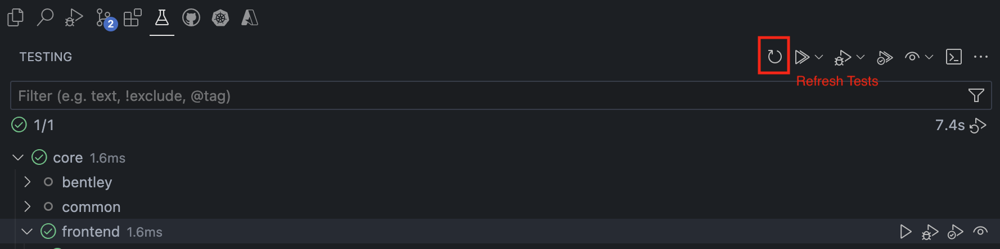

# Contributing to iTwin.js

Welcome, and thank you for your interest in contributing to iTwin.js!

There are many ways to contribute.
The goal of this document is to provide a high-level overview of how you can get involved.

- [Contributing to iTwin.js](#contributing-to-itwinjs)
  - [Repo Setup](#repo-setup)
  - [Source Code Edit Workflow](#source-code-edit-workflow)
    - [Other NPM Scripts](#other-npm-scripts)
    - [Debugging](#debugging)
      - [Filtering Test Suites](#filtering-test-suites)
  - [Asking Questions](#asking-questions)
  - [Providing Feedback](#providing-feedback)
  - [Reporting Issues](#reporting-issues)
    - [Look For an Existing Issue](#look-for-an-existing-issue)
    - [Writing Good Bug Reports and Feature Requests](#writing-good-bug-reports-and-feature-requests)
    - [Follow Your Issue](#follow-your-issue)
  - [Contributing Guidelines](#contributing-guidelines)
    - [Branch Naming Policy](#branch-naming-policy)
    - [Contributor License Agreement (CLA)](#contributor-license-agreement-cla)
    - [Pull Requests](#pull-requests)
    - [Types of Contributions](#types-of-contributions)
  - [Frequently Asked Questions](#frequently-asked-questions)
    - [Rush commands take too long, is there a way to speed up my contribution workflow?](#rush-commands-take-too-long-is-there-a-way-to-speed-up-my-contribution-workflow)
    - [Do I have to rebuild all packages in the repo, even those I didn't work on?](#do-i-have-to-rebuild-all-packages-in-the-repo-even-those-i-didnt-work-on)
    - [A subdirectory can not find a node\_modules file or directory](#a-subdirectory-can-not-find-a-node_modules-file-or-directory)
    - [Updating dependencies/devDependencies on packages within the monorepo](#updating-dependenciesdevdependencies-on-packages-within-the-monorepo)
    - [Updating dependencies/devDependencies on packages external to monorepo](#updating-dependenciesdevdependencies-on-packages-external-to-monorepo)

## Repo Setup

This repository is a [monorepo](https://monorepo.tools/) that holds the source code for multiple [iTwin.js npm packages](https://www.npmjs.com/search?q=%40itwin). It is built using [Rush](http://rushjs.io/).

Each package has its own **node_modules** directory that contains symbolic links to *common* dependencies managed by Rush.

1. Install dependencies: `rush install`
2. Build source: `rush build`
3. Run tests: `rush cover`

The above commands iterate and perform their action against each package in the monorepo.

## Source Code Edit Workflow

<details>
  <summary>Once you've set up the repo, you can move on to making changes to the source code by following the steps within: </summary>

1. Create your own branch by running `git checkout -b "<your-branch-name>"`. See [Branch Naming Policy](#branch-naming-policy)
2. Make source code changes.
3. Rebuild the repo by running `rush build`.
4. Ensure unit tests pass when run locally: `rush cover`.
5. Ensure linting passes when run locally: `rush lint`.
6. Locally commit changes: `git commit` (or use the Visual Studio Code user interface).
7. Repeat steps 1-4 until ready to push changes.
8. Check for API signature changes: `rush extract-api`. This will update the signature files, located in `common/api`. **Note:** before doing this, first do the following:
    - Be sure that your branch is up to date with the target branch (i.e. `git merge origin/master`).
    - Clean up your build output: `rush clean`.
    - Rebuild the project: `rush build`.
9. Review any diffs to the API signature files in the `common/api` directory to ensure they are compatible with the intended release of the package.
    - If any differences are in packages not modified on this branch, revert the changes before committing.
10. Add changelog entry (which could potentially cover several commits): `rush change`.
11. Follow prompts to enter a change description or press ENTER if the change does not warrant a changelog entry. If multiple packages have changed, multiple sets of prompts will be presented. If the changes are only to non-published packages (like **display-test-app**), then `rush change` will indicate that a changelog entry is not needed.
12. Completing the `rush change` prompts will cause new changelog entry JSON files to be created.
13. Add and commit the changelog JSON files and any API signature updates.
14. Publish changes on the branch and open a pull request.

> If executing scripts from `package.json` files in any of the subdirectories, we recommend using [`rushx`](https://rushjs.io/pages/commands/rushx/) over `npm`.

> The CI build will break if changes are pushed without running `rush change` and `rush extract-api` (if the API was changed). The fix will be to complete steps 6 through 11.

Here is a sample [changelog](https://github.com/microsoft/rushstack/blob/master/apps/rush/CHANGELOG.md) to demonstrate the level of detail expected. Changelogs are user facing, so less verbosity is encouraged, and should avoid unnecessary details.

</details>

### Other NPM Scripts

1. Build TypeDoc documentation for all packages: `rush docs`
2. Build TypeDoc documentation for a single package: `cd core\backend` and then `rushx docs`

### Debugging

Custom VSCode tasks are found in [launch.json](/.vscode/launch.json) to make debugging easier for contributors. Navigate to the `Run and Debug` panel in VSCode and you can select one of many custom tasks to run, which will attach a debugger to the process, and stop at a breakpoint you've set up.

#### Filtering Test Suites
The custom scripts above run all tests found in the respective package; contributors, when debugging, tend to know exactly which individual test suite/case to run, and would prefer to filter out all other tests that aren't relevant to their task.

This monorepo has packages using either mocha or vitest - both testing frameworks - to run tests, and instructions for filtering differs between the two:

<details>
  <summary> Filtering Mocha tests</summary>

Add a `.only` to a `describe()` or `it()` test function. Afterwards, run the custom VSCode task for the package through the `Run and Debug` panel, and mocha will run only that test suite.
</details>

<details>
  <summary>Filtering Vitest tests</summary>

  There are 2 ways to filter Vitest tests:

1. A VSCode Extension, [Vitest Explorer](https://marketplace.visualstudio.com/items?itemName=vitest.explorer) is available, that integrates with VSCode allowing you to select individual test cases to run/debug. After editing a test or source code, if unexpected behavior occurs, hit the refresh tests button as shown below.



> The Vitest Explorer is not compatible with tests run on a browser, and the second way below is the only viable way to debug browser-based tests.

2. Edit the `vitest.config.mts` found in a package's root folder and add a [include](https://vitest.dev/config/#include) property to filter out tests. Afterwards, run the custom VSCode task for the package through the `Run and Debug` panel. For example, to test the ViewRect class in core-frontend, which respectively has `ViewRect.test.ts`, one would edit the `vitest.config.mts` for core-frontend like below. By adding `.only` to a `describe()` or `it()` test function in `ViewRect.test.ts`, you can filter out tests in more detail.

```typescript
export default defineConfig({
  esbuild: {
    target: "es2022",
  },
  test: {
    dir: "src",
    setupFiles: "./src/test/setupTests.ts",
    include: ["**/ViewRect.test.ts"], // Added here - the include property accepts a regex pattern.
    browser: {
      ...
    },
    ...
  }
  ...
})
```
</details>

To distinguish whether a package is using vitest or mocha, look at the `package.json` `devDependencies`.
## Asking Questions

Have a question?
Rather than opening an issue, please ask away on [the Github discussions page](https://github.com/iTwin/itwinjs-core/discussions).

The community will be eager to assist you. Your well-worded question will serve as a resource to others searching for help.

## Providing Feedback

Your comments and feedback are welcome. For general comments or discussion please [click here](https://github.com/iTwin/itwinjs-core/labels/discussion) to contribute via GitHub issues using the `discussion` label.

## Reporting Issues

Have you identified a reproducible problem in iTwin.js?
Have a feature request?
We want to hear about it!
Here's how you can make reporting your issue as effective as possible.

### Look For an Existing Issue

Before you create a new issue, please do a search in [open issues](https://github.com/iTwin/itwinjs-core/issues) to see if the issue or feature request has already been filed.

If you find that your issue already exists, please add relevant comments and your [reaction](https://github.com/blog/2119-add-reactions-to-pull-requests-issues-and-comments).
Use a reaction in place of a "+1" comment:

- 👍 - upvote
- 👎 - downvote

If you cannot find an existing issue that describes your bug or feature, create a new issue using the guidelines below.

### Writing Good Bug Reports and Feature Requests

File a single issue per problem and feature request.
Do not enumerate multiple bugs or feature requests in the same issue.

Do not add your issue as a comment to an existing issue unless it's for the identical input.
Many issues look similar, but have different causes.

The more information you can provide, the more likely someone will be successful reproducing the issue and finding a fix.

Please include the following with each issue:

- A short description of the issue that becomes the title
- Versions of relevant iTwin.js packages
- Minimal steps to reproduce the issue or a code snippet that demonstrates the issue
- What you expected to see, versus what you actually saw
- Images that help explain the issue
- Any relevant error messages, logs, or other details
- Impact of the issue
- Use the [`bug`](https://github.com/iTwin/itwinjs-core/labels/bug) or [`enhancement`](https://github.com/iTwin/itwinjs-core/labels/enhancement) label to identify the type of issue you are filing

Don't feel bad if the developers can't reproduce the issue right away.
They will simply ask for more information!

### Follow Your Issue

You may be asked to clarify things or try different approaches, so please follow your issue and be responsive.

## Contributing Guidelines

We'd love to accept your contributions to iTwin.js.
There are just a few guidelines you need to follow.

### Branch Naming Policy

We recommend putting your github username, followed by a succinct branch name that reflects the changes you want to make. Eg. ` git checkout -b "<gh_username>/cleanup-docs"`
### Contributor License Agreement (CLA)

A [Contribution License Agreement with Bentley](https://gist.github.com/imodeljs-admin/9a071844d3a8d420092b5cf360e978ca) must be signed before your contributions will be accepted. Upon opening a pull request, you will be prompted to use [cla-assistant](https://cla-assistant.io/) for a one-time acceptance applicable for all Bentley projects.
You can read more about [Contributor License Agreements](https://en.wikipedia.org/wiki/Contributor_License_Agreement) on Wikipedia.

### Pull Requests

All submissions go through a review process.
We use GitHub pull requests for this purpose.
Consult [GitHub Help](https://help.github.com/articles/about-pull-requests/) for more information on using pull requests.

### Types of Contributions

We welcome contributions, large or small, including:

- Bug fixes
- New features
- Documentation corrections or additions
- Example code snippets
- Sample data

If you would like to contribute new APIs, create a new [issue](https://github.com/iTwin/itwinjs-core/issues) and explain what these new APIs aim to accomplish. If possible check the [CODEOWNERS](https://github.com/iTwin/itwinjs-core/blob/master/.github/CODEOWNERS) file and tag the owners of the package you plan on introducing the new APIs into.

Thank you for taking the time to contribute to open source and making great projects like iTwin.js possible!

## Frequently Asked Questions

### Rush commands take too long, is there a way to speed up my contribution workflow?

If your source code change only impacts the subdirectory you are working on, you can use `rushx` to run local commands, without affecting other packages.

Eg. I add a new method within `core/frontend`, also adding a relevant unit test in that folder's `src/test`. I can navigate to the root of that subdirectory, and run `rushx build`, followed by `rushx test` or `rushx cover`.

### Do I have to rebuild all packages in the repo, even those I didn't work on?
No. For incremental builds, the `rush build` command can be used to only build packages that have changes versus `rush rebuild` which always rebuilds all packages.

> It is a good idea to `rush install` after each `git pull` as dependencies may have changed.
>
### A subdirectory can not find a node_modules file or directory
If you get an error similar to the following:

```
[Error: ENOENT: no such file or directory, stat '/.../itwinjs-core/test-apps/display-test-app/node_modules/@bentley/react-scripts']
```
This means that the repo has stopped making use of an npm package that was used in the past:

To fix this build error, you should completely remove the node_modules directory and reinstall your dependencies. `rush update --purge` is a one-line solution for the above.

### Updating dependencies/devDependencies on packages within the monorepo

The version numbers of internal dependencies (see [example](https://github.com/iTwin/itwinjs-core/blob/e17654e4eca60c66bd1888f032aa03ef39d4c8a3/core/bentley/package.json#L3)) should not be manually edited.
These will be automatically updated by our internal CI pipelines.
Note that the packages are published by CI builds only.

### Updating dependencies/devDependencies on packages external to monorepo

Use these instructions to update dependencies and devDependencies on external packages (ones that live outside of this monorepo).

1. Go into the appropriate `package.json` file and update the semantic version range of the dependency you want to update.
2. Run `rush check` to make sure that you are specifying consistent versions across the repository
3. Run `rush update` to make sure the newer version of the module specified in #1 is installed
