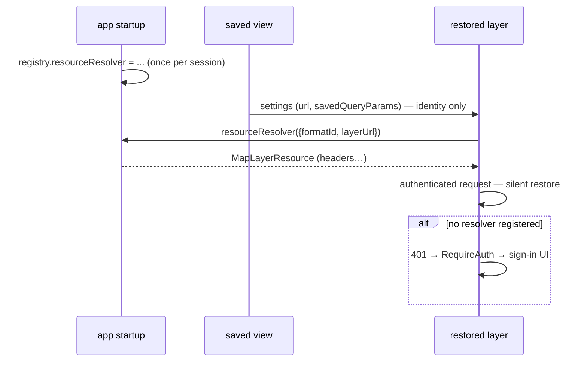

# `MapLayerResource` — design summary

Status: design agreed 2026-08-26, not implemented. Prototype branch: `MichelD/MapLayerResourcePrototype`.

## Concept

`MapLayerResource` is a small runtime object, **provided by the hosting application**, that tells
the display system **how to dress the network requests of one map layer**: extra headers, extra
query parameters, and what to do when a request fails. The engine never creates one on its own —
the app supplies it, either directly on the layer's settings or through a resolver it registers
(see Integration). It is inspired by Cesium's `Resource`.

```ts
class MapLayerResource {
  /** e.g. { Authorization: "Bearer ..." } */
  headers?: Record<string, string>;
  /** Appended to every request. Runtime-only successor of settings.unsavedQueryParams. */
  queryParameters?: Record<string, string>;
  /** Cesium contract: inspect the failure, optionally mutate this resource
   * (e.g. refresh the Authorization header), return true to retry the request. */
  retryCallback?: (resource: MapLayerResource, error: { response?: Response, status?: number }) => boolean | Promise<boolean>;
  retryAttempts?: number;
  /** See "providesAuthentication" below. Default true. */
  providesAuthentication?: boolean;
}
```

Two rules define its place in the API:

1. **It is never serialized.** `ImageMapLayerSettings` remains the only persisted description of a
   layer (url, formatId, name, `savedQueryParams`, …). Everything on a `MapLayerResource` is
   runtime-only — that's what makes it safe to put credentials on it.
2. **The engine reads it live.** Assign or replace it at any time; the next request uses it.

## Integration

A layer gets its resource from one of two places — first match wins, checked on every request:

```ts
settings.resource ?? IModelApp.mapLayerFormatRegistry.resourceResolver?.(args)
```

**Directly on the settings** (new runtime field), for code that attaches the layer:

```ts
const settings = ImageMapLayerSettings.fromJSON({ formatId: "WMS", name: "Ops", url });
settings.resource = new MapLayerResource({ headers: { Authorization: `Bearer ${await getJwt()}` } });
viewport.displayStyle.attachMapLayer({ settings, mapLayerIndex });
```

**Or from the app's resolver** (one global slot on the registry, set once at startup):

```ts
IModelApp.mapLayerFormatRegistry.resourceResolver = ({ formatId, layerUrl }) =>
  layerUrl.startsWith("https://gis.corp.com/")
    ? corpResource                     // shared instance; caching is the resolver's business
    : undefined;                       // undefined = this layer needs no transport
```

If neither supplies a resource, requests go out as today; a 401 puts the layer in the existing
`RequireAuth` state and the sign-in UI takes over. `MapLayerAccessClient` keeps only its
interactive-auth role (OAuth endpoints, ArcGIS legacy tokens).

## Re-hydration after view restore

This is the question the design must answer: a saved view cannot store headers or callbacks
(they are secrets and code). So **restoring a view never restores a resource — it re-creates the
need for one, and the resolver answers it.**

```ts
// ── app startup (runs every session, before any view) ─────────────────────
IModelApp.mapLayerFormatRegistry.resourceResolver = ({ layerUrl }) =>
  layerUrl.startsWith("https://gis.corp.com/")
    ? new MapLayerResource({ headers: { Authorization: `Bearer ${getCachedJwt()}` } })
    : undefined;

// ── later: user opens a saved view containing a corp WMS layer ────────────
await viewport.changeView(savedView);
// settings deserialize (url, savedQueryParams). settings.resource is undefined.
// First tile request → engine asks the resolver → corp layer is authenticated silently.
// No per-view restore code. No user prompt.
```



Principle: the saved view names **what** the layer needs (its URL); **how** to satisfy it always
re-enters through app code — eagerly (resolver at startup), lazily (`settings.resource` after
load), or interactively (sign-in dialog).

## `providesAuthentication`

A resource is presumed to be its layer's **authentication authority** (`providesAuthentication`
defaults to `true`): its values are treated as credentials, which makes its requests subject to:

- **redirect refusal** when `MapLayerFormatRegistry.restrictCredentialsToTrustedOrigins` is
  enabled — the platform offers no way to inspect a redirect's destination before the credentials
  have already been delivered to it (`fetch` follows atomically; `redirect: "manual"` yields an
  opaque response), so refusing redirects on authenticated requests is the only way to honour the
  origin whitelist;
- **capability/service-metadata cache bypass** — an authenticated response must never be served
  to a differently-authenticated layer with the same URL;
- **suppression of SSO retries** — the authentication authority for a layer is exclusive: a 401
  means *its* auth failed and must surface through its own
  channels (`retryCallback`, then `RequireAuth`) — not be silently papered over by retrying with
  the user's ambient Windows identity, which would mask the failure, switch the request to a
  different principal, and hand the domain identity to a server the app configured for token auth.

Sole-authority applies only against *ambient* fallbacks like SSO. Explicitly configured
credentials (`settings.userName`/`password`) are not suppressed by a resource: both were
deliberately set by the app, they coexist under transport-last precedence (a resource
`Authorization` header overwrites the Basic one), and basic creds remain origin-gated by
`isCredentialsSharingAllowed` as today. Apps wanting transport-only auth simply leave
`userName`/`password` unset.

When is declaring `providesAuthentication: false` necessary? Exactly when the resource injects
only **non-authenticating, non-confidential** values — an `api-version` parameter, a tenant hint,
a correlation header — and the app doesn't want to pay for protections it doesn't need: redirects
(e.g. `http→https` upgrades) keep working under the origin restriction, capability responses stay
cacheable, and Windows-authenticated servers remain usable on the same layer.

Rules: `false` asserts that nothing the resource ever injects authenticates the request **or is
confidential for any other reason** — including anything `retryCallback` may later write. When in
doubt, leave the default; the cost of a wrong `true` is a little performance, the cost of a wrong
`false` is a credential leak.

## Maintainer notes

- Tile trees are shared by settings-derived IDs: when `settings.resource` is set, the tree ID
  must include a nonce so identical settings with different transports never share a tree
  (implement first).
- `ValidateSourceArgs` gains `resource?` so a dialog validates with the transport it will attach with.
- Fixed request assembly order: settings URL → `savedQueryParams` → resource `queryParameters` → auth last.
- **`(layerUrl, formatId)` is a weak layer identifier** — it collides (two layers on one
  multi-tenant URL differing only by transport), it is user-editable (editing the URL severs every
  resolver/credential association keyed on it), and URL string matching is normalization-sensitive.
  Acceptable for now (`properties` offers an app-managed discriminator), but consider a first-class
  persisted layer id (`id?: string` on `CommonMapLayerProps`, minted at creation) at some point.
  Unlike the rejected *resource/behavior* id, a pure identity id is safe to persist: it claims
  "same layer as before," not "how to authenticate it."
- Supersedes: `settings.unsavedQueryParams` (→ `queryParameters`), `applyToRequest`/
  `isAuthenticationError` on the access client (transitional — see below), and prototype
  step 1's per-format `setAccessClientResolver` (→ the single `resourceResolver` slot).
- **Transitional `applyToRequest` (parent branch `MichelD/MapLayerAuthHeader`):** its TSDoc and
  docs state the redirect/SSO/cache policies unconditionally — qualify the *mechanism* sentences
  with "by default" before any opt-out ships (guarantee sentences about secrets stay absolute).
  If a non-authenticating shaping client materializes while `applyToRequest` is still the shipping
  mechanism, the sanctioned fix is widening its return type from `void` to
  `{ providesAuthentication?: boolean } | void` — additive (void = reserved conservative slot),
  same field name and semantics as the resource. Per-entry allow-lists and a static client flag
  were considered and rejected (wrong granularity / consumer bookkeeping burden).
