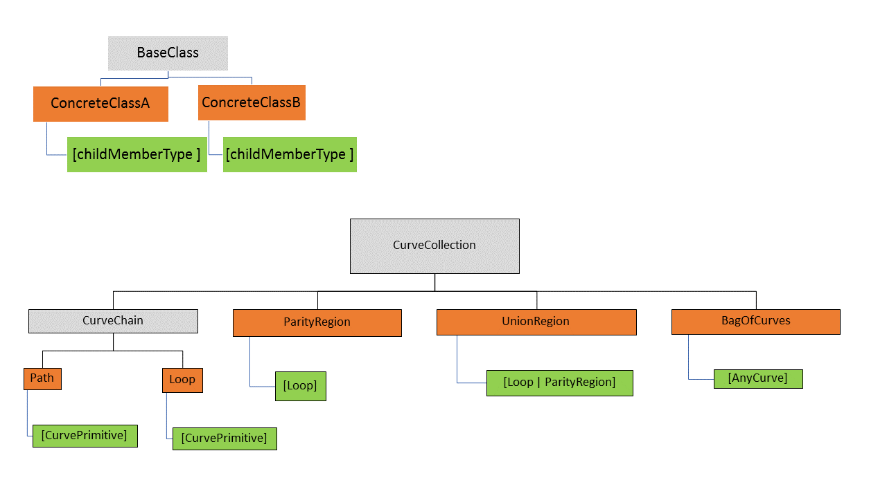

# Curve Collections

A `CurveCollection` is a an abstract base class for various collection of curves.

There are 5 concrete derived types:
* `Path` - curve primtives joining head to tail
* `Loop` - curve primtives joining head to tail and closing to form a loop
* `ParityRegion` - `Loop`s that bound a planar area by parity rules.
* `UnionRegion` - boolean union of areas of `Loop`s and/or `ParityRegion`s

## `Path` and `Loop`

`Path` and `Loop` are collections which
 * All members of the collection must be derived from `CurvePrimitive`, i.e. be one of
 * * LineSegment3d
 * * Arc3d
 * * BSplineCurve3d
 * * TransitionSpiral
 * Successive `CurvePrimitive` members must match "head to tail".
 * In a `Loop`, the last member's head must match the first member's tail.
 * Throughout the library, a `Loop` is expected to be a "filled" planar region.
 * A `Path` is usually does _not_ return to its start point.
 * * If a `Path` _does_ return to its start point, it is _not_ interpretted as enclosing area.  The path is still just a wire that happens to come back to its start.

 The immediate base class for both `Path` and `Loop` is `CurveChain`.   The `CurveChain` base class implements various methods that depend on the internal head-to-tail matching but _not_ on the closure of a `Loop`.

### Special `Loop` properties

* The purpose of a `Loop` is to act as the boundary of a planar region.
* * Unless specifically indicated by names or comments for various methods that at on `Loop`s,  The containing plane will be determine "on demand" using the `FrameBuilder` class.
* A point is "inside" a loop if a line (within the `Loop`'s plane) from the point "to infinity"  crosses the loop an odd number of times.
* The crossing count rule may be applied (and mathematically always produces the same result) for:
* * Any line direction -- horizontal, vertical, or any other direction.
* * Any curved path that starts at the and gets to infinity.

 ## `ParityRegion`

 A `ParityRegion` is a curve collection whose immediate children are
 * _all_ of type `Loop` (i.e. array of `CurvePrimitive` joined head-to-tail both internally an from last to first.
 * all coplanar.

"Inside" and "Outside" of a parity region is determined by the rule commonly called "even/odd", "exclusive or" or "parity":
* A point is "inside" the parity region if and only if it is classified as "inside" of an odd number of its `Loop`s.
* A point is "inside" if and only if performing "exclusive or" among the (boolean) "inside" classification of all of its `Loop`s.

In nearly all uses, the various loops in a `ParityRegion`
* have no intersections among any pair of loops.
* have exactly one that can be called `outer`
* all other than the `outer`

 ## `UnionRegion`

 A `UnionRegion` is a curve collection whose immediate children are
 * limited to the two types `Loop` and `ParityRegion`.
 * all coplanar.

"Inside" and "Outside" of a parity region is determined by the boolean "union" or "OR" rule:
* A point is "inside" the union region if it is "inside" _one or more_ of the members.
* A point is "inside" if and only if performing "union" among the (boolean) "inside" classification of all of its `Loop` and `ParityRegion`.

 # Tips for Processing `CurveCollection`s

Processing all 5 subtypes of `CurveCollection` initally appears quite complex.  However, within each of the cases of a top level switch statement or sequence of `if` tests, the number of possibilities drops quickly:
* A `Path` or `Loop` can _only_ contain true `CurvePrimitive`.
* A `ParityRegion` may only contain `Loop`s.
* A `UnionRegion` may contain only `Loop`, `ParityRegion`, or further `UnionRegion`.
* A `BagOfCurves` is the only one with free mixture of both `CurveCollection` and `CurvePrimitive`.
