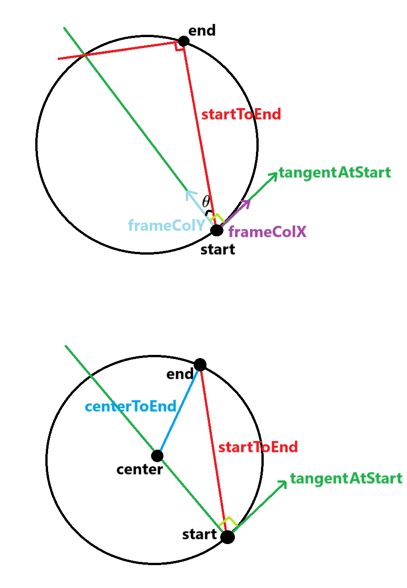

# Create Circular Arc using Start, TangentAtStart, and End

Below we explain the algorithm used in `Arc3d.createCircularStartTangentEnd` to create a circular arc using start point, tangent at start, and end point.

All we need is to find center of the circle. We know that the center would be on the perpendicular line to `TangentAtStart`. If we draw a line from start to end (call it `startToEnd`) then the perpendicular line to `startToEnd` would hit the perpendicular line to `TangentAtStart` on the circle. It's because two adjacent chords that form a right angle always subtend a semi-circle (thus the third leg forming a triangle is a diameter).

if we create a matrix called `frame` using `Matrix3d.createRigidFromColumns(tangentAtStart, startToEnd, AxisOrder.XYZ)` then column X would lay on `TangentAtStart` and column Y would lay on he perpendicular line to `TangentAtStart`. Now using the angle between `startToEnd` and column Y we find the radius on circle (thus find the center).

Suppose `v = startToEnd`, `w = column Y`, and `d` is the circle diameter. Then:

$$v.w = ||v|| ||w|| \cos(\theta) = ||v|| \frac{||v||}{d} = \frac{||v||^2}{d} $$

Therefore,

$$\frac{||v||.||v||}{2v.w} = \frac{||v||^2}{2\frac{||v||^2}{d}} = \frac{d}{2} = radius$$

