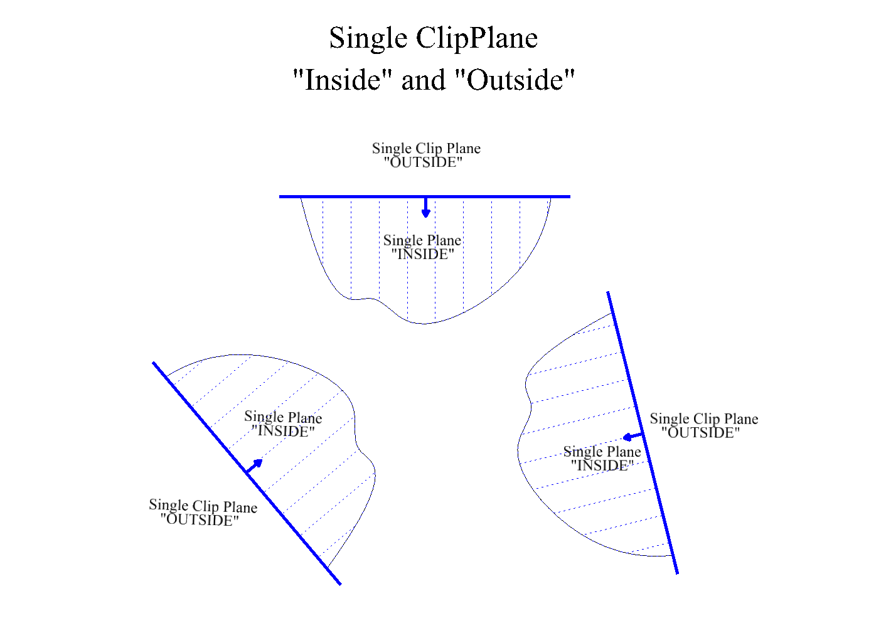
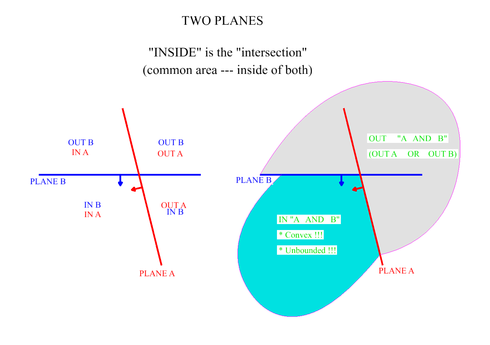
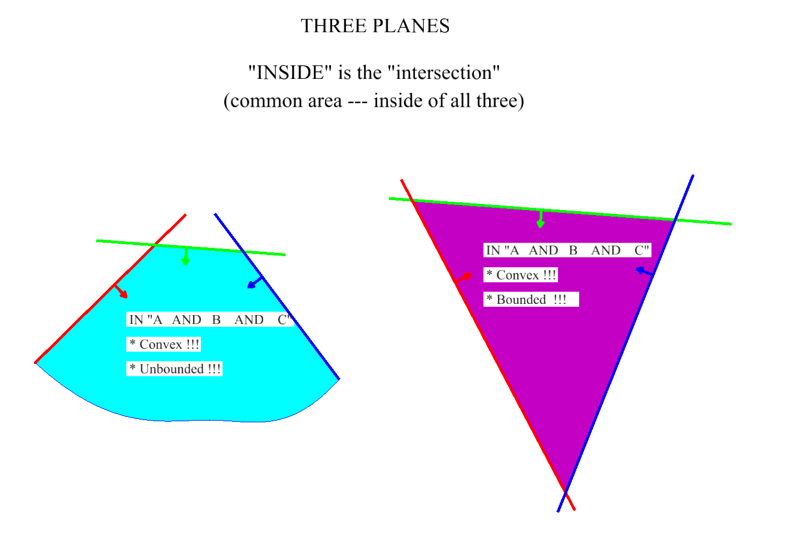
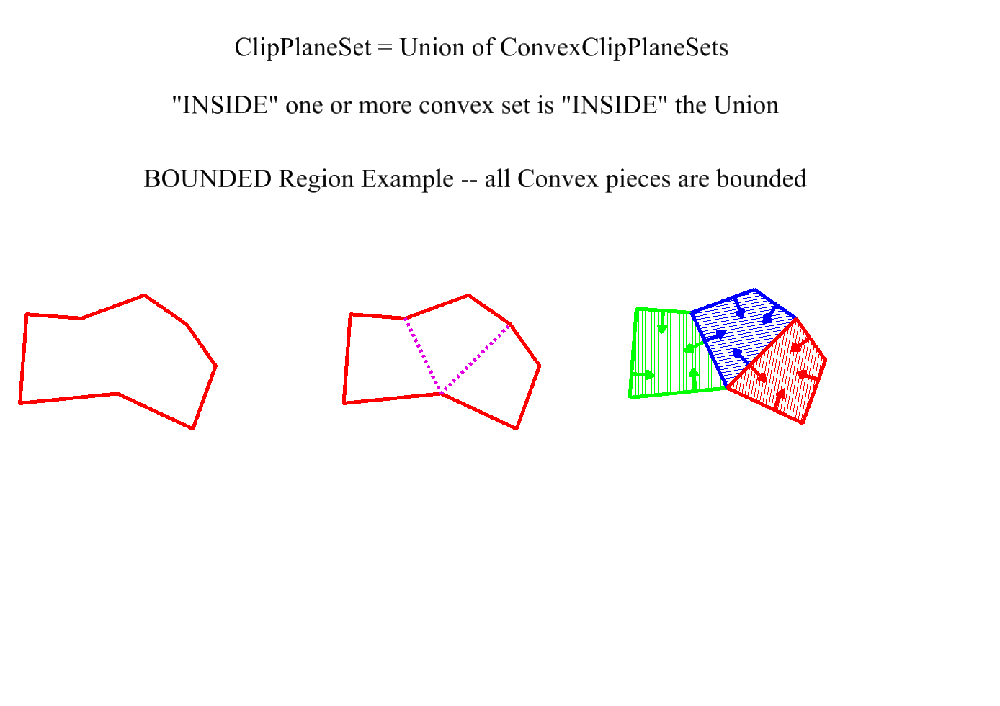
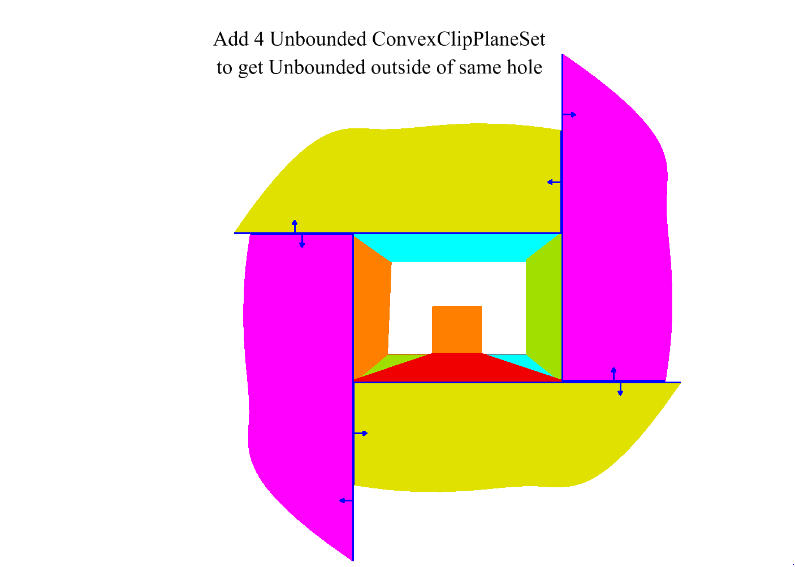

# Planar clipping

ClipPlane, ConvexClipPlaneSet, and UnionOfConvexClipPlaneSets form a clear sequence of complexity:

| Class | Content | semantics |
|---------------|-------------------|--------------|
| ClipPlane | Single clip plane | Splits the universe into two halfspaces at planar boundary |
| ConvexClipPlaneSet | Array of clip planes | convex region which is the _intersection_ of the half spaces |
| UnionOfConvexClipPlaneSets | Array of ConvexClipPlaneSet | _union_ of the convex regions |

# ClipPlane

* A single ClipPlane is a plane.
* The (unbounded, infinite) space on one side is called "in".
* The (unbounded, infinite) space on the other side is called "out".
* The clip plane stores an inward normal.

# ConvexClipPlaneSet

* A point is _inside_ the convex region if and only if it is inside every ClipPlane
* If a point its _outside_ any single ClipPlane it is outside of the convex region.
* Hence in/out test has quick exit for _out_ but must loop over all planes for _in_.
* A ConvexClipPlaneSet can be unbounded.
  * A ConvexClipPlaneSet with one member is always unbounded
  * A ConvexClipPlaneSet with two members is always unbounded.
  * Within a plane, it takes a minimum of 3 planes (lines in the plane) to bound a (convex polygonal) area
  * In full 3d, it takes a minimum o 4 planes to make the convex volume bounded.

# UnionOfConvexClipPlaneSets remarks

* The ConvexClipPlaneSet members of a UnionOfConvexClipPlaneSets are assumed non-overlapping
  * Test for "point inside" can terminate at first "inside" of a ConvexClipPlaneSet member
  * When clipping a polygon, if a fragment is found to be inside a ConvexClipPlaneSet member the fragment may be accepted "as is" -- no need to consider also being in other ConvexClipPlaneSet members.
* A non-convex polygon must be represented by a collection of convex pieces (e.g. triangles).
* A non-convex polygon must be represented by a collection of convex pieces that wrap around the hoel (e.g. triangles)

