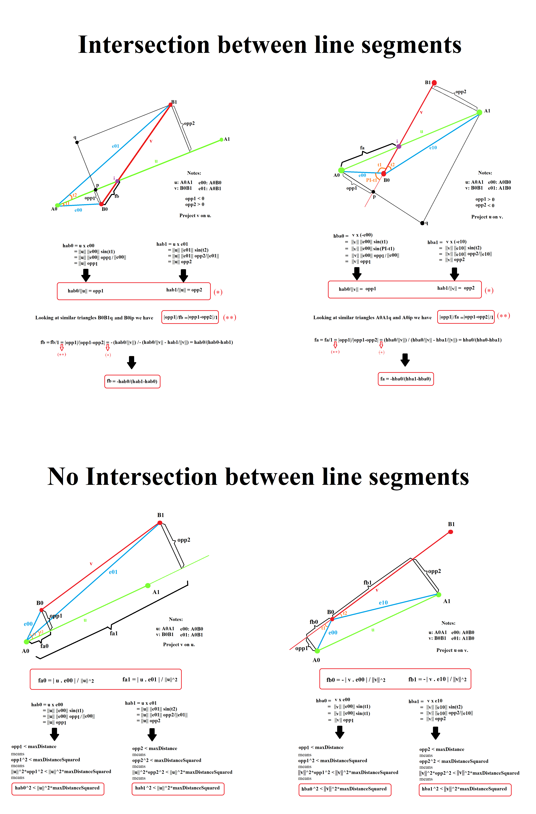

# `Approach Between 2 Line Segments`

Here is the math details of `CurveCurveCloseApproachXY.segmentSegmentBoundedApproach`



# `Curve Parametrization`

Derivations of the maths used in `CurveChainWithDistanceIndex.fractionToPointAndDerivative` and `CurveChainWithDistanceIndex.fractionToPointAnd2Derivatives`.

Let $C(t) : [0,1] \rightarrow R^3$ be a sufficiently smooth curve parameterized by $t$ with total length $L$.

A curve can have infinitely many parameterizations (for example, based on infinitely many variations of speed we can travel along a curve from start of the curve to the end). Of all the parameterizations you can give a curve, only one is constant speed which is called "fractional arc length parameterization".

To define this special parametrization, we use the arc length formula for $C$ from calculus $s(t): [0,1] \rightarrow [0,L]$ given by $s(t) = \int_0^t||C'(x)||dx$.

Now we can define "fractional arc length parameterization" of curve $C$ using new parameterization $f$ (instead of $t$). The parameter f is computed by $f(t): [0,1] \rightarrow [0,1]$, where $f = f(t) = s(t) / L$.

Using $f$ to parametrize $C$ instead of t has some advantages in that it makes some calculations (like the derivative is easier to compute).

By the Fundamental Theorem of Calculus, f has derivative $f'(t) = d/dt(f) = d/dt(s) / L = ||C'(t)||/L$.

Also we know $f(t)$ is strictly increasing so it has an inverse function $t = t(f)$. By the Inverse Function Theorem, $t$ has derivative $t'(f) = d/df(t) = 1/(d/dt(f)) = 1/f'(t) = L/||C'(t)||$.

Now lets calculate the first derivative of $C$ with respect to $f$:
```
C'(t(f)) = d/df(C(t(f))) = d/dt(C) * d/df(t) = C'(t) * t'(f) = L*C'(t)/||C'(t)||
```

$||C'(t)||$ (movement speed along the curve) is not necessarily constant. However, using the new parameterization $f = f(t)$ we get a constant speed:
```
||C'(t(f))|| = L*||C'(t)||/||C'(t)|| = L
```

Before calculating the second derivative of $C$, we find a formula for "derivative of curve magnitude".

We know $C'(t).C'(t) = ||C'(t)||^2$ (where "$.$" is dot product between point-valued or vector-value functions) so
```
d/dt(||C'(t)||^2) = 2||C'(t)||*d/dt(||C'(t)||)
```
which implies:
```
d/dt(||C'(t)||) = d/dt(||C'(t)||^2) / 2||C'(t)||
			    = d/dt(C'(t).C'(t)) / 2||C'(t)||
			    = (C"(t).C'(t)+C'(t).C"(t)) / 2||C'(t)||
			    = (2C(t).C"(t)) / 2||C'(t)||
			    = C(t).C"(t) / ||C'(t)||
```
Now we can calculate the second derivative of $C$ with respect to $f$:
```
C"(t(f)) = d/df(C'(t(f)))
         = L d/df(C'(t)/||C'(t)||)
         = (     d/df(C'(t(f)))*||C'(t)|| - C'(t)*d/df(||C'(t(f))||)                   ) / (L/||C'(t)||^2)  // by the quotient rule
         = (     d/df(C'(t(f)))*||C'(t)|| - C'(t)*d/dt(||C'(t)||)*d/df(t)              ) / (L/||C'(t)||^2)  // by the chain rule
         = (     d/df(C'(t(f)))*||C'(t)|| - C'(t)*(C'(t).C"(t)/||C'(t)||)*t'(f)        ) / (L/||C'(t)||^2)  // by derivative of curve magnitude
         = (d/dt(C'(t))*d/df(t)*||C'(t)|| - C'(t)*(C'(t).C"(t)/||C'(t)||)*t'(f)        ) / (L/||C'(t)||^2)  // by the chain rule
         = (        C"(t)*t'(f)*||C'(t)|| - C'(t)*(C'(t).C"(t)/||C'(t)||)*t'(f)        ) * (L/||C'(t)||^2)  // by the chain rule
         = (C"(t)*(L/||C'(t)||)*||C'(t)|| - C'(t)*(C'(t).C"(t)/||C'(t)||)*(L/||C'(t)||)) * (L/||C'(t)||^2)
         = (C"(t)                         - (C'(t)*C'(t).C"(t))/(||C'(t)||*||C'(t)||)  ) * (L/||C'(t)||)^2
         = (C"(t)                         - (C'(t)*C'(t).C"(t))/(||C'(t)||^2)          ) * (L/||C'(t)||)^2
```
