# `Visualization of Exterior and Boundary HalfEdge`

Exterior HalfEdges (nodes) are shown by green and Boundary HalfEdges (nodes) are shown by blue:

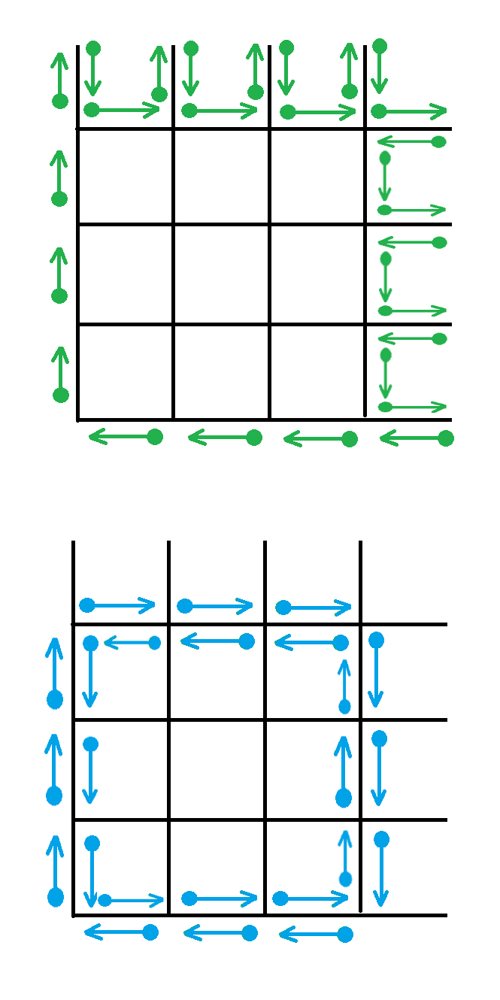

# `Visualization of Some of HalfEdge Functions`

Here is visualization of some the HalfEdge functions (`createHalfEdgePair`, `splitEdge`, and `splitEdgeCreateSliverFace`). Note that edges of the graph are indicated by black lines and vertices of the graph are indicated by black dots. HalfEdges (nodes) are indicated by non-black dots. The arrow emanating from a node points to its faceSuccessor node.


# `Signed Area of a Face`

Here is the illustration of the `HalfEdge.signedFaceArea` algorithm:

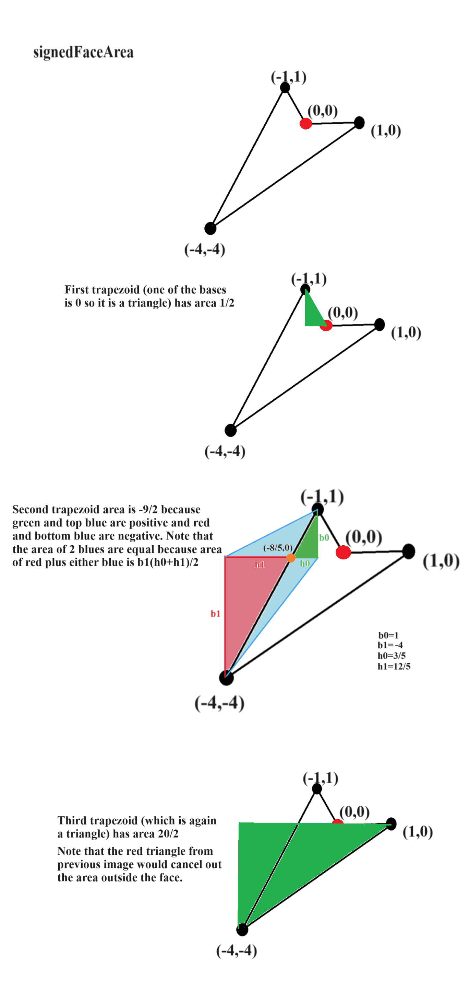

More info can be found at https://en.wikipedia.org/wiki/Shoelace_formula


# `Transverse Intersection Fractions`

Here is the math details of `HalfEdge.transverseIntersectionFractions`

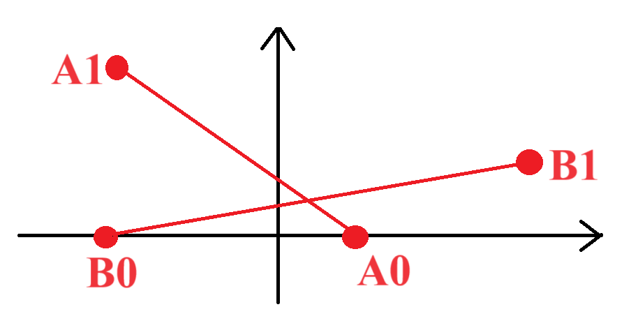

Let $A0 = (x_{a_0},y_{a_0}), A1 = (x_{a_1},y_{a_1}), B0 = (x_{b_0},y_{b_0}),$ and $B1 = (x_{b_1},y_{b_1})$.

The parametric equations of the lines are:

$(1-t_a)(x_{a_0},y_{a_0}) + t_a (x_{a_1},y_{a_1})$

$(1-t_b)(x_{b_0},y_{b_0}) + t_b (x_{b_1},y_{b_1})$

These 2 equations are equal at the intersection so:

$((1-t_a)x_{a_0} + t_a x_{a_1},(1-t_a)y_{a_0} + t_a y_{a_1}) = ((1-t_b)x_{b_0} + t_b x_{b_1},(1-t_b)y_{b_0} + t_b y_{b_1})$

which leads to the final equations:

$ (x_{a_1} - x_{a_0}) t_a + (x_{b_0} - x_{b_1}) t_b = x_{b_0} - x_{a_0} $

$ (y_{a_1} - y_{a_0}) t_a + (y_{b_0} - y_{b_1}) t_b = y_{b_0} - y_{a_0} $

# `Pinch`

Pinch is visualized in the following 2 sections.

# `Create EdgeXYZ HalfEdge`

Here is the visualization of the `HalfEdgeGraph.createEdgeXYZHalfEdge`:

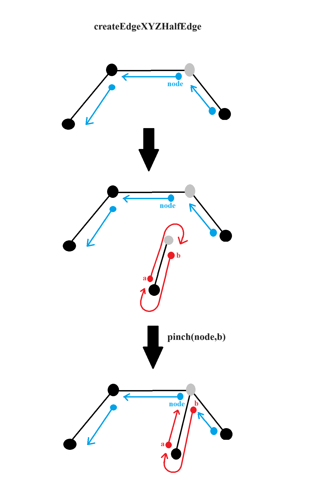

# `Create HalfEdge HalfEdge`

Here is the visualization of the `HalfEdgeGraph.createEdgeHalfEdgeHalfEdge`:

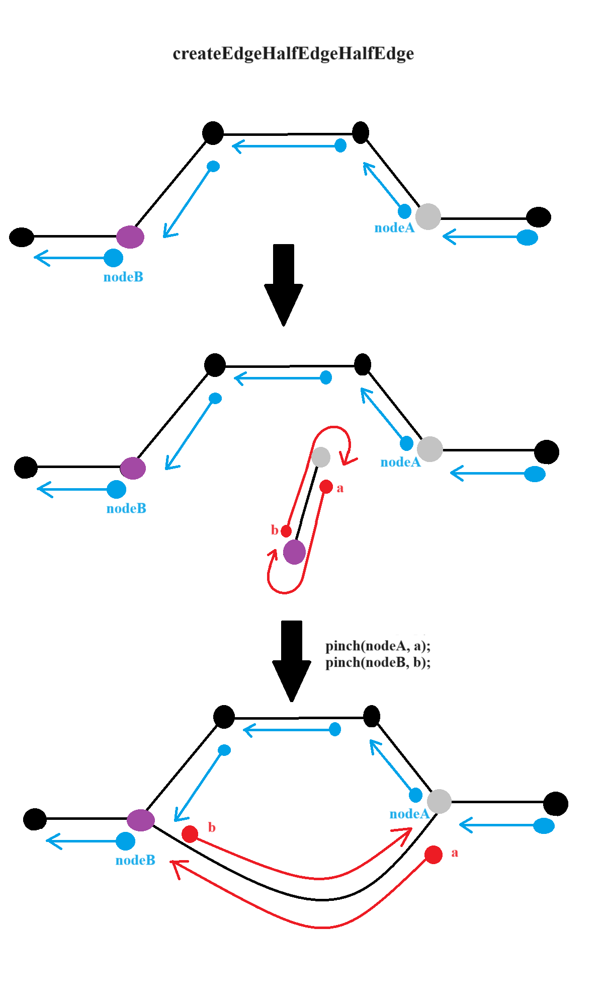

# `Collect Connected Graph Components`

Below is the explanation of the `HalfEdgeGraphSearch.collectConnectedComponentsWithExteriorParityMasks`.

Suppose you call the following code
```
HalfEdgeGraphSearch.collectConnectedComponentsWithExteriorParityMasks(
    graph, new HalfEdgeMaskTester(HalfEdgeMask.BOUNDARY_EDGE), HalfEdgeMask.EXTERIOR,
  );
```
on the following graph where blue shows boundary nodes and red shows non-boundary nodes:
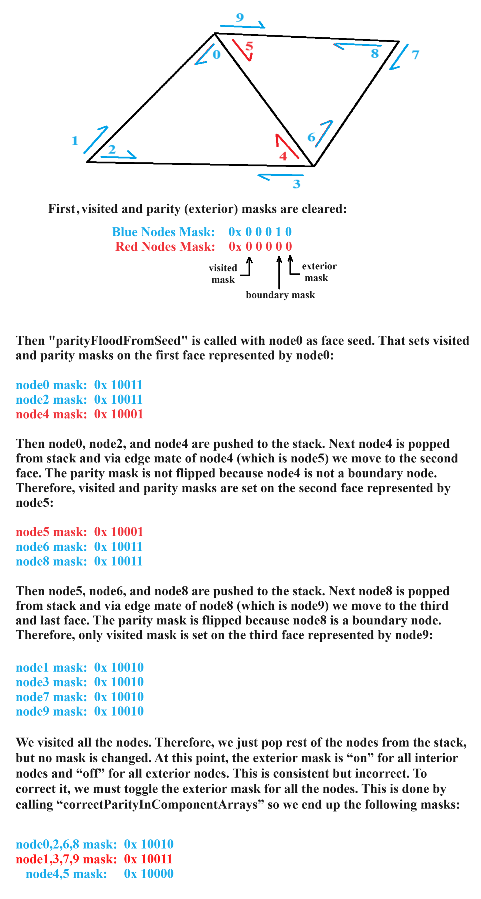

# `Traverse Graph Using Stack and Queue`
Suppose we have this half edge graph:
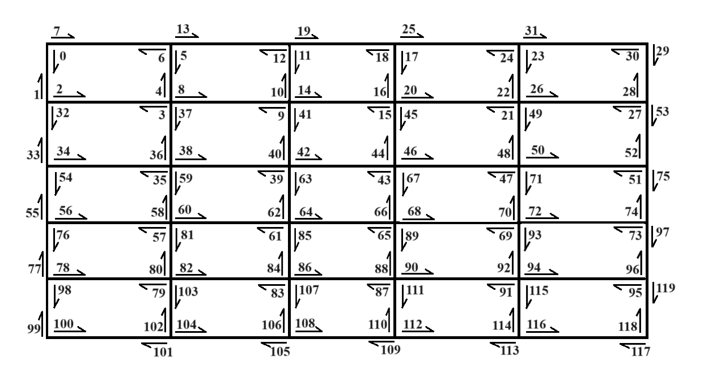

Now we want to traverse the graph and collect connected components. We can set a limit on the number of faces in each component or assume there is no limit. Also we can traverse using stack and queue. Below we discuss each case:

**No Limit (Stack)**<br>
A stack-based approach with no limit on the number of faces in each component is implemented in `HalfEdgeGraphSearch.collectConnectedComponentsWithExteriorParityMasks` to traverse the graph. Note that in this function, we DO NOT ignore exterior faces.

Suppose we start from the middle face (node 63). We push nodes 63, 64, 66, and 43 to the stack and mark all of them as visited. Then we pop the top node (43) from the stack and using its edge mate (node 42 which is NOT already visited) move to the second face. Then nodes 42, 44, 15, and 41 are pushed to the stack and mark them as visited. Again we pop the top node (41) from the stack and using its edge mate (node 40 which is NOT already visited) move to the third face.

We continue this process to traverse all the faces. Note that if we pop a node from stack which is already visited, we just skip that node and pop the next node from stack.

Below is the graph image with faces numbered by red color in the order in which they are visited (the exterior face is 26). Faces of alternate parity have different shading to illustrate the method's default parity masking rule, which results in a "bullseye" parity pattern:
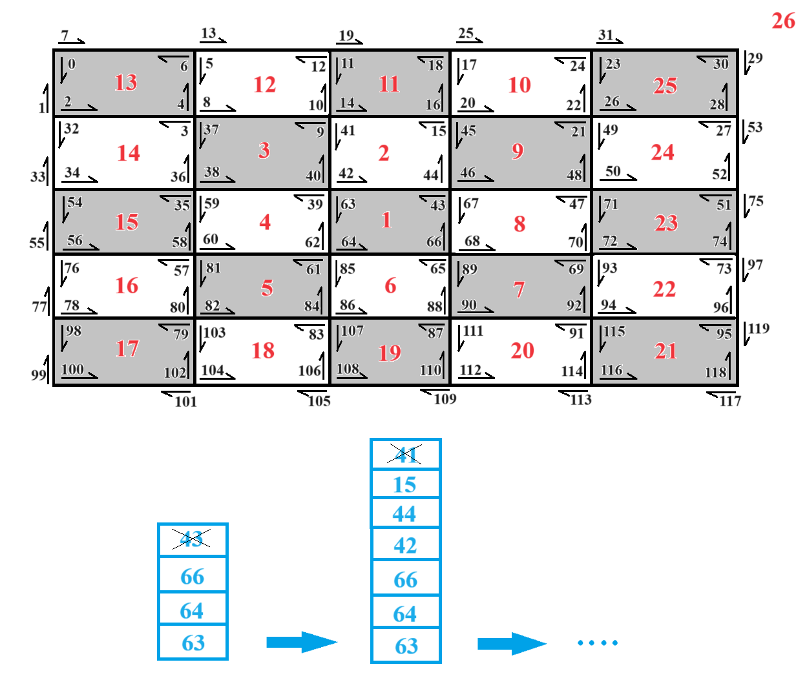

**No Limit (Queue)**<br>
We could have used queue for implementation of `HalfEdgeGraphSearch.collectConnectedComponentsWithExteriorParityMasks`. However, queue is potentially less efficient than stack. That is why we picked stack.

Suppose we start from the middle face (node 63). We add nodes 63, 64, 66, and 43 to the queue and mark all of them as visited. Then we retrieve node 63 from the front of queue and using its edge mate (node 62 which is NOT already visited) move to the second face. Then nodes 62, 39, 59, and 60 are added to the queue and mark them as visited. Again we retrieve node 64 from the front of queue and using its edge mate (node 65 which is NOT already visited) move to the third face.

We continue this process to traverse all the faces. Note that if we retrieve a node from the front of queue which is already visited, we just skip that node and retrieve the next node from the front of queue.

Below is the graph image with faces numbered by red color in the order in which they are visited (the exterior face is 16). Note the different traversal compared to stack:
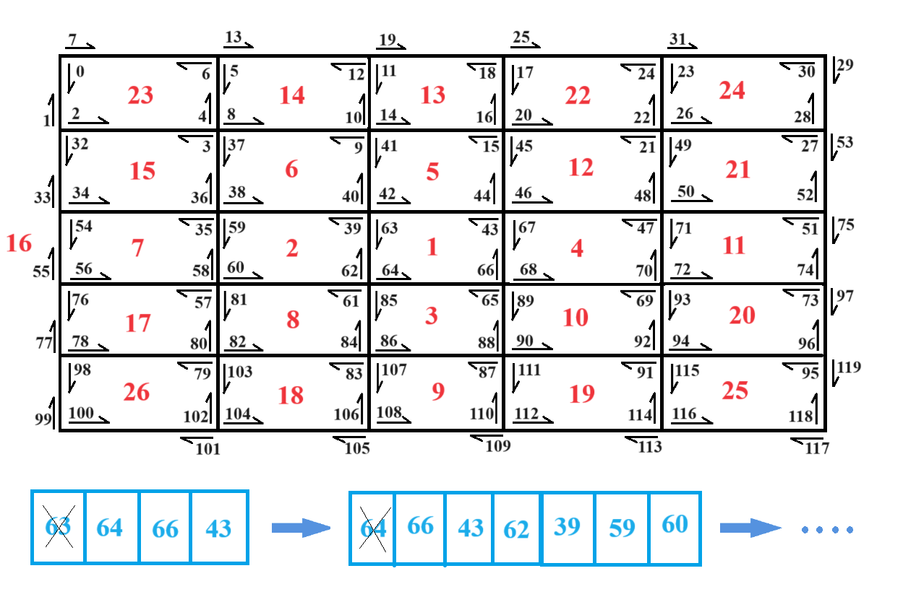

**With Limit (Queue)**<br>
A queue-based approach with limit on the number of faces in each component is implemented in `HalfEdgeGraphSearch.collectConnectedComponents` to traverse the graph. Note that in this function, we IGNORE exterior faces.

Suppose we start from the top left face (node 0). We push node 0 to the queue. Then we remove the head of queue (node 0) and mark all of the nodes in that face (0, 2, 4, 6) as visited. We also push all of the vertex successors in that face to the queue (unless they are already visited or are in an exterior face). Therefore, we push nodes 3 and 5 to the queue and ignore node 7 and 1 (exterior). Now we remove the head of queue (node 3) to move to the second face and mark all of the nodes in that face (3, 32, 34, 36) as visited. We also push nodes 37 and 35 to the queue and ignore node 2 (already visited) and 33 (exterior).

We continue this process to traverse all the faces. Note that if we remove a node from queue which is already visited, we just skip that node and remove the next node from queue.

Below is the graph image with the first 10 faces numbered by red color. As you can see, the traverse covers all adjacent faces and moves forward. Therefore, if we stop traversal at any point, the faces we have visited are localized:
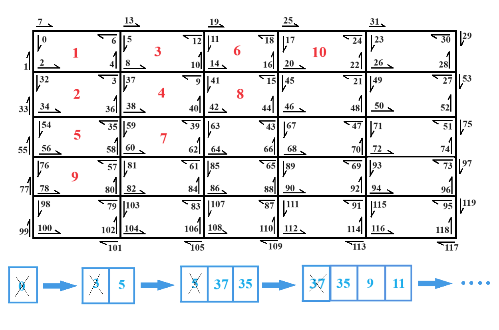

**With Limit (Stack)**<br>
We could have used stack for implementation of `HalfEdgeGraphSearch.collectConnectedComponents`. However, you will see stack will generate snake shape components, which are often less desirable. That is why we picked queue.

Suppose we start from the top left face (node 0). We push node 0 to the stack. Then we pop from stack (node 0) and mark all of the nodes in that face (0, 2, 4, 6) as visited. We also push all of the vertex successors in that face to the stack (unless they are already visited or are in an exterior face). Therefore, we push nodes 3 and 5 to the stack and ignore node 7 and 1 (exterior). Now we pop from stack (node 5) to move to the second face and mark all of the nodes in that face (5, 8, 10, 12) as visited. We also push nodes 9 and 11 to the queue and ignore node 13 (exterior) and 4 (already visited).

We continue this process to traverse all the faces. Note that if we pop a node from stack which is already visited, we just skip that node and pop the next node from stack.

Below is the graph image with the first 10 faces numbered by red color. As you can see, the traversal snakes along the boundary of the exterior face. In general, this will happen whenever stack-based traversal hits an exterior face or a previously visited component. Therefore, if we stop traversal at any point, the faces we have visited may not be localized:
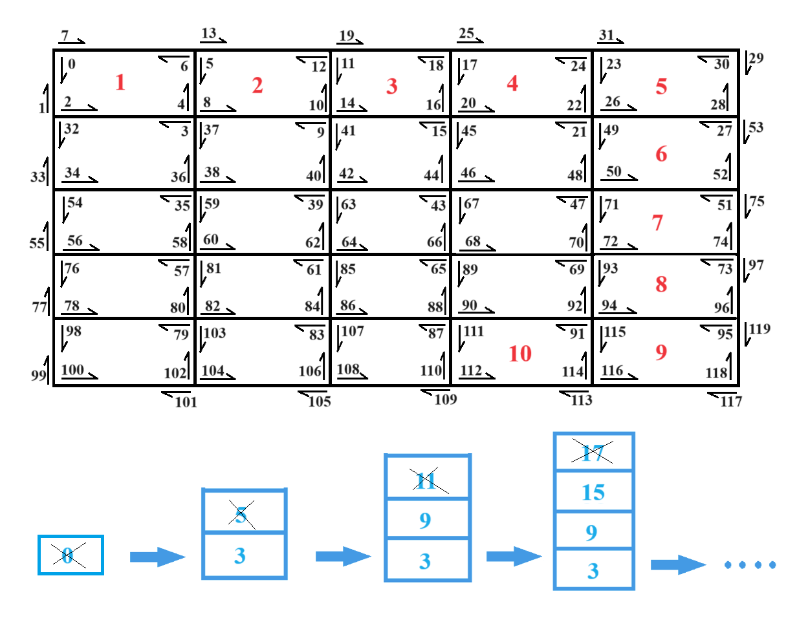

**Realistic Meshes**<br>
We ran `HalfEdgeGraphSearch.collectConnectedComponents` on several meshes with max face limit = 1000. The results of one run are shown below. As you can see queue created localized components and stack created snake shape components.

Example with **queue**
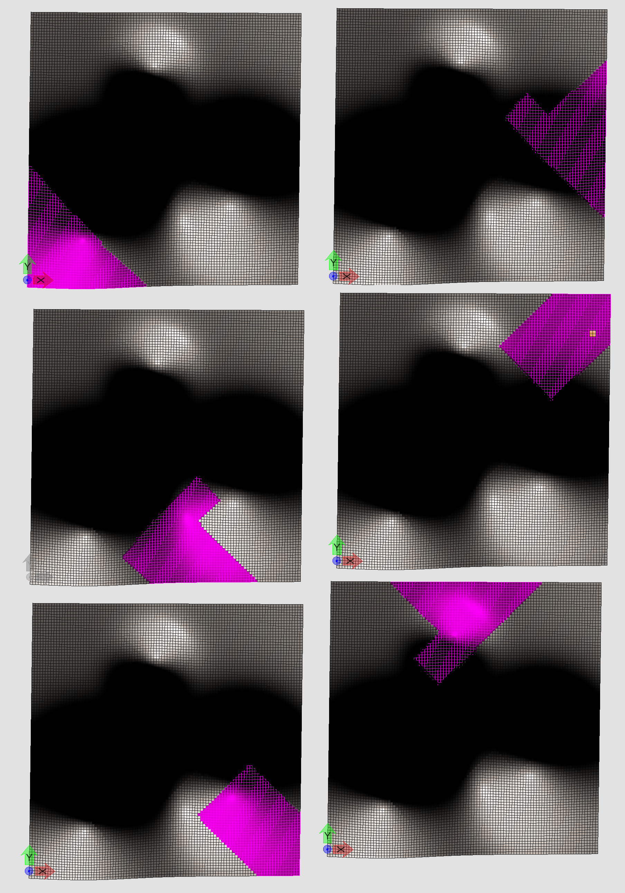<br>
<br>Example with **stack**
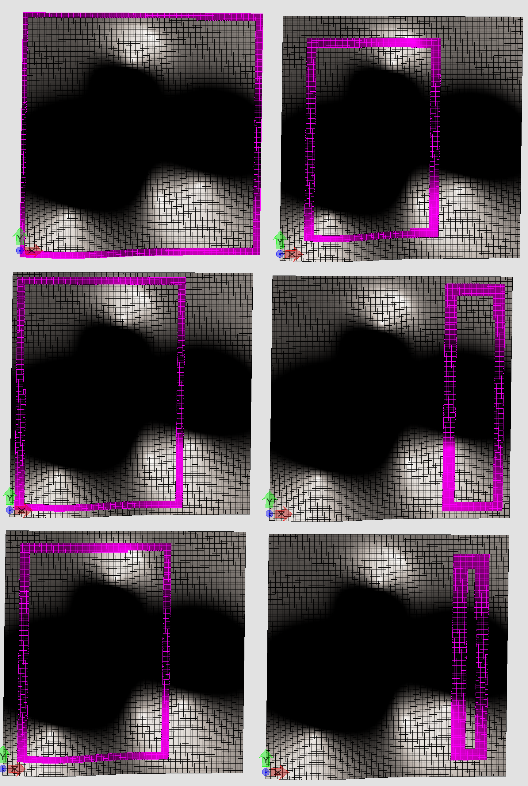<br>

# `Collect Boundary Loops`

Below is the explanation of the `HalfEdgeGraphSearch.collectExtendedBoundaryLoopsInGraph`.

Suppose you call the following code
```
HalfEdgeGraphSearch.collectExtendedBoundaryLoopsInGraph(graph, HalfEdgeMask.EXTERIOR);
```
on the following graph where blue and orange show boundary nodes and red shows non-boundary nodes:

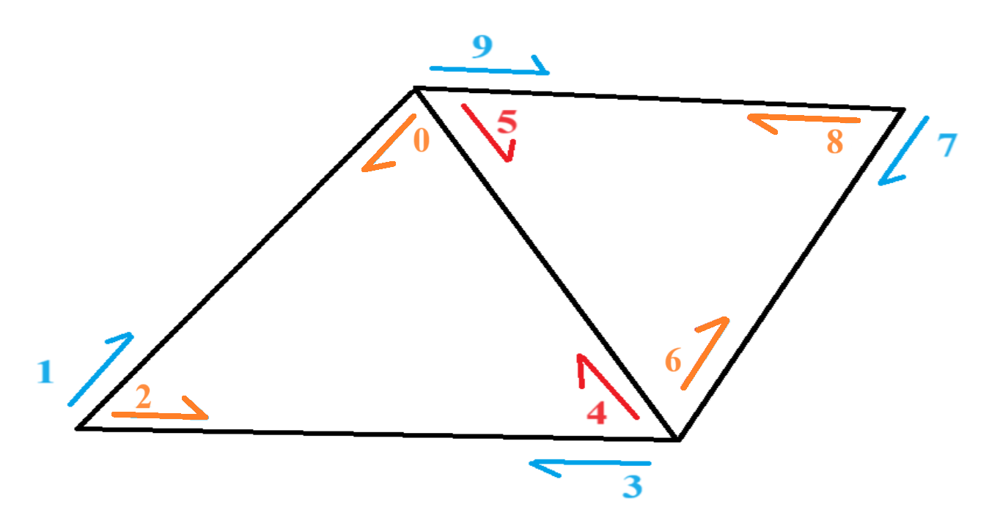

In this image we have one boundary loop. The function collects orange nodes which represent the boundary loop and returns it in an array. Below is how the code works.

First note that we set the visit mask on every node that we visit. Now suppose we start from `node0`. Since this node represents a boundary edge, it is added to the boundary loop array. Then we move to the face successor of `node0` which is `node2`. Again it is added to the boundary loop array because this node represents a boundary edge.

After that we move to the face successor of `node2` which is `node4`. This time it is NOT added to the boundary loop array because this node does not represent a boundary edge. At this point, to find the next boundary edge, we move to the vertex predecessor of `node4` which is `node6`. This node is a boundary edge, so it is added to boundary loop array.

Next we move to the face successor of `node6` which is `node8`. It is added to the boundary loop array and we move to the face successor of `node8` which is `node5`. It is NOT added to the boundary loop array because this node does not represent a boundary edge. Therefore, we move to the vertex predecessor of `node5` which is `node0`. We have already visited this node so we have found the end of boundary loop and we return the boundary loop array: `[node0, node2, node6, node8]`