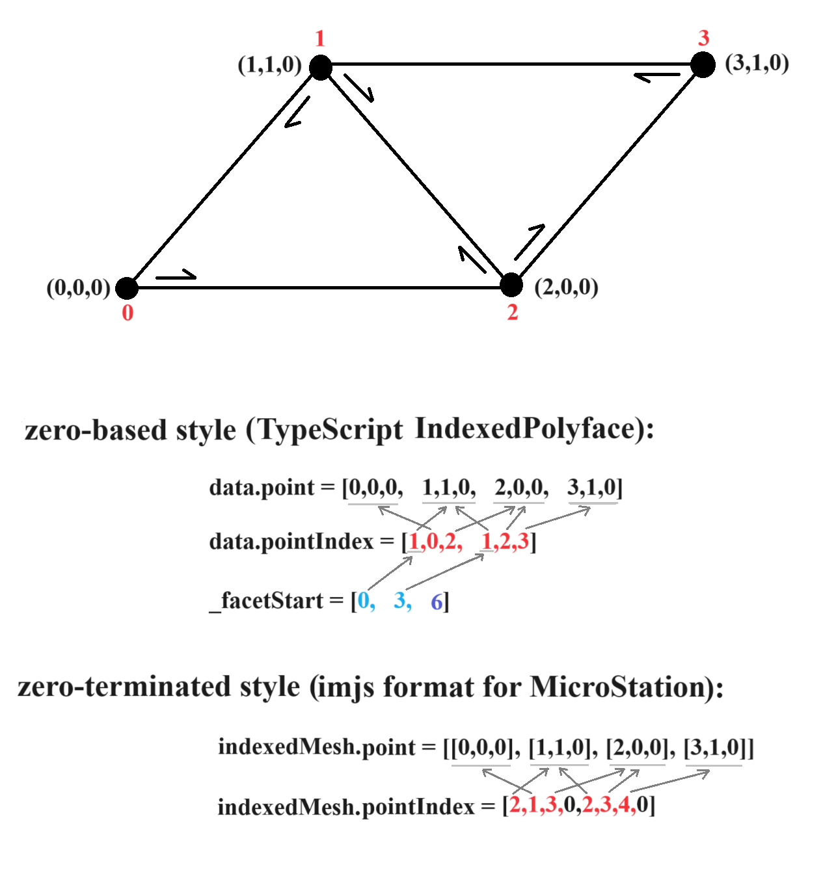

# `IndexedPolyface`

Here is a simple indexed polyface mesh along with some of its data shown in 2 different styles. This data is required to represent an indexed polyface mesh. Other data, such as color, normal, uv parameters, and edge visibility, are not required.

**zero-based style** 
First style is `zero-based` style and is used in TypeScript `IndexedPolyface` class. `data.point` array contains the coordinates of mesh vertices. If we index each vertex (shown by red color in the image), then we can represent each facet using vertex indices. `data.pointIndex` contains facet data. First facet starts from vertex 1 to 0 and ends at 2. Second facet starts from vertex 1 to 2 and ends at 3. As you can see, orientation is CCW.

Facets do not have to be triangles and can be any polygon so we need another piece of data (`_facetStart`) to show the start index of each facet in `data.pointIndex` array. It is clear from `data.pointIndex` array that elements 0 to 2 represent first facet and elements 3 to 5 represent second facet. Therefore, first element of `_facetStart` is 0 which shows the start of first facet and second element of `_facetStart` is 3 which shows the start of second facet. We also store the third element of `_facetStart` (6) which shows the start of the next facet (which does not exist yet).

**zero-terminated style** 
Second style is `zero-terminated` style and is used to serialize an `IndexedPolyface` in imjs (json) format. This is also the way MicroStation stores type 105 Mesh Elements in a DGN file. Coordinates of mesh vertices are stored in `indexedMesh.point` in a similar way as the previous style. However, facet data is represented differently. We use a 1-based zero-terminated style. We know first facet starts from vertex 1 to 0 and ends at 2 (i.e., vertex indices 1,0,2). Now we add 1 to each index (i.e., 2,1,3) and to show the end of facet, we add 0 (i.e., 2,1,3,0). This means we do NOT need a separate array to indicate the start index of each facet. Since zero is not a valid vertex index in this style, we gain another bit of information: the sign of each index determines the corresponding edge's visibility. For example, face loop {2,-1,3,0} means the triangle's second edge, from vertex 0 to 2, is invisible.

**Note:** 
If an IndexedPolyface is defined with only the required data, then it is a complete specification of a mesh's geometry, but an incomplete specification of its topology. That is because a Polyface only knows how to get to the next vertex around a facet (but not to adjacent facets) and how to get to the next facet in the collection (but not to the next adjacent facet). The benefit is it requires less storage and it is straightforward to compute the full topology when we need it.