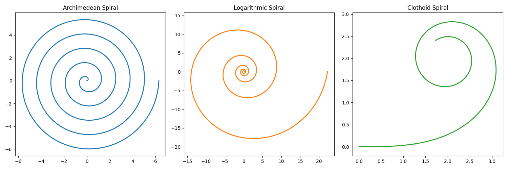
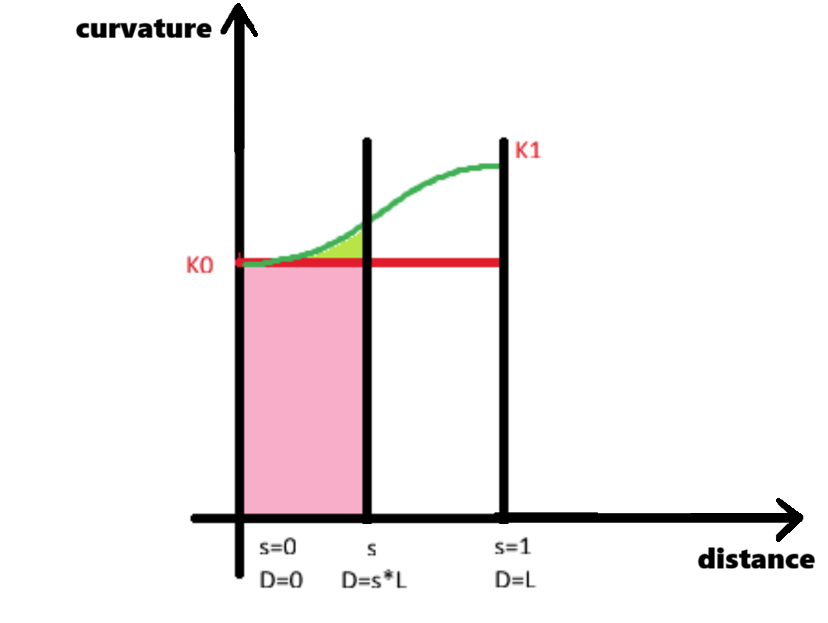

# Spirals

## General Math

A spiral is a curve that winds around a point (usually the origin), moving progressively closer or farther away from it.

Mathematically, a spiral can be described in polar coordinates $(r,θ)$ where $r$ is the distance from the origin and $θ$ is the angle (in radians) from the x-axis. Therefore, a spiral can be defined by $r=f(θ)$ where $f(θ)$ describes how the radius grows as the angle increases.

**Example:**

*Archimedean Spiral:*
$$r=a+bθ$$
Parametric (Cartesian) form:
$$
\begin{aligned}
x(θ)=(a+bθ)\cosθ \\
y(θ)=(a+bθ)\sinθ​
\end{aligned}
$$

*Logarithmic Spiral:*
$$r=ae^{bθ}$$
Parametric (Cartesian) form:
$$
\begin{aligned}
x(θ)=ae^{bθ}\cosθ \\
y(θ)=ae^{bθ}\sinθ
\end{aligned}
​$$

**Note:** core-geometry does not currently support Archimedean or logarithmic spirals, and there are no plans to implement them. Their inclusion here is solely to illustrate the mathematical concepts behind spirals.
-----------

Another way to represent a spiral is via its curvature. In general, for a curve parameterized by curve length $s$ we have:

$$\frac{dθ}{ds} = κ(s)$$

where where $κ(s)$ is curvature and $θ$ is not the same theta as the polar coordinate. Here, $θ$ is a function of arc length: it is the angle that the tangent vector of the curve at arc length $s$ makes with the $x$-axis. That "the derivative of theta is the curvature function" is a consequence of the Frenet-Serre formulas, which apply to all 3D curves with nonzero curvature.

If we integrate and change variable from $s$ to $f$ we get

$$θ(s)= \int_{0}^{Lf} κ(u)du \tag{*}$$

because fraction $f(s) = \frac{s}{L}$ so $s(f) = Lf$ where $L$ is the spiral length from fraction 0 to $f$.

If $T$ is the unit tangent vector we have

$$T(s) = (x'(s),y'(s)) = (\cosθ(s), \sinθ(s))$$

so integrating gives positions:

$$
\begin{aligned}
x(s)= \int_{0}^{s} \cosθ(u)du \\
y(s)= \int_{0}^{s} \sinθ(u)du
\end{aligned}
$$

Replacing equation (*) this and switching variable to fraction form gives:

$$\boxed{
\begin{aligned}
  x(f)= L \int_{0}^{f} \cos\Bigl(\int_{0}^{Lu} 𝜅(v)dv\Bigl) du \\ y(f)= L \int_{0}^{f} \sin\Bigl(\int_{0}^{Lu} 𝜅(v)dv\Bigl) du
\end{aligned}
}$$

**Example:**

*Clothoid (Euler Spiral)*

Curvature $𝜅$ increases linearly with arc length $s$:
$$𝜅(f) = cf \Rightarrow θ(f) = \frac{cf^2}{2} $$
where $c$ is a constant.

Parametric (Cartesian) form:
$$
\begin{aligned}
x(f)= \int_{0}^{f} \cos\Bigl(\frac{cu^2}{2}\Bigl)du \\
y(f)= \int_{0}^{f} \sin\Bigl(\frac{cu^2}{2}\Bigl)du
\end{aligned}
$$



## Code

**TransitionSpiral3d**

Parent class for all iTwin spirals is `TransitionSpiral3d` which is extended by `IntegratedSpiral3d` and `DirectSpiral3d`.

`TransitionSpiral3d` class has an member called `TransitionConditionalProperties` which encapsulates 5 elements: `radius0`, `radius1`, `bearing0`, `bearing1`, and `curveLength`.

We already know:
$$θ(f)= \int_{0}^{Lf} 𝜅(u)du$$
This can be rewritten as
$$θ_1 - θ_0 = L \bar{𝜅} = L \frac{𝜅_0 + 𝜅_1}{2}$$
where $\bar{𝜅}$ is curvature average, $θ_0$ is `bearing0`, $θ_1$ is `bearing1`, $L$ is `curveLength`, $𝜅_0$ is `1/radius0`, and $𝜅_1$ is `1/radius1`.

**IntegratedSpiral3d**

iTwin has 5 integrated spirals: `clothoid`, `bloss`, `biquadratic`, `cosine`, and `sine`. All 5 are defined by their curvature function $𝜅(s)$ in `NormalizedTransition` class.

**Note:** `NormalizedTransition` class has normalized formulas meaning $𝜅(0) = 0$ and $𝜅(1) = 1$ while in general we have  $𝜅(0) = 𝜅_0$ and $𝜅(1) = 𝜅_1$. We will show how to calculate general values using normalized values.

The spiral $x$ and $y$ coordinates is calculated by

$$\boxed{
\begin{aligned}
  x(f)= L \int_{0}^{f} \cos\Bigl(\int_{0}^{Lu} 𝜅(v)dv\Bigl) du \\ y(f)= L \int_{0}^{f} \sin\Bigl(\int_{0}^{Lu} 𝜅(v)dv\Bigl) du
\end{aligned}
}$$

These coordinates are stored in `_globalStrokes` and `_activeStrokes` which are populated in `IntegratedSpiral3d.refreshComputedProperties` via call to `IntegratedSpiral3d.fullSpiralIncrementalIntegral`. This function calculates the outer integral numerically using Gaussian quadrature formula.


The inner integral, which is in fact the angle $θ$, is calculated analytically by `IntegratedSpiral3d.globalFractionToBearingRadians`.

Suppose this is the curvature graph:


`IntegratedSpiral3d.globalFractionToBearingRadians` calculates the angle $θ$ by calculating the area under the graphs.

The area is the pink rectangle area $s*L*K0$ plus green area which is the normalized integral and has to be scaled by curve length for $x$ and curvature delta for $y$. Start angle should also be added to the calculated area to correctly determine the angle $θ$.

These translate to below code:


```ts
public globalFractionToBearingRadians(fraction: number): number {
  const areaFraction = this._evaluator.fractionToArea(fraction);
  const arcLength = this._arcLength01;
  return this.bearing01.startRadians // start angle
    + fraction * arcLength * this._curvature01.x0 // pink area
    + areaFraction * arcLength * this._curvature01.signedDelta(); // green area
}
```

**DirectSpiral3d**

Direct spirals do not use integration to calculate $x$ and $y$ coordinates. Instead they use direct formulas to find coordinates.

The 4 spirals `JapaneseCubic`, `Arema`, `ChineseCubic`, and `WesternAustralian` have a formula for $θ$ (which is $θ(s) = c*s^2$). These formulae use truncated Taylor series to approximate the clothoid integrands by polynomials, which we can integrate directly (without quadrature).

To find the $x$ and $y$ coordinates for each one of those 4 spirals:

- We find Taylor series of $\cos(θ)$ and $\sin(θ)$
- We pick a couple of $x$ and $y$ terms in the series
- We replace $θ(f)$ with $c*f^2$
- We integrate

All these steps are done in `ClothoidSeriesRLEvaluator`.

The 5 spirals `AustralianRailCorp `, `Czech`, `Italian`, `MXCubicAlongArc`, and `Polish` are indeed NOT spirals`. Those are just cubic curves defined by
$$
\begin{aligned}
x(f)= fL \\
y(f) = cf^3
\end{aligned}
$$
that briefly take off from the x axis "like a spiral".

All of these 5 spirals extend `CubicEvaluator` class.
