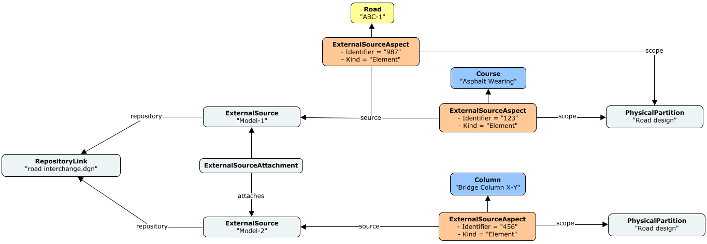

# Provenance in BIS

## Introduction

Provenance concerns the ability to trace an element in a BIS repository back to its native, external source. Several classes are available in the BisCore schema to help capturing provenance information for Elements in a BIS repository. They are particularly important for data-synchronization workflows, while detecting changes in an external source with respect to data stored in a BIS repository.

## Core Concepts

The following class diagrams depict the main classes from the BisCore schema involved in capturing provenance in BIS repositories. See [Class-diagram Conventions](../guide/references/class-diagram-conventions.md) for details about the conventions used.

### RepositoryLink

A [RepositoryLink](./BisCore.ecschema.md#repositorylink-repository-link-badge-textentityclass-kindinfo) represents a link to an external repository. External Repositories may be associated with Reality data as well as with data that is synchronized with elements in a BIS repository.

### ExternalSource

An [ExternalSource](./BisCore.ecschema.md#externalsource-source-badge-textentityclass-kindinfo) represents an `Information Container` within a repository. External repositories are referenced by [RepositoryLink](#repositorylink) instances in a BIS repository.

Some external repositories do not have any data-container concept and therefore, their corresponding [RepositoryLink](#repositorylink) instances will only be associated with one  `ExternalSource` instance.

### ExternalSourceAttachment

An [ExternalSourceAttachment](./BisCore.ecschema.md#externalsourceattachment-external-source-attachment-badge-textentityclass-kindinfo) enables the representation of hierarchical `Information Container`s or acyclical dependency graphs that can be encountered in some external repositories.

`ExternalSourceAttachment` instances are owned by a `ExternalSource` at the higher level of the hierarchy via the [ExternalSourceOwnsAttachments](./BisCore.ecschema.md#externalsourceownsattachments-badge-textrelationshipclass-kindinfo) relationship.

An instance of `ExternalSourceAttachment` also captures any transformations needed - in the form of translation, scale or rotation - relative to the  `ExternalSource` attaching it.

### ExternalSourceAspect

An [ExternalSourceAspect](./BisCore.ecschema.md#externalsourceaspect-external-source-aspect-badge-textentityclass-kindinfo) is an [Element Aspect](../guide/fundamentals/elementaspect-fundamentals.md) which is meant to capture the specific details with regards to provenance for its owning Element.

Provenance for a specific Element is captured in terms of:

- An `Identifier` in the source repository (required).
- A `Kind` of object within the source repository.
- A reference to another Element that represents a `Scope` in which the combination of `Identifier` and `Kind` is unique. This referenced Element is typically a [RepositoryLink](#repositorylink) or an [InformationPartitionElement](./BisCore.ecschema.md#informationpartitionelement-information-partition-abstract-badge-textentityclass-kindinfo).
- A reference to an [ExternalSource](#externalsource) from which the Element originated (required).
- An optional `Version` of the Element's data captured in the BIS repository.
- An optional `Checksum` - a cryptographic hash (any algorithm) - of the Element's data captured in the BIS repository.
- Optional `JsonProperties` in case additional provenance-related attributes need to be captured.

This provenance properties are very important during data-synchronization workflows. Each data-synchronizer needs to decide what values from entities in the external source to capture in the aforementioned properties. It is recommended that data-synchronizers assign not-null values to `Identifier`, `Kind` and `Scope` since they are targeted by aspect-finding-APIs in iTwin.js.

Note that an Element can own more than one `ExternalSourceAspect` if its provenance is associated to multiple source repositories or multiple entities in one external repository. Furthermore, `ExternalSourceAspect`s with the same combination of `Identifier`, `Kind` and `Scope` are allowed on the same Element. Data-synchronizers can use the `JsonProperties` attribute of each `ExternalSourceAspect` in order to differenciate their provenance, if needed.

The following instance diagram shows an example of three elements synchronized from an external repository consisting of a single Dgn file containing two Dgn models. See [Instance-diagram Conventions](../guide/references/instance-diagram-conventions.md) for details about the conventions used.

### ExternalSourceGroup

An [ExternalSourceGroup](./BisCore.ecschema.md#externalsourcegroup-external-source-group-badge-textentityclass-kindinfo) is an special case of [ExternalSource](#externalsource) intended to be used when there is a potential for duplicate elements across a set of external source files.

One real-world use case is the appearance of the same "Wall", with the same "unique" id, in more than one IFC file. This setup may have been done for the purpose of referencing the same "Wall" from three different IFC files focusing on piping, HVAC and architectural details respectively. This set of IFC files is then considered to be an `ExternalSourceGroup` in a BIS repository. The individual `ExternalSource` instances for each IFC file are then grouped via the `ExternalSourceGroupGroupsSources` relationship. The following instance diagram depics such an example. See [Instance-diagram Conventions](../guide/references/instance-diagram-conventions.md) for details about the conventions used.

### SynchronizationConfigLink

A [SynchronizationConfigLink](./BisCore.ecschema.md#synchronizationconfiglink-synchronization-configuration-link-badge-textentityclass-kindinfo) represents a link to the configuration of a synchronization job in a BIS repository. `SynchronizationConfigLink`s specify the associated [ExternalSource](#externalsource) instances that were processed during its execution via the [SynchronizationConfigLinkProcessesSources](./BisCore.ecschema.md#synchronizationconfigprocessessources-badge-textrelationshipclass-kindinfo) relationship.

When the associated `ExternalSource` is the root of a synchronization job, which means that it is used to discover other referenced sources, the [SynchronizationConfigLinkSpecifiesRootSources](./BisCore.ecschema.md#synchronizationconfigspecifiesrootsources-sealed-badge-textrelationshipclass-kindinfo) relationship shall be used instead.

The following instance diagram shows an example of a hierarchy of `ExternalSource`s, starting at an instance specified by a `SynchronizationConfigLink`. See [Instance-diagram Conventions](../guide/references/instance-diagram-conventions.md) for details about the conventions used.

---
| Back to: [Core domains](./core-domains.md)
|:---
