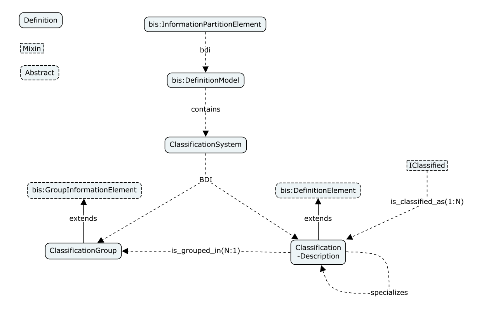

# Schema : Classification Systems (alias)

## Design considerations

## Naming considerations

## Classes

## Relationships

## Code

Name|Value
--|--
CodeValue|NULL
CodeScope|CodeScopeSpec::Repository
CodeSpec|bis:NullCodeSpec

## Pending work
- Applicability (Allan)
- Catalog impact on the Schema (Allan)
- ONLY what BCS needs rest is out. (Wouter)
- how to relate to PE (Wouter)
- Strong or weak typing. SEALED. (Wouter)
- instance diagram is wrong (Wouter)
- how to prevent multiple classifications from the same system on same type. Solve in software.(Wouter)
- IClassiedType mixin (Wouter)
- Wrong airport-toilet classification in library (Wouter)

## iModel Bridges using ClassificationSystems

Bridges that do not store `SpatialComposition` relationships natively, may compute and maintain those in their bridge. In the long run it is not sure if the tradeoff of storing and maintaining the persistance of relationships outweighs the performance loss of computing them each time. However a future domain handler API may elect to compute them (as bim software grows more mature).

## Domain Standardization of SpatialCategories
