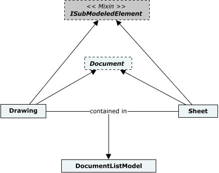
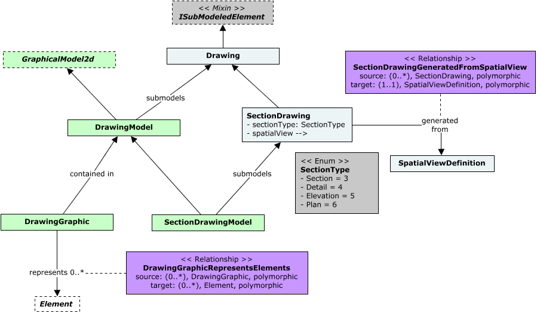
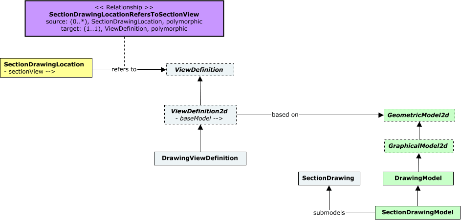
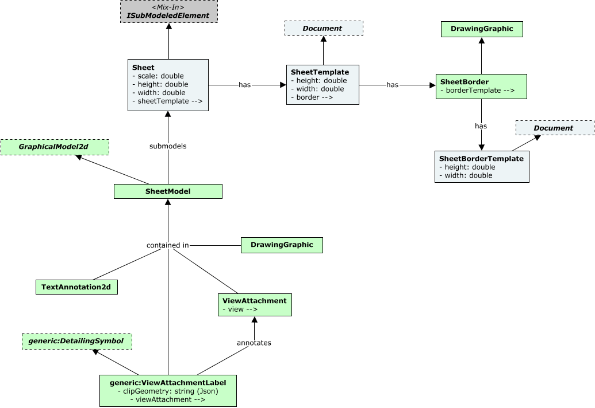
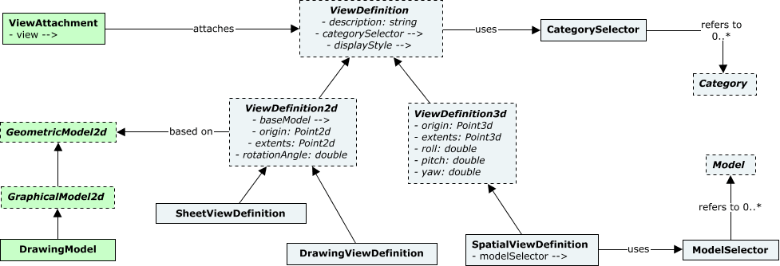
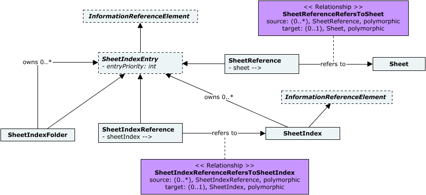

# Drawings & Sheets

## Introduction

Drawings & Sheets concern the ability to capture 2D representations of Entities that are widely used in detailed-design phases of infrastructure assets, as means of documenting and communicating decisions across teams and stakeholders. The BisCore schema contains several classes standardizing concepts, rules and patterns that enable capturing Drawings & Sheets in BIS repositories with a high-level of detail.

The following class diagram depicts the most basic classes from the BisCore schema involved in capturing a Drawing or a Sheet in a BIS repository. See [Class-diagram Conventions](../guide/references/class-diagram-conventions.md) for details about the conventions used.

&nbsp;

&nbsp;

Both the `Drawing` and `Sheet` classes mixin the `ISubModeledElement` interface, which advertises the expectation that they will be detailed in a submodel. A `Drawing` instance is expected to be submodeled by a `DrawingModel` while a `Sheet` instance is expected to be submodeled by a `SheetModel`. `Drawing` and `Sheet` instances are contained in one or more `DocumentListModel`s.

## Drawings

The following class diagram depicts the main classes from the BisCore schema involved in capturing a Drawing in a BIS repository. See [Class-diagram Conventions](../guide/references/class-diagram-conventions.md) for details about the conventions used.

&nbsp;

&nbsp;

### Drawing

A [Drawing](./BisCore.ecschema.md#drawing) is a 2D representation of Entities used to apply annotations, dimensions, callouts, and other embellishments.

### SectionDrawing

A [SectionDrawing](./BisCore.ecschema.md#sectiondrawing) is a specialized drawing generated from a 2D section of a spatial view. A SectionDrawing can be of one of four types, captured by its `SectionType` property: Section, Detail, Elevation or Plan.

For additional settings about a `ViewAttachment` that can be captured in its `JsonProperties` attribute as JSON, please see [SectionDrawingProps](https://www.itwinjs.org/reference/core-common/entities/sectiondrawingprops/).

### SectionDrawingLocation

A [SectionDrawingLocation](./BisCore.ecschema.md#sectiondrawinglocation), as a base class of bis:SpatialLocationElement, captures the spatial location of a section drawing generated from a `SpatialViewDefinition`. An `SectionDrawingLocation` instance refers to the view generated from a SpatialViewDefinition, typically a `DrawingViewDefinition`, via its _SectionView_ navigation property.

The associated `SectionDrawing` can be found via the _BaseModel_ navigation property on the `DrawingViewDefinition` that a `SectionDrawingLocation` refers to, as shown in the following class-diagram. See [Class-diagram Conventions](../guide/references/class-diagram-conventions.md) for details about the conventions used.

&nbsp;

&nbsp;

## Sheets

### Sheet

A sheet is a document that captures one or multiple views of a BIS repository into a 2D representation that is optimized for  drawing production, serving as an electronic drawing sheet.

The following class diagram depicts the main classes from the BisCore schema involved in capturing a Sheet in a BIS repository. See [Class-diagram Conventions](../guide/references/class-diagram-conventions.md) for details about the conventions used.

&nbsp;

&nbsp;

&nbsp;

&nbsp;

### ViewAttachment

A [ViewAttachment](./BisCore.ecschema.md#viewattachment) is a `GraphicalElement2d` element that attaches a particular `ViewDefinition` into a `Sheet`. Instances of `ViewAttachment` are contained in the `SheetModel` of the `Sheet` it attaches a `ViewDefinition` into. The _BBoxLow_ and _BBoxHigh_ properties of a `ViewAttachment` specify the placement of the attachment into its `Sheet`.

For additional settings about a `ViewAttachment` that can be captured in its `JsonProperties` attribute as JSON, please see [ViewAttachmentProps](https://www.itwinjs.org/reference/core-common/entities/viewattachmentprops/).

### DrawingViewDefinition

A [DrawingViewDefinition](./BisCore.ecschema.md#drawingviewdefinition) specifies parameters for a view of a `DrawingModel`. For additional settings about a `DrawingViewDefinition` that can be captured in its `JsonProperties` attribute as JSON, please see [ViewDetailsProps](https://www.itwinjs.org/reference/core-common/views/viewdetailsprops/).

### SpatialViewDefinition

A [SpatialViewDefinition](./BisCore.ecschema.md#spatialviewdefinition) specifies parameters for a view of a spatially-located volume. For additional settings about a `SpatialViewDefinition` that can be captured in its `JsonProperties` attribute as JSON, please see [ViewDetails3dProps](https://www.itwinjs.org/reference/core-common/views/viewdetails3dprops/).

## Sheet Index

A sheet index is a structured collection of sheets in a BIS repository. A sheet index can link any sheet in a BIS repository and organize them hierarchically into folders.

The following class diagram depicts the main classes from the BisCore schema involved in capturing a Sheet Index in BIS repositories. See [Class-diagram Conventions](../guide/references/class-diagram-conventions.md) for details about the conventions used.

&nbsp;

&nbsp;

Instances of `SheetIndexEntry` subclasses (i.e. `SheetReference`s, `SheetIndexFolder`s and `SheetIndexReference`s) as well as `SheetIndex` instances are contained in `SheetIndexModel`s, who further models a `SheetIndexPartition`. The displayed order of `SheetIndexEntry` instances per SheetIndex or SheetIndexFolder can be controlled by assigning their _EntryPriority_ property accordingly.