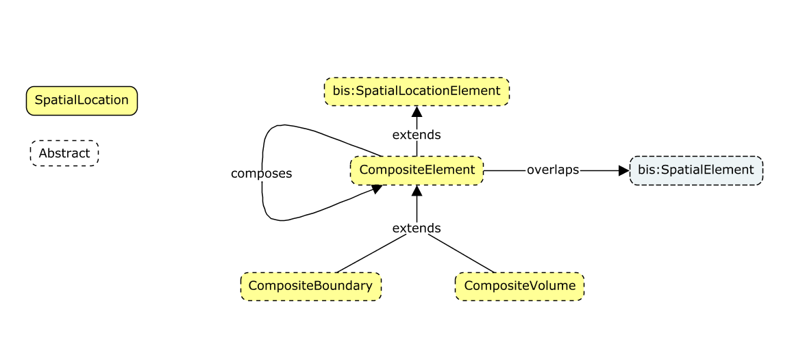

# Spatial Composition

This schema describes the breakdown of `SpatialLocationElement`. It is intended to be used across disciplines. For instance it should allow to make a single composition hierarchy composing instances of `BuildableVolume` into a `Site`.The composition relationship can be applied in a recursive manner, i.e. a composed element can be composed into another composition. Cyclic references are prevented by rules in the `domain handler`. Semantically composition means that composer and composed elements describe the same thing and therefore sharing geometric location is not a conflict, it is actually expected.



## Design considerations

- This schema does not specialize any of the two available breakdown mechanisms in `BIS` (`IParent` and models). The direct reason are legacy data uploaded by [iModel bridges](./../intro/imodel-bridges.md). Reusing a `BIS` breakdown mechanism is desired but not currently available.
- Modeled and named after IFC.

## Naming considerations

- Avoid negatives So compose is favored over decompose.

## Schema properties

Property | Value
--|--
alias           | "spcomp"
status          | proposed
initial release | imodelhub v1.0, mid 2018
references      | BisCore

## Classes

### CompositeElement

A spatial element that may be Composite of other CompositeElements

Naming :
1 - Do not repeat "SpatialLocation" of the base class it makes the name to long especially when this name is repeated in relationship names. Leaving that out makes the name sound more general than it should however namespace should resolve that.
2 - Do not use Composed since leaf nodes will not be composed.
3 - Equivalent of `IfcSpatialStructureElement`.

```xml
    <ECEntityClass typeName="CompositeElement" modifier="Abstract">
        <BaseClass>bis:SpatialLocationElement</BaseClass>
        <BaseClass>bis:IParentElement</BaseClass>
        <ECNavigationProperty propertyName="ComposingElement" relationshipName="CompositeComposesSubComposites" direction="Backward" description="The Composite Element" />
    </ECEntityClass>
```

### CompositeBoundary

A CompositeElement that is delimited by a curve. We expect a closed curve on a surface as geometry.

Naming :
1 - Boundary indicates a 2 dimensional perimeter (on a terrain surface) for the location.

```xml
    <ECEntityClass typeName="CompositeBoundary" modifier="Abstract">
        <BaseClass>CompositeElement</BaseClass>
    </ECEntityClass>
```

### CompositeVolume

A CompositeElement that is delimited by a volume

Naming :
1 - Volume indicates a 3d solid object to delimit the spatial location.

```xml
    <ECEntityClass typeName="CompositeVolume" modifier="Abstract">
        <BaseClass>CompositeElement</BaseClass>
    </ECEntityClass>
```

## Relationships

### CompositeComposesSubComposites

*TODO like to derive from `IElementOwnsChildElements`.*

Naming :
1 - Equivalent of : `IfcSpatialStructureElement.IsDecomposedBy`.

Relates the Composer with its' composees

```xml
    <ECRelationshipClass typeName="CompositeComposesSubComposites" strength="embedding" modifier="None">
      <!-- Relationship that indicates a decomposition of child CompositeElement -->
      <Source multiplicity="(0..1)" roleLabel="composes" polymorphic="true">
        <Class class="CompositeElement"/>
      </Source>
      <Target multiplicity="(0..*)" roleLabel="is part of" polymorphic="true">
        <Class class="CompositeElement"/>
      </Target>
    </ECRelationshipClass>
```

### CompositeOverlapsSpatialElements

A relationship to mark that an element is at least partially contained within the CompositeElement

Naming :
1 - Equivalent of : `IfcSpatialStructureElement.ContainsElements`.

```xml
    <ECRelationshipClass typeName="CompositeOverlapsSpatialElements" modifier="None" strength="referencing">
      <BaseClass>bis:ElementRefersToElements</BaseClass>
        <Source multiplicity="(0..*)" roleLabel="contains" polymorphic="true">
            <Class class="CompositeElement"/>
        </Source>
        <Target multiplicity="(0..*)" roleLabel="is contained by" polymorphic="true">
            <Class class="bis:SpatialElement"/>
        </Target>
    </ECRelationshipClass>
```

## CodeValue

## Category CodeScope

## iModel Bridges and instances of CompositeElement
