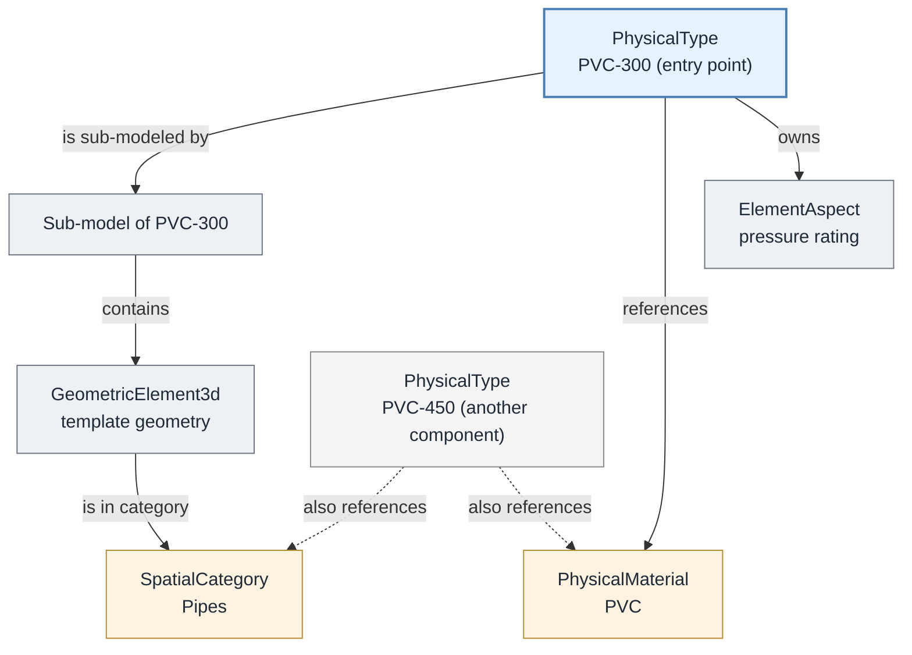
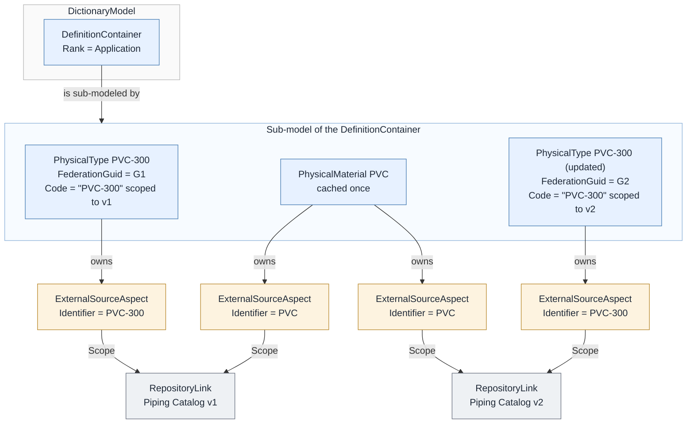

# Catalogs

A **catalog** is a repository of reusable definitions (component types, templates, materials, styles, and other standards) maintained by a *catalog authority* outside of the iModels that use them. Applications copy the definitions they need from a catalog into an iModel so that placed instances can reference them.

This page describes how catalog-sourced definitions are organized inside an iModel and how their provenance is recorded. It does not cover how a catalog authority hosts, stores, or serves its catalogs; those are implementation choices of each authority. For the backend APIs that can open a catalog stored as an iModel, see [Catalogs in the backend documentation](../../../learning/backend/Catalogs.md).

> The organization and provenance patterns on this page are the working conventions adopted by current catalog implementations. They are recommended for any catalog authority, but they are not (yet) formalized BIS standards and may evolve.

## A running example

The sections below follow one example through the catalog lifecycle. A catalog authority publishes a *Piping Catalog* containing pipe types. Version 1 of the catalog includes **PVC-300**, a 300&nbsp;mm PVC pipe type modeled as a `PhysicalType`. An application imports PVC-300 into a project iModel so that pipes of that type can be placed. Later, the authority corrects PVC-300's wall thickness and publishes version 2 of the catalog.

## Why copy definitions into an iModel

The catalog authority remains the source of truth for its definitions. An iModel caches only the definitions that are used, or that the user intends to use, rather than entire catalogs. Copying a definition into the iModel:

- makes the definition available offline,
- tracks changes to the definition with the iModel's own change history,
- allows other elements in the iModel to reference the definition,
- keeps the type of a placed instance unambiguous,
- lets applications handle components consistently, whether or not they came from a catalog, and
- preserves the meaning of placed instances even if the catalog later changes.

See [Components from Catalogs](../../../learning/backend/IModelContents.md#components-from-catalogs) for guidance on which definitions belong in an iModel.

## Components and their dependencies

*Component* commonly refers to a single reusable catalog entry: a pipe type, a valve, a title-block template. In BIS terms, a catalog entry is rooted at a [DefinitionElement](../references/glossary.md#DefinitionElement), typically a [TypeDefinitionElement](../fundamentals/type-definitions.md), but that entry-point element is rarely self-contained. A usable component consists of the entry-point `DefinitionElement` **and all of its dependencies**, which may include:

- a sub-model of the entry-point element, and the elements it contains (for example, geometric elements that act as a template of the component's geometry),
- `Category` and `SubCategory` elements referenced by those geometric elements,
- `PhysicalMaterial`, `RenderMaterial`, and other referenced `DefinitionElement`s,
- `ElementAspect`s owned by any of those elements, and
- the relationships among all of the above.

In the running example, the PVC-300 component is more than its `PhysicalType` element:

Importing PVC-300 means copying every node above except PVC-450: the `PhysicalType`, its sub-model and template geometry, the *Pipes* category, the *PVC* material, and the aspect, together with the relationships among them. The amber nodes are dependencies that PVC-300 shares with other components such as PVC-450.

There is currently no single BIS construct that identifies this bundle of elements as a unit. Discovering it requires traversing outward from the entry-point element: follow the `ModelModelsElement` relationship to its sub-model, the contained elements of that sub-model, navigation properties and relationships to referenced definitions, and owned aspects, recursively, until no new dependent elements are found.

When copying a component:

1. **Copy its dependencies, not just the entry-point element.** An application that imports a catalog entry must traverse and copy all of its dependencies. Copying only the entry-point element produces a broken definition.
2. **Dependencies may be shared.** A single `Category` or `PhysicalMaterial` may be referenced by many components. Such shared dependencies belong to more than one component and must be copied only once into the destination iModel: if PVC-300 was imported earlier, importing PVC-450 reuses the already-copied *Pipes* category and *PVC* material.

## Organization of cached definitions in an iModel

Definitions cached from a catalog authority are *Application-rank* standardized definitions (see [Organizing Definition Elements](./organizing-definition-elements.md)). The recommended organization is:

- A well-known `DefinitionContainer`, with its `Rank` property set to `Application`, is created in the [DictionaryModel](../references/glossary.md#DictionaryModel) as the entry point for all definitions cached from a given catalog authority. Its [Code](../fundamentals/codes.md) has a `CodeValue` that follows the `{organization name}:{application name}:Definitions` convention described in [Organizing Definition Elements](./organizing-definition-elements.md#dictionarymodel-for-global-scoped-definitions).
- The sub-model of that `DefinitionContainer` contains the cached definitions.
- A specific version of a definition is cached **only once per iModel**, no matter how many catalogs or catalog versions include it. (A changed definition is a new version and is cached as a new element; see [Provenance of cached definitions](#provenance-of-cached-definitions).)

In the running example, the application creates (or finds) its well-known `DefinitionContainer` in the project iModel's `DictionaryModel` and copies PVC-300 and its dependencies into that container's sub-model. When PVC-450 is imported later, it lands in the same sub-model, reusing the shared category and material already there.

Local `DefinitionElement`s that an application creates for its own purposes, without any association to a catalog, do not belong under this container. They are stored in `DefinitionModel`s within the application's [Channel](../../../learning/backend/Channel.md).

### Folders

Catalog authorities commonly let users organize catalog entries into folders. Folders, including nested folders, are represented in the iModel by nested `DefinitionContainer`s and their sub-models under the authority's entry-point `DefinitionContainer`.

## Provenance of cached definitions

Applications must be able to determine where a cached definition came from (which catalog, which version of that catalog, and which entry in it), for example, to detect that a newer version of the definition is available. The general provenance mechanisms are described in [Provenance in BIS](../../domains/Provenance-in-BIS.md); this section describes their recommended application to catalogs.

A published catalog version is treated as **immutable**: changing anything in a catalog produces a new catalog version.

The recommended mapping is:

- **Catalog version → [RepositoryLink](../../domains/Provenance-in-BIS.md#repositorylink).** Each version of a catalog from which definitions were cached is represented by a `RepositoryLink` element identifying that specific, immutable catalog version.
- **Cached definition → [ExternalSourceAspect](../../domains/Provenance-in-BIS.md#externalsourceaspect).** Each cached `DefinitionElement` carries one `ExternalSourceAspect` per catalog version that includes it, with the aspect's `Scope` referencing the corresponding `RepositoryLink`. A definition that appears unchanged across several catalog versions is still cached once, with multiple aspects recording each catalog version it belongs to.
- **Stable entry identity → `ExternalSourceAspect.Identifier`.** The catalog authority's stable identifier for the catalog entry, the identity that persists as the entry evolves across versions, is recorded in the aspect's `Identifier` property.
- **Definition-version identity → [FederationGuid](../fundamentals/federationGuids.md).** The cached `DefinitionElement`'s `FederationGuid` holds the catalog authority's identifier for the *specific version* of the definition. When a changed catalog entry is cached, the new copy is a new `DefinitionElement` with a new `FederationGuid`, while its `CodeValue` and its stable identifier in `ExternalSourceAspect.Identifier` may remain unchanged. A `FederationGuid` normally identifies the real-world entity an Element represents; here, each immutable published version of a definition is treated as a distinct entity, so each version gets its own `FederationGuid`, and the identity that persists across versions is carried by `ExternalSourceAspect.Identifier` instead.
- **Code scope.** The `RepositoryLink` representing the catalog version under which a definition was first cached serves as the `CodeScope` element for that cached `DefinitionElement` (see [Codes](../fundamentals/codes.md)). Scoping the `Code` to a catalog version prevents code collisions between coexisting copies of the same definition: two cached versions of one catalog entry share a `CodeValue` but have different `CodeScope`s.

The `ExternalSourceAspect` class has additional properties, such as `Source` and `Kind`, described in [Provenance in BIS](../../domains/Provenance-in-BIS.md#externalsourceaspect). Their values for catalog-cached definitions are authority-specific and are not standardized by this mapping.

### The example, end to end

Applying the mapping to the running example:

1. The application imports PVC-300 from Piping Catalog version 1. It creates a `RepositoryLink` for *Piping Catalog v1*, copies the component into the well-known container's sub-model, sets the cached `PhysicalType`'s `FederationGuid` to the authority's identifier for *this version* of PVC-300, scopes the element's `Code` to the v1 `RepositoryLink`, and attaches an `ExternalSourceAspect` with `Identifier` set to the authority's stable identifier for PVC-300 and `Scope` referencing the v1 `RepositoryLink`.
2. The authority corrects PVC-300's wall thickness and publishes catalog version 2. Version 1 is unchanged; it remains valid and immutable.
3. The application detects (by its own means; nothing in the iModel does this automatically) that catalog v2 contains a newer PVC-300 and imports it. The updated pipe type is a **new** `DefinitionElement` with a **new** `FederationGuid`, an `ExternalSourceAspect` with the **same** stable `Identifier`, and `Scope` referencing a new *Piping Catalog v2* `RepositoryLink`. Its `CodeValue` is unchanged, but its `Code` is scoped to the v2 `RepositoryLink`, so the two cached copies do not collide.
4. The *PVC* material did not change between v1 and v2. It stays cached once, and gains a second `ExternalSourceAspect` scoped to the v2 `RepositoryLink`.

The two cached PVC-300 elements share a stable `Identifier` and a `CodeValue` but have different `FederationGuid`s and `CodeScope`s; the unchanged *PVC* material is cached once with one aspect per catalog version that includes it. To check whether a newer version of a cached definition exists, the application looks up the definition's stable `Identifier` in the latest catalog version and compares the authority's version identifier there against the cached `FederationGuid`.

## Scope and future standardization

The organization and provenance patterns above generalize to any catalog authority. Authority-specific concerns (identifier formats, publishing workflows, hosting, storage, and APIs for browsing or downloading catalogs) are outside the scope of BIS and of this page. Broader standards for third-party catalog authorities are deferred until concrete use cases arise.

---

| Next: [3D Guidance](../physical-perspective/3d-guidance.md)
|:---
