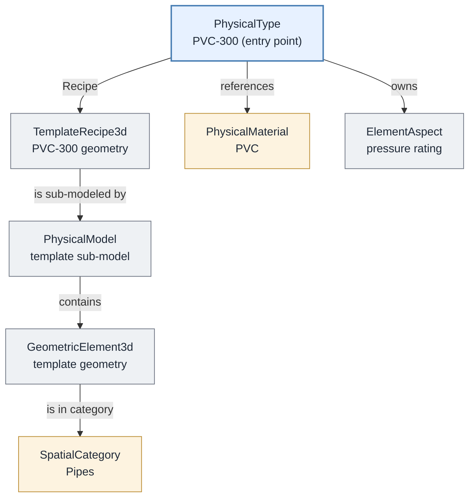
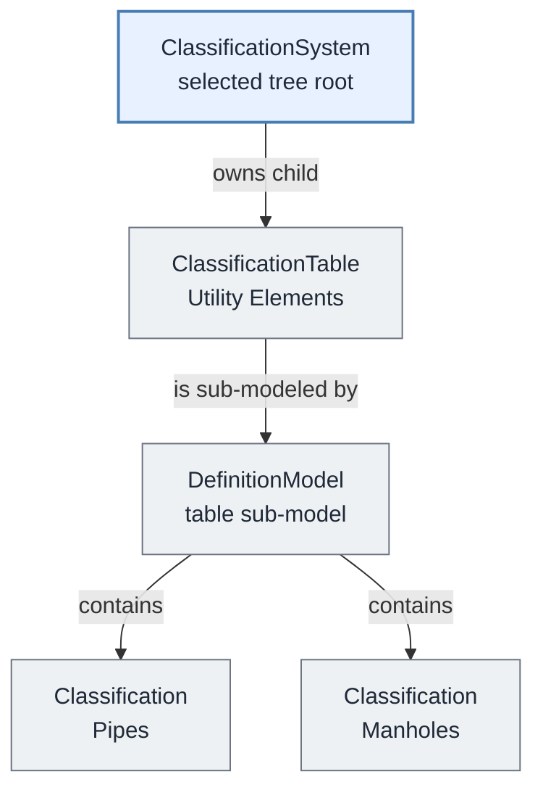
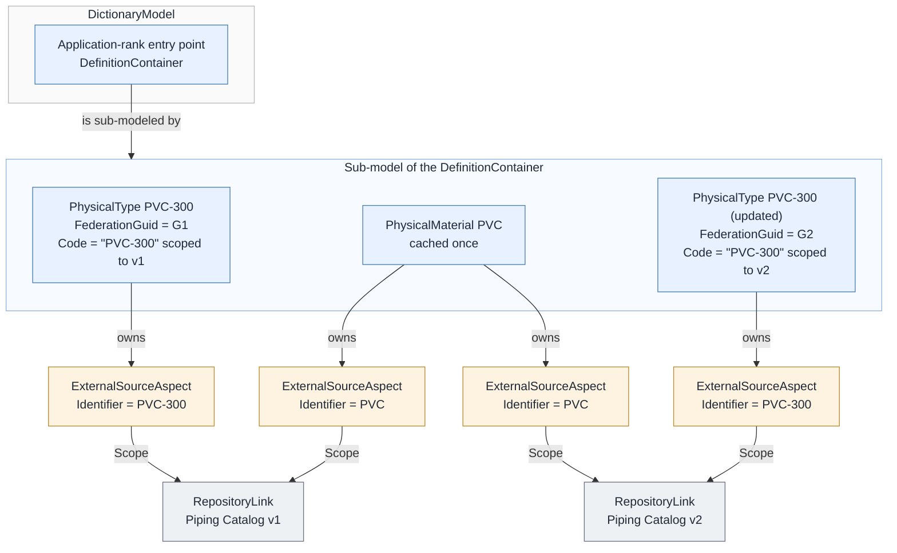

# Catalogs

A **catalog** is a repository of reusable definitions (component types, templates, materials, styles, and other standards) maintained by a *catalog authority* outside of the BIS repositories that use them. Applications copy the definitions they need from a catalog into a BIS repository so that placed instances can reference them.

This page describes how catalog-sourced definitions are organized inside a BIS repository and how their provenance is recorded. It does not cover how a catalog authority hosts, stores, or serves its catalogs; those are implementation choices of each authority. For the backend APIs that can open a catalog stored as an iModel, see [Catalogs in the backend documentation](../../../learning/backend/Catalogs.md).

> The organization and provenance patterns on this page are evolving conventions adopted by current catalog implementations; they are not yet formalized BIS standards. BIS defines several reusable discovery mechanisms, but it does not yet define a complete, generic way to discover every dependency of a catalog entry. Domain schemas and applications may require additional rules.

## A running example

Consider an engineering firm using OpenSite+, a civil site design application. The examples below illustrate two uses of catalogs: a designer selects a reusable pipe type, and a project administrator may select a [classification tree](../fundamentals/data-classification.md#classification-systems) that organizes the meaning of elements such as pipes and manholes. The example catalog contents are illustrative, not a description of a shipped OpenSite+ catalog.

The firm's catalog maintainer publishes a *Piping Catalog* containing pipe types. The firm is the *catalog authority*: the organization responsible for those definitions. In this example, the maintainer updates and publishes the catalog, while the project administrator chooses which definitions the project uses.

Version 1 of the catalog includes **PVC-300**, a 300&nbsp;mm PVC pipe type modeled as a `PhysicalType`. The application imports this type and the definitions it needs so that the designer can place pipes of that type. Later, the catalog maintainer corrects PVC-300's wall thickness and publishes version 2. The sections below follow that lifecycle, with a separate example showing why the administrator selects a classification tree as a whole.

## Why copy definitions into a BIS repository

The catalog authority remains the source of truth for its definitions. A BIS repository caches only the definitions that are used, or that the user intends to use, rather than entire catalogs. Copying a definition into the BIS repository:

- makes the definition available offline,
- records when the cached definition was added through the BIS repository's change history,
- allows other elements in the BIS repository to reference the definition,
- keeps the type of a placed instance unambiguous,
- lets applications handle components consistently, whether or not they came from a catalog, and
- preserves the meaning of placed instances even if the catalog later changes.

Definitions cached from catalogs must be treated as read-only snapshots of an immutable catalog version. Applications do not modify them in place. When a catalog authority publishes a changed definition, the application caches it as a new `DefinitionElement`, as described in [Provenance of cached definitions](#provenance-of-cached-definitions).

See [Components from Catalogs](../../../learning/backend/IModelContents.md#components-from-catalogs) for guidance on which definitions belong in a BIS repository.

## Components and their dependencies

*Component* commonly refers to a single reusable catalog entry: a pipe type, a valve, a title-block template. In BIS terms, a catalog entry is rooted at a [DefinitionElement](../references/glossary.md#DefinitionElement), typically a [TypeDefinitionElement](../fundamentals/type-definitions.md), but that entry-point element is rarely self-contained. On this page, a *definition bundle* means the entry-point `DefinitionElement` together with the owned and referenced data required to use it. This is descriptive terminology, not a formal BIS construct.

Before copying a component, the application must find all the data needed to use it. Otherwise, it could copy a pipe type without the template geometry or materials that the type requires. Finding that data is called *dependency discovery*.

Discovery starts at the highest element of the selected bundle, then follows its descendants and required references. Start with PVC-300's `PhysicalType`, rather than selecting one of its template geometry elements and trying to discover the component by climbing its ancestors.

### Example: a pipe type

PVC-300 references a `TemplateRecipe3d`, a definition element whose sub-model contains the reusable 3D template geometry. Those geometry elements reference the category used to display them. The pipe type also references its physical material and owns an aspect containing additional properties.

The arrows below show how discovery reaches those dependencies from the selected pipe type:

For this example, every node shown belongs to the PVC-300 bundle. Copying only the `PhysicalType` would omit the template geometry and the definitions needed to use it. The amber category and material may be shared: importing another pipe type, say, one called PVC-450, can reuse those same cached definitions instead of copying them again.

This diagram shows ownership, sub-models, and direct references. A real pipe type may have additional dependencies, including the link-table and geometry-stream references described below.

### Example: a classification tree

A *classification* expresses what an element represents according to an industry or company-specific scheme. For example, the firm's scheme might distinguish pipes from manholes independently of their particular product types. A classification tree organizes those meanings in a hierarchy. See [Classification Systems](../fundamentals/data-classification.md#classification-systems) for background and examples of industry schemes.

Unlike a pipe type, a classification tree is not something a designer places. OpenSite+ requires the complete tree as one bundle from application startup. For example, a project administrator may choose that tree from a catalog by selecting its root `ClassificationSystem` element, not an individual classification within the tree.

In this example, the system owns a `ClassificationTable`. The table's sub-model contains the classifications:

Discovery proceeds down from the selected system through its tables, their sub-model contents, and any nested child elements, then follows required references. The whole tree is selected deliberately; it is not discovered by importing a pipe and climbing from a referenced classification to its ancestors.

OpenSite+ currently uses only one classification tree in an end-user iModel, although users may have multiple trees available in different versioned catalogs. This is an OpenSite+ application requirement, not a BIS restriction on how many trees a repository or table can contain.

There is currently no single BIS construct that identifies a definition bundle as a unit. The application determines which root represents the component its users need.

### Generic discovery mechanisms

Starting with the entry-point element, apply these BIS mechanisms recursively to each element they discover:

- Include owned `ElementAspect`s and child elements. Classes expected to own children implement `IParentElement`.
- For each `ISubModeledElement`, include its sub-model and the elements contained in that model. `TemplateRecipe3d` and `DefinitionContainer` are examples of sub-modeled elements.
- Discover navigation-property references from the schema and follow them from the referencing element to the referenced element, not in reverse. Follow the many-to-zero/one reference toward its zero/one target; an unset optional reference contributes no element. Examples include `TypeDefinitionElement.Recipe`, `PhysicalType.PhysicalMaterial`, `GeometricElement3d.Category`, and `PhysicalMaterial.RenderMaterial`.
- Follow link-table dependencies only according to the traversal rules supplied by the caller, as described in the next section. Include the traversed relationship and the required element it reaches.

These rules do not add a containing model, its modeled element, or ancestors merely because a referenced element was discovered. Ownership and sub-model traversal proceeds downward from bundle elements. Copying may still require the application or transfer tooling to create or map destination models and preserve required parent relationships. That transfer work does not make every source ancestor, sibling, or containing model's contents part of the selected bundle.

For PVC-300, these mechanisms first follow the `Recipe` navigation property from the `PhysicalType` to its `TemplateRecipe3d`, then include the recipe's sub-model and its contents. The traversal also includes the referenced *Pipes* category and *PVC* material, the owned aspect, and any dependencies discovered from those elements.

### Link-table relationship discovery

A [link-table relationship](../fundamentals/relationship-fundamentals.md#link-table) connects elements without a navigation property. Schemas expose these relationships and their endpoints, but do not capture enough dependency semantics to determine which direction discovery should follow. Deriving from `ElementRefersToElements` does not mean that a relationship should automatically be traversed in both directions.

The caller supplies the link-table relationships to traverse. The application must also establish the traversal direction for each dependency; a relationship name alone does not explain which endpoint requires the other.

Examples requiring caller-supplied rules include:

- `CategorySymbolizesClassification`: in the [OpenSite domain schema](https://github.com/iTwin/bis-schemas/blob/master/Domains/4-Application/OpenSite/OpenSite.ecschema.xml), concrete subclasses connect a source `Category` to a target `Classification`.
- `PhysicalTypeComposesSubTypes`.
- `SpatialLocationTypeRepresentsTypeDefinition`.

These are examples, not a built-in list that every importer must always follow. For the classification-tree example, the caller must specify any category dependencies needed by the application. Merely reaching a category while discovering the pipe bundle does not automatically select an entire classification tree.

### Discovery limits

The mechanisms above cover ownership, sub-modeling, navigation-property references, and caller-selected link-table dependencies. They do not guarantee discovery of every dependency.

Some references are stored inside data rather than exposed as navigation properties or link-table relationships:

- Geometry streams must be inspected for referenced `Texture`s and `GeometryPart`s. They may also refer to `RenderMaterial`s.
- A `RenderMaterial` can reference a `Texture` through its `JsonProperties`. A link-table relationship for this association has been proposed, but is not the current representation.

These references require special discovery and copy handling, including remapping source identifiers to the copied or reused destination elements. Other property payloads or application-defined data may require additional rules.

A `TemplateRecipe3d` can be referenced by multiple `PhysicalType`s. Whether required dependencies should span separately maintained catalogs, and how versions of those catalogs would be resolved together, remain unresolved. This page does not define a cross-catalog version-resolution policy.

When copying a component:

1. **Copy its required dependencies, not just the entry-point element.** Apply the generic mechanisms above together with any class-, schema-, or application-specific rules. Copying only the entry-point element can produce an incomplete definition.
2. **Dependencies may be shared.** A single `TemplateRecipe3d`, `Category`, or `PhysicalMaterial` may be referenced by more than one component and must be copied only once into the destination BIS repository: if PVC-300 was imported earlier, importing PVC-450 reuses the already-copied *Pipes* category and *PVC* material.

## Organization of cached definitions in a BIS repository

Definitions cached from a catalog authority are organized beneath a well-known `DefinitionContainer` in the [DictionaryModel](../references/glossary.md#DictionaryModel). This container is the *Application-rank* entry point for that authority's cached definitions; the cached definitions themselves do not require an assigned rank. See [Organizing Definition Elements](./organizing-definition-elements.md). The recommended organization is:

- The entry-point `DefinitionContainer` has a [Code](../fundamentals/codes.md) whose `CodeValue` follows the `{organization name}:{application name}:Definitions` convention described in [Organizing Definition Elements](./organizing-definition-elements.md#dictionarymodel-for-global-scoped-definitions).
- The sub-model of that `DefinitionContainer` contains the cached definitions.
- A specific version of a definition is cached **only once per BIS repository**, no matter how many catalogs or catalog versions include it. (A changed definition is a new version and is cached as a new element; see [Provenance of cached definitions](#provenance-of-cached-definitions).)

In the running example, the application creates (or finds) its well-known `DefinitionContainer` in the BIS repository's `DictionaryModel` and copies PVC-300 and its dependencies into that container's sub-model. When PVC-450 is imported later, it lands in the same sub-model, reusing the shared category and material already there.

Local `DefinitionElement`s that an application creates for its own purposes, without any association to a catalog, do not belong under this container. They are stored in `DefinitionModel`s within the application's [Channel](../../../learning/backend/Channel.md).

### Folders

Catalog authorities commonly let users organize catalog entries into folders. Folders, including nested folders, are represented in the BIS repository by nested `DefinitionContainer`s and their sub-models under the authority's entry-point `DefinitionContainer`.

## Provenance of cached definitions

Applications must be able to determine where a cached definition came from (which catalog, which version of that catalog, and which entry in it), for example, to detect that a newer version of the definition is available. The general provenance mechanisms are described in [Provenance in BIS](../../domains/Provenance-in-BIS.md); this section describes their recommended application to catalogs.

A published catalog version is treated as **immutable**: changing anything in a catalog produces a new catalog version.

The mapping applies to every catalog-sourced `DefinitionElement` cached as part of a bundle, not only to the bundle's entry-point element. A locally created `DefinitionElement` that has no catalog source does not require this catalog provenance.

The recommended mapping is:

- **Catalog version → [RepositoryLink](../../domains/Provenance-in-BIS.md#repositorylink).** Each version of a catalog from which definitions were cached is represented by a `RepositoryLink` element identifying that specific, immutable catalog version.
- **Cached definition → [ExternalSourceAspect](../../domains/Provenance-in-BIS.md#externalsourceaspect).** Each cached `DefinitionElement` carries one `ExternalSourceAspect` per catalog version that includes it, with the aspect's `Scope` referencing the corresponding `RepositoryLink`. A definition that appears unchanged across several catalog versions is still cached once, with multiple aspects recording each catalog version it belongs to.
- **Stable entry identity → `ExternalSourceAspect.Identifier`.** The catalog authority's stable identifier for the catalog entry, the identity that persists as the entry evolves across versions, is recorded in the aspect's `Identifier` property. Correcting an existing entry preserves this identifier; a distinct replacement product is a new catalog entry with a new stable identifier.
- **Definition-version identity → [FederationGuid](../fundamentals/federationGuids.md).** The cached `DefinitionElement`'s `FederationGuid` holds the catalog authority's identifier for the *specific version* of the definition. When a changed catalog entry is cached, the new copy is a new `DefinitionElement` with a new `FederationGuid`, while its `CodeValue` and its stable identifier in `ExternalSourceAspect.Identifier` may remain unchanged. A `FederationGuid` normally identifies the real-world entity an Element represents; here, each immutable published version of a definition is treated as a distinct entity, so each version gets its own `FederationGuid`, and the identity that persists across versions is carried by `ExternalSourceAspect.Identifier` instead.
- **Code scope.** The `RepositoryLink` representing the catalog version under which a definition was first cached serves as the `CodeScope` element for that cached `DefinitionElement` (see [Codes](../fundamentals/codes.md)). Scoping the `Code` to a catalog version prevents code collisions between coexisting copies of the same definition: two cached versions of one catalog entry share a `CodeValue` but have different `CodeScope`s.

The `ExternalSourceAspect` class has additional properties, such as `Source` and `Kind`, described in [Provenance in BIS](../../domains/Provenance-in-BIS.md#externalsourceaspect). Their values for catalog-cached definitions are authority-specific and are not standardized by this mapping.

This mapping applies to definitions cached beneath the catalog authority's well-known `DefinitionContainer`. If an application copies a definition elsewhere only when a recipe or template is used, how that copy retains its catalog provenance is application-specific and is not standardized by this mapping.

### The example, end to end

Applying the mapping to the running example:

1. The application imports PVC-300 from Piping Catalog version 1. It creates a `RepositoryLink` for *Piping Catalog v1*, copies the component into the well-known container's sub-model, sets the cached `PhysicalType`'s `FederationGuid` to the authority's identifier for *this version* of PVC-300, scopes the element's `Code` to the v1 `RepositoryLink`, and attaches an `ExternalSourceAspect` with `Identifier` set to the authority's stable identifier for PVC-300 and `Scope` referencing the v1 `RepositoryLink`.
2. The catalog maintainer corrects PVC-300's wall thickness and publishes catalog version 2. Version 1 is unchanged; it remains valid and immutable.
3. The application detects (by its own means; nothing in the BIS repository does this automatically) that catalog v2 contains a newer PVC-300 and imports it. The updated pipe type is a **new** `DefinitionElement` with a **new** `FederationGuid`, an `ExternalSourceAspect` with the **same** stable `Identifier`, and `Scope` referencing a new *Piping Catalog v2* `RepositoryLink`. Its `CodeValue` is unchanged, but its `Code` is scoped to the v2 `RepositoryLink`, so the two cached copies do not collide.
4. The *PVC* material did not change between v1 and v2. It stays cached once, and gains a second `ExternalSourceAspect` scoped to the v2 `RepositoryLink`.

The two cached PVC-300 elements share a stable `Identifier` and a `CodeValue` but have different `FederationGuid`s and `CodeScope`s; the unchanged *PVC* material is cached once with one aspect per catalog version that includes it. To check whether a newer version of a cached definition exists, the application looks up the definition's stable `Identifier` in the latest catalog version and compares the authority's version identifier there against the cached `FederationGuid`.

## Scope and future standardization

The organization and provenance conventions above are intended to apply across catalog authorities. The dependency-discovery mechanisms cover only the BIS patterns described above; domain schemas and applications may define additional rules. Authority-specific concerns (identifier formats, publishing workflows, hosting, storage, and APIs for browsing or downloading catalogs) are outside the scope of BIS and of this page. Broader standards for third-party catalog authorities are deferred until concrete use cases arise.

---

| Next: [3D Guidance](../physical-perspective/3d-guidance.md)
|:---
