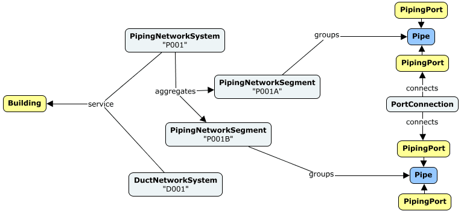
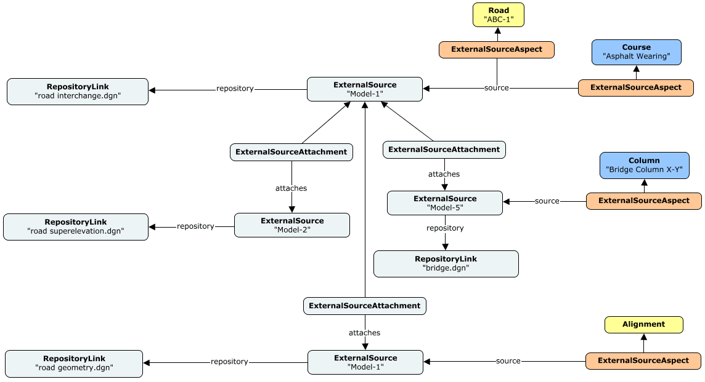

# Information Hierarchy

<!-- TODO: Some of the information in this chapter will likely be moved to [Model Fundamentals](./model-fundamentals.md). It will be natural to have links from this chapter to that one. -->

The information in a BIS repository is arranged in a hierarchy that is governed by rules. Some of the rules are explicitly defined by the schemas, and other rules require the applications that are creating data to follow standards.

The hierarchies in BIS repositories are intended to facilitate both human and software comprehension of the data.

## Hierarchy Constructs

There are several mechanisms available in BIS that domain authors can take advantage of in order to organize elements into hierarchies:

* The Subject hierarchy organizes Models.
* A Model can contain Elements.
* An Element can be sub-modeled by a Model.
* An Element can own child Elements.
* An Element can be spatially organized by a *Spatial Organizer* into a hierarchy according to a specific discipline.
* A *Physical System* can group member Elements as part of a hierarchical organization by sub-systems, according to a specific discipline.
* The provenance of an Element can be traced back to an *External Source*, whose organization may be hierarchical.

Each of these mechanism is intended to be used in specific circumstances which are explained in this chapter.

### The Subject Hierarchy Organizes Models

The RepositoryModel contains a hierarchy of `Subject` Elements organized into a parent-child hierarchy. All Models (other than the RepositoryModel itself) are organized under these `Subject`s (via InformationPartition)

### Model Contains Elements

A Model is a *container* for Elements. Models are a way to subdivide and organize the overall repository. Each Element is contained by exactly 1 Model as defined by the `ModelContainsElements` relationship.

### Model Models Element

A Model is more detail about an Element from a higher level in the information hierarchy. A Model is about exactly 1 Element as defined by the `ModelModelsElement` relationship. From the Model's perspective, this higher-level Element is known as the *modeled element*. From the Element's perspective, the lower-level Model is knows as the *SubModel*. The *SubModel* term is just a way to refer to a relative position in the information hierarchy. There is no special class for a *SubModel*, only the standard `Model` subclasses.

For example, a `DrawingModel` sub-models a `Drawing` Element and contains the `DrawingGraphic` Elements that are the details of the overall drawing. The following instance-diagram depicts such situation. See [Instance-diagram Conventions](../references/instance-diagram-conventions.md) for details about the conventions used.

&nbsp;

&nbsp;

### Element Owns Child Elements

An Element can own child Elements. This is useful for modeling *assembly* relationships or for modeling cases where one Element exclusively controls the lifetime of other Elements. An Element can have 0 or 1 parent Elements as defined by the `ElementOwnsChildElements` relationship. An Element without a parent is considered a *top-level* Element. An Element with a parent is considered a *child* Element. These hierarchies can go N levels deep, which means that an Element can be both a parent and a child. A parent Element and all its children are required to be contained in the same model.

### Element Organized by Spatial Organizer

A [Spatial Organizer](../../domains/SpatialComposition.ecschema.md#ispatialorganizer), typically a subclass of `spcomp:SpatialStructureElement` or `spcomp:Zone`, can *organize* (i.e. either *hold* or *reference*) Spatial Elements and aggregate other Spatial Structure elements.

These concepts are part of the rules and patterns introduced by the [SpatialComposition](../../domains/spatialcomposition.ecschema/) schema. They aim to enable the modeling of the Spatial Structure of infrastructure.

The resulting hierarchy can define as many levels as needed. These Spatial Composition hierarchies can co-exist with the other organization mechanisms listed above.

For example, a `Building` is modeled as a subclass of `spcomp:SpatialStructureElement`, which spatially aggregates other Spatial Organizers such as `Stories` and `Spaces`. Physical elements such as `Wall`s, `Column`s and `Door`s are associated to (held or referenced by depending on the case) those concepts from the Building decomposition. The following instance-diagram depicts such situation. See [Instance-diagram Conventions](../references/instance-diagram-conventions.md) for details about the conventions used.

For more details about Spatial Composition in BIS, please refer to the [Spatial Composition](./spatial-composition.md) topic later in this chapter.

### Physical System Groups Members

A Physical System can group member-Elements which, together, provide a specific function. Physical Systems can be organized in a hierarchical manner by using the `bis:PhysicalSystemAggregatesSubSystems` relationship. Physical System hierarchies can co-exist with the other organization mechanisms listed above.

For more details about Physical Systems in BIS, please refer to the [Modeling Systems](./modeling-systems.md) topic later in this chapter.

### Element Is From Source

An Element's provenance, captured by `bis:ExternalSourceAspect`s attached to it, can refer to the External Source it came from. External Sources can be organized in a hierarchical manner, reflecting how they are laid out in the external repository. These External Source hierarchies can co-exist with the other organization mechanisms listed above.

For example, an iModel Connector synchronizes data from a Road dataset containing 4 dgn files. The model-attachments among those dgn files are represented in the iModel by a hierarchy composed of `ExternalSource` instances, which act as the *sources* for the elements in the iModel that were synchronized from the external dgn files. The following instance-diagram depicts such situation. See [Instance-diagram Conventions](../references/instance-diagram-conventions.md) for details about the conventions used.

For more details about External Sources in BIS, please refer to [Provenance in BIS](../../domains/Provenance-in-BIS.md).

## Top of the World

The top of the information hierarchy is strictly controlled and is very similar in all BIS repositories. Its contents are explained in [Top of the World](./top-of-the-world.md)

## Typical Repository Organization

Two examples of repository organizations are described below. It should be noted that a single BIS repository may have multiple uses. When that occurs each use (often corresponding to an application) adds the hierarchy; the resulting hierarchy is similar to a union of the uses' hierarchies.

## Example Information Hierarchy

The following instance-diagram depicts the information hierarchy for an hypothetical campus. It shows the organization of data in two modeling perspectives: Physical and Functional, as well as catalog-data in Definition models. See [Instance-diagram Conventions](../references/instance-diagram-conventions.md) for details about the conventions used.

&nbsp;

&nbsp;

### iModel Connector Repository Organization

iModel Connectors transform data in an external format into an iModel. As part of that job, they need to organize the resulting data in a way that is comprehensible by both humans and software.

The following instance diagram depicts the organization of information in one iModel target by three iModel Connectors: IFC, OpenBuilding Designer and Bentley Civil. The last two are shown with more detail, including their parallel `Model`, `ExternalSource` and `SpatialComposition` hierarchies. The sample iModel shows data synchronized from three different datasets, two .dgn-based and one .ifc.

&nbsp;

&nbsp;

Since iModel Connectors run headless without user-input, they need to organize data they write into iModels based on their understanding about it. In the example above, data synchronized by each iModel Connector is stored under a specific branch of the Subject hierarchy. Each iModel Connector lays out the next levels according to the structure and discoverable semantics about the data on the source. In the case of dgn files, both the OpenBuilding Designer and Bentley Civil iModel Connectors create child Subjects for every referenced dgn & model on the external dataset, mirroring the division of labor among teams and disciplines that drive the organization of data in those external products.

See [iModel Connectors](../../../learning/imodel-connectors.md) for more details.

<!-- TODO:
### Editing Application Repository Organization
-->

---
| Next: [Modeling Perspectives](./modeling-perspectives.md)
|:---
