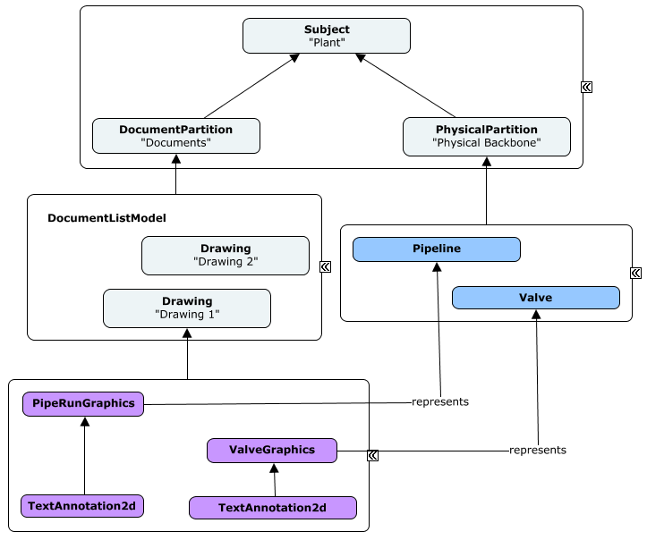

# Modeling Perspectives

<!-- Responsible for this page: ??? -->

As discussed in [Modeling with BIS](../intro/modeling-with-bis.md), objects in the real world can be thought about from different *modeling perspectives*. A modeling perspective is a way of conceptualizing the real world for a particular purpose. For example, a Sewer System can be thought about from many modeling perspectives:

* As a physical 3D reality with form, material and mass (the *physical* perspective).
* As a system for hydrological conveyance (an *analytical* perspective)
* As a set of components that together provide an adequate wastewater treatment capacity (a *functional* perspective)
* As a set of 2D graphics as part of Sheets & Drawings (a *document* perspective)

## Keeping Modeling Perspectives Segregated

Each modeling perspective simplifies objects in the real world in a different way; this requires different specialized data structures for each perspective. This is manifested in BIS classes as explained in the following section.

Each perspective's data
(`InformationPartitionElement`s, `Model`s, `Element`s, etc.) is segregated from other perspectives' data in order to allow each perspective to be optimally organized. Relationships between the `Element`s of different perspectives are used to indicate that they are all modeling the same objects, just from different perspectives.

### Modeling Perspectives and BIS Class Hierarchy

Modeling perspectives are represented directly in the BIS class hierarchies as:

* `InformationPartitionElement` subclasses
* `Model` subclasses
* `Element` subclasses

For every modeling perspective there is a corresponding `InformationPartitionElement` subclass and a `Model` subclass.

Modeling perspectives are also manifested in `Element` subclasses. There is an `Element` subclass that directly corresponds to a modeling perspective. `Element`s placed in a `Model` need to have a modeling perspective that is compatible with the `Model`.

[Top of the World](./top-of-the-world.md) discusses `InformationPartitionElement`s and [Model Fundamentals](../fundamentals/model-fundamentals.md) discusses `Model`s.

Note that the only `Model` subclass that does not correspond to any particular modeling perspective is the `RepositoryModel`.

### Modeling Perspective Consistency of Partitions, Models and Elements

As is described in [Top of the World](./top-of-the-world), for every Subject, there may be zero or more `InformationPartitionElement` child `Element`s. Each of those `InformationPartitionElement`s is effectively a declaration of a modeling perspective and starts a `Model` hierarchy that is of that the declared modeling perspective.

Each `InformationPartitionElement` has a sub-`Model` that is of the same modeling perspective. That sub-`Model` contains only `Element`s of the same modeling perspective. Some of those `Element`s may have sub-`Model`s of their own, which must be of the same modeling perspective as the `Element` they sub-model.

These modeling perspective rules enforce a minimum level of logical data consistency. For example, they prevent the placement of a physical fire hydrant `Element` into a section drawing `Model`.

### Abstract, Concrete and Sealed Modeling Perspectives

Modeling Perspectives can be considered to be abstract, concrete, or sealed to correspond with the `InformationPartitionElement` and `Model` subclasses that implement them:

* An *abstract* modeling perspective is used only to logically group more-specialized perspectives and is implemented by abstract `InformationPartitionElement` and `Model` subclasses.

* A *concrete* modeling perspective is used directly to model reality and is implemented by concrete `InformationPartitionElement` and `Model` subclasses.

* A *sealed* modeling perspective is a concrete modeling perspective that is not allowed to be further specialized. A sealed modeling perspective is implemented with sealed `InformationPartitionElement` and `Model` subclasses.

## Standard Modeling Perspectives

It is not possible to predict all of the modeling perspectives that may eventually be needed in BIS. BIS does, however, provide a core set of modeling perspectives from which other modeling perspectives must derive.

The following table shows the most common core modeling perspectives, which subclass the abstract `InformationPartitionElement` class, as well as the expected kind of `Model` subclass that implement them for each case.

| Major Modeling Perspective | Sample Use-cases | `InformationPartitionElement` subclass | `Model` subclass implementer |
| --- | --- | --- | --- |
| Physical | Clash-detection, Quantity takeoffs | PhysicalPartition (sealed) | PhysicalModel |
| Functional | Eletrical or Plant Functional Model | FunctionalPartition (concrete but considered abstract) | appropriate subclass of FunctionalModel |
| Analytical | Structural or Hydraulic Analysis | AnalyticalPartition (abstract) | appropriate subclass of AnalyticalModel |
| Shared and/or Support data | Components Catalog, Material Library | DefinitionPartition (sealed) | DefinitionModel |
| Documents | Drawings & Sheets | DocumentPartition (sealed) | DocumentListModel |

The following table shows additional core modeling perspectives that are typically considered as specialized.

| Modeling Perspective | Sample Use-cases | `InformationPartitionElement` subclass | `Model` subclass implementer |
| --- | --- | --- | --- |
| Graphics-only (3D) | Pure graphics positioned in true world coordinates | GraphicalPartition3d (sealed) | appropriate subclass of GraphicalModel3d |
| Grouping Information-only | _Named Groups_ | GroupInformationPartition (sealed) | appropriate subclass of GroupInformationModel |
| Information records-only | Non-graphical data records | InformationRecordPartition (sealed) | InformationRecordModel |
| Linked data | Links to Reality Data | LinkPartition (sealed) | LinkModel |
| Physical Systems | Cold & Hot water, Air Conditioning or Electrical Systems | PhysicalSystemPartition (sealed) | PhysicalSystemModel |
| Spatial Location-only | A Building's Grid, Roads' Alignments or Parcel boundaries. Subset of Physical. | SpatialLocationPartition (sealed) | SpatialLocationModel |

Note that most `InformationPartitionElement` subclasses are *sealed* with the exception of FunctionalPartition and AnalyticalPartition. Each concrete implementation of those modeling perspectives, due to them being specialized according to the type of functional system or analysis being captured, always require subclassing of the appropriate Partition and Model classes. For more information, see [Functional Modeling Perspectives](#functional-modeling-perspectives) and [Analytical Modeling Perspectives](#analytical-modeling-perspectives) further below.

If the need for a new core modeling perspective is discovered (none of the existing core modeling perspectives is appropriate as a parent perspective), new ones can be added.

### Physical Modeling Perspective

The Physical modeling perspective views reality as objects with form, material(s) and mass in 3D space. The Physical modeling perspective merits special discussion as it plays such an important role in BIS.

There is one and only one Physical modeling perspective for a given `Subject` instance. If there is one sewer pipe in reality, there can only be one physical representation of that sewer pipe.

The Physical modeling perspective cannot be "subclassed". (For legacy reasons there are some subclasses of `PhysicalModel` in BIS schemas, but those subclasses are never used.)

See [Physical Models and Elements](../physical-perspective/physical-models-and-elements.md) for details of physical modeling.

#### Physical Backbone

The principle of a "physical backbone" in BIS states that the one thing that all disciplines can agree upon is physical reality, and thus the physical perspective should be the "touchstone" among other perspectives. `Elements` representing a non-physical perspective of a physical object will typically have a relationship to a `PhysicalElement` modeling the object from a Physical perspective.

### Functional Modeling Perspectives

Functional modeling perspectives view reality as objects intended to perform a function. Often those objects are connected to form a functional system.

An example of a functional modeling perspective is viewing the interconnected components of a process plant as a system that performs a function.

See [Functional Models and Elements](../other-perspectives/functional-models-and-elements.md) for details of functional modeling.

### Analytical Modeling Perspectives

The analytical modeling perspective views reality as objects in 3D space that participate in a phenomenon that can be analyzed.

An example of an analytical modeling perspective is thermal analysis of a building, where the components of the building have thermal properties and may be heat sources or sinks.

Any analysis involves one or more numerical solvers capable of predicting the behavior of a system (output) based on a set of initial conditions (input). While some analyses can be performed directly on the Physical Perspective data, there are many kinds of analyses that require a parallel representation of reality based on a custom perspective. In the latter case, input data of an analysis is captured in the corresponding analytical model perspective of the applicable `Subject` in a BIS repository.

Note that a BIS repository is not appropriate to store results or output data from an analysis. Analytical resultsets are usually transient and large in size, created frequently or in-bulk as a specialized modeler tries out several sets of initial conditions.

See [Analytical Models and Elements](../other-perspectives/analysis-models-and-elements.md) for details of analytical modeling.

### Definition Partitions

The top of a definition hierarchy starts with a `DefinitionModel` that models a `DefinitionPartition`.
This allows `DefinitionElements` to be organized by how they relate to the parent `Subject` of the `DefinitionPartition`.
There can be multiple `DefinitionContainer` Elements in the `DefinitionPartition`'s `DefinitionModel`, each with a corresponding `DefinitionModel` that sub-models it. That way, definitions (instances of `DefinitionElement`) can be hierarchically organized by source, discipline, or other criteria. Each `DefinitionPartition` is identified by its [Code](../references/glossary.md#code).

See [Organizing Repository-global Definition Elements](./organizing-definition-elements.md) for details on the expected organization of repository-global definition elements in the *DictionaryModel*.

### Document Partitions

The top of a document hierarchy starts with a `DocumentListModel` that sub-models a `DocumentPartition`.
This allows `Document` elements to be organized by how they relate to the parent `Subject` of the `DocumentPartition`.
`Drawing` and `Sheet` are 2 example subclasses of `Document`.
`Drawings` and `Sheets` are further sub-modeled by `DrawingModels` and `SheetModels` which graphically break down the content of the drawing or sheet.

The following instance-diagram depicts that hierarchy for a hypothetical iModel about a Plant building. Two drawing documents are shown as well as associations between 2D graphics from one of them with the Physical elements of the iModel. BIS offers the `DrawingGraphicRepresentsElement` relationship to address the need of associations between elements in a *Drawing* with elements in a different modeling perspective. See [Instance-diagram Conventions](../references/instance-diagram-conventions.md) for details about the conventions used.

&nbsp;

&nbsp;

## Domains and Modeling Perspectives

A domain may or may not require a custom modeling perspective. The need for a custom modeling perspective corresponds to a need to model reality using concepts that are significantly different from other existing modeling perspectives.

Structural Steel Detailing is an example of a domain that does ***not*** require its own modeling perspective. That domain will require custom classes to represent the physical items that are important to it, but all of those items are viewed from the Physical modeling perspective. Structural Steel Detailing might also need some scheduling or costing information; that information is unlikely to require a custom modeling perspective, as costing and scheduling are common needs.

Hydraulic Analysis, on the other hand, does require a custom modeling perspective. This perspective will model reality as a system that transports and stores water. Reality will be simplified into a network of conduits and other items, with properties and relationships appropriate for hydraulic analysis.

## Codes for InformationPartition instances

As explained in [Top of the World](./top-of-the-world.md#informationpartitionelements), since `InformationPartitionElement` instances are aimed at software to understand rather than being human-comprehensible, their *Codes* are typically not meaningful in the context of a business or an infrastructure asset. It is the *Code* of its parent `Subject` what is usually considered to be the "_Name_" of the Partition's submodel.

Having said that, as implementers of the `ISubModeledElement` mix-in, each `InformationPartitionElement` shall have a Code assigned. The following guidelines aim at achieving consistency in their Codes.

Generally, the different parts of the Code of `InformationPartitionElement` instances shall be setup as follows:

* CodeSpec: "bis:InformationPartitionElement".
* CodeScope: Per parent (Code values expected to be unique per parent `Subject`).
* CodeValue: According to the kind of `InformationPartitionElement`.

The following table provides a default Code Value for each `InformationPartitionElement` subclass to be used for cases in which there is not a more appropriate one.

| InformationPartition sub-class | Default Code Value |
| --- | --- |
| AnalyticalPartition subclass | \<_Appropriate CodeValue per specialized kind of Analysis_\> |
| DefinitionPartition | "Definitions" |
| DocumentPartition | "Documents" |
| FunctionalPartition subclass | \<_Appropriate CodeValue per Functional specialization_\> |
| GraphicalPartition3d | "Graphics" |
| GroupInformationPartition | "Groups" |
| InformationRecordPartition | "InformationRecords" |
| LinkPartition | "Links" |
| PhysicalPartition | "Physical" |
| PhysicalSystemPartition | "PhysicalSystems" |
| SpatialLocationPartition | "SpatialLocation" |

Examples of cases with a more appropriate Code Value than the default ones listed above include:

* "BisCore.DictionaryModel" for the `DefinitionPartition` leading into the global DictionaryModel from a Root `Subject`.
* "BisCore.RealityDataSources" for the `LinkPartition` leading into the global LinkModel from a Root `Subject`.

---
| Next: [Top of the World](./top-of-the-world.md)
|:---
