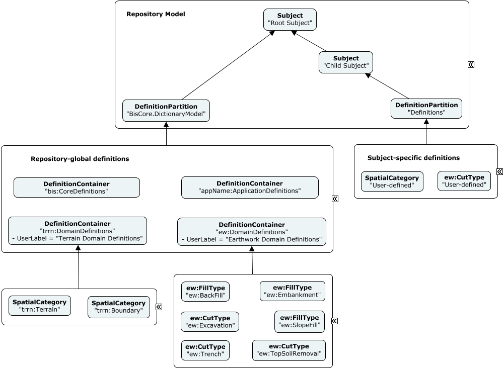

# Organizing Definition Elements

Instances of [DefinitionElement](../references/glossary.md#DefinitionElement) hold configuration-related information that is meant to be referenced and shared. They are expected to be contained in `DefinitionModel`s as explained in [Model Fundamentals](../fundamentals/model-fundamentals.md).

Examples of `DefinitionElement`s include instances of:

* `Category` and `Subcategory`
* `TypeDefinitionElement`
* `RenderMaterial`
* `PhysicalMaterial`
* `LineStyle`
* etc.

## Definition Rank

Some `DefinitionElement` instances are introduced in an iModel for standardization. This is done at various ranks of the BIS ecosystem. The ranks to keep in mind in this discussion are:

* Core: standardized definitions that are semantically at the "Core" and "Common" layers of the [BIS schema hierarchy](../intro/bis-organization.md). There are actually no examples of these to-date.
* Discipline: standardized definitions at the "Discipline-Physical" or "Discipline-Other" layers of the [BIS schema hierarchy](../intro/bis-organization.md).
* Application: application-specific definitions. Note that applications and connectors should endeavor to define and use standardized domains, so this does not mean "any definition written by a connector".
* User: most definitions, which are user-specific or project-specific.

## Definition scope

The `Subject` hierarchy in the repository essentially defines various levels of scope. The Root `Subject` is a "global" scope and all other `Subjects` define narrower scopes.

Each `Subject` can have 0 or 1 child `DefinitionPartition` element which is sub-modeled by a `DefinitionModel`.

### DictionaryModel (for global-scoped definitions)

The `DefinitionPartion` of the Root `Subject` always has a `CodeValue` of "BisCore.DictionaryModel". Its sub-model is called the "DictionaryModel". The [DictionaryModel](../references/glossary.md#DictionaryModel) is a singleton container of `DefinitionElement` instances. It *directly* holds User-rank definitions and holds Core, Discipline, and Application-standardized definitions organized under `DefinitionContainer`s.

* For Discipline-rank definitions, there should be a `DefinitionContainer` with a `CodeValue` of _"{domain alias}:DomainDefinitions"_ (where {domain alias} is the schema alias for the domain that is doing the standardization - which *might be different* than the schema that defines the particular `DefinitionElement` subclass) - and a `CodeScope` that is the ElementId of the `DefinitionModel` that contains it. Domain-standardized definitions should go in the sub-model of that `DefinitionContainer`.
* For standardized Application-rank definitions, there should be a `DefinitionContainer` with a `CodeValue` of _"{application name}:ApplicationDefinitions"_ and a `CodeScope` that is the Id of the `DefinitionModel` that contains it. Application-standardized definitions should go in the sub-model of that `DefinitionContainer.
* For Core-rank definitions, there should be a `DefinitionContainer` with a `CodeValue` of _"bis:CoreDefinitions"_ and a `CodeScope` that is the Id of the `DefinitionModel` that contains it. BIS-standardized definitions should go in the sub-model of that `DefinitionContainer`.

All global-scoped Core-rank, Discipline-rank and  Application-rank definitions should be organized under the DictionaryModel.

As an example of domain-ranked definitions, the "Terrain" domain (with prefix "trrn") defines a set of standard `Category` elements and the "Earthworks" domain (with prefix "ew") defines some standard `PhysicalType` elements to be used with Connectors and Applications that support that domain. See diagram below.

### Subject-specific definitions

Only User-rank definitions should be placed in Subject-specific `DictionaryModel`s, which are typically created by iModel Connectors. In that case, the `DefinitionPartion` for Subject-specific definitions should have a `CodeValue` of "Definitions" and `CodeScope` of its parent `Subject`.

### Example organization of definitions

The following instance-diagram depicts the organization of definition elements of various ranks and scopes. See [Instance-diagram Conventions](../references/instance-diagram-conventions.md) for details about the conventions used.

&nbsp;

&nbsp;

---
| Next: [3D Guidance](../physical-perspective/3d-guidance.md)
|:---
