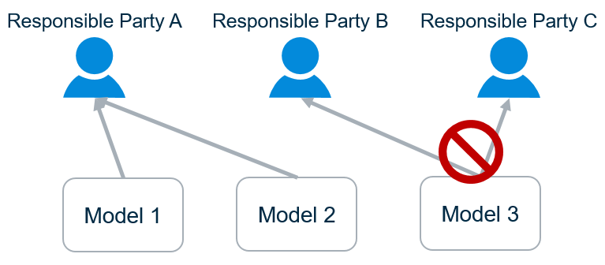

# The Single Responsible-Party Principle (SRPP)

Throughout the information lifecycle of infrastructure engineering, the responsibility for information is a key concern. These responsibilities influence the organization of all relevant information repositories, including BIS Repositories.

For this reason, it is helpful when we can identify a single responsible-party for any piece of information in a BIS Repository. To facilitate the identification of the responsible party for information, all domain authors and developers should follow these two rules:

- A `Model` should have a single responsible-party at any given point in time.
- Sub-modeled `Element`s may have a different responsible-party than their sub-`Model`.

The first rule facilitates mapping of `Model`s to ISO 19650 “information containers”, among other practical considerations. The second rule allows a responsible-party to delegate responsibility for the detailed sub-modeling of an `Element` to another party.

The responsible-parties may be organizations or individuals. Because there are typically different responsible-parties for different disciplines, it naturally follows that one should not model multiple disciplines in a single Model.

In the physical perspective, responsibilities are generally assigned according to systems, with one party responsible for designing a given system. This drives organization within the physical partition. For details see [Physical Hierarchy](../physical-perspective/physical-hierarchy-organization.md).

The SRPP essentially defines a workflow-driven constraint on the organization of `Element`s into Models. Within that constraint, there is a high degree of flexibility regarding the `Element`/`Model` organization. Generally, the organization of `Element`s and `Model`s that are the responsibility of a single party should be driven by anticipated user workflows, keeping in mind the practical ramifications of `Model`s, described in [Model Fundamentals](../fundamentals/model-fundamentals.md).

---
| Next: [Organizing Models and Elements](./organizing-models-and-elements.md)
|:---
