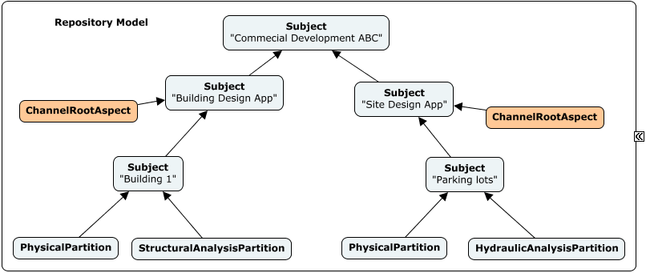

# Top of the World

BIS repositories have a strict hierarchical organization. This page describes the top of that hierarchy and how it functions as a *table of contents* for the repository as a whole.  This *table of contents* consists of:

* `RepositoryModel`
* `Subject`s
* `InformationPartitionElement`s

The following figure shows a simple example of a the top of the hierarchy. See [Instance-diagram Conventions](../references/instance-diagram-conventions.md) for details about the conventions used.

&nbsp;

&nbsp;

## RepositoryModel

Every BIS repository has exactly one `RepositoryModel` that defines the top of the hierarchy. `Element`s can be inserted into or updated within the `RepositoryModel`, but the `RepositoryModel` itself cannot be deleted. The `RepositoryModel` sub-models the root `Subject` of a BIS repository.

*The RepositoryModel is the only Model in a BIS repository that sub-models an Element contained within itself (the root `Subject`). Due to implementation details, this was easier than the RepositoryModel not sub-modeling any Element.*

## Subjects

`Subject`s are `Element`s that are used to identify things that the repository is *about*. The `Subject` class cannot be specialized (subclassed). The most important capabilities of `Subject` are:

* It can have a UserLabel (inherited from Element)
* It can have a Description
* It can have child `Subject`s
* It can have child `InformationPartitionElement`s

`Subject`s only exist in the `RepositoryModel`.

Every BIS repository has exactly one *root* `Subject` that describes what the repository as a whole is about.

* The root `Subject` - like all `Subject`s - is contained by the `RepositoryModel`.
* The root `Subject` has no parent element as it is the top of the `Subject` hierarchy.
* The root `Subject` can be updated, but it cannot be deleted.
* the root `Subject` is sub-modeled by the `RepositoryModel`.

Child `Subject`s can be introduced to further organize the contents of the repository.

* Child `Subject`s - like all `Subject`s - are contained by the `RepositoryModel`.
* Child `Subject`s  have another `Subject` as a parent.
* A child `Subject` can be identified as _the root of an Editing Channel_.

## Editing Channels

An `Editing Channel` is a tree of models and elements below one *Channel Root* `Subject` element. `Editing Channel`s segregate the contents of a BIS repository into *sections* to provide access control over which applications may change which data. See [Editing Channels](../../../learning/backend/Channel.md) for more information about this topic.

## InformationPartitionElements

As discussed in [Modeling Perspectives](./modeling-perspectives.md) `Subject`s can be viewed and modeled from multiple modeling perspectives (physical, functional, analytical, etc.). `InformationPartitionElement`s are used to "partition" a `Subject` into different modeling perspectives.

When it is determined that a `Subject` is to be modeled from a particular modeling perspective, an `InformationPartitionElement` of the appropriate modeling perspective is added as a child of the `Subject`. That InformationPartitionElement is the start of a Model hierarchy representing the modeling perspective. The `InformationPartitionElement` is sub-modeled by a `Model` of the same modeling perspective.

In summary, `Subject`s capture a *human-understandable* hierarchical breakdown of what a BIS repository is about, organized according to the design of the applications that created their data, in terms of `Editing Channels` in a BIS repository. Furthermore, an `InformationPartitionElement` primarily declares the kind of data-modeling - modeling perspective - about its parent `Subject` that starts to take place under its submodel, to any *software* that consumes data in a BIS repository for different purposes.

Since the "_Name_" (e.g. Code and UserLabel properties) of an `InformationPartitionElement` is typically not meaningful in the context of a business, it is typically the *Code* of its parent `Subject` what is considered to be the "_Name_" of the Partition's submodel. Due to that reason, it is usually expected for a `Subject` to have only one `InformationPartitionElement` instance of a given modeling perspective, but it is not enforced. When such need arises, it is typically better addressed via child `Subjects`, each owning a different `InformationPartitionElement` instance of the same modeling perspective.

`InformationPartitionElement`s always have a parent `Subject` and are never used outside of the `RepositoryModel`.

---
| Next: [Single Responsible-Party Principle](./srpp.md)
|:---
