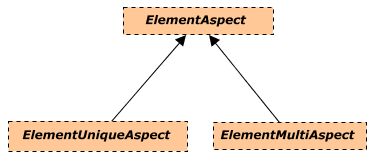

# ElementAspect Fundamentals

## Introduction

`ElementAspect`s are EC classes, typically with EC properties defined for them. ElementAspects are generally used for creating optional sets of properties.

ElementAspects have a special relationship with Elements. Every ElementAspect instance is associated (through an EC relationship) to exactly one Element instance. ElementAspect instances are never shared among Element instances. An Element *owns* its ElementAspects; if the Element is deleted its ElementAspects are also deleted.

## Core ElementAspect Types

There are three core ElementAspect classes in this class hierarchy:

All three of these classes are abstract and therefore never instantiated.
ElementAspect is not expected to ever have more than the two subclasses shown here.
There are and will be many subclasses of ElementUniqueAspect and ElementMultiAspect.

### ElementUniqueAspect

`ElementUniqueAspect` is used as a base class when there may be zero or one (but never more than one) ElementAspect of the exact same ECClass owned by an individual Element.

The relationship `ElementOwnsUniqueAspect` is used to connect an Element to an ElementUniqueAspect.

### ElementMultiAspect

`ElementMultiAspect` is used as a base class when there may be zero, one, or more ElementAspects of the same ECClass owned by an individual Element.

The relationship `ElementOwnsMultiAspects` is used to connect an Element to its ElementMultiAspects.

## ElementAspects and Identity

ElementAspects primarily derive their identities from the Element which owns the ElementAspect.

For an ElementUniqueAspect, the combination of subclass and the Element identity uniquely identifies the ElementUniqueAspect.

For an ElementMultiAspect, the combination of subclass and the Element identity identifies a list of ElementMultiAspects. Every ElementMultiAspect also has a *private* Id if an individual ElementMultiAspect instance has to be referenced.

ElementAspects can also be used to separate groups of properties according to their applicability.  Consider the need to capture the `Shape` and related dimension properties from a set of objects. The list of dimension properties applicable to each object depends on its specific `Shape`. This situation can be modeled via an ElementAspect class-hierarchy that captures all the `Shape`s to be supported by such a system as well as their respective properties.

In this case, the `ShapeAspect` base-class should be used as the *key-class* to uniquely identify instances of the concrete aspects of this class-hierarchy. That is needed in this case in order to ensure an object only owns one aspect of any of the three concrete classes in the `ShapeAspect` hierarchy at any given time.

## ElementAspects and Relationships

ElementOwnsUniqueAspect and ElementOwnsMultiAspects relationships are used to define the ownership of ElementAspects by Elements, but what about other ElementAspect relationships? The only other relationships that ElementAspects may have are “outward” relationships that effectively map to a single foreign key in the ElementAspect. This kind of relationships are implemented as navigation-properties in ECSchemas. ElementAspects cannot be the target of any other relationships.

For example, A Fireproofing ElementAspect might have a Thickness property and a relationship to a FireproofingMaterial via a navigation-property.

General behaviors and uses of BIS relationships are discussed in [Relationship Fundamentals](./relationship-fundamentals.md).

## Common Strategies Involving ElementAspects

Because ElementAspects are ECClasses, they have a fixed schema.
This gives them the same first class *reporting* functionality as with Elements.

ElementAspects are often used when the same set of properties needs to be stored for Elements that live in different parts of the class hierarchy.
However, if the data is more ad-hoc, then Element `JsonProperties` are probably more appropriate.

---
| Next: [Mixins](./mixins.md)
|:---
