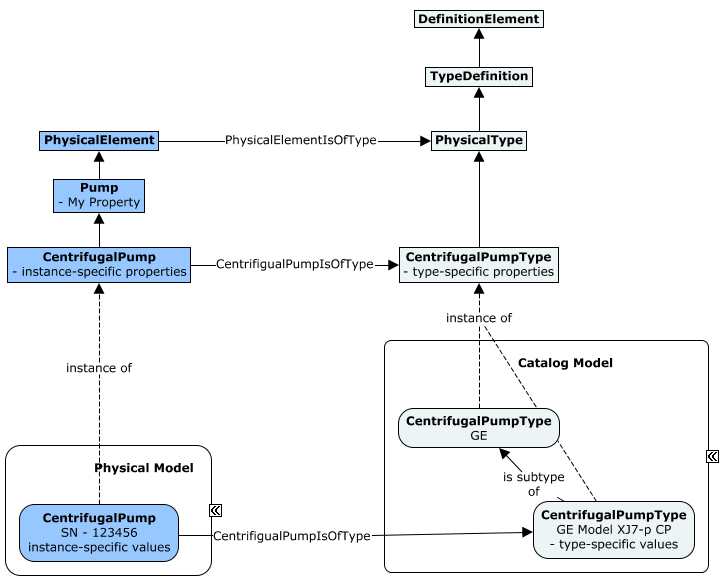
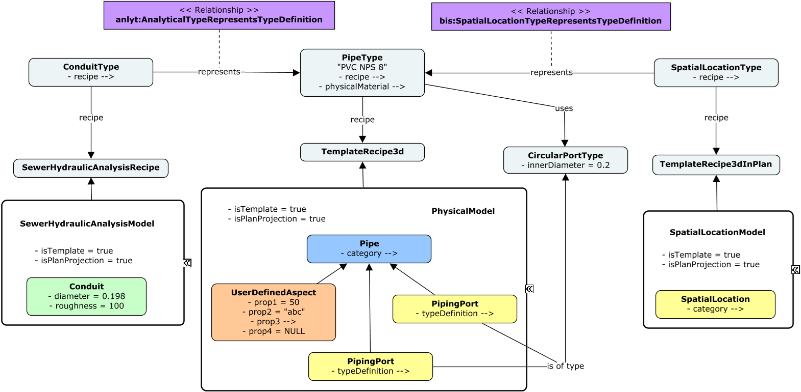

# Type Definitions

## Fundamentals

If we consider some primary Entity modeled by a primary `Element`, the `Element`'s ECEntityClass tells us what kind of Entity it is, and can add new ECProperties to for modeling the Entity. We can further classify instances into subsets where each subset has a shared set of property values. Each of these distinct sets of property values is a "type" of the primary Entity (characterized by having all of those property values in common). The properties are defined in a subclass of `TypeDefinitionElement`, which defines the properties whose values are said to vary by "type".

A `TypeDefinitionElement` is similar to a [IfcTypeObject](https://standards.buildingsmart.org/IFC/RELEASE/IFC4/ADD2_TC1/HTML/schema/ifckernel/lexical/ifctypeobject.htm).

Practically, these "types" tend to correspond to product-models (not to be confused with bis:Model) such as a Mazda model "RX-7" car. The product-model numbers typically identify entries in a catalog. The catalog entry will include other attributes whose values are shared by all instances of the product of the given product-model. A `TypeDefinitionElement` represents such a catalog entry, with a `Code` being a product-model-number. Even if a primary `Element` is "custom" and does not actually come from a catalog, if can still have a custom "catalog entry", e.g. an instance of `TypeDefinitionElement` with custom values that are not in-common with other instances. It is essentially a "type" for which there is only one instance.

`TypeDefinitionElement`s *complement* class inheritance. They differ from it in two important ways:

- `TypeDefinitionElement`s are "instance data" in a BIS Repository. You can add new instances of `TypeDefinitionElement`s without changing the BIS Domain Schema.
- `TypeDefinitionElement`s contain values for ECProperties defined by their `TypeDefinitionElement` ECEntityClass, but cannot introduce new ECProperties.

A primary `Element` instance will have a relationship (e.g. `PhysicalElementIsOfType`) to an instance of its type (e.g. a subclass of `PhysicalType`). The complete attributes of the Entity being modeled are found by combining the property values of the primary `Element` instance with the property values from its associated `TypeDefinitionElement` instance.

If the primary `Element` instance has an ECProperty with the same name as one in its `TypeDefinition`, the instance-specific value overrides the type-specific value. This is similar to [how IFC works with Property Sets applied to an instance or to the type](https://standards.buildingsmart.org/IFC/RELEASE/IFC4/ADD2_TC1/HTML/schema/templates/property-sets-with-override.htm).

For example, let's say that we are modeling a double-hung window using ECEntityClass `DoubleHungWindow`. Most double-hung windows are ordered from a catalog, and the only permutations of height and width of window that you can get are those that are listed in the catalog. The author of the DoubleHungWindow ECEntityClass with also define a subclass of `TypeDefinition` (or its subclass `PhysicalType`) `DoubleHungWindowType` that has ECProperties for all properties of double-hung windows that vary per-type (per catalog-entry) rather than per instance, e.g. `Height`, `Width` and `IsInsulated`. For many products, not much other than the spatial placement of the entity will vary per instance. For our double-hung window, there might be 4 types, where each has a `CodeValue` that is its product-model-number: 2x4I, 2x3I, 2x4U, 2x3U. In a GUI, the list of `TypeDefinitionElement` instances that are applicable to a given primary `Element` ECEntityClass can be used to populate a drop-down list of available "types" for the given ECEntityClass. The list of available types can be narrowed-down by defining specializations of the `PhysicalElementIsOfType` relationship.

The following diagram shows both the class hierarchy for a `PhysicalElement` modeling a centrifugal pump along with an associated `PhysicalType` and a specialized relationship to relate them. See [Class-diagram Conventions](../references/class-diagram-conventions.md) for details about the conventions used.

Though we describe types here in terms of PhysicalElements, this pattern can be applied to other kinds of Elements. The relationships `GeometricElement2dHasTypeDefinition` and `GeometricElement3dHasTypeDefinition` make the pattern usable for geometric elements, but new relationships classes could be added to support a "type-system" for other kinds of Elements.

## Template Recipes

In authoring workflows (when a BIS Repository is the main storage of an Editing Application), a `TypeDefinition` instance may refer to a `RecipeDefinitionElement` subclass (aka _Template Recipe_), which captures any data needed during the creation of (aka _Placement of_) `GeometricElement` instances associated with a `TypeDefinition`. Such data may include any of the following:

- Template geometry with associations to default Categories and SubCategories.
- Business data, in the form of first-class or ElementAspect properties, representing default values for them.
- Additional helper elements needed during Placement. E.g. Instances that enforce domain contrains, rules, or capture design-intent.

A _Template Recipe_ captures all of its associated details in a _Template Model_ that breaks it down. That is, subclasses of the `RecipeDefinitionElement` base class mix-in the `ISubModeledElement` interface, advertising that there is a `Model` that models each one of them at a finer granularity. A _Template Model_ is an instance of a `Model` subclass with its _IsTemplate_ property set to **True**.

Each `RecipeDefinitionElement` subclass advertises the type of `Model` breaking it down via a corresponding `ModelModelsElement` relationship subclass. The following table depicts such correspondence.

| `RecipeDefinitionElement` subclass | Associated break-down relationship |
|---|---|
| `TemplateRecipe2d` | `DrawingModelBreaksDownTemplateRecipe2d` |
| `TemplateRecipe3d` | `PhysicalModelBreaksDownTemplateRecipe3d` |
| `TemplateRecipe3dInPlan` | `SpatialLocationModelBreaksDownTemplateRecipe3dInPlan` - with _IsPlanProjection_ set to **True** |
| `TemplateRecipeAnalytical` | `AnalyticalModelBreaksDownTemplateRecipe` |

## Considerations with Multiple Modeling Perspectives

Editing applications that need to support multiple modeling perspectives shall follow the same patterns described above for each perspective, with the following consideration:

Since the Physical modeling perspective is considered the backbone of a BIS Repository, any non-Physical `TypeDefinitionElement` is considered to be a representation of a `PhysicalType`. Thus, the appropriate _RepresentsTypeDefinition_ relationship needs to be used accordingly, targeting the corresponding `PhysicalType` instance.

For example:
- Plan-Projection representation: `bis:SpatialLocationTypeRepresentsTypeDefinition`.
- Analytical representation: a subclass of `anlyt:AnalyticalTypeRepresentsTypeDefinition`.

The following instance-diagram presents an example based on an instance of a `PipeType` (Physical modeling-perspective) with associated Plan-Projection and Hydraulic-Analysis representations. Each one of them references a _RecipeDefinition_ element that leads to a corresponding _Template Model_ containing _Template Elements_ to be used during placement (i.e. default-geometry, values and/or helper elements). See [Instance-diagram Conventions](../references/instance-diagram-conventions.md) for details about the conventions used.

---
| Next: [Categories](./categories.md)
|:---
