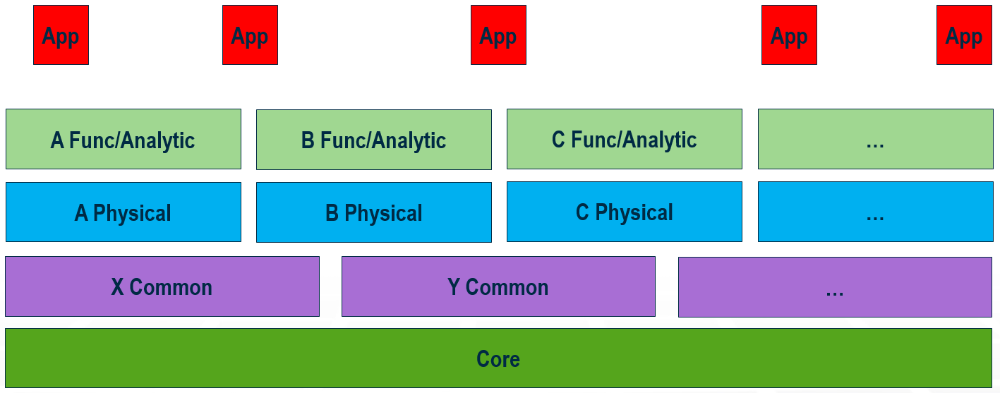

# Organization of BIS

## A Family of Schemas

BIS is not a monolithic schema, but is modularized into a family of “domain” Schemas that are organized in layers based on dependency constraints and degree of specificity. The modular design allows new domains to be added incrementally. Each domain should be semantically cohesive and small enough in scope to be owned by a single person.

The layers are depicted below:

&nbsp;

&nbsp;

Schemas in any layer may refer to (be dependent upon) schemas in the same layer or in any lower layer. The layers of the schema hierarchy are intended to avoid circular dependencies while still allowing different domains to interoperate. BIS schemas developed by Bentley Systems are mantained and evolved in a public and open-source [GitHub repository](https://github.com/iTwin/bis-schemas), whose folder-structure reflects these layers in the BIS ecosystem.

### Core Layer

At the base of this hierarchy is the Core layer. It encompasses schemas defining the “fabric of the universe” and some key organizational strategies. All classes in other layers descend from classes in the BisCore schema, allowing BIS-based software to understand – at least at some basic level – all BIS schemas, even BIS schemas it has never seen before.

### Common Layer

Above the Core is the Common layer. This layer is where abstract or immaterial concepts and patterns that span multiple disciplines are defined. Examples of these concepts are “grid lines”, “network topology”, “distribution systems”, “linear referencing”, “spatial composition”, etc.

iTwin.js Core as well as any other generic extensions may depend on and understand the schemas and patterns defined at the Core and Common layers.

### Discipline-Physical Layer

Above Common is the Discipline-Physical layer. This layer is for defining real-world concrete physical / spatial entities and closely associated information, used by the Physical modeling perspectives of Subjects.

### Discipline-Other Layer

Above Discipline-Physical is the Discipline-Other layer. Schemas defining concepts from modeling perspectives other than physical, in light of a specific discipline, are part of this layer. Examples of schemas in this layer includes functional data (such as the process data behind P&ID drawings) and analytical data (such as the structural behavior data that is used to analyze a structure).

Extensions developed targeting a particular discipline may depend on and understand the subset of Discipline-Physical or Discipline-Other schemas applicable to their intended use-cases.

### Application Layer

The top layer is for the Application schemas. These schemas contain no data that any other application would need or want to access. Product and iModel Connector schemas are examples of this layer.

## Schema Metadata

A BIS schema shall advertise its author's intended layer for it by applying the `SchemaLayerInfo` custom-attribute, defined in the [BisCustomAttributes](../../domains/BisCustomAttributes.ecschema.md) schema.

## BIS Compatibility Grades for Schemas

The conversion of products to use BIS Domain Schemas can occur incrementally, but an ecosystem of BIS-based infrastructure (including iModelHub and Design Review) is rapidly expanding. This creates a short-term need for BIS-based “compatibility” schemas that have not been as rigorously designed as true BIS schemas but allow usage and some level of interoperability with the BIS ecosystem. For this reason, a grading level for BIS schemas has been created:

- *Grade A*: True BIS schemas carefully designed for editing and interoperability
- *Grade B*: Either:
  - Legacy “consensus” schemas (such as ISM), intelligently converted to BIS, or
  - New BIS schemas, with one-way conversion to BIS in mind, but not intended for editing (native format).
- *Grade C*: Legacy schema with software-discoverable semantics, intelligently converted to follow relevant BIS rules and patterns.
- *Grade D*: Legacy schema with minimim or no software-discoverable semantics, typically auto-converted, following basic BIS rules and patterns.

---
| Next: [Fabric of the Universe](./fabric-of-the-universe.md)
|:---
