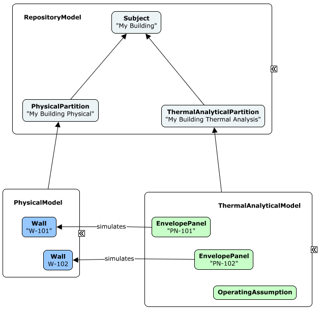

# Analytical Models and Elements

## Introduction

`AnalyticalModel`s are models used to facilitate analyses of infrastructure. Analyses that require an AnalyticalModel typically are specialized analytical perspectives that cannot be performed directly on `PhysicalModel`s as the physical world is too complex; these analyses require simplified geometry and other data. AnalyticalModels are similar in purpose to `FunctionalModel`s, but have one significant difference: they are models in true world coordinates.

Typically each AnalyticalModel is relevant to only one type of analysis. A particular PhysicalModel (e.g. a building) may have multiple associated AnalyticalModels. Examples of the analyses facilitated by AnalyticalModels are Hydraulic analysis, Building energy analysis, Traffic analysis and Structural analysis.

## Analytical Elements

`AnalyticalElement`s are simplified representations of real physical infrastructure. An example of an AnalyticalElement is a Pipe Segment (not a physical pipe) in a Hydraulic Analytical Model. This Pipe Segment might have a simple 2D line segment location, together with a set of hydraulic analytical properties; it would also likely have relationships to other Hydraulic Analytical Elements in the network being analyzed.

AnalyticalElements must always be contained in AnalyticalModels. AnalyticalElements will frequently have `AnalyticalElementSimulatesSpatialElement` relationships to the PhysicalElements or SpatialLocationElements that model the same real world infrastructure. This relationship, however, is not always 1:1.

## Analytical Models

`AnalyticalModel`s exist to facilitate the analyses of infrastructure. AnalyticalModels contain – directly or indirectly - all of the information necessary for one or more analysis of single type. For some Analytical domains, it may be appropriate to have more than one AnalysisModel for a `PhysicalModel`.

### Contents of Analytical Models

`AnalyticalModel`s contain `AnalyticalElement`s, but they may also contain other types of Elements. AnalyticalModels will frequently contain `InformationElement`s. AnalyticalModels never contain `PhysicalElement`s.

### Analytical Models in Model Hierarchy

As `AnalyticalModel`s are used to assist in the design or understanding of physical infrastructure, AnalyticalModels are often linked to `PhysicalModel`s. Such link is expressed via `AnalyticalElementSimulatesSpatialElement` relationships between their elements.

At the [Top of the World](../data-organization/information-hierarchy.md), a specialized analysis is introduced via an `AnalyticalPartition` subclass, which is sub-modeled by an AnalyticalModel.

## Typical Analytical Model Workflows

`AnalyticalModel`s are expected to be used in three basic scenarios:

1. AnalyticalModel is derived from a `PhysicalModel`
2. PhysicalModel is derived from an AnalyticalModel
3. AnalyticalModel is used without relationship to a PhysicalModel.

Deriving an AnalyticalModel from a PhysicalModel is expected to be a common workflow. Existing or planned infrastructure will frequently be modeled and need to be analyzed. The derivation of the AnalyticalModel may be automated, partially automated or manual. The derivation will typically create `AnalyticalElementSimulatesSpatialElement` relationships between the `AnalyticalElement`s and the `PhysicalElement`s or `SpatialLocationElement`s. These relationships can be used later to assist with updating the AnalyticalModel when the PhysicalModel changes, or in creating a two-way syncing of information between the two models.

Deriving a PhysicalModel from an AnalyticalModel may be a common workflow for new infrastructure when the analytical design of the infrastructure occurs before the physical design. The derivation of the PhysicalModel from the AnalyticalModel is often a simple automated operation, but typically does not produces a fully-detailed PhysicalModel. As with the Physical-to-Analytical derivation, AnalyticalElementSimulatesSpatialElement relationships will typically be created. These relationships can be used for updating and two-way syncing.

A standalone AnalyticalModel that is not related to a PhysicalModel is a valid configuration. This configuration might be used when the organization using the iModel is only involved in the analytical investigation.

## Example - Building Thermal Analysis

Building thermal analysis is one likely use of `AnalyticalModel`. This specialized analysis is introduced in the model hierarchy via a subclass of `AnalyticalPartition`.

The exterior envelope and interior partitions of the building might be modelled with an EnvelopePanel subclass of `AnalyticalElement` which would contain information on the panel shape, with relevant infrared radiation transmittance, thermal mass and thermal insulation properties. These EnvelopePanel elements would be related back to whatever items in the `PhysicalModel` that they were representing.

Similarly, AnalyticalElement subclasses would be created to represent the key components of the HVAC system. These would also be related back to their associated `PhysicalElement`s.

`InformationElement` subclasses would be used to record other parameters for the analysis, such as weather scenarios and building operating assumptions.

The complete results of the thermal analysis would likely be large and would not be stored directly in the iModel. However, key or summary results would likely be stored in Elements (InformationElements or AnalyticalElements) in the AnalyticalModel.

---
| Next: [Information Models and Elements](./information-models-and-elements.md)
|:---
