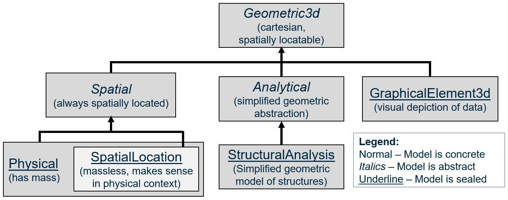
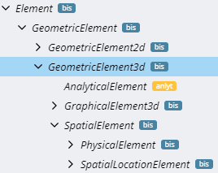
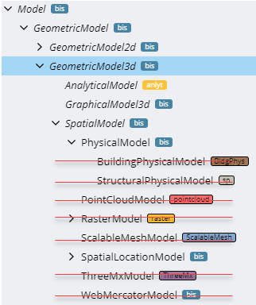
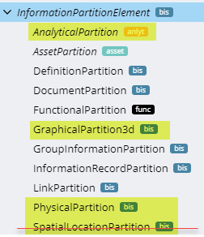

# 3D Modeling Guidance

3D modeling is central to BIS and iModels. There is a hierarchy of 3D-related Modeling Perspectives.

For each perspective, there are corresponding Model, and Element classes that have a similar inheritance hierarchy. There are corresponding InformationPartitionElement subclasses for some (but not all) of the perspectives.

“Spatial” is essentially a synonym for “uses real-world coordinates”. All of the perspectives inheriting from Geometric3d use a cartesian coordinate system that can be spatially located somewhere on the Earth. Specializations of SpatialModel are always in real-world coordinates. Other Specializations of GeometricModel3d can opt-out of being in real-world coordinates (and spatial indexed) by setting IsNotSpatiallyLocated=true.

The “Spatial” perspective is for modeling “real” stuff in “real” space, e.g. physical Entities and the spatial locations that they define or that define them. The non-Spatial perspectives are for mathematical abstractions or “pure graphics” that may or may not relate closely to physical Objects.
The “Physical” perspective is for modeling physical Entities, which have mass and for modeling spatial location Entities. What is a “spatial location Entity”? It is massless, but manifests in the real physical world:

- They may be defined in relation to physical Entities, e.g. the air gap between two conductors, the space around an access panel, the volume occupied by a physical Entity, or an area indicating a region on the surface of a physical Entity.
- They may be used to guide positioning of physical Entities, e.g. gridlines that may be manifested physically on a construction site via chalk lines or laser beams.
- They may be abstractions of physical consequence, like property or political boundaries that are often demarcated in the physical world via markers, signs, or natural boundaries.

We define the “SpatialLocation” perspective as a strict subset of the “Physical” perspective, so that we can have SpatialLocationModels which do not contain any PhysicalElements. However, PhysicalModels can contain SpatialLocationElements. PhysicalModels and SpatialLocationModels can also contain GraphicalElement3d Elements (for annotations and illustrations of information) as well as non-geometric InformationContentElements.

The “Analytical” perspective is for modeling abstract mathematical/geometric Entities that are simplifications of the real world designed for a specific kind of analysis, such as a stick-figure model of complex structural steel beams and columns. Because every kind of analysis represents a unique perspective, the Analytical Partition, Model, and Element classes are abstract, and we expect analysis-specific concrete subclasses of them all.

## 3D Elements

The Element class hierarchy mirrors the perspective hierarchy. Relationship constraints can use “SpatialElement” when they want a source or target Element to represent a “real” physical Entity or spatial location Entity.

## 3D Models

The Model class hierarchy also largely mirrors the perspective hierarchy, but it is complicated by legacy, deprecated classes, depicted with red strike-through, above.

There should be no specializations of bis:PhysicalModel, although a few specializations of bis:PhysicalModel were released before it was determined that bis:PhysicalModel should be “sealed”. We use validation rules to prevent additional specializations.

Instances of any specialization of bis:PhysicalElement can technically reside in any bis:PhysicalModel, though conventions enforced by applications may be more restrictive.

Use bis:SpatialLocationModel when sub-modeling specializations of bis:SpatialLocationElement, such as a “Grid” or “RealityLocationSet.

There are some other existing specializations of SpatialModel related to “reality modeling” which do not follow a pattern that we wish to promote or continue: PointCloudModel, RasterModel, ScalableMeshModel, ThreeMxModel, and WebMercatorModel. These sub-Model RepositoryLink Elements that point to external repositories of “reality data”. It was originally anticipated that they would contain SpatialLocationElements cached from the external sources, but this has not happened, in practice. They have JsonProperties that hold metadata about the data in the external repository.

## 3D Partitions

The bis:PhysicalPartition of a bis:Subject contains its “physical backbone”. There should not be more than one per bis:Subject.

The class bis:SpatialLocationPartition exists to cover specialized cases such as Road or Rail Alignments, Grids or data from Geographic Information Systems, whose elements are modeled primarily as `SpatialLocation`. However, since the “SpatialLocation” perspective is a subset of the “Physical” perspective, in general SpatialLocationElements can be part of the “physical backbone”.

We anticipate concrete specializations of bis:AnalyticalPartition that will be analysis-specific.

Generally, the Partition and Model of a given perspective should have the same modifiers, e.g. they should both be either abstract, concrete, or sealed. If they are abstract, their corresponding Element class should be abstract. It is also common for the Partition/Model to be concrete or sealed while the corresponding Element is abstract, as is the case for Physical and SpatialLocation.

The class hierarchy under InformationPartitionElement is largely “flattened”. The 3D-related Partitions are highlighted below. As indicated, iModel authors should avoid usage of SpatialLocationPartition.

## Guidance for new specializations of the 3D Geometric Perspective

If your new Element is modeling the physical geometry (including physical materials) of an Entity with mass, it should be a direct or indirect specialization of `PhysicalElement`. You will not create specializations of `PhysicalPartition` or `PhysicalModel`.

If your new Element is modeling a real-world location in space, then specialize `SpatialLocationElement`. Your element will either be placed in a `PhysicalModel` or a `SpatialLocationModel` that is sub-modeling some other `SpatialLocationElement`.

If your new Element is modeling a 3d geometric abstraction of something in real-world coordinates, you should specialize each of `AnalyticalElement`, `AnalyticalModel` and `AnalyticalPartition`.

If your new Element doesn’t fall into any of the categories above, please consult with Bentley’s BIS experts to determine if new specializations of Geometric3d Partition/Model/Element are needed.

In all cases, new corresponding Model and Partition classes should have the same class qualifiers. Generally, both should be concrete or sealed.

---
| Next: [Physical Models and Elements](./physical-models-and-elements.md)
|:---
