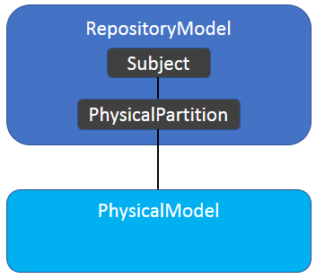
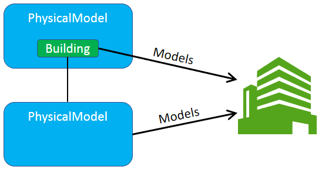

# PhysicalModel Hierarchy

Each Subject in a BIS Repository can have one PhysicalPartition child Element, which will be sub-modeled by one “top-level” PhysicalModel, as shown below.

&nbsp;

&nbsp;

There are two ways to establish a hierarchy of Models:

- Via the `Subject` hierarchy
- Via sub-modeling

## Subject Hierarchy

By building a Subject hierarchy with parent-child relationships among Subjects, the PhysicalPartitions and PhysicalModels associated with those Subjects can be organized hierarchically.

The subject hierarchy approach is used by iModel connectors and legacy applications, because it more closely maps to legacy ways of modeling.

>*Theoretically, the child Subject could have a relationship to some Element in the PhysicalModel of its parent Subject, in order to indicate that the child Subject’s PhysicalModel is modeling the same thing as the Element in the other model, though this has not been done in practice. It would be a more-flexible way of expressing that the child Subject's PhysicalModel is essentially sub-modeling an Element in the parent `Subject`'s PhysicalModel, as described below.*
*In general, new classes of relationships could be invented to relate specific Elements to specific Subjects, regardless of their modeling perspective. This could facilitate flexible re-organization of Models/Elements while maintaining the semantic connection to the Subject hierarchy.*

## Sub-modeling

Sub-modeling was described in [Model Hierarchy](../data-organization/information-hierarchy.md) and more-directly establishes a hierarchy of PhysicalModels.

With sub-modeling, the “top-level” PhysicalModel contains some Elements that mixin ISubModeledElement. Those elements will have a sub-PhysicalModel that represents the same real-world Entity as the sub-modeled Element, but at a finer granularity.  Certain iModel-based authoring apps take this approach to establishing a hierarchy of PhysicalModels
Organizing the contents of PhysicalModels

There is no strict requirement limiting the top `PhysicalModel` to contain only a single `PhysicalElement`. iModels that are generated from other repositories will sometimes have top `PhysicalModel`s with multiple `PhysicalElement`s if that best matches the organization of the source data. Legacy data may also have a non-standard organization.

Sub-`Model`s are weakly-typed in BIS. To understand the real-world Entity that a `Model` is modeling, it is necessary to look at the `Element` which the `Model` is sub-modeling.

***Note: PhysicalModel should not be subclassed.*** The few `PhysicalModel` subclasses that exist are deprecated and should not be used. When a term such as "Site Model" is used, it indicates "a `Model` that sub-models a `Site`", but does not indicate a strongly-typed `SiteModel`.

## Organizing the Elements

Additional hierarchical organization can be applied to Elements using the [SpatialComposition](../data-organization/spatial-composition.md) schema and the [PhysicalSystem](../data-organization/modeling-systems.md) class.

---
| Next: [Physical Models and Elements](./physical-models-and-elements.md)
|:---
