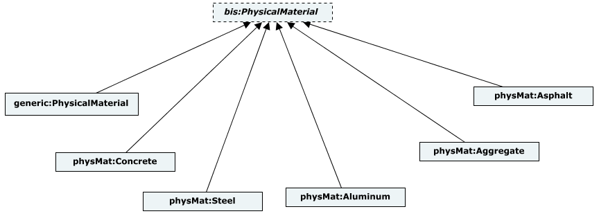
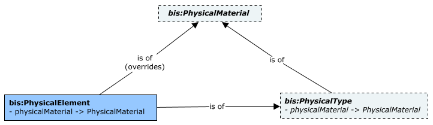
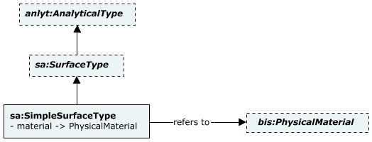
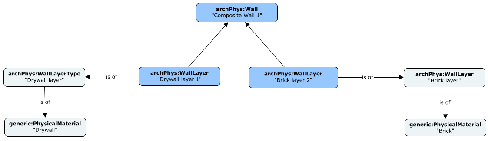

# Physical Materials

## Introduction

Properly capturing the `PhysicalMaterial` of a `PhysicalElement` is of great importance for Quantity takeoffs and material estimating. Note that in BIS the concept of `PhysicalMaterial` is different from `RenderMaterial`. The former defines the matter of which physical objects are made while the latter captures the rendering properties of materials for display.

## Physical Material class-hierarchy

Physical materials are modeled in BIS using an abstract subclass of `DefinitionElement` named `PhysicalMaterial`, which is defined in the *BisCore* schema. More specific subclasses of `bis:PhysicalMaterial` are defined in a separate core-layer `PhysicalMaterial` schema, covering the main physical materials used in infrastructure. It includes sealed subclasses such as `Aggregate`, `Aluminum`, `Asphalt` and `Concrete`. The list of physical materials included in the `PhysicalMaterial` schema may grow over time.

In some cases, especially while converting legacy data, the software may not know enough about a physical material to be able to classify it in terms of the classes offered by the `PhysicalMaterial` schema. The core-layer `Generic` schema includes a `generic:PhysicalMaterial` class for those cases.

The following class diagram depicts the `PhysicalMaterial` class hierarchy. See [Class-diagram Conventions](../references/class-diagram-conventions.md) for details about the conventions used.

&nbsp;

&nbsp;

## Physical Materials in Types and Elements

In BIS, the physical material of a physical object is primarily captured by its physical type. The `bis:PhysicalType` offers a `PhysicalMaterial` navigation property that can be used to refer to the applicable concrete instance of `bis:PhysicalMaterial`. That way, any `bis:PhysicalElement` referencing a given `bis:PhysicalType` shares the same instance of `bis:PhysicalMaterial`.

For cases in which a particular instance of `bis:PhysicalElement` is made of a different physical material than the one referenced by its `bis:PhysicalType`, the `bis:PhysicalElement` instance can override it via its own `PhysicalMaterial` navigation property.

The following class diagram depicts the relationships between `PhysicalElement`, `PhysicalType` and `PhysicalMaterial`. See [Class-diagram Conventions](../references/class-diagram-conventions.md) for details about the conventions used.

&nbsp;

&nbsp;

Modeling perspectives other than Physical may have the need to capture Physical Material information. Each concrete implementation of such modeling perspective may choose to reference `PhysicalMaterial` instances in their own way. The following class-diagram shows an example from the `StructuralAnalytical` domain (alias `sa`). See [Class-diagram Conventions](../references/class-diagram-conventions.md) for details about the conventions used.

&nbsp;

&nbsp;

## Heterogeneous Assemblies

It is not uncommon to find physical assemblies composed of parts made of different materials. This use-case spans multiple disciplines, from composite walls and structural beams to rigid pavement structures. The approach in BIS explained above associates one and only one `PhysicalMaterial` instance for each `PhysicalElement` instance. Heterogeneous assemblies are, therefore, accommodated by associating `PhysicalMaterial` instances with the parts being assembled rather than the parent assembly.

The following instance-diagram shows an example of a composite beam as an heterogeneous assembly. See [Instance-diagram Conventions](../references/instance-diagram-conventions.md) for details about the conventions used.

&nbsp;

&nbsp;

---
| Next: [Quantity takeoffs: Guidelines](./qto-guidelines.md)
|:---
