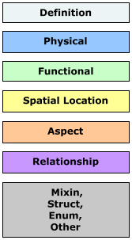
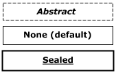
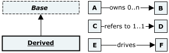
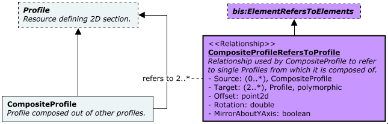
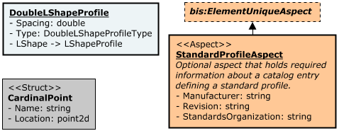
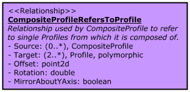
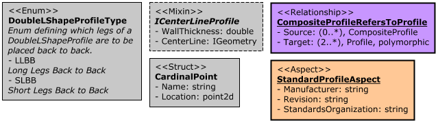
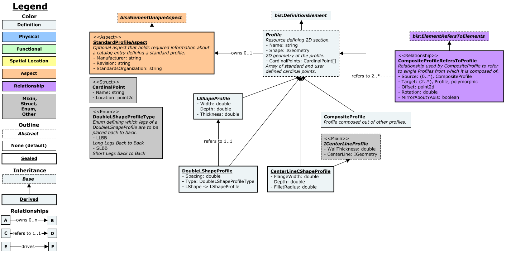
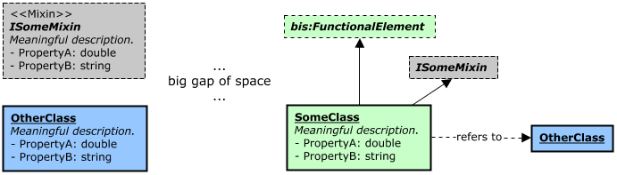

# Class-diagram Conventions

## **Introduction**

This page explains the conventions used by **class** diagrams included in this guide as well as the documentation of individual BIS schemas.

## **Colors**

Colors of nodes are determined by the type of the class/entity. Bellow are listed default colors by class/entity type used in class diagrams:

- `Elements\Models`
  - `Definition` - light cyan (#EDF4F6)
  - `Physical` - light blue (#96C8FF)
  - `Functional or Analytical` - light green (#C8FFC8)
  - `Spatial Location` - light yellow (#FFFF96)
- `Other`
  - `Aspects` - light orange (#FFC896)
  - `Relationships` - purple (#C896FF)
  - `Mixins, Structs, Enums, Other` - grey (#C8C8C8)

&nbsp;

&nbsp;

## **Shapes, outlines and Class name style**

All entity classes have **rectangle** shape margins. Outline and class name style of nodes are determined by the class modifier:

|Modifier            |Class name style|Line style|Line thickness|
|--------------------|----------------|----------|-------------:|
|`Abstract`          |bold + italic   |dotted    |1             |
|`None (default)`    |bold            |solid     |1             |
|`Sealed`            |bold + underline|solid     |2             |

## **Inheritance/Relationships**

Arrows are used to indicate relationships and inheritance. The existence of a label on the arrow indicates that this is a relationship and not inheritance.

- `Inheritance` - arrow pointing from derived class to base class with **no label**.
- `Relationship` - arrow pointing from source to target end point, with a label describing the relationship. It may include the UML-like multiplicity ([link](https://www.uml-diagrams.org/multiplicity.html)) of the relationship, but this may be in free form.

Relationships are detailed by linking the label to the relationship class definition similarly like "association class" pattern in UML. The link has no arrows and has a dotted line.

## **Content**

The following conventions apply to all definitions: classes, structs, relationships etc.

Class contents in order:

- `Stereotype` - (optional) see [Stereotypes](#stereotypes) for more details
- `Class name` - **bold text**, first line if stereotype is not present
- `Description` - (optional) right after class name, **italic text**
- `Properties` - (optional) list of properties in the form: `'- <name><separator> <type> [<description>]'` where:
  - `name` - name of the property
  - `separator` - ":" if it's a regular property or " ->" if it's a navigation property
  - `type` - type of the property, this might be:
    - `primitive` - ec primitive types ([full list](https://www.itwinjs.org/bis/ec/primitive-types/)) e.g. string, double, point3d, IGeometry, etc.
    - `array` - double[], SomeStruct[], etc.
    - `enum` - name of the enum e.g. "SomeEnum"
    - `navigation` - name of the end point class e.g. "PhysicalElement"
  - `description` - (optional) description in italic, should start in new line

`Source` and `Target` properties of relationship classes can be defined in the form: `'- <endPoint>: <multiplicity>, <class>, [polymorphic]'` where:

- `endPoint` - relationship end point, either "Source" or "Target"
- `multiplicity` - UML like multiplicity ([link](https://www.uml-diagrams.org/multiplicity.html)) of the relationship in the form (x..y)
- `class` - class name of the relationship end point
- `polymorphic` - (optional) "polymorphic" suffix if relationship end point is polymorphic

## **Stereotypes**

UML like **stereotypes** (profile classes) are optionally added for nodes to add context specific meaning.

Stereotypes should be defined in the form: `'<<Name>>'`, should be placed as the first line in a node and start with an upper-case letter.

Following stereotypes **must** be added for:

- `Relationship class` - **&lt;&lt;Relationship>>**
- `Aspect class` - **&lt;&lt;Aspect>>**
- `Mixin class` - **&lt;&lt;Mixin>>**
- `Struct` - **&lt;&lt;Struct>>**
- `Enumeration` - **&lt;&lt;Enum>>**

## **Example**

## **Additional conventions**

- Classes referenced from other schemas are prefixed with schema alias in the form: `'<alias>:<name>'` e.g. "bis:DefinitionElement"

## **Situational examples**

- Nodes containing only the name of the referenced class, separate from the single definition for such class, are used in larger class-diagrams when placing inheritance/relationship arrows is otherwise difficult as the line might extend long distances or cut through other classes.

- The following grouping approach is used in cases where a base class has many derived classes:

