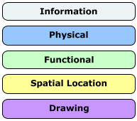
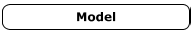
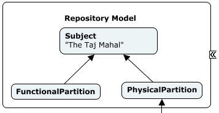
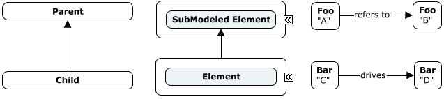
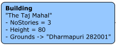
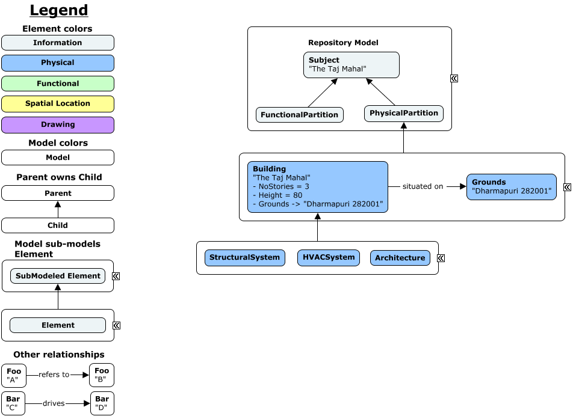

# Instance-diagram Conventions

## **Introduction**
This page explains the conventions used by **instance** diagrams included in this guide as well as the documentation of individual BIS schemas.

## **Colors**

For **Elements**, colors are determined by the type of the element:
- `Information` - light cyan (#EDF4F6)
- `Physical` - light blue (#96C8FF)
- `Functional or Analytical` - light green (#C8FFC8)
- `Spatial Location` - light yellow (#FFFF96)
- `Drawing` - purple (#C896FF)

All **Models** are colored white (#FFFFFF) since their type can be inferred from their modeled-element.

## **Shapes and outlines**

Models are represented by a **nested node**.

Both Models and Elements have a **rounded rectangle** shape and **solid line, thickness 1** outline.

## **Relationships**

All relationship arrow are represented by a **solid arrow** with **thickness 1**.

- `Parent owns child` - arrow pointing from child element to its parent element. **By default no label** should be added, but custom label are added if a specialized parent-child relationship is relevant for the given context.
- `Model sub-models Element` - arrow pointing from model to a sub-modeled element (i.e. element that the model breaks down).
- `Other relationships` - arrow pointing from the source element to the target element with a **label** describing the relationship.

## **Content**

The following conventions apply to all **Element** instances (aspects included).

Instance contents in order:

- `Class name` - **bold text**, first line
- `Code/UserLabel` - (optional) right after class name, surrounded by quotation marks e.g. `"The Taj Mahal"`
- `Properties` - (optional) list of properties in the form: `'- <name> <operator> <value>'` where:
  - `name` - name of the property
  - `operator` - "=" if it's a regular property or "->" if it's a navigation property
  - `value` - value of the property. In case of a navigation property the Code/UserLabel is added e.g. `"The Taj Mahal"`

**Models** have an optional label added denoting their concrete type of the model or context specific information like the what real world entity is being modeled. See [shapes and outlines example](#shapes-and-outlines).

## **Example**

