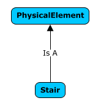

# Data Evolution Across Time

## Introduction

BIS needs to support modeling of infrastructure that evolves over time. The evolution may be as simple as defining a few new properties to elaborately detailing an item. BIS supports this entire range.

For this appendix, a staircase will be used as an example to illustrate evolution over time. The designer of the Stair class will not be able to predict all possible information that may need to be associated with the stair in the future, or how complex a Stair definition will be needed.

## Start Simple

It is best to start with as few assumptions and requirements as possible. The Stair class designer determines that Stair is a PhysicalElement, and gives it a definition such as “*A vertical passageway allowing occupants to walk (step) from one floor level to another floor level at a different elevation. It may include a landing as an intermediate floor slab.*” (which was copied from IAI). The Stair class needs no other complexity to be functional.

### Simple Stair Inheritance Diagram

### Simple Stair Instance Diagram

The Stair instance can be defined purely by the GeometryStream EC Property (inherited from GeometricElement3d) within the instance. A Stair modeled like that might be created through import from IFC. It is unlikely that a Stair designed natively in a iModel application would be defined in this manner.

## Using Types

Using Types allows easier and clearer Stair definition. As a Stair is a PhysicalElement, it has the PhysicalElementIsOfType relationship and hence an instance can be defined by its relationship to a Type. For clarity the schema designer will probably add a StairType class and a custom relationship:

### Stair Using Types Inheritance Diagram

### Stair Using Types Instance Diagram

The JsonProperties property that Stair inherited from Element is used to store whatever instance data is needed by the particular StairType instance (width, height and length are likely). This Type modeling is likely to used extensively in both the preliminary design and design phases.

<!-- TODO: Future proposal, not yet implemented
## Using Form

The Stair class designer will also want to allow users to create custom stairs from parametric geometry. To enable this the Stair class designer will add a StairOwnsForm relationship to allow the Stair to own FormApects:

### Stair Using Form Inheritance Diagram

### Stair Using Form Instance Diagram

Form and Type approaches will both be available through the schema, but will never be used simultaneously by the same instance.
-->

## Using Child Elements

Stairs using either a Type or a FormAspect may eventually need to be detailed (detailed modeling could also be done from the start). This detailing is enabled using child Elements. To support this, the Stair class designer will add the mixin class IParentElement as a superclass of Stair (indicating that this Stair can be defined via its children, but not via a breakdown model). For further clarity, thee Stair class designer will subclass PhysicalElementAssemblesChildElements…..

<!-- (image of Stair, etc….) -->

This modeling allows the stair to be defined by any PhysicalElement; the Stair class designer has provided extreme flexibility, but weak “compile-time type checking”. This compromise is common in BIS.

### Stair Using Children Inheritance Diagram

### Stair Using Children Instance Diagram

All of these modeling approaches will all be available through the schema, but will never be used simultaneously by the same instance.

## Simple Data Additions – Aspects & Relationships

Other schema designers can create Aspects that can be attached to Stair or one of its superclasses. The Stair class designer does not need to predict all Aspects that may need to be associated with Stair in the future. Users may take advantage of these Aspects at any point in time.

Relationships – like Aspects – can be defined for the Stair class (and its superclasses) without any knowledge by the Stair class designer. Users may take advantage of these Relationships to other Elements at any point in time.

> Next: [Schema Versioning](schema-versioning-and-generations.md)