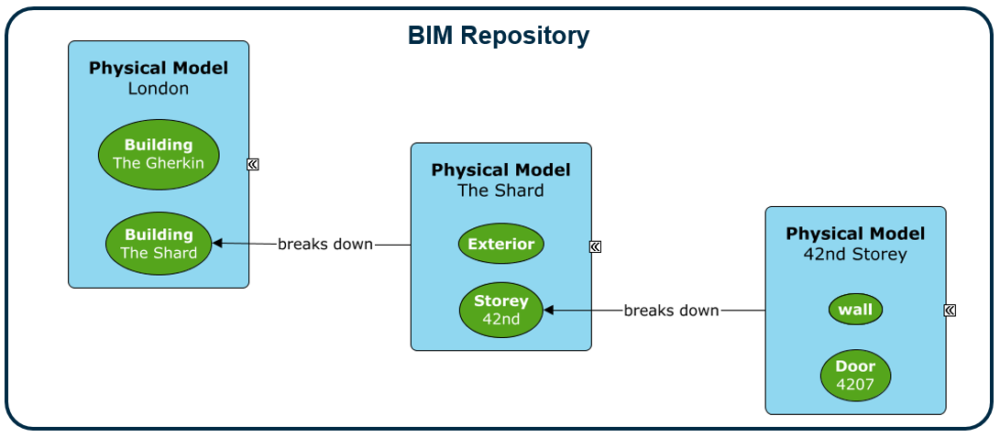

# Model Fundamentals

A `Model` is a container that owns a collection of Elements.
Every Element is contained by exactly one Model as defined by the `ModelContainsElements` relationship.
Models help organize the overall contents of the repository as there is a separate container for each collection of Elements.
The Model contents are driven by:

- The Model subclass
  - Model specializations may limit the types of Elements that can be contained.
- The granularity or level of detail
  - The object as a whole vs. a more detailed breakdown of it
- User preferences
  - Some users may organize by spatial location (east wing vs. west wing) while others may organize by discipline (building vs. civil)
- Domain rules
  - Some rules are enforced by code and are not customizable by users

## Core Model Types

| Model subclass            | Type of Elements contained        |
|---------------------------|-----------------------------------------------|
| `PhysicalModel`           | PhysicalElements and SpatialLocationElements  |
| `SpatialLocationModel`    | SpatialLocationElements                       |
| `DrawingModel`            | GeometricElement2d elements                   |
| `DefinitionModel`         | DefinitionElements                            |
| `InformationRecordModel`  | InformationRecordElements                     |
| `GroupInformationModel`   | GroupInformationElements                      |
| `DocumentListModel`       | Document elements                             |

### Model Identity

Models are also a key building block of the information hierarchy within a BIS repository.
Looking down the information hierarchy, Models are collections of Elements.
Looking up the information hierarchy, Models are more detail about an Element from a higher level.
This higher-level Element is known as the *modeled element*. The *modeled element* is what gives a
Model its identity. The value of the model's Id matches the value of the modeled element's Id.
The Model is related to its modeled Element via the `ModelModelsElement` relationship.
Also, a Model does not store a name of its own. Instead, it its name comes from the `CodeValue` of its modeled element.

See [Information Hierarchy](./information-hierarchy.md) for more details.

<!-- WIP
## Rules

TODO - Each Model represents a single *perspective* on a portion of reality.

TODO - Replace diagrams with better ones?

-->

> Next: [Relationship Fundamentals](./relationship-fundamentals.md)