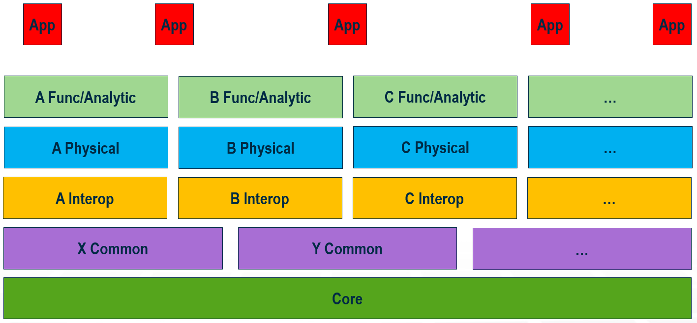

# Schemas (“Domains”)

<!-- TODO
*AB> Are we ok with identifying the primary author/contact for each chapter?*
*AB> "Domain" and "Schema" not same thing*
-->

## Introduction

Domain is a synonym for BIS ECSchema. Domains define the data types for a naturally coherent and limited subject matter. This approach aims to avoid problems and complexities associated with understanding and managing monolithic or very large schemas. It highly depends on coordination and cooperation among multiple BIS domain designers so each sharable concept needed by BIS applications find its appropriate home (i.e. domain) where it will be managed and maintained.

With Domains being the main concept in BIS behind how the world is divided in, and each domain being small enough to have a clear scope and owner, BIS can also be thought as a modular family of “domain” schemas.

## A Layered Approach

Domains are [organized into layers](./bis-organization) based on how generic or specialized the subject matter of the ECSchema in a domain is. The most generic ECSchema in BIS, which lies at the base of this hierarchy – depicted in the figure below – is BisCore.

Schemas in any layer may be dependent upon schemas in any lower layer. The layers of the schema hierarchy are intended to avoid circular dependencies while still allowing different domains to interoperate.

### The BisCore layer

BisCore defines the core ECClasses and organizational strategies that all other data types in other domains must follow. Classes such as Model, Element and UniqueAspect are in the BisCore.

### The Common layer

The next layer in the BIS family of ECSchemas above “Core” is “Common”. That is where broad concepts applicable to multiple disciplines are defined. As an example, a Building “Common” schema may include concepts like stories, but not details of architecture (such as Windows), or structure (such as beams).

The three layers above “Common” specialize on a single discipline (in the figure above, sharing the same initial letter), while differentiating in their purpose: “Interoperability”, “Physical” and “Functional/Analytical”.

### The Interoperability layer

The “Interoperability” layer aims to contain concepts that other disciplines will need to implement or reference. As an example, an IElectricalLoad mixin defined by the electrical discipline may allow other disciplines to define required electrical service (pumps, elevators, server rooms, etc.).

### The Physical layer

“Physical” and “Functional/Analytical” domains model a particular discipline from different perspectives.

The Physical layer defines real-world physical entities and closely associated information. Classes such as Pump, Pipe or Roadway are in the Physical layer.

### The Functional/Analytical layer

This layer defines data types for functional or analytical data towards enabling various schematics and simulations.

<!-- TODO
*AB> Add example elements (Vern?).*
-->

### The Application Layer

The top layer is for any needed application schema. These schemas are intended to be very small, and contain no data that any other application would need to access. Most data that is currently considered application data will probably be found in the discipline or common layers.

### Physical Backbone

A key organizational strategy for both the BIS schemas and the organization of data within BIS repositories is the “physical backbone”. For schema design the physical world is a unifying reality upon which all disciplines can agree when coming to a consensus on how to represent something in BIS.

Within a BIS repository, the representation of the physical world becomes the framework upon which we can organize other data. All data in BIS repositories is expected to be about or related to physical infrastructure. The physical infrastructure is modeled as a hierarchy and other non-physical information (e.g. Functional or Analytical perspectives) is stored relative to that hierarchy. However, it is expected that in some workflows the physical infrastructure appears after other non-physical data is modeled. Thus, the concept of a “physical backbone”, albeit not being mandatory from the start of a BIS repository, it should drive the design of the various domains in a discipline.

<!-- TODO
*AB> "...is stored relative to that hierarchy..." no longer true?*
-->

## Domain Handlers

The BIS schema for a Domain is expected to be useful to a wide variety of clients, designed with the mindset that multiple products, or other domains if needed, will make use of them. Furthermore, as part of the implementation of a BIS Domain, a cross-platform C++ component – usually referred to as a “Domain Handler” – is expected to be in place, representing code that understands the BIS ECSchema the Domain is about, is able to read and modify its data in a coherent manner, as well as exposing public APIs providing special functionality to make working with its ECSchema easier and less error-prone.

## Lifecycle Considerations

Disciplines that will be using BIS usually focus on the entire lifecycle of infrastructure assets. That is, conceptual/detailed design, construction, operations and maintenance lifecycle phases. BIS, at its core, does not intend to break up schemas further into lifecycle phases, but rather be agnostic of them. Thus, a domain BIS ECSchema should be designed so that it can accommodate data at various phases.The quality and/or detail of data for any BIS concept modeled by an ECSchema should evolve as it “flows” through lifecycle phases. No import/export workflows shall be needed.

Designing BIS schemas backwards (i.e. understanding concepts needed for Operations and Maintenance first, while leaving Conceptual Design last) may help to identify all needed pieces towards achieving a schema that works for the entire lifecycle of the infrastructure of interest.

## Example

Taking Road & Rail disciplines as a example, the following figure depicts how they can be divided into various BIS domains.

At the lowest level, BisCore continues to be most generic domain, layout the framework and foundation for all BIS domains.

Next layer up – Common – domains shared with disciplines other than Road & Rail can be found. Those include domains such as Linear-Referencing, Costing and physical Storm water Drainage structures.

Above Common, discipline-specific layers are introduced. In the case of Road & Rail, domains that introduce fundamental pieces such as Alignments – based on Linear-Referencing – and Physical Terrain can be found. These in turn serve as the foundation for Physical domains focusing on different structures common in Road and Railways, such as Bridges, Tunnels and Pathways in general.

Other domains in Road & Rail disciplines focusing on Analytical perspectives included in the figure above include: Structural Analysis (applicable to bridges and tunnels), Traffic Analysis and Storm water Analysis (Hydraulic and Hydraulic simulations).

Additionally, concepts defined in these Road & Rail domains are needed in other disciplines, such as Site and Building – Physical as well as analytical, such as for Site optimization – calling for references from these other domains into the appropriate Road & Rail domains depicted below.

Lastly, several Civil applications can be built on top of all these Road & Rail domains. These Civil applications may focus on specific assets and lifecycle phases in the Road & Rail disciplines. However, BIS ECSchemas referenced by them are expected to be useful across the entire lifecycle of assets in the Road & Rail disciplines.

---
| Next: [Information Hierarchy](./information-hierarchy.md)
|:---
