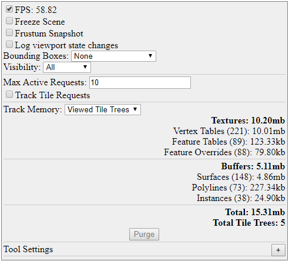

# 1.1.0 Change Notes

## Update to TypeScript 3.5

For the 1.0 release, iModel.js was using TypeScript 3.2. In order to take advantage of recent improvements, iModel.js has moved up to TypeScript 3.5. One of the main features of interest was the incremental build support. TypeScript 3.5 also includes some enhanced error checking over what was available in 3.2. This makes it easier to identify potential problems, but also may mean that source code that successfully compiled using 3.2 may require minor adjustments to compile using 3.5.

Please see the [TypeScript Roadmap](https://github.com/Microsoft/TypeScript/wiki/Roadmap) for more details.

## New frontend-devtools package

The new `frontend-devtools` package contains a collection of simple UI widgets providing diagnostics and customization related to the display system. These include:

- `MemoryTracker` - reports on total GPU memory usage, breaking it down by different types of objects like textures and buffers. Memory can be reported for all tile trees in the system or only those currently displayed in the viewport.
- `FpsTracker` - reports average frames-per-second. Note: this forces the scene to be redrawn every frame, which may impact battery life on laptops and mobile devices.
- `TileStatisticsTracker` - reports exhaustive tile request statistics, including the current numbers of active and pending requests, the total number of completed, dispatched, failed, and timed-out requests, and more.
- `ToolSettingsTracker` - allows settings affecting the operation of viewing tools to be customized.

These widgets may be used in any combination. Alternatively, `DiagnosticsPanel` bundles them all together as a set of expandable panels along with a handful of other features like freezing the current scene, controlling display of tile bounding boxes, and hiding particular types of geometry.



## Display system optimizations

Many incremental enhancements contributed to improved performance and quality of the rendering system and decreased memory usage, including:

- Reducing the number of tiles requested and expediently cancelling requests for tiles which are no longer needed.
- Improving culling logic - this particularly improves performance when a clip volume is applied to the view.
- Reclaiming memory from not-recently-drawn tiles.
- Decompressing texture images in the background using web workers.
- Eliminating distortion of text, and of the skybox in orthographic views.
- Enabling tiles to be downloaded without edge data, and optimizing shaders to more efficiently render tiles without edges.

## Changes to handling of GUID ECProperties

A [Guid](https://www.imodeljs.org/v1/reference/bentleyjs-core/ids/guid) is stored inside an [IModelDb](https://www.imodeljs.org/v1/reference/imodeljs-backend/imodels/imodeldb) as an ECProperty of `binary` type (a "blob" of bytes) with `extendedTypeName="BeGuid"`, but represented in Typescript as a `string`. ECSql queries must translate between these two representations. Previously, querying such a property would return a 16-byte `Uint8Array`; in iModel.js 1.1 it instead returns a `string`.

The example below selects a Guid property:

```ts
for await (const row of conn.query("SELECT FederationGuid FROM bis.Element WHERE FederationGuid IS NOT NULL")) {
  // Expect row.federationGuid to be a string of the format "xxxxxxxx-xxxx-xxxx-xxxx-xxxxxxxxxxxx"
}
```

When a Guid is bound to an ECSql parameter, either the `Uint8Array` **or** the `string` representation can be supplied. In the example below, the `string` representation is supplied:

```ts
for await (const row of conn.query("SELECT FederationGuid FROM bis.Element WHERE FederationGuid = ?", ["xxxxxxxx-xxxx-xxxx-xxxx-xxxxxxxxxxxx"])) {
  // ...
}
```

Currently, the `string` representation **cannot** be used directly inside an ECSql statement. This will be fixed in a future version. For now, use the helper functions `GuidToStr` and `StrToGuid` to explicitly convert between binary and string:

```ts
// WARNING: The following will not work because no implicit conversion between BINARY and STRING is performed.
for await (const row of conn.query("SELECT FederationGuid FROM bis.Element WHERE FederationGuid = 'xxxxxxxx-xxxx-xxxx-xxxx-xxxxxxxxxxxx'")) { /* */ }

// This query is logically equivalent to the above, and will work as expected because the string is explicitly converted to a blob.
for await (const row of conn.query("SELECT FederationGuid FROM bis.Element WHERE FederationGuid = StrToGuid('xxxxxxxx-xxxx-xxxx-xxxx-xxxxxxxxxxxx')")) { /* */ }

// The inverse conversion can also be useful.
for await (const row of conn.query("SELECT FederationGuid FROM bis.Element WHERE GuidToStr(FederationGuid) = 'xxxxxxxx-xxxx-xxxx-xxxx-xxxxxxxxxxxx'")) { /* */ }
```

## ECSQL support for correlated subqueries

ECSql now supports the following syntax for correlated subqueries

```sql
[NOT] EXISTS (<subquery>)
```

### Example

```sql
SELECT ECInstanceId FROM bis.Element E
  WHERE EXISTS (
      SELECT 1 FROM meta.ECClassDef C WHERE C.ECInstanceId = E.ECClassId AND C.Name='Pump')

SELECT ECInstanceId FROM bis.Element E
  WHERE NOT EXISTS (
      SELECT 1 FROM meta.ECClassDef C WHERE C.ECInstanceId = E.ECClassId AND C.Name='Pump')
```

## ECSQL support for bitwise operators

ECSql now supports the following bitwise operators. The operand is treated as a signed 64-bit integer.

- `~` not
- `|` or
- `&` and
- `<<` left-shift
- `>>` right-shift

### Example

```sql
SELECT 2 & prop FROM test.Foo WHERE prop & 2 = 2

SELECT 2 | prop FROM test.Foo WHERE prop | 2 = 2

SELECT * FROM test.Foo WHERE (1 << 2) & prop

SELECT * FROM test.Foo WHERE ~prop & 2;
```
