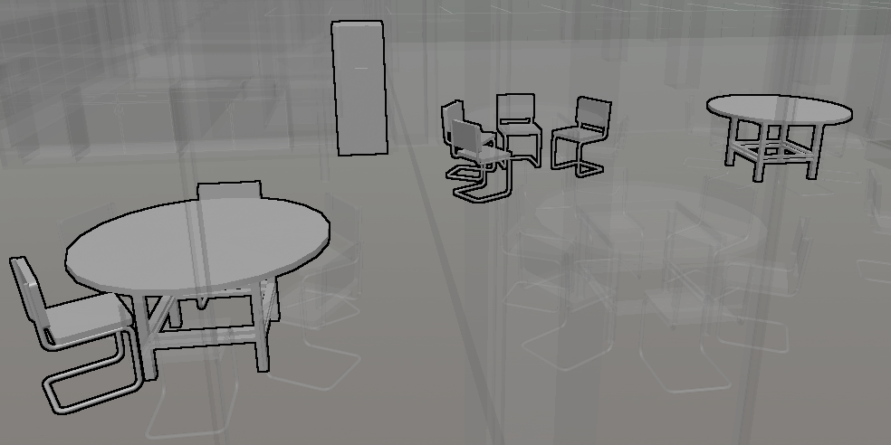

# 1.6.0 Change Notes

## Silhouettes for emphasis

The [Hilite](https://www.imodeljs.org/v1/reference/imodeljs-common/rendering/hilite) effect can now be applied to individual features (elements, models, subcategories, etc) using [FeatureSymbology.Overrides](https://www.imodeljs.org/v1/reference/imodeljs-frontend/rendering/featuresymbology/featuresymbology.overrides). The color, color ratios, and silhouette width can all be customized using [Viewport.emphasisSettings](https://www.imodeljs.org/v1/reference/imodeljs-frontend/views/viewport/emphasissettings) - the default settings apply a thick black silhouette to emphasized features with no effect on the features' own colors. If you are using [EmphasizeElements](https://www.imodeljs.org/v1/reference/imodeljs-frontend/rendering/emphasizeelements), set its `wantEmphasis` property to control whether or not the emphasis settings are applied. Otherwise, have your [FeatureOverrideProvider](https://www.imodeljs.org/v1/reference/imodeljs-frontend/views/featureoverrideprovider) specify which features are emphasized using [FeatureSymbology.Appearance.emphasized](https://www.imodeljs.org/v1/reference/imodeljs-frontend/rendering/featuresymbology/featuresymbology.appearance/#emphasized) and optionally override [Viewport.emphasisSettings](https://www.imodeljs.org/v1/reference/imodeljs-frontend/views/viewport/emphasissettings).

## Geometry

- [PolyfaceBuilder.addGreedyTriangulationBetweenLineStrings](https://www.imodeljs.org/v1/reference/geometry-core/polyface/polyfacebuilder/addgreedytriangulationbetweenlinestrings) method to build triangles "between" loosely related linestrings.
- [RegionOps.consolidateAdjacentPrimitives](https://www.imodeljs.org/v1/reference/geometry-core/curve/regionops/#consolidateadjacentprimitives) method to consolidate adjacent lines and linestrings, and adjacent arcs of the same underlying circle or ellipse.
- [RegionOps.rectangleEdgeTransform](https://www.imodeljs.org/v1/reference/geometry-core/curve/regionops/#rectangleedgetransform) method to decide if a Loop object or point array is a simple rectangle.
