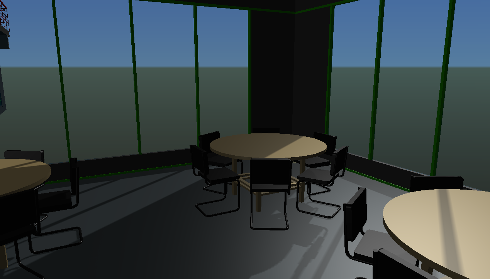

# 1.7.0 Change Notes

## Improvements to solar shadows

Several enhancements were made to the display of `SolarShadows`:

- The shadow map now continuously refines as new geometry is loaded.
- The position of the solar light is now synchronized with sun direction. See [DisplayStyle3dState.sunDirection](https://www.imodeljs.org/v1/reference/imodeljs-frontend/views/displaystyle3dstate/sundirection).
- World decorations no longer receive shadows.
- A display style can now configure whether or not transparent surfaces cast shadows. Any surface whose transparency is greater than the transparency threshold defined by the [DisplayStyle3dState](https://www.imodeljs.org/v1/reference/imodeljs-frontend/views/displaystyle3dstate) will not cast shadows. See [HiddenLine.Settings.transparencyThreshold](https://www.imodeljs.org/v1/reference/imodeljs-common/displaystyles/hiddenline/hiddenline.settings/transparencythreshold).

Solar shadows interacting with transparent surfaces

## Reusable decoration graphics

All [RenderGraphic](https://www.imodeljs.org/v1/reference/imodeljs-frontend/rendering/rendergraphic)s created as decorations are automatically disposed to ensure any WebGL resources are freed. This has the unfortunate side effect of preventing such graphics from being reused from one frame to another. If your decorations are expensive to create and/or change infrequently, you can now prevent automatic disposal by wrapping them in a [RenderGraphicOwner](https://www.imodeljs.org/v1/reference/imodeljs-frontend/rendering/rendergraphicowner). By doing so you assume responsibility for properly disposing of them when they are no longer needed. See [RenderSystem.createGraphicOwner](https://www.imodeljs.org/v1/reference/imodeljs-frontend/rendering/rendersystem/creategraphicowner).

## Spatial classification improvements

- Volume classification is now fully supported.
- Flash and hilite effects are now applied correctly.
- Planar classifiers now support transparency; the classified geometry will use the transparency specified by the classifier geometry.
- Classification of point clouds now works properly.
- Classification now works correctly in perspective views.

## Display system startup options

The following changes have been made to the [RenderSystem.Options](https://www.imodeljs.org/v1/reference/imodeljs-frontend/rendering/rendersystem.options) used to initialize the [RenderSystem](https://www.imodeljs.org/v1/reference/imodeljs-frontend/rendering/rendersystem) when invoking [IModelApp.startup](https://www.imodeljs.org/v1/reference/imodeljs-frontend/imodelapp/imodelapp/#startup):

- `displaySolarShadows` now defaults to `true` if not defined, instead of false.
- `directScreenRendering` has been deprecated; it no longer has any effect.

## Improvements to ambient occlusion

The default settings for ambient occlusion have been changed to make the effect more subtle, and an option has been added to limit the distance at which the effect will be applied.

## Geometry

- [PolyfaceBuilder.addGreedyTriangulationBetweenLineStrings](https://www.imodeljs.org/v1/reference/geometry-core/polyface/polyfacebuilder/addgreedytriangulationbetweenlinestrings) method to build triangles "between" loosely related linestrings.
- [RegionOps.consolidateAdjacentPrimitives](https://www.imodeljs.org/v1/reference/geometry-core/curve/regionops/#consolidateadjacentprimitives) method to consolidate adjacent lines and linestrings, and adjacent arcs of the same underlying circle or ellipse.
- [RegionOps.rectangleEdgeTransform](https://www.imodeljs.org/v1/reference/geometry-core/curve/regionops/#rectangleedgetransform) method to decide if a Loop object or point array is a simple rectangle.
- [Range2d.corners3d](https://www.imodeljs.org/v1/reference/geometry-core/cartesiangeometry/range2d/corners3d) method to get a `Point3d[]` containing the range corners.
- [GrowableXYArray.length](https://www.imodeljs.org/v1/reference/geometry-core/arraysandinterfaces/growablexyarray/length) property is writable (e.g. to trim the array)
- [IndexedXYZCollection.getRange](https://www.imodeljs.org/v1/reference/geometry-core/arraysandinterfaces/indexedxyzcollection/#getrange) -- return the range of data in the collection.
- Support methods for using `PolyfaceVisitor` as staging area for new facets to be given to a `PolyfaceBuilder`
  - [PolyfaceVisitor.clearArrays](https://www.imodeljs.org/v1/reference/geometry-core/polyface/polyfacevisitor/cleararrays) -- empty all arrays
  - [PolyfaceVisitor.pushDataFrom](https://www.imodeljs.org/v1/reference/geometry-core/polyface/polyfacevisitor/#pushdatafrom) -- add new point, param, normal, color from indexed position in another `PolyfaceVisitor`
- [PolyfaceVisitor.pushInterpolatedDataFrom](https://www.imodeljs.org/v1/reference/geometry-core/polyface/polyfacevisitor/pushinterpolateddatafrom) -- add new point, param, normal, color interpolated between two indexed positions in another `PolyfaceVisitor`
- `[PolyfaceQuery.cloneWithTVertexFixup](https://www.imodeljs.org/v1/reference/geometry-core/polyface/polyfacequery/#clonewithcolinearedgefixup) -- clone a polyface, inserting vertices within edges that are incident to points on other facets.
- `[PolyfaceQuery.cloneWithColinearEdgeFixup](https://www.imodeljs.org/v1/reference/geometry-core/polyface/polyfacequery/#clonewithcolinearedgefixup) -- clone a polyface, removing mid-edge vertices that are interior to adjacent colinear edges and are _not_ used as non-colinear vertex on any other facet.

## Presentation

### Read-only mode

Added a flag [PresentationManagerProps.mode](https://www.imodeljs.org/v1/reference/presentation-backend/core/presentationmanagerprops/mode) to indicate that the backend always opens iModels in read-only mode and presentation manager
can make some optimizations related to reacting to changes in iModels. This is an optional property that defaults to previous behavior (read-write), but it's
strongly encouraged to set it to [PresentationManagerMode.ReadOnly](https://www.imodeljs.org/v1/reference/presentation-backend/core/presentationmanagermode/#readonly) on read-only backends.
