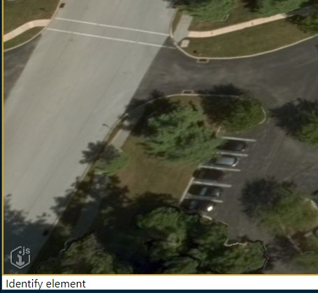
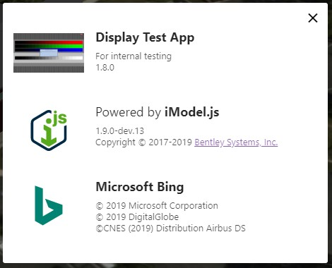
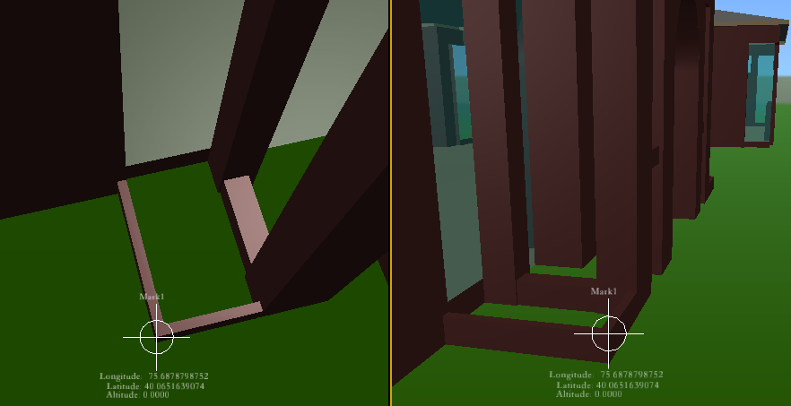

# 1.8.0 Change Notes

## Node 12 Support

iModel.js now officially supports Node 12 starting with LTS version of 12.13.0.  Node 12 support is in addition to Node 10, not a replacement.

## Logo Cards

iModel.js now displays an icon in the lower left corner of viewports to provide credit attribution for software or data authors.



When the cursor moves over the icon, a set of *Logo Cards* with notices and logos for the content of the view appears. Applications may also add their own Logo Card to display information about their authors, versions, status, etc.



If the user clicks or taps on the iModel.js icon, a modal dialog opens showing the logo cards.

See [Logo Cards]($docs/learning/frontend/LogoCards.md) for more information.

## View-independent Geometry

Spatial elements now support "view-independent" geometry - that is, geometry that is always displayed facing toward the viewer, regardless of the orientation of the view. Such geometry is considered by the display system to exist at a single point. As the view orientation changes, the geometry rotates about that point. If the point falls outside of the view frustum, the geometry stops drawing as well.

Use [GeometryStreamBuilder.isViewIndependent](https://www.imodeljs.org/v1/reference/imodeljs-common/geometry/geometrystreambuilder/isviewindependent) to configure this behavior for an element. The element's placement origin will be used as the rotation point.


<p align="center">The same marker viewed from two different angles.</p>

## Viewing Tool Improvements

Added new view cursors for rotate, look, walk, and zoom view tools.

Viewing tools that require identification of an object to define the point the tool will operate about now provide better feedback for the current cursor location.

- The 3d rotate view tool now shows a preview of the point it will rotate about.
- Pan, zoom, and scroll view tools now show a preview of the depth point used when the camera is on.

 Cursor over sky 2) Cursor over element 3) Cursor over terrain")
<p align="center">Rotate view tool showing rotate point used for various cursor locations</p>

1) Current cursor location doesn't identify anything. Uses default rotate point, which may not be meaningful.
2) Current cursor location identifies a valid depth point on an element.
3) Current cursor location identifies a valid depth point on terrain or background map.

## Removal of `EntityProps` String Indexer

In prior releases, the `EntityProps` interface implemented by most types that represent data inside an iModel exposed an [indexer](https://basarat.gitbooks.io/typescript/docs/types/index-signatures.html) declared as follows:

```ts
export interface EntityProps {
  [propName: string]: any;
}
```

The dubious motivation was to enable access to arbitrary properties known to exist on some sub-type of `EntityProps` without requiring a cast. This was problematic for a number of reasons:

- If the object was *not* in fact of the expected sub-type, the property might not exist.
- Even if the expected property did in fact exist, the compiler could not catch typos in the property name.
- It disabled *all* type-checking on *all* properties of *all* sub-types of `EntityProps` - even those explicitly defined.

That final problem defeats the entire purpose of using TypeScript instead of JavaScript - it essentially forces the compiler to accept any expression `myEntity.anythingAtAll` and to consider it to have any type at all.

To prevent bugs resulting from this complete lack of type-safety, the indexer has been removed (and as a result, several existing bugs were exposed). The onus is now on the user of `EntityProps` to accommodate the type checker. Required changes may involve, in order of preference:

- Using explicit types such that no casts are required; or
- Casting to a known type that defines the properties of interest (e.g., `myEntity as ElementProps`); or
- Casting to `any` to bypass the type system entirely.

## Geometry

PolyfaceQuery methods to support edge visibility markup.

- PolyfaceQuery.setSingleEdgeVisibility (polyface, facetIndex, vertexIndex, value)
  - within indicated facet, mark visibility of edge that starts with indicated vertexIndex
- PolyfaceQuery.markPairedEdgesInvisible (polyface, sharpEdgeAngle?)
  - Mark all unpaired edges visible
  - Also marked paired edges with large angle across the edge visible.
  - mark all other paired edges invisible
- PolyfaceQuery.computeFacetUnitNormal (visitor, facetIndex, result?): Vector3d | undefined
  - move the visitor to the indicated facet and compute a unit normal with `PolygonOps.unitNormal`
- PolyfaceQuery.markAllEdgeVisibility (mesh, value : boolean)
  - mark all edges of all facets visible (true) or invisible (false)
