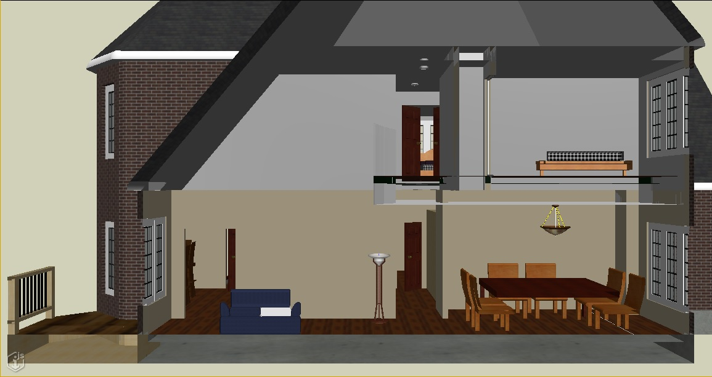
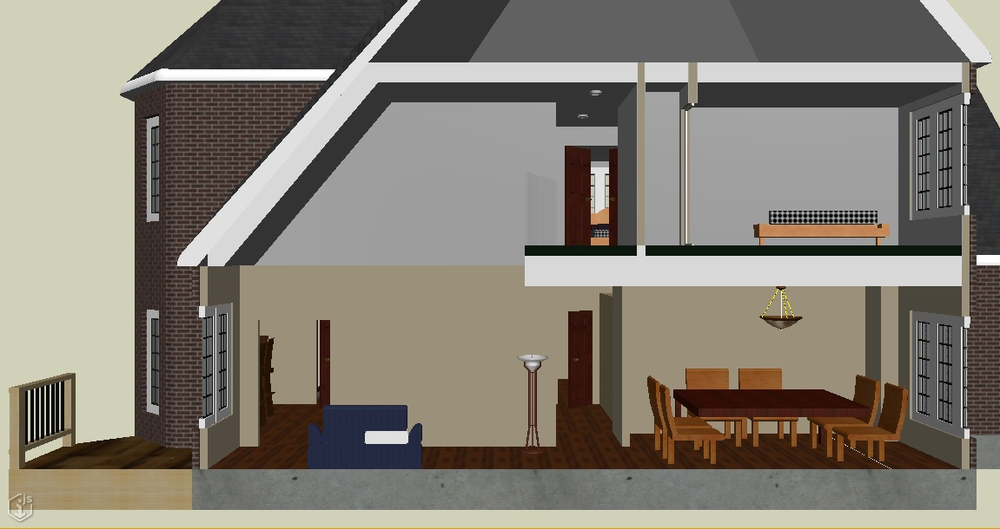
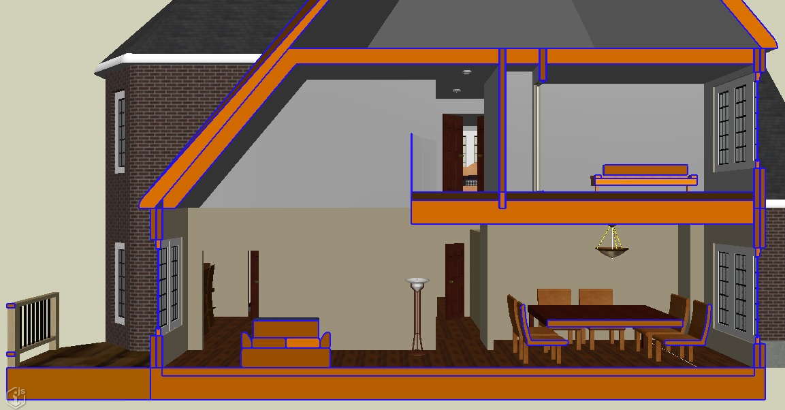

# 2.11.0 Change Notes

Overview:

- Breaking Changes:
  - [Breaking API changes](#breaking-api-changes)
  - [BriefcaseManager changes](#briefcasemanager-breaking-changes)
- Visualization
  - [Section-cut graphics](#section-cut-graphics)
  - [Custom screen-space effects](#custom-screen-space-effects)
  - [Automatic viewport synchronization](#automatic-viewport-synchronization)
  - [Globe location tool fixes](#globe-location-tool-fixes)
  - [Changes to display style excluded elements](#changes-to-display-style-excluded-elements)
  - [Tile compression](#tile-compression)
- [Upgrading schemas in an iModel](#upgrading-schemas-in-an-imodel)
- [Presentation](#presentation)
  - [Formatted property values in ECExpressions](#formatted-property-values-in-ecexpressions)
  - [Enhanced navigation property values](#enhanced-navigation-property-values)
  - [Interactable navigation properties](#interactable-navigation-properties)
  - [Breaking changes to `ContentRelatedInstances`](#breaking-changes-to-contentrelatedinstances)
  - React Components
    - [Filtering in Property Grid](#filtering-in-property-grid)
- [QuantityFormatter updates](#quantityformatter-updates)

## Breaking Changes

## Breaking API Changes

- The union type [Matrix3dProps]($core-geometry) inadvertently included [Matrix3d]($core-geometry). "Props" types are wire formats and so must be pure JavaScript primitives. To fix compilation errors where you are using `Matrix3d` where a `Matrix3dProps` is expected, simply call [Matrix3d.toJSON]($core-geometry) on your Matrix3d object. Also, since [TransformProps]($core-geometry) includes Matrix3dProps, you may need to call [Transform.toJSON]($core-geometry) on your Transform objects some places too.

- The type of [Texture.data]($backend) has been corrected from `string` to `Uint8Array` to match the type in the BIS schema. If you get compilation errors, simply remove calls to `Buffer.from(texture.data, "base64")` for read, and `texture.data.toString("base64")` if you create texture objects.

- Several interfaces in the `@itwin/components-react` package have been renamed:

 Previous

  ```ts
  interface HighlightedRecordProps {
    activeMatch?: PropertyRecordMatchInfo;
    searchText: string;
  }
  ```

  New

  ```ts
  interface HighlightInfo {
    highlightedText: string;
    activeHighlight?: HighlightInfo;
  }
  ```

 > This is just a terminology change, so reacting to the change is as simple as renaming `searchText` -> `highlightedText` and `activeMatch` -> `highlightedText`.

Previous

 ```ts
 interface PropertyRecordMatchInfo {
    matchCounts: {
        label: number;
        value: number;
    };
    matchIndex: number;
    propertyName: string;
  }
  ```

New

  ```ts
  interface HighlightInfo {
    highlightedItemIdentifier: string;
    highlightIndex: number;
  }
  ```

> This is just a terminology change, so reacting to the change is as simple as renaming `matchIndex` -> `highlightedItemIdentifier` and `propertyName` -> `highlightedItemIdentifier`.

- Changed `highlightProps?: HighlightedRecordProps` property to `highlight?: HighlightingComponentProps` on [PrimitiveRendererProps]($components-react) interface. To react to this change, simply rename `highlightProps` -> `highlight`.

- Changed `highlightProps?: HighlightedRecordProps` property to `highlight?: HighlightingComponentProps` on [PropertyRendererProps]($components-react) interface. To react to this change, simply rename `highlightProps` -> `highlight`.

- The methods fromJson and toJson from alpha class `Format`, in the quantity package, have been renamed to fromJSON and toJSON respectively.

- The method parseIntoQuantityValue from alpha class `QuantityFormatter` in the imodeljs-frontend package, has been renamed to parseToQuantityValue.

### BriefcaseManager breaking changes

This version changes the approach to storing Briefcase and Checkpoint files in the local disk cache. Now, [BriefcaseManager]($backend) will create a subdirectory from the root directory supplied in [BriefcaseManager.initialize]($backend) for each iModelId, and then folders called `briefcases` and `checkpoints` within that folder. The Briefcase and Checkpoint files themselves are named with the `BriefcaseId` and `ChangeSetId` respectively.

> For backwards compatibility: When searching for local files from RPC calls, the previous locations and naming rules are checked for briefcase and checkpoint files. This check will be removed in a future version.

Several methods on the @beta class `BriefcaseManager` have been changed to simplify how local Briefcase files are acquired and managed. Previously the location and name of the local files holding Briefcases was hidden behind a local in-memory cache that complicated the API. Now, the [BriefcaseDb.open]($backend) method takes an argument that specifies the file name. This makes working with local Briefcases much simpler. BriefcaseManager's role is limited to acquiring and releasing briefcases, and for downloading, uploading, and applying changesets.

In particular, the method `BriefcaseManager.download` was removed and replaced with [BriefcaseManager.downloadBriefcase]($backend), since backwards compatibility could not be maintained. See the documentation on that method to understand what you may need to change in your code.

The `BriefcaseManager.imodelClient` has been removed in favor of directly using `IModelHost.iModelClient`.

> Note that the frontend APIs have not changed, so the impact of this change to the beta APIs should be limited.

Also, the `@internal` class `NativeApp` has several changed methods, so some refactoring may be necessary to react to those changes for anyone implementing native applications using this internal API.

## Section-cut graphics

A [DisplayStyleState]($frontend) can now be configured to produce section-cut graphics from the view's [ClipVector]($core-geometry). In the image below, a clipping plane has been applied to produce a cross-section view of a house. Note that all of the geometry intersecting the clipping plane appears to be hollow, whereas in the real world we'd expect things like walls, floors, and tables to be solid throughout:



Now, every [DisplayStyleSettings]($common) has a [ClipStyle]($common) that specifies how the clipping planes should affect the view. [ClipStyle.produceCutGeometry]($common) specifies that additional graphics should be produced for solid geometry intersecting the clipping planes, causing solid objects to continue to appear solid when sliced by a clipping plane, as shown below:



A [ClipStyle]($common) can also specify a [CutStyle]($common) controlling how the section-cut geometry is displayed by overriding:

- Aspects of the [ViewFlags]($common) with which it is drawn;
- The edge symbology via [HiddenLine.Settings]($common); and
- The color, transparency, etc of the geometry via [FeatureAppearance]($common).

In the image below, the section-cut graphics are drawn in orange with visible blue edges as specified by the [CutStyle]($common).



NOTE: If a ClipStyle is associated with a [Viewport]($frontend), it should be modified via [Viewport.clipStyle]($frontend) to ensure the viewport's contents are updated to reflect the change.

## Custom screen-space effects

The display system now allows applications to apply their own post-processing effects to the image rendered by a [Viewport]($frontend) using [RenderSystem.createScreenSpaceEffectBuilder]($frontend). A couple of example effects can be found in the [frontend-devtools package](https://github.com/iTwin/itwinjs-core/tree/master/core/frontend-devtools), including [LensDistortionEffect]($frontend-devtools) (illustrated below) for simulating the distortion produced by real-world cameras with wide fields of view; and various [ConvolutionEffect]($frontend-devtools)s for producing a blurred, sharpened, or embossed image.

Wide-angle camera with no lens distortion:


Wide-angle camera with lens distortion:


## Automatic viewport synchronization

A [Viewport]($frontend) holds a reference to a [ViewState]($frontend) defining its viewing parameters, which in turn holds references to objects like a [DisplayStyleState]($frontend) and [CategorySelectorState]($frontend) controlling the styling and contents of the Viewport. Previously, directly modifying the ViewState or its components would not cause the Viewport to update immediately on-screen - instead, callers would either need to manually invoke methods like `Viewport.invalidateScene` to notify the Viewport that something had changed; or use special Viewport APIs like [Viewport.changeCategoryDisplay]($frontend) that would forward to the appropriate object and also invalidate the Viewport's internal state. This was error-prone and tedious.

New events have been added to ViewState and its related classes to notify listeners when aspects of their states change. For example, changing the background color via [DisplayStyleSettings.backgroundColor]($common) raises the [DisplayStyleSettings.onBackgroundColorChanged]($common) event. A Viewport now listens for such events and updates its own state automatically. This eliminates the need for most manual synchronization. However, [Viewport.synchWithView]($frontend) should still be used when modifying the ViewState's [Frustum]($common)

## Globe location tool fixes

The globe location tools now will properly use GCS reprojection when navigating. Previously, navigating to certain cartographic locations within the iModel extents could be slightly inaccurate.

The tools affected are:

- [ViewGlobeSatelliteTool]($frontend)
- [ViewGlobeBirdTool]($frontend)
- [ViewGlobeLocationTool]($frontend)
- [ViewGlobeIModelTool]($frontend)

The [ViewGlobeLocationTool]($frontend) has been further improved to navigate better across long distances when using plane mode.

There is now a method called `lookAtGlobalLocationFromGcs` on [ViewState3d]($frontend). This method behaves exactly like `lookAtGlobalLocation` except that is async and uses the GCS to reproject the location.

[ViewState3d]($frontend) also has GCS versions of these methods:

- `rootToCartographicFromGcs` behaves like `rootToCartographic` except it is async and uses the GCS to reproject the location.
- `cartographicToRootFromGcs` behaves like `cartographicToRoot` except it is async and uses the GCS to reproject the location.

## Changes to display style excluded elements

`DisplayStyleSettings.excludedElements` allows a display style to specify a set of elements that should not be drawn. Previously, this set was always persisted to the database as an array of element Ids, and represented in JSON and in memory as a `Set<string>`. However, element Ids tend to be long strings (at least 13 characters), and sets of excluded elements can occasionally grow quite large. To reduce the amount of data associated with these sets:

- They are now always persisted to the database as a [CompressedId64Set]($core-bentley).
- The type of [DisplayStyleSettingsProps.excludedElements]($common) has changed from `Id64Array` to `Id64Array | CompressedId64Set`.
- `DisplayStyleSettings.excludedElements` - a `Set<string>` - has been deprecated in favor of [DisplayStyleSettings.excludedElementIds]($common) - an [OrderedId64Iterable]($core-bentley).
- [IModelDb.Views.getViewStateData]($backend) and [ElementLoadProps]($common) allow the caller to specify whether the Ids should be returned in compressed (string) form or as an uncompressed array; by default, they are uncompressed.
- [IModelConnection.Views.load]($frontend) will always use the compressed representation of the Ids.

To adjust code that uses `DisplayStyleSettings.excludedElements`, given `settings: DisplayStyleSettings`:

```ts
  settings.excludedElements.add(id); // Replace this...
  settings.addExcludedElements(id); // ...with this.

  settings.excludedElements.delete(id); // Replace this...
  settings.dropExcludedElements(id); // ...with this.

  settings.excludedElements.clear(); // Replace this...
  settings.clearExcludedElements(); // ...with this.

  for (const id of settings.excludedElements) { } // Replace this...
  for (const id of settings.excludedElementIds) { } // ...with this.
```

Note that [DisplayStyleSettings.addExcludedElements]($common) and [DisplayStyleSettings.dropExcludedElements]($common) can accept any number of Ids. If you have multiple Ids, prefer to pass them all at once rather than one at a time - it is more efficient.

## Tile compression

[IModelHostConfiguration.compressCachedTiles]($backend) specifies whether tiles uploaded to blob storage should be compressed using gzip. Previously, it defaulted to `false` if omitted. The default has now been switched to `true`. Compressing tiles conserves bandwidth; the tiles are transparently and efficiently decompressed by the browser.

## Upgrading schemas in an iModel

In previous versions the method to open briefcases ([BriefcaseDb.open]($backend)) and standalone files (`StandaloneDb.open` renamed to `StandaloneDb.openFile`) provided options to upgrade the schemas in the iModel. This functionality has been now separated out, and there are separate methods to validate and upgrade the schemas in the iModel. As a result [OpenBriefcaseProps]($common) and [SnapshotOpenOptions]($common) do not include options to upgrade anymore.

See section on [Upgrading Schemas]($docs/learning/backend/IModelDb.md#upgrading-schemas-in-an-imodel) for more information.

## Filtering in Property Grid

Now it is possible to filter property grid items (Records or Categories) using `FilteringPropertyDataProvider`. In addition, support for highlighting parts of items that matched the search criteria has also been added.


Filtering is done by `FilteringPropertyDataProvider` and `IPropertyDataFilterer` that is passed to the provider. We provide a number of read-to-use filterers:

- `CompositePropertyDataFilterer` combines two other filterers
- `PropertyCategoryLabelFilterer` filters `PropertyCategories` by label
- `DisplayValuePropertyDataFilterer` filters `PropertyRecords` by display value
- `LabelPropertyDataFilterer` filters `PropertyRecords` by property label
- `FavoritePropertiesDataFilterer` (in `@itwin/presentation-components`) filters `PropertyRecords` by whether the property is favorite or not.

**Example:**

```ts
const searchString = "Test";

const filteringDataProvider = useDisposable(React.useCallback(() => {
  // Combine a filterer that filters out favorite properties having `searchString` in their category label,
  // property label or display value
  const valueFilterer = new DisplayValuePropertyDataFilterer(searchString);
  const labelFilterer = new LabelPropertyDataFilterer(searchString);
  const categoryFilterer = new PropertyCategoryLabelFilterer(searchString);
  const recordFilterer = new CompositePropertyDataFilterer(labelFilterer, CompositeFilterType.Or, valueFilterer);
  const recordAndCategoryFilterer = new CompositePropertyDataFilterer(recordFilterer, CompositeFilterType.Or, categoryFilterer);
  const favoritesFilterer = new FavoritePropertiesDataFilterer({ source: dataProvider, favoritesScope: FAVORITES_SCOPE, isActive: true });
  const combinedFilterer = new CompositePropertyDataFilterer(recordAndCategoryFilterer, CompositeFilterType.And, favoritesFilterer);
  // Create the provider
  return new FilteringPropertyDataProvider(dataProvider, combinedFilterer);
}, [dataProvider]));

// Getting results from FilteringDataProvider
const { value: filteringResult } = useDebouncedAsyncValue(React.useCallback(async () => {
  return await filteringDataProvider.getData();
}, [filteringDataProvider]));

// Getting a match at index 10, which we want to actively highlight
const [activeHighlight, setActiveHighlight] = React.useState<HighlightInfo>();
React.useEffect(() => {
    if (filteringResult?.getMatchByIndex)
      setActiveHighlight(filteringResult.getMatchByIndex(10));
}, [filteringDataProvider, filteringResult]);

// Set up props for highlighting matches
const highlightProps: HighlightingComponentProps = {
  highlightedText: searchString,
  activeHighlight,
  filteredTypes: filteringResult?.filteredTypes,
};

// Render the component with filtering data provider and highlight props
return (
  <VirtualizedPropertyGridWithDataProvider
    dataProvider={filteringDataProvider}
    highlight={highlightProps}
    ...
  />
);
```

## Presentation

### Formatted property values in ECExpressions

ECExpressions now support formatted property values. `GetFormattedValue` function can be used in ECExpressions to get formatted value of the property. This adds ability to filter instances by some formatted value:

```ts
GetFormattedValue(this.Length, "Metric") = "10.0 m"
```

### Enhanced navigation property values

Navigation property values now contain related instance class information in addition to instance ids, making them now full-fledged instance keys. As a result, it is now possible to use navigation property values directly with Unified Selection APIs.

### Interactable navigation properties

A property value renderer for instance key values has been added, which allows users to click the key value to select the referenced instance in Unified Selection. This can be used, for instance, to implement navigation between related elements through navigation properties. To enable this new renderer, you'll need to wrap your UI components with [UnifiedSelectionContextProvider]($presentation-components) and set `SelectableInstance` renderer on specific properties using Presentation Rules:

```json
{
  "ruleType": "ContentModifier",
  "propertyOverrides": [
    {
      "name": "<navigation property to make clickable>",
      "renderer": {
        "rendererName": "SelectableInstance"
      }
    }
  ]
}
```

### Breaking changes to `ContentRelatedInstances`

Behavior of `ContentRelatedInstances` specification used in content rules was changed. It used to include input instances into the result if all paths in `relationshipPaths` property had `count: "*"` and target class matched input instance class. The behavior was changed to match cases where steps `relationshipPaths` have `count` set to specific number - the result only includes instances resulting from step outputs. See [RelationshipPathSpecification documentation]($docs/presentation/Common-Rules/RelationshipPathSpecification.md) for more details and examples.

Example:

```json
{
  "ruleType": "Content",
  "specifications": [
    {
      "specType": "ContentRelatedInstances",
      "relationshipPaths": [
        [
          {
            "relationship": {
              "schemaName": "BisCore",
              "className": "GeometricElement3dHasTypeDefinition"
            },
            "direction": "Backward",
            "count": "*"
          },
          {
            "relationship": {
              "schemaName": "BisCore",
              "className": "ElementOwnsChildElements"
            },
            "direction": "Forward",
            "count": "*"
          }
        ]
      ]
    }
  ]
}
```

This rule used to include *BisCore.TypeDefinitionElement* instance used as input along side *BisCore.GeometricElement3d* instances. If previous behavior is desired `SelectedNodeInstance` specification can be added to the content rule:

```json
{
  "ruleType": "Content",
  "specifications": [
    {
      "specType": "SelectedNodeInstances"
    },
    {
      "specType": "ContentRelatedInstances",
      "relationshipPaths": [
        [
          {
            "relationship": {
              "schemaName": "BisCore",
              "className": "GeometricElement3dHasTypeDefinition"
            },
            "direction": "Backward",
            "count": "*"
          },
          {
            "relationship": {
              "schemaName": "BisCore",
              "className": "ElementOwnsChildElements"
            },
            "direction": "Forward",
            "count": "*"
          }
        ]
      ]
    }
  ]
}
```

## QuantityFormatter updates

The [QuantityFormatter]($frontend) now support four unit systems: Metric, Imperial, US Survey, and US Customary. This allows it to align with the four unit systems supported in the `Presentation` package. The method `setActiveUnitSystem` and property `activeUnitSystem` can be used to set and query the active unit system. See `UnitSystemKey` in `@itwin/core-frontend` package.

```ts
export type UnitSystemKey = "metric" | "imperial" | "usCustomary" | "usSurvey";
```

There are also new methods to set and
clear override formats for a particular [QuantityType]($frontend). The example below show how to set an override format for QuantityType.Length used be the measure tool.

```ts
    const overrideLengthFormats = {
      metric: {
        composite: {
          includeZero: true,
          spacer: " ",
          units: [{ label: "cm", name: "Units.CM" }],
        },
        formatTraits: ["keepSingleZero", "showUnitLabel"],
        precision: 4,
        type: "Decimal",
      },
      imperial: {
        composite: {
          includeZero: true,
          spacer: " ",
          units: [{ label: "in", name: "Units.IN" }],
        },
        formatTraits: ["keepSingleZero", "showUnitLabel"],
        precision: 4,
        type: "Decimal",
      },
      usCustomary: {
        composite: {
          includeZero: true,
          spacer: " ",
          units: [{ label: "in", name: "Units.IN" }],
        },
        formatTraits: ["keepSingleZero", "showUnitLabel"],
        precision: 4,
        type: "Decimal",
      },
      usSurvey: {
        composite: {
          includeZero: true,
          spacer: " ",
          units: [{ label: "in", name: "Units.US_SURVEY_IN" }],
        },
        formatTraits: ["keepSingleZero", "showUnitLabel"],
        precision: 4,
        type: "Decimal",
      },
    };

await IModelApp.quantityFormatter.setOverrideFormats(QuantityType.Length, overrideLengthFormats);
```
