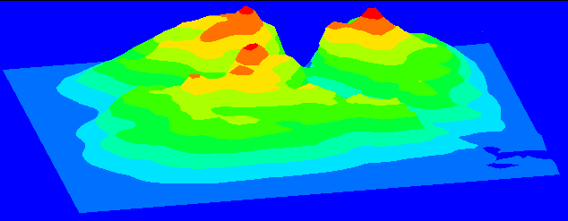
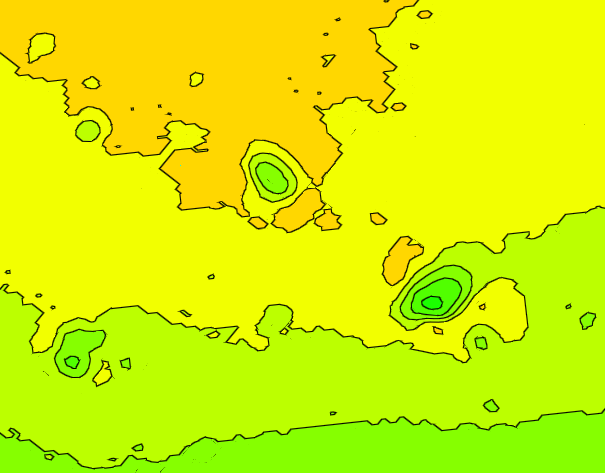
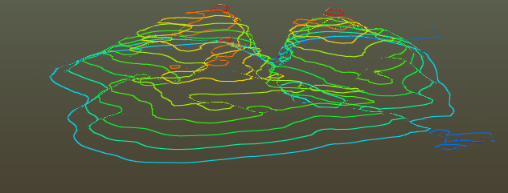
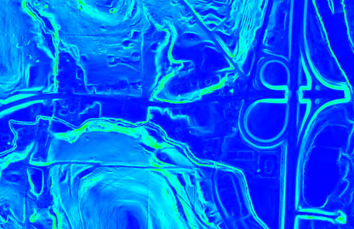
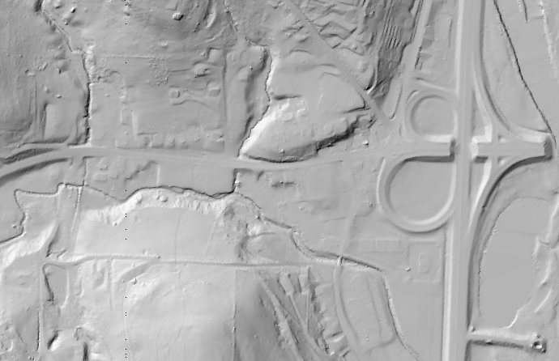

# 2.3.0 Change Notes

## Thematic display

### New gradient modes

Thematic display supports several new gradient mode values for the `mode` property of [ThematicGradientSettings]($common):

- `ThematicGradientMode.Stepped` applies a stepped color gradient to the scene.
- `ThematicGradientMode.SteppedWithDelimiter` applies a stepped color gradient to the scene with delimiters (lines between the color steps).
- `ThematicGradientMode.IsoLines` applies isolines to the scene to achieve an effect similar to a contour map.

Note: Gradient modes `ThematicGradientMode.SteppedWithDelimiter` and `ThematicGradientMode.IsoLines` cannot be used with thematic display mode values other than `ThematicDisplayMode.Height`.


<p align="center">Stepped thematic gradient mode applied to height</p>


<p align="center">Stepped-with-delimiter thematic gradient mode applied to height</p>


<p align="center">Isoline thematic gradient mode applied to height</p>

### New display modes

Thematic display supports several new display mode values for the `displayMode` property of [ThematicDisplay]($common):

- `ThematicDisplayMode.Slope` applies a color gradient to surface geometry based on the slope of the surface relative to a specified axis. The slope value is calculated based on the angle between the surface and the axis specified in the associated [ThematicDisplay]($common) object.
- `ThematicDisplayMode.HillShade` applies a color gradient to surface geometry based on the direction of a sun shining on the surface.
  - [ThematicDisplay]($common) has a new property named `sunDirection`, a 3d vector, which describes the solar direction used by this display mode.
  - If desired, in order to create a sun direction from azimuth and altitude values, a new API function is available: [calculateSolarDirectionFromAngles]($common). This function takes an azimuth and altitude as input and returns a solar direction vector.


<p align="center">Slope display mode applied relative to a Z axis with a range of 0 to 90 degrees and a blue-red color scheme</p>


<p align="center">Hillshade display mode applied with a monochrome color scheme</p>

## Hyper-modeling

The hyper-modeling [Extension]($frontend) has been replaced by the `hypermodeling-frontend` package to permit customization of its behavior.

- Use [HyperModeling.initialize]($hypermodeling) to initialize the package before using any of its APIs.
- Use [HyperModeling.startOrStop]($hypermodeling) to enable or disable hypermodeling for a [Viewport]($frontend).
- Use [HyperModelingConfig]($hypermodeling) to customize the package's behavior.

## Rendering styles

A [DisplayStyle]($backend) defines how the contents of a [ViewDefinition]($backend) are rendered. However, the display style contains some data that is specific to the containing iModel, or to the project to which the iModel belongs. It can be very useful to be able to define various "rendering styles" that can be applied to any display style in any iModel or project to change the lighting, thematic display settings, and other visual aspects of the view. To facilitate this, three new methods have been introduced:

- [DisplayStyleSettings.toOverrides]($common) to selectively capture a subset of the settings as a JSON object;
- [DisplayStyleSettings.applyOverrides]($common) to selectively override a subset of the display style settings; and
- [Viewport.overrideDisplayStyle]($frontend) to apply overrides to the viewport's display style and ensure the results become immediately visible.

A "rendering style" is simply a partial [DisplayStyle3dSettingsProps]($common). When applied to a [DisplayStyleSettings]($common), any settings explicitly defined by the rendering style will be overridden; the remainder will retain their original values.

Examples of some general-purpose rendering styles can be found in [display-test-app](https://github.com/imodeljs/imodeljs/blob/master/test-apps/display-test-app/src/frontend/ViewAttributes.ts).

## Multiple feature override providers

[Viewport]($frontend) now allows multiple [FeatureOverrideProvider]($frontend)s to be registered at any given time. Use [Viewport.addFeatureOverrideProvider]($frontend) to register a provider and [Viewport.dropFeatureOverrideProvider]($frontend) to unregister it. To query for a registered provider, use [Viewport.findFeatureOverrideProvider]($frontend) or [Viewport.findFeatureOverrideProviderOfType]($frontend).

When multiple providers are registered, no attempt is made to reconcile conflicts between two providers overriding the same [Feature]($common) - that is left to the application. Note that most [FeatureSymbology.Overrides]($frontend) methods like `overrideModel` take an optional `replaceExisting` argument indicating whether or not to replace an existing override for the same entity, so if you have two providers, one of which should never overwrite changes made by the other, that one should pass `false` for `replaceExisting` while the other one should pass `true` (the default).

This change necessitates the deprecation of [Viewport.featureOverrideProvider]($frontend), previously used to get or set the sole provider. This property will be removed in a future version. For now, the getter will return a provider if and only if exactly one provider is currently registered. The setter will remove all existing providers and, if a new provider is supplied, register it as the sole provider. We recommend migrating to the new APIs. You can do so as follows:

- Replace `viewport.featureOverrideProvider = myProvider` with `viewport.addFeatureOverrideProvider(myProvider)`.
- Replace `viewport.featureOverrideProvider = undefined` with `viewport.dropFeatureOverrideProvider(myProvider)`.
- Replace calls to the getter with a call to `findFeatureOverrideProvider` or `findFeatureOverrideProviderOfType`. For example:

```ts
  class MyProvider implements FeatureOverrideProvider {
    public id: string;
    public addFeatureOverrides(ovrs: FeatureSymbology.Overrides, vp: Viewport): void { /* ... */ }
  }

  // If you know that at most one provider of type MyProvider should be registered at any one time:
  let provider = viewport.findFeatureOverrideProviderOfType<MyProvider>(MyProvider);
  // Or, if you can identify your provider by some other means, like a property:
  provider = viewport.findFeatureOverrideProvider((x) => x instanceof MyProvider && x.id === "my provider");
```

## ECSql Enhancements

Added the following expressions and functions:

1. `<type> IS [NOT] (type-list)` - Filter parent type by subtype
    - [Lesson 9: Type Filter](../learning/ECSQLTutorial/TypeFilter.md)
1. `CASE-WHEN-THEN-ELSE` - Conditional expression
    - [Lesson 10: Conditional Expressions](../learning/ECSQLTutorial/ConditionalExpr.md)
1. `IIF()`  - Conditional expression
    - [Lesson 10: Conditional Expressions](../learning/ECSQLTutorial/ConditionalExpr.md)
1. `ec_classname()` - Get formatted class names for a ECClassId
    - [Lesson 11: Built-In functions](../learning/ECSQLTutorial/BuiltInFunctions.md)
1. `ec_classid())` - Get ECClassId from a  qualified classname.
    - [Lesson 11: Built-In functions](../learning/ECSQLTutorial/BuiltInFunctions.md)

## Schema upgrades

Domain schemas can now be upgraded when opening BriefcaseDb-s and StandaloneDb-s. See new [UpgradeOptions]($common) options that can be passed in to the [BriefcaseDb.open]($backend) call.
