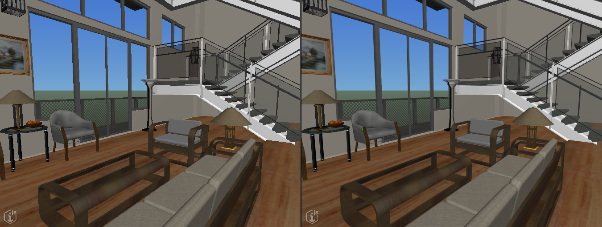

# 2.4.0 Change Notes

## Hypermodeling marker filtering

Some iModels contain thousands of [SectionDrawingLocation]($backend)s. When hypermodeling is used with such iModels, this may result in display of thousands of [SectionMarker]($hypermodeling)s. While markers located close together will automatically cluster, and [SectionMarkerConfig]($hypermodeling) supports filtering markers based on model, category, or section type, some applications may want to apply their own filtering logic. They can now do so by implementing [SectionMarkerHandler]($hypermodeling) to customize the visibility of the markers.

## Device pixel ratio

[Device pixel ratio](https://developer.mozilla.org/en-US/docs/Web/API/Window/devicePixelRatio) is the ratio of physical (screen) pixels to logical (CSS) pixels. For example, most mobile devices have a device pixel ratio of 2, causing UI controls to display at twice the size while still appearing sharp on the screen. Similarly, a desktop computer with a 4k monitor always has a 4k physical resolution, but the operating system may allow the UI to be arbitrarily scaled to the user's preferences. In such cases the number of logical pixels will not match the number of physical pixels.

Previously, when iModel.js computed the appropriate level of detail for tiles and decoration graphics, it exclusively used the logical resolution, ignoring device pixel ratio. On high-DPI devices this causes lower-resolution graphics to be displayed, resulting in a less detailed image.

Now, if [RenderSystem.Options.dpiAwareLOD]($frontend) is set to `true` when supplied to [IModelApp.startup]($frontend), level of detail computations will take device pixel ratio into account. This will result in a sharper image on high-DPI displays. However, it may also reduce display performance, especially on mobile devices, due to more tiles of higher resolution being displayed.

This option has no effect if [RenderSystem.Options.dpiAwareViewports]($frontend) is overridden to be `false`.

## Device pixel ratio override

If [RenderSystem.Options.devicePixelRatioOverride]($frontend) is defined when supplied to [IModelApp.startup]($frontend), its numeric value will be used as the device pixel ratio instead of the system's actual device pixel ratio. This can be helpful for situations like running in the iOS Simulator where forcing a lower resolution by setting a sub-1 device pixel ratio would increase performance.

Please note:

- If this setting is used to decrease the effective device pixel ratio, the view will appear pixelated.
- This setting should only be used to increase performance in situations like the iOS Simulator for testing purposes only. It should not be used in a production situation.

This option has no effect if [RenderSystem.Options.dpiAwareViewports]($frontend) is overridden to be `false`.

## Background Map Enhancements

Support for map imagery from WMS, WMTS, ArcGIS, AzureMaps, MapBox and file based tiled map servers is added in this version.  This imagery is seperated into base map, background layers and overlay layers.  The visibility and transparency of these layers can be individually controlled.  Map servers can either provide fixed, potentially cached tiles based on a predefined tiling scheme (WMTS, AzureMaps, MapBox) or produce images on demand (WMS, ArcGIS MapServer).  In general cached tile servers are more performant while the servers that produce images on demand are more flexible and may potentially include hierarchical sublayers that can be filtered seperately.

### BaseMap

The base map imagery can now be provided by any map imagery source or set to be a single color.  The transparency of the base map can be controlled seperately from the background map. [DisplayStyleState]($frontend) methods `changeBaseMapProps` and `changeBaseMapTransparency` are provided to control the baseMap display.   The `changeBackgroundMapProps` method continues to supports changing map properties that are not related to imagery. If `changeBackgroundMapProps` is used to change the legacy map imagery settings (`providerName` and `providerData.mapType`), the base map properties are set appropriately.  The  [DisplayStyleState]($frontend) `backgroundMapBase` property contains the base map imagery settings.

### Map Layers

Map Layers can be either **background** layers displayed on top of the base map but below all iModel geometry or **overlay** layers displayed on top of the iModel geometry.  The  [DisplayStyleState]($frontend) properties `backgroundMapLayers` and `overlayMapLayers` contain the background and overlay layers.  A set of  [DisplayStyleState]($frontend) methods, `attachMapLayer`, `detachMapLayerByIndex`, `changeMapLayerProps`, `changeMapSubLayerProps` etc are provided to manipulate these layers.

## Antialiasing

Antialiasing can now be turned on and off per view by setting [Viewport.antialiasSamples]($frontend) to the number of desired samples.  A value of 1 will turn off antialiasing, and a value > 1 will turn it on and attempt to use that many samples (restricted by the given hardware constraints).

[ViewManager.setAntialiasingAllViews]($frontend) can be used to set the antialiasing samples in all currnet views as well as all future views created.

Example: no antialiasing on left, and antialiasing with 8 samples on the right

Example: no antialiasing on left, and antialiasing with 4 samples on the right

