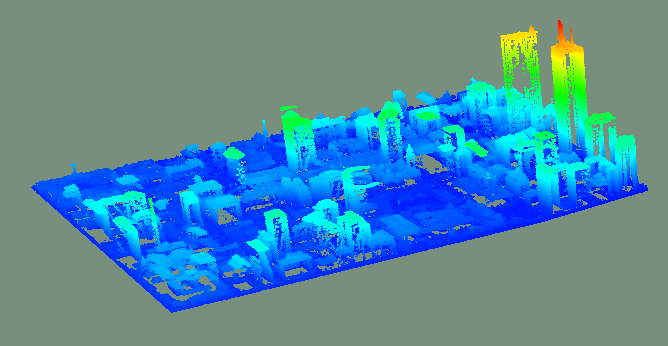
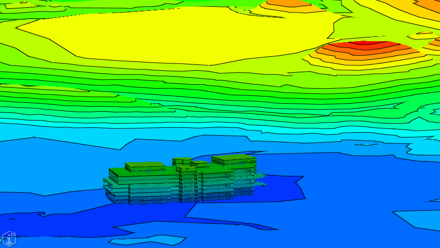

# 2.7.0 Change Notes

## Lighting for decoration graphics

Most types of decorations can receive lighting in 3d views (see [GraphicType]($frontend) for details about how lighting applies to each type). But lighting requires normals, and until now a [GraphicBuilder[($frontend) would never generate normals; therefore, decorations were always unlit.

Now, [GraphicBuilder.wantNormals]($frontend) can be used to indicate that normals should be generated. This property defaults to `false` to preserve the previous behavior. Meshes produced for any geometry added while the property is set to `true` will result in graphics with normals. For example:

```ts
// Create a GraphicBuilder for a "scene" graphic, which can be affected by the view's light settings.
const builder = decorateContext.createSceneGraphicBuilder();
// Add a shape (with normals) that will receive lighting as configured in the view.
builder.wantNormals = true;
builder.addShape(shapePoints);
// Add a planar region (without normals) that will not receive lighting.
builder.wantNormals = false;
builder.addLoop(loop);
```

Caveat: currently, no API exists for generating normals for a [Polyface]($geometry-core). So for now, if you want a lit polyface, you must both set `GraphicBuilder.wantNormals` **and** ensure the `Polyface` you supply to [GraphicBuilder.addPolyface]($frontend) has predefined normals. (If the `Polyface` has predefined normals but `GraphicBuilder.wantNormals` is `false`, the normals will be ignored). This behavior will change once an API for generating normals becomes available - then, the normals will be generated if the `Polyface` lacks them and `wantNormals` is `true`.

## Thematic display of point clouds and background terrain

Thematic display now supports point clouds and background terrain. If thematic display is enabled, point clouds and background terrain will be colorized using the corresponding thematic settings.

Note: Values of `ThematicDisplayMode.Slope` or `ThematicDisplayMode.HillShade` for the `displayMode` property of [ThematicDisplay]($common) do not affect point clouds or background terrain. If these thematic display modes are selected, they will be colorized normally without any of the thematic settings applied. In this case, surfaces in the scene will still be colorized using the thematic settings.


<p align="center">Thematic rendering applied to a point cloud</p>


<p align="center">Thematic rendering applied to background terrain</p>

## Presentation

### A new rule to override default property category

By default, all properties that don't have a defined category, fall under the default one, labeled "Selected Item(s)". In
some cases there is a need for that category to be labeled differently, and for that purpose there's now a new presentation
rule - `DefaultPropertyCategoryOverride`. Example:

```JSON
{
  "ruleType": "DefaultPropertyCategoryOverride",
  "specification": [{
    "id": "default",
    "label": "My Custom Default Property Category",
  }],
}
```

## ui-components

Add components [DatePickerPopupButton]($ui-components) and [DatePicker]($ui-components) for showing and selecting a date and optionally a time.

## ui-framework

Add support for [KeyinPalettePopup] component that opens using the Ctrl+F2 key combination. opening a popup that provides a list of key-ins supported by registered tools and allows a user to select and run a key-in. iModel.js applications must enable the use by enabling the feature flag as shown below.

```ts
IModelApp.uiAdmin.updateFeatureFlags({ allowKeyinPalette: true });
```

An application can also provide a tool button to popup the Key-in Popup using the newly provided item definition `CoreTools.keyinPaletteButtonItemDef`.

## Changes to frontend API to pull, merge and push change sets

The method to pull, merge and push change sets at the *frontend* has been split and moved to a new location. These frontend API continue to be work in progress, and are marked with the appropriate @alpha release tag. The corresponding backend API remains unchanged.

Before:

```ts
const changeSetId = await iModelConnection.editing.concurrencyControl.pullMergePush("", false /*=doPush*/);
```

After:

```ts
  await iModelConnection.pullAndMergeChanges();
  const changeSetId = iModelConnection.changeSetId;
```

Before:

```ts
  const changeSetId = await iModelConnection.editing.concurrencyControl.pullMergePush("Push message", true /*=doPush*/);
```

After:

```ts
  await iModelConnection.pushChanges("Push message");
  const changeSetId = iModelConnection.changeSetId;
```

The method to get the parent change set id from the IModelConnection has been removed. It's available as a property that's kept up to date as change sets are pulled/pushed:

Before:

```ts
  const changeSetId = await iModelConnection.editing.getParentChangeSetId();
```

After:

```ts
  const changeSetId =  iModelConnection.changeSetId;
```
