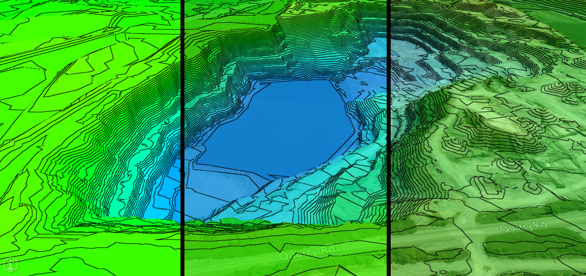
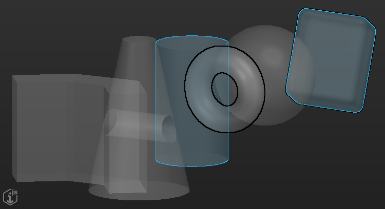

# 2.9.0 Change Notes

## ViewCreator APIs

Two new APIs for creating views:

1) [ViewCreator3d]($frontend): provides a convenient way to create a default view (ViewState3d) for any given iModel. This can then be passed into the Viewport to render all 3D models.

2) [ViewCreator2d]($frontend): does the same for any given 2D model (drawing or sheet).

Examples:

```ts
// ViewCreator3D
 const viewCreator = new ViewCreator3d(imodel);
 const defaultView = await viewCreator.createDefaultView({skyboxOn: true});
```

```ts
// ViewCreator2D
const viewCreator = new ViewCreator2d(imodel);
const models = await imodel.models.queryProps({ from: "BisCore.GeometricModel2d" });
if (models.length > 0)
  const view = await viewCreator.createViewForModel(models[0].id!, models[0].classFullName);
  ```

## Map Layers

Map layers such as BingMaps and MapBox require keys so that they may be accessed. These keys were previously hardcoded in multiple locations. These keys have been moved and added as default [MapLayerOptions]($frontend). Keys should now be passed through [IModelApp.startup]($frontend), as an IModelAppOption like:

```
IModelApp.startup({mapLayerOptions: {BingMaps: {key: "expected-key-name-for-key-value-pair", value: "access-token-goes-here"}}})
```

The default options will be used both when no options are passed or some option in default options exists that does not in the passed options.

**NOTE: These default options may be removed in a later version, so if you are relying on these, please keep that in mind.**

## Color mix property added to thematic gradient settings

Thematic display gradient properties now supports a colorMix value for mixing the color of background map terrain or point clouds in with the thematic gradient color.  The `colorMix` property of [ThematicGradientSettings]($common) is a value between 0.0 and 1.0, defaulting to 0.0, which determines the percentage of the original color to blend in with the thematic gradient color (so 0.0 will be only the thematic gradient color, and 1.0 will be only the original terrain map or point cloud color).


<p align="center">Thematic rendering of background map terrain with colorMix set to 0.0, 0.33, and 0.67</p>

## Presentation

### `hideNodesInHierarchy` and grouping

Behavior of `hideNodesInHierarchy` attribute was changed when used in combination with grouping.

Previously the attribute meant that all nodes produced by the specification it was used on would be hidden, including grouping nodes. That made the combination useless, because grouping had absolutely no effect when used with `hideNodesInHierarchy`.

Now, only the instance nodes are hidden, but their grouping nodes (if any) are displayed. This makes it possible to create hierarchies like the following:

**Schema:**

```xml
<ECEntityClass typeName="A" />
<ECEntityClass typeName="A1">
  <BaseClass>A</BaseClass>
</ECEntityClass>
<ECEntityClass typeName="A2">
  <BaseClass>A</BaseClass>
</ECEntityClass>
<ECEntityClass typeName="B" />
<ECRelationshipClass typeName="A_B" strength="referencing" modifier="None" description="">
    <Source multiplicity="(0..*)" roleLabel="contains" polymorphic="true">
        <Class class="A"/>
    </Source>
    <Target multiplicity="(0..*)" roleLabel="is contained by" polymorphic="true">
        <Class class="B" />
    </Target>
</ECRelationshipClass>
```

**Instances:**

```
Classes:                                  Relationship "A_B"
+-------+-------------+-------+           +-----------+-----------+
| Class | Instance ID | Label |           | Source ID | Target ID |
+-------+-------------+-------+           +-----------+-----------+
| A1    |           1 | One   |           |         1 |         3 |
| A2    |           2 | Two   |           |         2 |         3 |
| B     |           3 | Three |
```

**Presentation rules:**

```json
rules: [{
  "ruleType": "RootNodes",
  "specifications": [{
    "specType": "InstanceNodesOfSpecificClasses",
    "classes": { "schemaName": "MySchema", "classNames": ["A"] },
    "groupByClass": true,
    "groupByLabel": false,
    "hideNodesInHierarchy": true
  }]
}, {
  "ruleType": "ChildNodes",
  "condition": "ParentNode.ClassName = \"A\"",
  "specifications": [{
    "specType": "RelatedInstanceNodes",
    "relationshipPaths": [{
        "relationship": { "schemaName": "MySchema", "className": "A_B" },
        "direction": "Forward"
    }],
    "groupByClass": false,
    "groupByLabel": false
  }]
}, {
  "ruleType": "ChildNodes",
  "condition": "ParentNode.ClassName = \"B\"",
  "specifications": [{
    "specType": "RelatedInstanceNodes",
    "relationshipPaths": [{
        "relationship": { "schemaName": "MySchema", "className": "A_B" },
        "direction": "Backward"
    }],
    "groupByClass": false,
    "groupByLabel": false
  }]
}]
```

**Result:**

```
+ A1          (class "A" grouping node)
+-+ Three     (instance node of class "B", ECInstanceId = 3)
| +-+ One     (instance node of class "A", ECInstanceId = 1)
+ A2          (class "A" grouping node)
+-+ Three     (instance node of class "B", ECInstanceId = 3)
  +-+ Two     (instance node of class "A", ECInstanceId = 2)
```

### `ContentInstancesOfSpecificClasses` specification and properties of derived classes

When `handleInstancesPolymorphically` attribute is set to `true`, only properties from specified classes used to be retrieved. We added a new attribute `handlePropertiesPolymorphically`, which tells the rules engine to also collect properties from derived classes.

```json
{
  "specType": "ContentInstancesOfSpecificClasses",
  "classes": [
    {"schemaName": "BisCore", "classNames": ["PhysicalElement"] },
  ],
  "handleInstancesPolymorphically": true,
  "handlePropertiesPolymorphically": true
}
```

### Nodes' duplication when using `RelatedInstanceNodes` specification

Behavior of `RelatedInstanceNodes` specification when used with many-to-x relationships was changed.

Previously, when traversing from a parent node, that is based on multiple instances on the "many" side of the relationship where the other side of the relationship points to the same other instance, we would see duplication.

Now, in the situation described above, there will be no more duplication.

### Breaking changes

- In `@itwin/presentation-backend` changed `cacheDirectory?: string` property to `cacheConfig?: HierarchyCacheConfig` on `PresentationManagerProps` interface. This adds ability to control cache mode.
Fix:

  ```ts
  Presentation.initialize({
    cacheConfig: { mode: HierarchyCacheMode.Disk, directory: "cacheLocation" },
  });
  ```

  instead of:

  ```ts
  Presentation.initialize({
    cacheDirectory: "cacheLocation",
  });
  ```

## Hilite/Emphasis interaction modified

The visual interaction between hilited and emphasized geometry has been modified to look better.  Hilited geometry now always shows through emphasized geometry and visa versa.  Geometry which is both hilited and emphasized now shows the outline for both (provided they are of different widths).


<p align="center">Cylinder is hilited, Torus is emphasized, and Block is both hilited and emphasized.</p>

## Memory threshold for mobile devices

### The problem

On mobile devices, GPU memory is shared with system memory; furthermore, the amount of overall memory is limited compared to a desktop environment. If too much system memory is consumed during a period of time, a memory pressure event can be triggered by the mobile operating system to terminate the offending process.

Reality datasets, with their per-tile textures, can trigger this condition during certain view dynamics on iPad devices because of the unused tiles' consumption of GPU texture resources.

This is because unused tiles (and their GPU resources) only expire periodically - not quickly enough to avoid memory pressure on an iPad.

### How it is addressed

[TileAdmin]($frontend) now has a `mobileExpirationMemoryThreshold` property that contains a numeric value in bytes. When the total used memory in bytes of all tile trees exceeds this value, tiles belonging to those trees will be immediately considered eligible for disposal after disuse; effectively, tiles unused by any viewport will be discarded. This value only has an effect on mobile devices. This has a default value of 200MB.

To customize this setting, specify a value for the `mobileExpirationMemoryThreshold` property on [TileAdmin.Props]($frontend) when calling `create` on [TileAdmin]($frontend).

### Other changes

To avoid this forced pruning from occurring too frequently on mobile devices due to memory usage, preloading of reality tiles is now disabled for mobile devices.

The minimum tolerance ratio for reality tiles has been increased for mobile devices to make the rendering coarser, consuming less memory. This ratio can be customized for mobile devices using the `mobileRealityTileMinToleranceRatio` property on [TileAdmin]($frontend). This has a default value of 3.0. This is nominally the error on screen size of a reality tile. The minimum value of 1.0 will apply a direct 1:1 scale. A ratio higher than 1.0 will result in lower quality display as the reality tile refinement becomes more coarse. This value only has an effect on mobile devices. On non-mobile devices, this ratio will always internally be 1.0.

To customize this setting, specify a value for the `mobileRealityTileMinToleranceRatio` property on [TileAdmin.Props]($frontend) when calling `create` on [TileAdmin]($frontend).

## Pickable isolines for thematic surfaces

When using gradient mode [ThematicGradientMode.IsoLines]($common), thematically displayed surfaces will show pickable lines. Previously, trying to select an area in between the lines would count as selecting the underlying geometry. Now the empty space in between lines does not count.

## Optional Class Validation for get and tryGet APIs

The following methods now take an optional parameter that can be used to validate the class of the returned entity:

- [IModelDb.Elements.getElement]($backend)
- [IModelDb.Elements.tryGetElement]($backend)
- [IModelDb.Models.getModel]($backend)
- [IModelDb.Models.tryGetModel]($backend)
- [IModelDb.Models.getSubModel]($backend)
- [IModelDb.Models.tryGetSubModel]($backend)

Code that used to be written as:

```ts
// The call below will only throw an IModelError if the entity is not found
const element1 = iModelDb.elements.getElement<DefinitionElement>(elementId);

// The call below will only return undefined if the entity is not found
const element2 = iModelDb.elements.tryGetElement<DefinitionElement>(elementId);
```

can now optionally be written as:

```ts
// The call below will also throw an IModelError if the entity is not an instance of DefinitionElement
const element1 = iModelDb.elements.getElement<DefinitionElement>(elementId, DefinitionElement);

// The call below will also return undefined if the entity is not an instance of DefinitionElement
const element2 = iModelDb.elements.tryGetElement<DefinitionElement>(elementId, DefinitionElement);
```

If the returned type is certain (result of an ECSQL query, for example), then the extra parameter is not required. However, it is often convenient to have the same error handling for *not found* and *class type mismatch*.

## UI Framework breaking change

- The class `ToolUiManager` has been renamed to [ToolSettingsManager]($appui-react).
