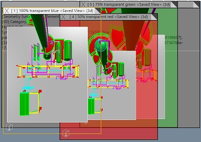

# 3.0.0 Change Notes

With most major releases comes many new features and some breaking API changes. Several breaking changes are the removal of previously deprecated APIs. In other cases, some APIs have changed in ways that may require calling code to be adjusted. This document describes these in detail to help you upgrade.

The first step in migrating to 3.0 is to try out the new [upgrade tool](#upgrade-guide) that makes it easy to react to all of the renames that took place during the 3.0 release.

The table of contents created below will make it easier to navigate through the various changes within the release. It provides a summary of the more complicated or extensive changes made and details on why the change has been made.

Table of Contents:

- [Upgrade guide](#update-guide)
- [New features](#new-features)
  - [Display System](#display-system)
  - [AppUi Framework](#new-appui-features)
  - [Presentation](#new-presentation-features)
  - [ECSql](#new-ecsql-features)
- [Breaking changes](#breaking-changes)
  - [Application Setup](#application-setup)
  - [Authorization](#authorization-re-work)
  - [iModel APIs](#imodels)
  - [Tool Framework](#tool-framework)
  - [Display System](#display-system-breaking-changes)
  - [Presentation](#presentation)
  - [AppUI](#appui)
  - [Utility Methods](#utility-methods)
  - [Buildology](#buildology)
  - [iModel Transformer](#transformation)
  - [Various Changes](#various-changes)
- [Dependency Update](#dependency-updates)
- [Exhaustive API Renames and Deprecation](#api-rename)

## Upgrade guide

To aid in the update from iModel.js 2.x, a [codemod tool](https://github.com/iTwin/codemods) using [JSCodeshift](https://github.com/facebook/jscodeshift) has been released which should serve as a starting point for updating your project to iTwin.js 3.0. This tool can automate some upgrade tasks like updating package names and replacing usage of deprecated or removed APIs with their replacement APIs. Please see the included [readme.md](https://github.com/iTwin/codemods#readme) for instructions on running the tool against your project.

## New features

Many of the enhancements introduced in iTwin.js 3.0 were directly motivated by feedback from users. If you have a new feature you'd like to see implemented, feel free to [let us know](https://github.com/iTwin/itwinjs-core/discussions)!

### Display system

#### Documentation

A collection of [learning articles](../learning/display/index.md) has been assembled to provide an overview of the features provided by the display system, illustrated by interactive samples.

#### Viewport.zoomToElements improvements

[Viewport.zoomToElements]($frontend) accepts any number of element Ids and fits the viewport to the union of their [Placement]($common)s. A handful of shortcomings of the previous implementation have been addressed:

- Previously, the element Ids were passed to [IModelConnection.Elements.getProps]($frontend), which returned **all** of the element's properties (potentially many megabytes of data), only to extract the [PlacementProps]($common) for each element and discard the rest. Now, it uses the new [IModelConnection.Elements.getPlacements]($frontend) function to query only the placements.
- Previously, if a mix of 2d and 3d elements were specified, the viewport would attempt to union their 2d and 3d placements, typically causing it to fit incorrectly because 2d elements reside in a different coordinate space than 3d elements. Now, the viewport ignores 2d elements if it is viewing a 3d view, and vice-versa.

#### Fresnel effect

[LightSettings]($common) has been enhanced to support a non-realistic Fresnel effect. As simply explained [here](https://www.dorian-iten.com/fresnel/), the effect causes surfaces to reflect more light based on the angle between the viewer's line of sight and the vector between the viewer and a given point on the surface. Use [FresnelSettings]($common) to configure this effect.

Especially when combined with ambient occlusion, this effect can produce non-realistic views suitable for plant models and architectural models.

Fresnel effect applied to an architectural model:


Fresnel effect applied to a plant model:


The following code applies a display style similar to those illustrated above to a [Viewport]($frontend):

```ts
  // Enable ambient occlusion.
  viewport.viewFlags = viewport.viewFlags.with("ambientOcclusion", true);

  // Configure the lighting.
  viewport.displayStyle.lightSettings = LightSettings.fromJSON({
    // A relatively bright ambient light is the only light source.
    ambient: {
      intensity: 0.55,
    },
    // Increase the brightness of surfaces that are closer to parallel with the viewer's line of sight.
    fresnel: {
      intensity: 0.8,
      invert: true,
    },
    // Disable directional lighting.
    solar: {
      intensity: 0,
    },
  });
```

#### Transparent viewport background

In some applications it is useful to be able to see HTML content underneath a [Viewport]($frontend). This can now be achieved by setting [DisplayStyleSettings.backgroundColor]($common) to a color with a transparency value greater than zero. HTML content behind the viewport will blend with the viewport's background color.

Three overlapping viewports with transparent background colors:



#### Wiremesh display

The graphics displayed by an iTwin.js [Viewport]($frontend) consist primarily of triangulated meshes. It can sometimes be useful to visualize the triangulation of these meshes. A new view flag - [ViewFlags.wiremesh]($common) - now enables wiremesh display. When wiremesh display is enabled, the edges of each triangle are overlaid on top of the mesh as anti-aliased black lines approximately 1 pixel wide.

To enable wiremesh display for a viewport:

```ts
  viewport.viewFlags = viewport.viewFlags.with("wiremesh", true);
```


#### Viewport synchronization

[TwoWayViewportSync]($frontend) establishes a connection between two [Viewport]($frontend)s such that any change to one viewport is reflected in the other. This includes not only [Frustum]($common) changes, but changes to the display style, category and model selectors, and so on. Synchronizing **everything** is not always desirable; and if the viewports are viewing two different [IModelConnection]($frontend)s it is not even meaningful, as category and model Ids from one iModel will not make sense in the context of the other iModel.

Now, `TwoWayViewportSync` is extensible, allowing subclasses to specify which aspects of the viewports should be synchronized by overriding [TwoWayViewportSync.connectViewports]($frontend) and [TwoWayViewportSync.syncViewports]($frontend). To establish a connection between two viewports using your subclass `MyViewportSync`, use `MyViewportSync.connect(viewport1, viewport2)`.

A new subclass [TwoWayViewportFrustumSync]($frontend) is supplied that synchronizes **only** the frusta of the viewports. The viewports will view the same volume of space, but may display different contents or apply different display styles. To establish this connection, use `TwoWayViewportFrustumSync.connect(viewport1, viewport2)`.

#### Environment decorations

A [DisplayStyle3dSettings]($common) can specify a [SkyBox]($common) and [GroundPlane]($common) to be drawn as environmental decorations. Previously, [DisplayStyle3dSettings.environment]($common) was a mutable JSON [EnvironmentProps]($common), while [DisplayStyle3dState.environment]($frontend) was a mutable [Environment]($common) object, formerly defined in the core-frontend package. This made the API quite awkward and led to bugs in synchronizing the [Viewport]($frontend)'s decorations with changes to the environment settings.

Now, [DisplayStyle3dSettings.environment]($common) is an immutable [Environment]($common) object consisting of a [GroundPlane]($common), [SkyBox]($common), and flags controlling the display of each. These changes require adjustment to existing code that toggles the display of either. For example:

```ts
// Replace this:
style.environment.sky.display = true;
style.environment.ground.display = false;
// With this:
style.environment = style.environment.withDisplay({ sky: true, ground: false });
```

Additionally, until now the images used by a [SkySphere]($common) or [SkyBox]($common) were required to be hosted by persistent [Texture]($backend) elements stored in the iModel. Now, they can also be specified as a URL resolving to an HTMLImageElement, allowing custom skyboxes to be created without modifying the iModel.

#### Merging appearance overrides

A [Viewport]($frontend) can have any number of [FeatureOverrideProvider]($frontend)s, each of which can specify how to override the appearances of elements, models, and/or subcategories. Sometimes, multiple providers want to override aspects of the appearance of the same objects, which produces conflicts. The existing methods for defining overrides - [FeatureOverrides.overrideElement]($common), [FeatureOverrides.overrideModel]($common), and [FeatureOverrides.overrideSubCategory]($common) - each take a boolean `replaceExisting` argument that defaults to `true`. This means that if one provider overrides the line width of an element and another wants to override the same element's transparency, the caller's only choice is to either replace the existing override, resulting in only transparency being overridden; or keep the existing override, resulting in only line width being overridden. But in most cases, the better result would be to **merge** the two sets of overrides such that both transparency and line width are overridden.

A new [FeatureOverrides.override]($common) method has been introduced to support merging appearance overrides. The caller can specify one of four strategies for dealing with conflicts, or accept the default:

- "replace": The existing appearance overrides are replaced by the caller's own overrides, equivalent to the default `replaceExisting=true` for methods like `overrideElement`;
- "skip": The existing appearance overrides are retained and the caller's own overrides are ignored, equivalent to `replaceExisting=false` for methods like `overrideElement`; or
- "extend": Merge the new appearance with the existing appearance such that any aspect of the appearance **not** overridden by the existing appearance can be overridden by the new appearance.
- "subsume" (the default): Merge the new appearance with the existing appearance such that any aspects of the appearance overridden by the existing appearance are preserved only if the new appearance does not also override them.

For example, if one provider overrides an element's color and transparency, and a second provider attempts to override its transparency and line width, using the "extend" option means the second provider will only override the line width, leaving the existing color and transparency overrides intact. Using the "subsume" option, the second provider will override the transparency and line width, leaving the existing color override intact.

Because the previous default behavior is generally not desirable, `overrideElement`, `overrideModel`, and `overrideSubCategory` have been deprecated in favor of the new `override` method. Existing code can be updated as follows:

```ts
// To use the new default "extend" behavior, replace these:
ovrs.overrideElement("0x123", appearance);
ovrs.overrideModel("0x456", appearance);
ovrs.overrideSubCategory("0x789", appearance);
// With these:
ovrs.override({ elementId: "0x123", appearance });
ovrs.override({ modelId: "0x456", appearance });
ovrs.override({ subCategoryId: " 0x789", appearance });

// To use the previous default "replace" behavior, replace this:
ovrs.overrideElement("0x123", appearance, true); // third argument is optional - defaults to true
// With this:
ovrs.override({ elementId: "0x123", appearance, onConflict: "replace" });

// To use the `replaceExisting=false` behavior, replace this:
ovrs.overrideModel("0x456", appearance, false);
// With this:
ovrs.override({ modelId: "0x456", appearance, onConflict: "skip" });
```

#### Improve/enhance particle systems

Improvements were made to the performance of [ParticleCollectionBuilder]($frontend) and an optional rotationMatrix was added to [ParticleProps]($frontend) so that particles can be rotated.

#### New clustering algorithm for MarkerSet

 The [MarkerSet]($frontend) class now clusters markers by the screen distance between their positions rather than overlap of their rectangles, so the `Cluster.rect` property is no longer needed and has been removed. Instead, there is a new member [MarkerSet.clusterRadius]($frontend) that controls when nearby Markers are clustered.

#### Support for glTF graphics

[glTF](https://www.khronos.org/gltf/) has become the de facto standard format for 3d graphics on the web. Now you can create a [RenderGraphic]($frontend) from a glTF asset for use with [Decorators](../learning/frontend/ViewDecorations), using [readGltfGraphics]($frontend). [This example](../learning/frontend/ViewDecorations#gltf-decorations) demonstrates how to convert a glTF asset into a graphic and display it using a decorator.

Note: `readGltfGraphics` targets the [glTF 2.0 specification](https://www.khronos.org/registry/glTF/specs/2.0/glTF-2.0.html), but implementation of the full specification is an ongoing work in progress. The current implementation can successfully read many glTF assets, but if a particular asset fails to load or display properly, please [file an issue](https://github.com/iTwin/itwinjs-core/issues).

#### Replacement for Viewport.readImage

[Viewport.readImage]($frontend) suffers from a cumbersome API and several bugs. In particular, if it is asked to read a sub-region of the image it will calculate the y values incorrectly; and it produces an upside-down image by default. It has been deprecated in favor of [Viewport.readImageBuffer]($frontend). Callers of `readImage` can be upgraded as follows:

```ts
  // Use default arguments for readImage.
  viewport.readImage(); // old - upside-down by default!
  viewport.readImageBuffer({ upsideDown: true }); // new

  // Read the entire image right-side-up - the typical case:
  viewport.readImage(undefined, undefined, false); // old - must explicitly request right-side-up!
  viewport.readImageBuffer(); // new

  // Read a sub-rect of the image
  viewport.readImage(rect); // old - produces incorrect results!
  viewport.readImageBuffer({ rect }); // new

  // Resize the image
  viewport.readImage(undefined, size); // old
  viewport.readImageBuffer({ size });
```

### New presentation features

#### Presentation rule additions

##### Schema requirements

A new `requiredSchemas` attribute has been added: [Ruleset.requiredSchemas]($presentation-common) and [RuleBase.requiredSchemas]($presentation-common). The attribute allows an easy way to filter presentation rules based on
ECSchemas / domains available in the iModel. See more details in the [Required schema specification](../presentation/RequiredSchemaSpecification) reference documentation page.

##### Conditional root node rules

Similar to [Child Node Rule](../presentation/Hierarchies/ChildNodeRule), the [Root Node Rule](../presentation/Hierarchies/RootNodeRule) now also has a [condition](../presentation/Hierarchies/RootNodeRule#attribute-condition) attribute. The attribute provides more flexibility in enabling or disabling the rule, including the use of [ruleset variables](../presentation/Advanced/RulesetVariables#using-variables-in-rule-condition).

##### More precise way to set class polymorphism

Previously polymorphism was specified at specification level using [ContentInstancesOfSpecificClassesSpecification.handleInstancesPolymorphically]($presentation-common) and [InstanceNodesOfSpecificClassesSpecification.arePolymorphic]($presentation-common) attributes. They're now deprecated in favor of the new [MultiSchemaClassesSpecification.arePolymorphic]($presentation-common) attribute and act as default values if the new attribute is not specified.

The change allows [ContentInstancesOfSpecificClassesSpecification]($presentation-common) and [InstanceNodesOfSpecificClassesSpecification]($presentation-common) specify multiple classes with different polymorphism values, if necessary.

##### Excluding classes

A new `excludedClasses` attribute has been added: [ContentInstancesOfSpecificClassesSpecification.excludedClasses]($presentation-common) and [InstanceNodesOfSpecificClassesSpecification.excludedClasses]($presentation-common).
The attribute provides an easy way to omit instances of specific classes from the result set. This was previously possible only through the `instanceFilter` attribute, but the new approach is much cleaner.

#### API additions

##### Content instance keys

A new [PresentationManager.getContentInstanceKeys]($presentation-frontend) has been added to allow getting keys of content instances much more effectively compared to getting content with all the properties and having to parse them from there, in cases when only keys are required.

##### Content sources

A new `getContentSources` API has been added to `PresentationManager`:

- On the backend: [PresentationManager.getContentSources]($presentation-backend)
- On the frontend: [PresentationManager.getContentSources]($presentation-frontend)

The API allows finding out what classes are used to get properties for specific class of elements based on default presentation rules. The default presentation rules set are set up to include properties
of various related classes when requesting content for specific types of elements. For example:

- Include properties of `bis.ElementUniqueAspect` and `bis.ElementMultiAspect` when creating content for any `bis.Element`.
- Include properties of `bis.PhysicalType` when creating content for `bis.PhysicalElement`.
- ...and much more.

That information may be useful when building ECSQL queries or anywhere else where there's a need to know the sources of element properties.

##### Getting properties of multiple elements at once

A new [PresentationManager.getElementProperties]($presentation-backend) override has been added for requesting element properties based on given element classes. Compared to [PresentationManager.getContent]($presentation-backend)
that was already available and is more flexible, the new API is designed to retrieve the properties in a simplified and more efficient way, especially when requesting properties for large numbers of elements.

#### Auto-update

A number of improvements have been made to support hierarchy and content components' automatic updates when either of these events happen:

- Data in iModel changes (only in [IpcApp]($frontend)).
- Presentation ruleset is modified.
- Ruleset variable values for the ruleset are changed.

To enable the feature, an additional attribute has to be set when setting up presentation-rules-driven components:

- When creating a node loader for [ControlledTree]($components-react) using the [usePresentationTreeNodeLoader]($presentation-components) hook, pass `enableHierarchyAutoUpdate: true` prop and resulting `onItemsRendered` callback to `ControlledTree`:

  ```tsx
  const { nodeLoader, onItemsRendered } = usePresentationTreeNodeLoader({ ...otherLoaderProps, enableHierarchyAutoUpdate: true });
  return <ControlledTree {...otherTreeProps} nodeLoader={nodeLoader} onItemsRendered={onItemsRendered} />;
  ```

- When creating [PresentationPropertyDataProvider]($presentation-components), pass `enableContentAutoUpdate: true` as a prop.

- When creating `PresentationTableDataProvider`, pass `enableContentAutoUpdate: true` as a prop.

In addition, to enable iModels' change tracking, IPC backends should initialize [Presentation]($presentation-backend) with the following attributes:

```ts
Presentation.initialize({
  ...otherProps,

  // tell presentation system that data in iModels might change
  mode: PresentationManagerMode.ReadWrite,

  // tell presentation system how often (in milliseconds) it should poll for changes
  updatesPollInterval: 20,
});
```

### New AppUi features

#### UiItemsProvider enhancements

UiItemsProviders will now filter out duplicate UiItems to ensure that only one of a particular item (e.g., Widget or Tool) will be added to a given stage. If you want the Select Tool is available in a stage, for example, you can include it in the Content Tools returned by your UiItemsProvider without checking to see if it's already in the stage you're augmenting.
Until this release, the applicationData specified in the frontstage was obscured once the stage was instantiated. Now, the UiItemsProvider will pass that info along to to each of the provide*() callbacks for the UiItemsProvider to use if needed.

#### Window resize enhancements

A new ResizeObserver was has been implemented that supports both the main window and any pop-out windows.

#### New options for defining Frontstages

| Class/Component                                 | Description                                                                                      |
| ----------------------------------------------- | ------------------------------------------------------------------------------------------------ |
| [StandardFrontstageProvider]($appui-react)      | Frontstage provider that provides an 'empty' stage that is to be populated via UiItemsProviders. |
| [StandardContentToolsProvider]($appui-react)    | UiItemsProvider that will add common tool entries to Tool Widget.                                |
| [StandardNavigationToolsProvider]($appui-react) | UiItemsProvider that will add common view tool entries to Navigation Widget.                     |
| [StandardStatusbarItemsProvider]($appui-react)  | UiItemsProvider that will add common statusbar items.                                            |
| [ContentToolWidgetComposer]($appui-react)       | Provides an empty Tool Widget that is to be populate via UiItemsProviders.                       |
| [ViewToolWidgetComposer]($appui-react)          | Provides an empty Navigation Widget that is to be populate via UiItemsProviders.                 |
| [StandardContentLayouts]($appui-abstract)       | Provides standard view layouts that can be used when defining a ContentGroup.                    |
| [ContentGroupProvider]($appui-react)            | Class that generates a ContentGroup at runtime when the frontstageDef is being constructed.      |

#### New timeline date marker

The [TimelineComponent]($imodel-components-react) react component now accepts a property to mark a specific date in a date-based timeline. If the timeline has a defined start date and end date, a date between them can be marked in the timeline by specifying an instance of [TimelineDateMarkerProps]($imodel-components-react) in the new markDate member of [TimelineComponentProps]($imodel-components-react). If the date member is left undefined, today's date will be used. The default marker is a short vertical bar, but a ReactNode can be specified in the dateMarker prop to customize the marker's appearance.

#### New Floating widget capabilities

Widgets provided via UiItemsProviders may now set `defaultState: WidgetState.Floating` and `isFloatingStateSupported: true` to open
the widget in a floating container. The property `defaultFloatingPosition` may also be specified to define the position of the floating container. If a position is not defined the container will be centered in the `AppUi` area.

The method `getFloatingWidgetContainerIds()` has been added to FrontstageDef to retrieve the Ids for all floating widget containers for the active frontstage as specified by the `frontstageDef`. These ids can be used to query the size of the floating container via `frontstageDef.getFloatingWidgetContainerBounds`. The method `frontstageDef.setFloatingWidgetContainerBounds` can then be used to set the size and position of a floating widget container.

#### New API to enable and disable view overlays

UiFramework now offers a `setViewOverlayDisplay(display:boolean)` method to enable or disable viewports displaying overlays. By default, the display is enabled. The current setting is available in `UiFramework.viewOverlayDisplay`.

### New ECSql features

#### Id64Set parameter bindings

It is now possible to efficiently bind a large set of ECInstanceIds to a query parameter. This can be very useful for `IN` clauses. For example, imagine you wanted to select some properties of all of the [SpatialModel]($backend)s belonging to a [ModelSelector]($backend). Previously you would need to write something like this:

```ts
  const ids = Array.from(modelSelector.models).join(",");
  db.query("SELECT IsPlanProjection, JsonProperties FROM bis.SpatialModel WHERE ECInstanceId IN (" + ids + ")");
```

The list of comma-separated Ids could be extremely long - in some cases, it might be so long that it would need to be split up into multiple queries!

Now, you can bind a set of Ids as a parameter for the `IN` clause. The Ids will be serialized in a compact string format.

```ts
  const params = new QueryBinder().bindIdSet("modelIds", modelSelector.models);
  db.query("SELECT IsPlanProjection, JsonProperties FROM bis.SpatialModel WHERE InVirtualSet(:modelIds, ECInstanceId)", params);
```

## Breaking Changes

### Application setup

A handful of changes have been made to simplify the process of setting up an application on both the backend and frontend side.

#### Removed default API keys

Previous versions of `@itwin/core-frontend` included API keys for Bing Maps, MapBox Imagery, and Cesium ION that would be used for _all_ iTwin.js applications. These common keys are no longer supported and will soon be disabled. All applications will now need to provide their own keys.

A valid [MapBox](https://www.mapbox.com/) key is required for display of map imagery in views with [BackgroundMapProvider.name]($common) set to "MapBoxProvider".

A valid [Bing Maps](https://www.bing.com/maps) key is required for:

- Display of map imagery in views with [BackgroundMapProvider.name]($common) set to "BingProvider".
- Location services supplied by [BingLocationProvider]($frontend), along with tools that use these services like [ViewGlobeLocationTool]($frontend).
- Elevation services supplied by [BingElevationProvider]($frontend), including accurate 3d terrain display.

A valid [Cesium ION](https://cesium.com/platform/cesium-ion/) key is required for:

- Display of 3d terrain in views with [TerrainSettings.providerName]($common) set to "CesiumWorldTerrain".
- Display of OpenStreetMap buildings.

[IModelAppOptions.mapLayerOptions]($frontend) can be used to configure keys for Bing Maps, MapBox, and/or any other map layer providers. [TileAdmin.Props.cesiumIonKey]($frontend) can be used to configure the Cesium ION key. For example, the following configures the Bing Maps and Cesium ION keys at startup:

```ts
const appOptions: IModelAppOptions = {
  mapLayerOptions: {
    BingMaps: {
      key: "some key",
      value: "key",
    },
  },
  tileAdmin: {
    cesiumIonKey: "key",
  },
};

await IModelApp.startup(appOptions);
```

#### Deprecation of the settings on iModelApp

The previous `IModelApp.settings` API has been removed in favor of [IModelApp.userPreferences]($frontend). The updated API will provide a clear distinction between the "settings" within the control of the user (user preferences) and which are within control of the admin of an iModel/iTwin (Workspaces). The separation is intended to make it clear who is capable of modifying and overriding a given setting while making the API easier to use.

The new [UserPreferencesAccess]($frontend) interface is a simple, easy-to-use API that can be implemented in many different ways. The `core-frontend` package does not dictate an implementation and could easily be setup using Local Storage (via [Storage APIs](https://developer.mozilla.org/en-US/docs/Web/API/Storage)) or by a cloud-hosted storage mechanism to share across user sessions.

#### Localization initialization

In previous versions, localization was provided via the I18N class. iTwin.js has been updated to instead use the [Localization]($common) interface. The initialization of [IModelApp]($frontend) now takes an optional object that implements [Localization]($common). The [ITwinLocalization]($i18n) class supplies the default implementation, and may be customized with [LocalizationOptions]($i18n) in the constructor and supplied via [IModelAppOptions.localization]($frontend).

The previous way to provide localization options:

```ts
const i18nOptions: I18NOptions = {
  urlTemplate: `${window.location.origin}/locales/{{lng}}/{{ns}}.json`
};

await IModelApp.startup({ i18n: i18nOptions });
```

Now becomes:

```ts
const localizationOptions: LocalizationOptions = {
  urlTemplate: `${window.location.origin}/locales/{{lng}}/{{ns}}.json`
};

await IModelApp.startup({ localization: new ITwinLocalization(localizationOptions) });
```

#### Simplification of CloudStorageService setup in iModelHost

`IModelHostConfiguration.tileCacheCredentials` is changed to [IModelHostConfiguration.tileCacheAzureCredentials]($backend) and used for setting Azure cloud storage for tile cache.
`IModelHost.tileCacheService` is moved to `IModelHostConfiguration.tileCacheService` and is used to supply a different implementation for any service provider by setting this property with a custom `CloudStorageService`.
If both `tileCacheAzureCredentials` and `tileCacheService` omitted - local cache will be used, if both set - error will be thrown.

To use Azure cloud storage for tile cache set [IModelHostConfiguration.tileCacheAzureCredentials]($backend) property:

```ts
  const config = new IModelHostConfiguration();
  // Replace this:
  config.tileCacheCredentials = {
    service: "azure",
    account: "account",
    accessKey: "accessKey",
  };
  // With this:
  config.tileCacheAzureCredentials = {
    account: "account",
    accessKey: "accessKey",
  };
```

To use AliCloud storage set `IModelHostConfiguration.tileCacheService` property with provided `AliCloudStorageService` implementation:

```ts
  import { AliCloudStorageService } from "@itwin/core-backend";

  const config = new IModelHostConfiguration();
  // Replace this:
  config.tileCacheCredentials = {
    service: "alicloud",
    account: "account",
    accessKey: "accessKey",
  };
  // With this:
  config.tileCacheService = new AliCloudStorageService({
    region: "region",
    accessKeyId: "accessKeyId",
    accessKeySecret: "accessKeySecret",
  });
```

To use any other external storage set `IModelHostConfiguration.tileCacheService` with a custom `CloudStorageService` implementation:

```ts
  const config = new IModelHostConfiguration();
  // Replace this:
  config.tileCacheCredentials = {
    service: "external",
    account: "",
    accessKey: "",
  };
  IModelHost.tileCacheService = new CustomCloudStorageService();
  // With this:
  config.tileCacheService = new CustomCloudStorageService();
```

#### @bentley/config-loader

The loader has been deprecated due to a preference for using the dotenv package instead. Any workflows using `.env` files will not be affected.

### Authorization re-work

The release contains quite a few changes to authorization to make iTwin.js more flexible for different non-Bentley Identity Providers and removing the enforcement of OAuth2.0 in the core library. In order to make this change, a set of changes were made; the format of the token used, refactored how an access token is passed through the code and remove the default clients that made it challenging to use different authentication workflows.

#### AccessToken refactor

The previous `AccessToken` class has been completely removed in favor of a simple [AccessToken]($core-bentley) string type. The core packages no longer interpret the token and only pass it around directly to the functions that need it using [TokenArg]($core-backend).

#### ClientRequestContext and AuthorizedClientRequestContext have been removed

The classes `ClientRequestContext` and `AuthorizedClientRequestContext` existed to identify RPC requests between a web frontend and a cloud backend. They have been removed. Most places that previously used an `AuthorizedClientRequestContext` should now be replaced with [AccessToken]($core-bentley).

If you have code that has something like this:

```ts
requestContext.enter();
```

you can simply delete it.

This change mostly affects backend code. For backend [RPC](../learning/RpcInterface.md) implementations, all _unhandled_ exceptions will automatically be logged along the appropriate RPC metadata. For this reason, it often preferable to throw an exception rather than logging an error and returning a status in code that may or may not be called from RPC.

#### Authorization Clients

The class hierarchy of `AuthorizationClient`s has been simplified in the core packages and the only contract of any authorization client is the [AuthorizationClient]($core-common) interface.

### iModels

#### Continued transition to `ChangesetIndex`

Every Changeset has both an Id (a string hash of its content and parent changeset) and an Index (a small integer representing its relative position on the iModel's timeline). Either value can be used to uniquely identify a changeset. However, it is often necessary to compare two changeset identifiers to determine relative order, or to supply a range of changesets of interest. In this case, Id is not useful and must be converted to an index via a round-trip to an iModelHub server. Unfortunately, much of the iTwin.js API uses only [ChangesetId]($common) to identify a changeset. That was unfortunate, since [ChangesetIndex]($common) is frequently needed and `ChangesetId` is rarely useful. For this reason we are migrating the API to prefer `ChangesetIndex` over several releases.

In version 2.19, we introduced the type [ChangesetIdWithIndex]($common) to begin that migration. However, for 2.x compatibility we could not use it several places where it would have been helpful:

- [IModelRpcOpenProps]($common)
- [CheckpointProps]($backend)
- [LocalBriefcaseProps]($common)

Each of these interfaces originally had only a member `changeSetId: string`, In 2.19, for backwards compatibility, a new member `changeSetIndex?: number` was added. In V3 those two members are now replaced with a single member `changeset: ChangesetIdWithIndex`. Note that this is a breaking change, and you may have to adjust your code. To get the changeset Id, use `changeset.id`. To get the changeset Index, use `changeset.index` (may be undefined). In V4, this will become `changeset: ChangesetIndexAndId` and index will be required.

> Note: "Changeset" is one word. Apis should not use a capital "S" when referring to them.

#### Concurrency control

The previous implementation of `ConcurrencyControl` for locking elements has been replaced with the [LockControl]($backend) interface.

`ConcurrencyControl` relied on detecting a list of changed elements and deferring the acquisition of locks until the application called the asynchronous `request` method to acquire locks, after the fact, but before calling [BriefcaseDb.saveChanges]($backend). The new approach is to require applications to call the asynchronous method [LockControl.acquireLocks]($backend) to get an exclusive lock on elements before update or delete, and shared locks on parents and models before insert. If an attempt is made to modify or insert without the required locks, an exception is thrown when the change is attempted. This will require tools to make the necessary lock calls.

Previously the concurrency "mode" was determined by applications when opening a briefcase. It is now established as a property of an iModel when it is first created (and "version0" is uploaded.) By default, iModels use pessimistic (i.e. locks) mode, so all previously created iModels will require locks. If you pass `noLocks: true` as an argument to [BackendHubAccess.createNewIModel](https://github.com/iTwin/imodels-clients/blob/52206238a863cb3ddad9e9abdec5700f8bf7ede6/itwin-platform-access/imodels-access-backend/src/BackendIModelsAccess.ts#L391), a briefcase-local value is saved in rev0.bim before it is uploaded. Thereafter, all briefcases of that iModel will use use optimistic (i.e. no locks, change merging) mode, since everyone will use briefcases derived from rev0.bim. The value is inspected in the `BriefcaseDb.useLockServer` method called by [BriefcaseDb.open]($backend).

Locks apply to Elements only. The "schema lock" is acquired by exclusively locking element id 0x1 (the root subject id). Models are locked via their modeled element (which has the same id as the model)

See the [ConcurrencyControl](../learning/backend/ConcurrencyControl.md) learning article for more information and examples.

#### BriefcaseManager, BriefcaseDb, and IModelDb changes

The signatures to several methods in [BriefcaseManager]($backend) and [BriefcaseDb]($backend) have been changed to make optional the previously required argument called `requestContext`. That argument was poorly named, but used only to supply a "user access token". Since anywhere briefcases are relevant, an authenticated user access token is available via the static method `IModelHost.getAccessToken`, this argument is rarely needed. The only case where a caller needs to supply that argument is for tests that wish to simulate multiple users via a single backend (which is not permitted outside of tests.) It is now optional and called `user`.

| Method                                   | New arguments                                         | notes                            |
| ---------------------------------------- | ----------------------------------------------------- | -------------------------------- |
| `BriefcaseDb.onOpen`                     | [OpenBriefcaseArgs]($backend)                         | event signature change           |
| `BriefcaseDb.onOpened`                   | [BriefcaseDb]($backend),[OpenBriefcaseArgs]($backend) | event signature change           |
| `BriefcaseDb.open`                       | [OpenBriefcaseArgs]($backend)                         |                                  |
| `BriefcaseDb.pullChanges`                | [PullChangesArgs]($backend)                           | was called `pullAndMergeChanges` |
| `BriefcaseDb.pushChanges`                | [PushChangesArgs]($backend)                           |                                  |
| `BriefcaseDb.upgradeSchemas`             | [OpenBriefcaseArgs]($backend)                         | `requestContext` removed         |
| `BriefcaseManager.acquireNewBriefcaseId` | [IModelIdArg]($backend)                               |                                  |
| `BriefcaseManager.downloadBriefcase`     | [RequestNewBriefcaseArg]($backend)                    |                                  |
| `IModelDb.importSchemas`                 | `LocalFileName[]`                                     | `requestContext` removed         |

#### Changed return types

The backend methods [IModelDb.saveFileProperty]($backend) and [IModelDb.deleteFileProperty]($backend) used to return a [DbResult]($core-bentley). They now are `void`, and throw an exception if an error occurred. The error value can be retrieved in the `errorNumber` member of the exception object, if desired.

#### Signature change to backend Geocoordinate methods

The two methods [IModelDb.getIModelCoordinatesFromGeoCoordinates]($backend) and [IModelDb.getGeoCoordinatesFromIModelCoordinates]($backend) used to take a string argument that was a stringified [IModelCoordinatesRequestProps]($common) and [GeoCoordinatesRequestProps]($common) respectively. Those arguments were changed to accept the interfaces directly. You should remove `JSON.stringify` from your code if you get compile errors.

#### Coordinate conversion between iModel GeographicCRS and any other GeographicCRS

Coordinate conversions is now possible between the iModel Geographic Coordinate Reference System and any other Geographic Coordinate Reference System.
Prior to this version, coordinate conversions were limited to those between the iModel Geographic Coordinate Reference System and latitude/longitude of a specified datum, usually WGS84.

To use, in the backend create either a [IModelCoordinatesRequestProps]($common) or a [GeoCoordinatesRequestProps]($common) depending on the direction coordinates are to be converted. Set the [IModelCoordinatesRequestProps.source]($common) or the [GeoCoordinatesRequestProps.target]($common) property to a string containing either the name of a datum (typically WGS84) or an empty string to specify the iModel Geographic CRS native datum or a stringified version of a [GeographicCRSProps]($common) containing the definition of the source or target of the coordinate conversion. The request can be added coordinates to be converted and fed in methods iModel.getGeoCoordinatesFromIModelCoordinates or iModel.getIModelCoordinatesFromGeoCoordinates.

Specification of the GeographicCRS can be complete or incomplete. Although fully-defined custom Geographic CRS are supported, most of the time simply specifying the id or the epsg code of the GeographicCRS is sufficient.

Here are examples of typical GeographicCRS:

```ts
{ horizontalCRS: { id: "CA83-II" }, verticalCRS: { id: "NAVD88" } }
```

or

```ts
{ horizontalCRS: { epsg: 26942 }, verticalCRS: { id: "NAVD88" } },
```

These identifiers refer to either the key-name of a Geographic CRS in the list of the dictionary or a known EPSG code.

More complex Geographic CRS can also be used such as the following user-defined:

```ts
      {
        horizontalCRS: {
          id: "UserDef-On-NAD83/2011",
          description: "User Defined",
          datumId: "NAD83/2011",
          unit: "Meter",
          projection: {
            method: "TransverseMercator",
            centralMeridian: -1.5,
            latitudeOfOrigin: 52.30,
            scaleFactor: 1.0,
            falseEasting: 198873.0046,
            falseNorthing: 375064.3871,
          },
        },
        verticalCRS: {
          id: "GEOID",
        },
      }
```

On the frontend the [GeoConverter]($frontend) class has been modified to accept either a string containing the datum or a [GeographicCRSProps]($common) of a similar format retaining cache capability as before for either format.

**NOTE**: The [IModelCoordinatesRequestProps.source]($common) and the [GeoCoordinatesRequestProps.target]($common) were renamed from previous version that used the sourceDatum and targetDatum properties.

### Utility methods

#### BentleyError constructor no longer logs

In V2, the constructor of the base exception class [BentleyError]($core-bentley) accepted 5 arguments, the last 3 being optional. Arguments 3 and 4 were for logging the exception in the constructor itself. That is a bad idea, since exceptions are often handled and recovered in `catch` statements, so there is no actual "problem" to report. In that case the message in the log is either misleading or just plain wrong. Also, code in `catch` statements always has more "context" about _why_ the error may have happened than the lower level code that threw (e.g. "invalid Id" vs. "invalid MyHashClass Id") so log messages from callers can be more helpful than from callees. Since every thrown exception must be caught _somewhere_, logging should be done when exceptions are caught, not when they're thrown.

The [BentleyError]($core-bentley) constructor now accepts 3 arguments, the last argument (`metaData`) is optional. The previous `log` and `category` arguments were removed. If your code passed 5 arguments, remove the 3rd and 4th. If you previously passed 3 or 4 arguments, just leave the first two. Also, the previous version of the constructor required the metaData argument to be a function that returns an object. It may now also just be an object.

#### Logger functions

The optional `metaData` argument for the [Logger]($core-bentley) functions was previously a function returning an object or undefined. That was to permit cases where it may be expensive to create the metadata to be elided when logging is turned off. However, there are many cases where the metaData object is directly available, so creating a function to return it created overhead whether or not logging is enabled. It may now also be just an object so you don't have to make a function.

#### Moved utility types

The [AsyncFunction]($core-bentley), [AsyncMethodsOf]($core-bentley), and [PromiseReturnType]($core-bentley) types have moved to the @itwin/core-bentley package. The ones in @itwin/core-frontend have been deprecated.

### Tool framework

#### `Tool.run` and `Tool.parseAndRun` are now async

In V2.0, the methods [Tool.run]($frontend) and [Tool.parseAndRun]($frontend) were synchronous. This was problematic in that it was impossible to invoke a tool and await its completion. Those two methods are now both `async` and return `Promise<boolean>`. This is obviously a breaking change. Any Tool subclasses that override those methods will need to become async, and any code that calls `Tool.run` or `Tool.parseAndRun` will need to appropriately handle the returned Promise (usually by awaiting it.)

In the process of converting `Tool.run` and `Tool.parseAndRun` to async, several other `Tool` class methods also became async and will likewise need to be modified if they are called or overridden.

These methods were previously synchronous and are now async:

- [Tool.run]($frontend)
- [Tool.parseAndRun]($frontend)
- [InteractiveTool.onInstall]($frontend)
- [InteractiveTool.onPostInstall]($frontend)
- [InteractiveTool.exitTool]($frontend)
- [InteractiveTool.onCleanup]($frontend)
- [InteractiveTool.onSuspend]($frontend)
- [InteractiveTool.onUnsuspend]($frontend)

#### Registering tools

In previous versions, the [Tool.register]($frontend) method took an optional argument to supply the localization object. Since it always existed on `IModelApp`, that argument served no purpose and is now removed. If you previously passed it, simply remove it.

### Display system breaking changes

#### Changes to GraphicBuilder

It is no longer necessary to supply a [Viewport]($frontend) when creating a [GraphicBuilder]($frontend). Instead, you can supply to [RenderSystem.createGraphic]($frontend) a [CustomGraphicBuilderOptions]($frontend) containing a function that can compute the level of detail appropriate for the produced [RenderGraphic]($frontend).

[GraphicBuilder]($frontend)'s properties are all now read-only - you can no longer change `placement`, `pickId`, `wantNormals`, or `wantEdges` after creating the builder. Previously, a caller could create a graphic builder, add some geometry, then modify any of these properties before adding more geometry, more often than not producing surprising results.

#### Breaking map imagery API changes

Originally, the type of imagery to be displayed for the background map was defined by `BackgroundMapSettings.providerName` and `BackgroundMapSettings.mapType`. Later, support for any number of map layers from any source was added in the form of [MapImagerySettings]($common). The [BackgroundMapSettings]($common) properties therefore became redundant with (and more limited than) [MapImagerySettings.backgroundBase]($common).

MapImagerySettings is now fully responsible for specifying the background map imagery; BackgroundMapSettings controls only how that imagery is applied to the view. The corresponding JSON properties have been removed from [BackgroundMapProps]($common); for backwards compatibility, they continue to exist in [PersistentBackgroundMapProps]($common) and will be used as the background imagery if no background imagery is specified by [MapImageryProps.backgroundBase]($common).

Previously, most code would change the map imagery using [Viewport.changeBackgroundMapProps]($frontend) or [DisplayStyleState.changeBackgroundMapProps]($frontend). Such code will no longer compile - it should instead use [Viewport.changeBackgroundMapProvider]($frontend) or [DisplayStyleState.changeBackgroundMapProvider]($frontend). For example:

```ts
  // Replace this:
  viewport.changeBackgroundMapProps({ providerName: "BingMapProvider", providerData: { mapType: BackgroundMapType.Street } });
  // With this:
  viewport.changeBackgroundMapProvider({ name: "BingMapProvider", type: BackgroundMapType.Street });
```

Because a [BaseLayerSettings]($common) can be either a [BaseMapLayerSettings]($common) or a solid [ColorDef]($common), and the former can be configured to use a [BackgroundMapProvider]($common) or any other imagery source, querying the current provider is now more complicated:

```ts
  // Replace this:
  const providerName: BackgroundMapProviderName = displayStyleSettings.backgroundMap.providerName;
  // With something like:
  let providerName: BackgroundMapProviderName | undefined;
  if (displayStyleSettings.mapImagery.backgroundBase instanceof BaseMapLayerSettings)
    providerName = displayStyleSettings.mapImagery.backgroundBase.provider?.name;
```

If you are producing JSON from a [BackgroundMapSettings]($common) to be persisted as a [DisplayStyleSettingsProps]($common) object, change your code as follows:

```ts
  // Replace this (no longer compiles):
  displayStyleSettingsProps.backgroundMap = backgroundMapSettings.toJSON();
  // With this:
  displayStyleSettingsProps.backgroundMap = backgroundMapSettings.toPersistentJSON();

Likewise if you are reading a [BackgroundMapSettings]($common) directly from a persistent [DisplayStyleSettingsProps]($common), change your code as follows:
```ts
  // Replace this (no longer compiles):
  const mapSettings = BackgroundMapSettings.fromJSON(displayStyleSettings.backgroundMap);
  // With this:
  const mapSettings = BackgroundMapSettings.fromPersistentJSON(displayStyleSettings.backgroundMap);
```

[DisplayStyleSettings.onBackgroundMapChanged]($common) will no longer be raised when changing the imagery provider. Use [DisplayStyleSettings.onMapImageryChanged]($common) instead.

#### ViewFlags

##### Immutability

[ViewFlags]($common) has long been a common source of surprising behavior. Consider the following code:

```ts
function turnOnShadows(vp: Viewport) {
  vp.viewFlags.shadows = true;
}
```

You could be forgiven for expecting the image displayed in the Viewport to include shadows after calling this function, but that will not be the case. Instead, you must write the function as follows:

```ts
function turnOnShadows(vp: Viewport) {
  const vf = vp.viewFlags.clone();
  vf.shadows = true;
  vp.viewFlags = vf;
}
```

To rectify this, and to eliminate various other pitfalls associated with mutable state, ViewFlags has been converted to an immutable type - all of its properties are read-only and the only way to change a property is to create a copy. The function above can now be written as:

```ts
function turnOnShadows(vp: Viewport) {
  vp.viewFlags = vp.viewFlags.with("shadows", true);
  // or, equivalently, but less efficiently in this case:
  vp.viewFlags = vp.viewFlags.copy({ shadows: true });
}
```

Methods that mutate a ViewFlags object have been removed.

- `clone` has been replaced with [ViewFlags.copy]($common), which returns a new object instead of modifying `this`.
- `createFrom` has been removed. Because ViewFlags is immutable, it is never necessary to create an identical copy of one - just use the same object. Or, if for some reason you really want an identical copy, use the object spread operator.

If your code used to modify a single property, change it to use [ViewFlags.with]($common) or [ViewFlags.withRenderMode]($common):

```ts
// Replace this...
viewport.viewFlags.clipVolume = true;
// ...with this:
viewport.viewFlags = viewFlags.with("clipVolume", true);
```

If your code used to modify multiple properties, change it to use [ViewFlags.copy]($common):

```ts
// Replace this...
viewport.viewFlags.shadows = viewport.viewFlags.lighting = true;
// ...with this:
viewport.viewFlags = viewport.viewFlags.copy({ shadows: true, lighting: true });
```

If your code used to create a new ViewFlags and then modify its properties, pass the initial properties to [ViewFlags.create]($common) instead:

```ts
// Replace this...
const vf = new ViewFlags();
vf.shadows = vf.lighting = true;
// ...with this:
const vf = ViewFlags.create({ shadows: true, lighting: true });
```

##### Removal of unused properties

The following deprecated [ViewFlagProps]($common) properties were removed: hlMatColors, edgeMask.

The following deprecated [ViewFlags]($common) properties were removed: noGeometryMap, hLineMaterialColors, edgeMask, noSolarLight, noCameraLights, noSourceLights.

If you were using noCameraLights, noSourceLights, or noSolarLight, use [ViewFlags.lighting]($common) instead. Set it to true if any of the old light-related properties were false.

##### Construction

[ViewFlags.fromJSON]($common) accepts a [ViewFlagProps]($common), which is awkward and error-prone for reasons discussed in that type's documentation. The [ViewFlags.constructor]($common) - like the new [ViewFlags.create]($common) static method - now takes an optional [ViewFlagsProperties]($common), which has exactly the same properties as ViewFlags. Prefer to use either `create` or the constructor instead of `fromJSON`.

#### ViewState3d.lookAt arguments changed

[ViewState3d.lookAt]($frontend) previously took 6 arguments. Also, the method `ViewState3d.lookAtUsingLensAngle` established a perspective `ViewState3d` from a field-of-view lens angle with many of the same arguments. There is now a new implementation of `ViewState3d.lookAt` that accepts named parameters to set up either a perspective or orthographic view, using the interfaces [LookAtPerspectiveArgs]($frontend), [LookAtOrthoArgs]($frontend), or [LookAtUsingLensAngle]($frontend).

This is a breaking change, so you may need to modify your code and replace the previous arguments with a single object with the appropriate names. For example,:

```ts
viewState.lookAt(
  eye,
  target,
  upVector,
  newExtents,
  undefined,
  backDistance,
  opts
);
```

can become:

```ts
viewState.lookAt({
  eyePoint: eye,
  targetPoint: target,
  upVector,
  newExtents,
  backDistance,
  opts,
});
```

likewise

```ts
viewState.lookAtUsingLensAngle(
  eye,
  target,
  up,
  lens,
  frontDistance,
  backDistance
);
```

can become:

```ts
viewState.lookAt({
  eyePoint: eye,
  targetPoint: target,
  upVector: up,
  lensAngle: lens,
  frontDistance,
  backDistance,
});
```

#### OnViewExtentsError and MarginOptions separated from ViewChangeOptions

The `opts` argument to [ViewState3d.lookAt]($frontend) was previously declared to be of type [ViewChangeOptions]($frontend). However, it only used the `onExtentsError` member to handle invalid view extents. That caused confusion because it led you to believe that [ViewState3d.lookAt]($frontend) performed a view change when it doesn't, it merely modifies the `ViewState3d`.

There is now a separate interface [OnViewExtentsError]($frontend) that `ViewState3d.lookAt` accepts it as its `opts` argument. Likewise, [ViewState3d.lookAtVolume]($frontend) and [ViewState3d.lookAtViewAlignedVolume]($frontend) accept "[MarginOptions]($frontend) & [OnViewExtentsError]($frontend)" as their `opts` argument.

#### ViewFlagOverrides

This cumbersome, inefficient class has been replaced with the identically-named [ViewFlagOverrides]($common) type, which is simply an interface that has all the same properties as [ViewFlags]($common), but each is optional. A flag is overridden if its value is not `undefined`.

Upgrade instructions:

```ts
let ovrs = new ViewFlagOverrides(); // Old code - nothing overridden.
let ovrs = {}; // New code

let ovrs = new ViewFlagOverrides(viewFlags); // Old code - override everything according to a ViewFlags
let ovrs = { ...viewFlags }; // New code

ovrs.overrideAll(viewFlags); // Old code - override everything according to a ViewFlags
ovrs = { ...viewFlags }; // New code.

ovrs.setThematicDisplay(true); // Old code - override thematic display to be true.
ovrs.thematicDisplay = true; // New code

ovrs.clone(other); // Old code - make other be a copy of ovrs
other = { ...other }; // New code

ovrs.copyFrom(other); // Old code - make ovrs be a copy of other
ovrs = { ...other }; // New code

if (ovrs.isPresent(ViewFlagPresence.ThematicDisplay))
  if (undefined !== ovrs.thematicDisplay)
    // Old code
    // New code

    ovrs.setPresent(ViewFlagPresence.ThematicDisplay); // Old code
ovrs.thematicDisplay = value; // New code, where "value" is whatever value thematicDisplay was set to in the old code

ovrs.clearPresent(ViewFlagPresence.ThematicDisplay); // Old code
ovrs.thematicDisplay = undefined; // New code

if (ovrs.anyOverridden()); // Old code - determine if any flags are overridden
if (JsonUtils.isNonEmptyObject(ovrs)); // New code

ovrs.clear(); // Old code - mark all flags as not overridden
ovrs = {}; // New code

ovrs.clearClipVolume(); // Old code - mark clip volume as not overridden
ovrs.clipVolume = undefined; // New code

const vf = ovrs.apply(viewFlags); // Old code - create a ViewFlags by applying the overrides to the input ViewFlags
const vf = viewFlags.override(ovrs); // New code

const props = ovrs.toJSON(); // Old code - obtain JSON representation
const props = ovrs; // New code

let ovrs = ViewFlagOverrides.fromJSON(props); // Old code - create from JSON representation
let ovrs = { ...props }; // New code
```

#### Simplification of texture creation APIs

Previously, creating a [RenderTexture]($common) generally involved creating a [RenderTexture.Params]($common) object and passing it along with an iModel and some representation of an image to one of a half-dozen [RenderSystem]($frontend) APIs. Those APIs have been consolidated into a single API: [RenderSystem.createTexture]($frontend). [RenderTexture.Params]($common) and the [RenderSystem]($frontend) APIs that use it have been deprecated, and the `key` and `isOwned` properties have been removed from [RenderTexture]($common).

[RenderSystem.createTexture]($frontend) takes a [CreateTextureArgs]($frontend) specifying the type of texture to create, the image from which to create it, and optional ownership information. The image includes information about its transparency - that is, whether it contains only opaque pixels, only semi-transparent pixels, or a mixture of both, where fully transparent pixels are ignored. If the caller knows this information, it should be supplied; the default - [TextureTransparency.Mixed]($common) - is somewhat more expensive to render.

Adjusting code to pass the [RenderTexture.Type]($common):

```ts
  // Replace this:
  system.createTextureFromImageBuffer(imageBuffer, iModel, new RenderTexture.Params(undefined, RenderTexture.Type.TileSection);
  // With this:
  system.createTexture({
    type: RenderTexture.Type.TileSection,
    image: { source: imageBuffer },
  });
```

Adjusting code that specifies `RenderTexture.Params.isOwned`:

```ts
  // Replace this:
  const isOwned = true;
  system.createTextureFromImageBuffer(imageBuffer, iModel, new RenderTexture.Params(undefined, undefined, isOwned);
  // With this:
  system.createTexture({
    ownership: "external",
    image: { source: imageBuffer },
  });
```

Adjusting code that specifies `RenderTexture.Params.key`:

```ts
  // Replace this:
  system.createTextureFromImageBuffer(imageBuffer, iModel, new RenderTexture.Params(myKey);
  // With this:
  system.createTexture({
    ownership: { iModel: myIModel, key: myKey },
    image: { source: imageBuffer },
  });
```

Adjusting callers of [RenderSystem.createTextureFromImage]($frontend):

```ts
  // Replace this:
  system.createTextureFromImage(image, hasAlpha, iModel, params);
  // With this:
  system.createTexture({
    image: {
      source: image,
      // If you know the texture contains only opaque or only translucent pixels, specify TextureTransparency.Opaque or TextureTransparency.Translucent;
      // otherwise omit it or specify TextureTransparency.Mixed.
      transparency: hasAlpha ? TextureTransparency.Translucent : TextureTransparency.Opaque,
    },
    // type and ownership as described above
  });
```

Adjusting callers of [RenderSystem.createTextureFromImageBuffer]($frontend):

```ts
  // Replace this:
  system.createTextureFromImageBuffer(buffer, iModel, params);
  // With this:
  system.createTexture({
    image: {
      source: buffer,
      // If the buffer's type is not RGBA, pass TextureTransparency.Opaque. Otherwise, if you don't know the transparency, omit it.
      transparency: TextureTransparency.Mixed,
    },
    // type and ownership as described above
  });
```

Adjusting callers of [RenderSystem.createTextureFromImageSource]($frontend):

```ts
  // Replace this:
  await system.createTextureFromImageSource(source, iModel, params);
  // With this:
  const image = await imageElementFromImageSource(source);
  system.createTexture({
    image: {
      source: image,
      // If the source was a JPEG, pass TextureTransparency.Opaque because JPEGs don't support transparency.
      // Otherwise, supply the transparency if you know it; otherwise omit it.
      transparency: TextureTransparency.Opaque,
    },
    // type and ownership as described above
  });
```

#### Default minimum level of detail for spatial views

[TileAdmin.Props.minimumSpatialTolerance]($frontend) specifies the minimum level of detail to produce for views of spatial models. Previously, the default was `undefined`, indicating no minimum. The default has been changed to 1 millimeter. This means that when zooming in extremely closely, geometry that contains details on the order of 1mm or smaller will not refine further. This prevents the display system from requesting extraordinarily detailed graphics, improving performance.

To change the minimum, supply a different value at startup. For example, the following code sets the minimum to 1 centimeter:

```ts
await IModelApp.startup({
  tileAdmin: { minimumSpatialTolerance: 0.01 },
});
```

### Presentation

#### Changes to `@itwin/presentation-common`

##### `NodeKey`

The [NodeKey]($presentation-common) object contains a `pathFromRoot` attribute which can be used to uniquely identify a node in a hierarchy. In addition, the attribute is stable - the value for the same node is the same even when being created by different backends, which allows it to be persisted and later be used to identify specific nodes.

In `3.0` changes have been made that changed the way this attribute is calculated, which means the same node produced by pre-3.0 and 3.x versions of `imodeljs` will have keys with different `pathFromRoot` value. To help identify the version of `NodeKey` a new `version` attribute has been added, with `undefined` or `1` being assigned to keys produced by pre-3.0 and `2` being assigned to keys produced by `3.x` versions of imodeljs. In addition, a new [NodeKey.equals]($presentation-common) function has been added to help with the equality checking of node keys, taking their version into account.

##### `KeySetJSON`

The format of [KeySetJSON]($presentation-common) has been changed to reduce its size. Instead of containing an array of instance IDs it now contains a single compressed IDs string. See [CompressedId64Set]($core-bentley) for more details about compressing IDs.

#### Changes to `Presentation` initialization in `@itwin/presentation-backend`

- [PresentationManagerProps]($presentation-backend) have been restructured to make attributes' purpose clearer. This affects calls to constructor of [PresentationManager]($presentation-backend) and [Presentation.initialize]($presentation-backend). Typical migration:

  **Before:**

  ```ts
  await Presentation.initialize({
    // now `defaultLocale`
    activeLocale: "en-us",

    // now `defaultUnitSystem`
    activeUnitSystem: "metric",

    // now under `caching.hierarchies`
    cacheConfig: { mode: HierarchyCacheMode.Memory },

    // now under `caching.content.size`
    contentCacheSize: 999,

    // removed in favor of `workerThreadsCount`
    taskAllocationsMap: {
      [RequestPriority.Preload]: 1,
      [RequestPriority.Max]: 2,
    },
  });

  ```

  **After:**

  ```ts
  await Presentation.initialize({
    presentation: {
      defaultLocale: "en-us",
      defaultUnitSystem: "metric",
      caching: {
        hierarchies: {
          mode: HierarchyCacheMode.Memory,
        },
        content: {
          size: 999,
        },
      },
      workerThreadsCount: 3,
    },
  });
  ```

#### Changes to `Presentation` initialization in `@itwin/presentation-frontend`

- [Presentation.initialize]($presentation-frontend) used to take [PresentationManagerProps]($presentation-frontend) as an argument. Now it takes [PresentationProps]($presentation-frontend) which allows supplying props not only to [PresentationManager]($presentation-frontend), but also [SelectionManager]($presentation-frontend) and [FavoritePropertiesManager]($presentation-frontend). Typical migration:

  **Before:**

  ```ts
  await Presentation.initialize({
    // ...props for presentation manager
    activeLocale: "en-us",
  });
  ```

  **After:**

  ```ts
  await Presentation.initialize({
    presentation: {
      // ...props for presentation manager
      activeLocale: "en-us",
    },
  });
  ```

- The frontend used to by default initialize with an [IFavoritePropertiesStorage]($presentation-frontend) implementation that uses Bentley's user settings service which may not be accessible by third party applications. The behavior was changed to use to a no-op storage by default with ability to choose an implementation that uses the settings service. Typical migration:

  **Before:**

  ```ts
  // no way to override favorite properties storage, so the implementation using settings service is used
  await Presentation.initialize();
  ```

  **After:**

  ```ts
  await Presentation.initialize({
    favorites: {
      // by default the no-op storage is used, but we can choose another option (or provide our own implementation)
      storage: createFavoritePropertiesStorage(
        DefaultFavoritePropertiesStorageTypes.UserPreferencesStorage,
      ),
    },
  });
  ```

#### `ControlledTree` API changes

`ControlledTree` component has received the following breaking changes:

- The component now takes `TreeModel` rather than `VisibleTreeNodes` as a prop to avoid requiring consumers to manage `VisibleTreeNodes` object. As a result, the `useVisibleTreeNodes` hook was replaced with `useTreeModel` hook. Typical migration:

  **Before:**

  ```tsx
  const visibleNodes = useVisibleTreeNodes(modelSource);
  return <ControlledTree visibleNodes={visibleNodes} {...otherProps} />;
  ```

  **After:**

  ```tsx
  const treeModel = useTreeModel(modelSource);
  return <ControlledTree model={treeModel} {...otherProps} />;
  ```

- Name of the `treeEvents` prop was changed to `eventsHandler` to make it clearer. Typical migration:

  **Before:**

  ```tsx
  return <ControlledTree treeEvents={eventsHandler} {...otherProps} />;
  ```

  **After:**

  ```tsx
  return <ControlledTree eventsHandler={eventsHandler} {...otherProps} />;
  ```

- `width` and `height` properties are now required. Previously they were optional and forced us to use non-optimal approach when not provided. Now it's up to the consumer to tell the size of the component. Typical migration:

  **Before:**

  ```tsx
  return <ControlledTree {...props} />;
  ```

  **After:**

  ```tsx
  const width = 100;
  const height = 100;
  return <ControlledTree width={width} height={height} {...props} />;
  ```

  `width` and `height` props may be calculated dynamically using [ResizeObserver](https://developer.mozilla.org/en-US/docs/Web/API/ResizeObserver) API.

#### PropertyGrid - related API Changes

- `width` and `height` are now required props for `VirtualizedPropertyGrid` and `VirtualizedPropertyGridWithDataProvider`. Also, `width` is now a required property for `PropertyList`. Previously they were optional and forced us to use non-optimal approach when not provided. Now it's up to the consumer to tell the size of the component. Typical migration:

  **Before:**

  ```tsx
  return <VirtualizedPropertyGrid {...props} />;
  ```

  **After:**

  ```tsx
  const width = 100;
  const height = 100;
  return <VirtualizedPropertyGrid width={width} height={height} {...props} />;
  ```

  `width` and `height` props may be calculated dynamically using [ResizeObserver](https://developer.mozilla.org/en-US/docs/Web/API/ResizeObserver) API.

- Default value of `PresentationPropertyDataProvider.isNestedPropertyCategoryGroupingEnabled` was changed from `false` to `true`.

### AppUi Changes

Some components in @itwin/core-react were deprecated in favor of components in @itwin/itwinui-react.
A few constructs were deprecated in @itwin/core-react package with alternatives elsewhere.
The `Table` component has been deprecated in favor of the Table in @itwin/itwinui-react.
A new @itwin/imodel-components-react package has been added and contains items related to Color, Cube, LineWeight, Navigation Aids, Quantity Inputs, Timeline and Viewport.

The iTwin.js ui and @itwin/presentation-components packages are now dependent on React version 17. **Applications using the ui packages must update to React 17.** Details about React version 17 can be found in the [React Blog](https://reactjs.org/blog/2020/10/20/react-v17.html).

React 16 is not an officially supported version of iTwin.js app or Extension development using the iTwin.js AppUi.

The component `UiSettingsProvider` has been renamed to [UiStateStorageHandler]($appui-react) and updated so it no longer takes a prop. Internally it now uses the value from `UiFrameWork.getUiStateStorage` and listens for changes to that value. This rename was to avoid confusion between UI State and User Preferences.

The component `FrameworkVersion` has been updated so it no longer takes a version prop. It now uses the value of `frameworkState.configurableUiState.frameworkVersion` from the redux store as the version. This value may be set using `UiFramework.setUiVersion` method and will be initialized to "2". Existing iModelApps using the 1.0 version of the user interface were not required to include the `<FrameworkVersion>` component in its component tree. It is now required that every iModelApp include the `<FrameworkVersion>` component and that the redux store entry mentioned above is specified to either "1" or "2". Below is a typical component tree for an iModeApp.

```tsx
<Provider store={MyIModelApp.store} >
  <ThemeManager>
    <SafeAreaContext.Provider value={SafeAreaInsets.All}>
      <ToolbarDragInteractionContext.Provider value={false}>
        <FrameworkVersion>
          <UiStateStorageHandler>
            <ConfigurableUiContent
              appBackstage={<AppBackstageComposer />}
            />
          </UiStateStorageHandler>
        </FrameworkVersion>
      </ToolbarDragInteractionContext.Provider>
    </SafeAreaContext.Provider>
  <ThemeManager>
</Provider>
```

#### Removed user change monitoring from @itwin/appui-react

Previously `UiFramework` would monitor the state of an access token and would close all UI popups if the token was found to be empty. This feature has been removed. It is now the applications responsibility to enable this capability if they want it. The method `ConfigurableUiManager.closeUi` is now public and can be called by application to close the popup items.

#### Deprecated components in favor of iTwinUI-react components

Several UI components in the @itwin/core-react and @itwin/components-react packages have been deprecated.
Developers should use equivalent components in @itwin/itwinui-react instead.

| Deprecated in @itwin/core-react | Use from @itwin/itwinui-react instead          |
| ------------------------------- | ---------------------------------------------- |
| Button                          | Button                                         |
| ButtonSize                      | `size` prop for itwinui-react Button           |
| ButtonType                      | `styleType` prop for itwinui-react Button      |
| Checkbox                        | Checkbox                                       |
| ExpandableBlock                 | ExpandableBlock                                |
| Headline                        | Headline                                       |
| HorizontalTabs                  | HorizontalTabs                                 |
| Input                           | Input                                          |
| LabeledInput                    | LabeledInput                                   |
| LabeledSelect                   | LabeledSelect                                  |
| LabeledTextarea                 | LabeledTextarea                                |
| LabeledToggle                   | ToggleSwitch with `labelPosition="right"` prop |
| LeadingText                     | Leading                                        |
| ProgressBar                     | ProgressLinear                                 |
| ProgressSpinner                 | ProgressRadial                                 |
| Radio                           | Radio                                          |
| Select                          | Select                                         |
| SelectOption                    | SelectOption                                   |
| Slider                          | Slider                                         |
| SmallText                       | Small                                          |
| Spinner                         | ProgressRadial with `indeterminate` prop       |
| SpinnerSize                     | `size` prop in ProgressRadialProps             |
| SplitButton                     | SplitButton                                    |
| Subheading                      | Subheading                                     |
| Textarea                        | Textarea                                       |
| Tile                            | Tile                                           |
| Title                           | Title                                          |
| Toggle                          | ToggleSwitch                                   |
| Tooltip                         | Tooltip                                        |
| TooltipPlacement                | Placement                                      |

| Deprecated in @itwin/components-react | Use from @itwin/itwinui-react instead |
| ------------------------------------- | ------------------------------------- |
| Breadcrumb                            | Breadcrumbs                           |

| Deprecated in @itwin/imodel-components-react | Use from @itwin/itwinui-react instead |
| -------------------------------------------- | ------------------------------------- |
| ColorPickerPanel                             | ColorPicker                           |

##### Slider

The deprecated [Slider]($core-react) was a wrapper around the react-compound-slider that does not work properly in popout windows. To eliminate this issue, the deprecated `Slider`will now wrap the `Slider` component from @itwin/itwinui-react. This result is a couple prop changes. The `onSlideStart` or `onSlideEnd` props are ignored, use `onUpdate` and `onChange` props if needed. The only two `modes` that remain supported are 1 and 2.

#### Deprecated with alternatives elsewhere

A few constructs were deprecated in @itwin/core-react package.
Some were copied to the @itwin/appui-abstract package.
Some have replacements within the @itwin/core-react package.

| Deprecated                             | Replacement                                |
| -------------------------------------- | ------------------------------------------ |
| DialogButtonDef in @itwin/core-react   | DialogButtonDef in @itwin/appui-abstract   |
| DialogButtonStyle in @itwin/core-react | DialogButtonStyle in @itwin/appui-abstract |
| DialogButtonType in @itwin/core-react  | DialogButtonType in @itwin/appui-abstract  |
| LocalUiSettings in @itwin/core-react   | LocalStateStorage in @itwin/core-react     |
| SessionUiSettings in @itwin/core-react | _eliminated_                               |

#### New @itwin/imodel-components-react package

A new @itwin/imodel-components-react package has been added, and some items were moved from @itwin/core-react and @itwin/components-react into this new package.
The ui-imodel-components package contains React components that depend on the imodeljs-frontend, imodeljs-common or imodeljs-quantity packages.
Dependencies on these other iTwin.js packages have been removed from core-react and components-react.
The items moved to ui-imodel-components are related to Color, Cube, LineWeight, Navigation Aids, Quantity Inputs, Timeline and Viewport.

The following items were moved into the ui-imodel-components package. For a complete list, see [iTwin.js Documentation](https://www.itwinjs.org/reference/ui-imodel-components/all).

- ColorPickerButton, ColorPickerDialog, ColorPickerPopup, ColorPropertyEditor, ColorSwatch
- Cube, CubeNavigationAid, CubeRotationChangeEventArgs
- DrawingNavigationAid
- QuantityInput, QuantityNumberInput
- TimelineComponent, TimelineDataProvider, TimelineMenuItemProps
- ViewportComponent, ViewportComponentEvents
- LineWeightSwatch, WeightPickerButton, WeightPropertyEditor

#### Tasks and workflows deprecated

Classes and methods pertaining to Tasks and Workflows have been deprecated due to a change in the UX design.
Please continue to use Frontstages.

### Buildology

`@itwin/build-tools` has bumped the [Typescript compilation target](https://www.typescriptlang.org/tsconfig#target) from [ES2017](https://262.ecma-international.org/8.0/) to [ES2019](https://262.ecma-international.org/10.0/)

All packages will continue to build a CommonJS variant, but will now deliver it to `lib/cjs`. All frontend and shared ("common") packages will now build an ESModules variant, and deliver it to `lib/esm`. This change is intended to improve the bundle sizes of applications and allow for dynamic imports in order to tree-shake unused code.

If you were previously importing directly from the `lib` directory (e.g. `import { ElectronHost } from "@itwin/core-electron/lib/ElectronBackend";`), you will need to update your code to import from the new directory, `lib/cjs`, (e.g. `import { ElectronHost } from "@itwin/core-electron/lib/cjs/ElectronBackend";`).

This also affects how you will import `*.scss` from the ui packages. If you were previously importing scss from the `lib` directory (e.g. `@import "~@itwin/ui-pkg/lib/ui-pkg/...";`), you will need to update your code to import from the new directory, `lib/esm`, (e.g. `@import "~@itwin/ui-pkg/lib/esm/ui-pkg/...";`).

#### Updates to @bentley/build-tools

- Removed `test` and `test-tsnode` scripts from `@itwin/build-tools`. Please use mocha directly instead.
- Removed TSLint support from `@itwin/build-tools`. If you're still using it, please switch to ESLint.
- Removed legacy `.eslintrc.js` file from the same package. Instead, use `@itwin/eslint-plugin` and the `imodeljs-recommended` config included in it.
- Dropped support for ESLint 6.x.

### Transformation

#### New @itwin/core-transformer package

 APIs for importing and exporting data between iModels have moved from the [@itwin/core-backend](https://www.npmjs.com/package/@itwin/core-backend) package to the new [@itwin/core-transformer](https://www.npmjs.com/package/@itwin/core-transformer) package. These APIs include [IModelExporter]($transformer), [IModelImporter]($transformer), and [IModelTransformer]($transformer).

#### IModelImporter property options deprecated in favor of constructor options

 Configuration of an [IModelImporter]($transformer) is now only represented by an [IModelImportOptions]($transformer) object passed to the constructor. The ability to modify options with the [IModelImporter]($transformer) properties `simplifyElementGeometry`, `autoExtendProjectExtents`, and `preserveElementIdsForFiltering` has been deprecated; instead, set these options while constructing your [IModelImporter]($transformer), and read them if necessary from [IModelImporter.options]($transformer). For example, replace the following:

 ```ts
   const importer = new IModelImporter(targetDb);
   importer.autoExtendProjectExtents = true;
   const isExtendingProjectExtents = importer.autoExtendProjectExtents;
 }
 ```

 With this:

 ```ts
   const importer = new IModelImporter(targetDb, { autoExtendProjectExtents: true });
   const isExtendingProjectExtents = importer.options.autoExtendProjectExtents;
 ```

#### Customized handling of dangling predecessor Ids

 When the [IModelTransformer]($transformer) encounters a dangling predecessor element id reference in an iModel, an element id for which no element exists in the database, by default the entire transformation is rejected. Now, there are multiple behaviors to choose from for the transformer to use when it encounters such references while analyzing predecessor elements. The `danglingPredecessorBehavior` option defaults to `reject`, or can be configured as `ignore`, which will instead leave the dangling reference as is while transforming to the target. You can configure the new behavior like so:

 ```ts
   const transformer = new IModelTransformer(sourceDb, targetDb, { danglingPredecessorBehavior: "ignore" });
 ```

### Various changes

#### iTwinId

Several api's in **iTwin.js** refer to the "context" for an iModel, meaning the _project or asset_ to which the iModel belongs, as its `contextId`. That is very confusing, as the term "context" is very overloaded in computer science in general, and in iTwin.js in particular. That is resolved in iTwin.js V3.0 by recognizing that every iModel exists within an **iTwin**, and every iTwin has a GUID called its `iTwinId`. All instances of `contextId` in public apis that mean _the iTwin for this iModel_ are now replaced by `iTwinId`.

This is a breaking change for places like `IModel.contextId`. However, it should be a straightforward search-and-replace `contextId` -> `iTwinId` anywhere you get compilation errors in your code.

#### Changes to UnitProps

The `altDisplayLabels` property in [UnitProps]($quantity) has been removed. AlternateLabels are now provided via a [AlternateUnitLabelsProvider]($quantity). The [QuantityFormatter]($frontend) now provides one for use when parsing string to quantities. To add custom labels use [QuantityFormatter.addAlternateLabels]($frontend) see example below.

  ```ts
  IModelApp.quantityFormatter.addAlternateLabels("Units.FT", "feet", "foot");
  ```

#### @bentley/extension-cli

The cli tool has been deprecated due to an impending change of Extensions and the Extension Service. Please continue to use the 2.x version if you still require publishing Extensions.

#### Removed oidc-signin-tool

The `oidc-signin-tool` contained various authorization testing tools. It has been relocated to the [@itwin/auth-clients](https://github.com/iTwin/auth-clients) repository.

### @itwin/core-geometry

The method `BSplineCurve3d.createThroughPoints` has been deprecated in favor of the more general method `BSplineCurve3d.createFromInterpolationCurve3dOptions`.

The property `InterpolationCurve3dOptions.isChordLenTangent` has been deprecated due to a naming inconsistency with similar adjacent properties. Use `InterpolationCurve3dOptions.isChordLenTangents` instead.

#### @itwin/core-common

The `fromRadians`, `fromDegrees`, and `fromAngles` methods of [Cartographic]($common) now expect to receive a single input argument - an object containing a longitude, latitude and optional height property. The public constructor for [Cartographic]($common) has also been removed. If you would like to create a [Cartographic]($common) object without specifying longitude and latitude, you can use the new `createZero` method. These changes will help callers avoid mis-ordering longitude, latitude, and height when creating a [Cartographic]($common) object. Additionally, the `LatAndLong` and `LatLongAndHeight` interfaces have been removed and replaced with a single [CartographicProps]($common) interface.

#### @itwin/core-backend

[Entity]($backend) is no longer [type-compatible](https://www.typescriptlang.org/docs/handbook/type-compatibility.html) with [EntityProps]($common) - this was a common source of bugs. Likewise, each subclass of Entity - i.e., [Element]($backend), [Model]($backend), and [Relationship]($backend) - is now type-incompatible with its corresponding EntityProps sub-type - [ElementProps]($common), [ModelProps]($common), and [RelationshipProps]($common). Code that attempts to pass an Entity to a function expecting an EntityProps will now produce a compilation error.

An EntityProps can be obtained from an Entity by calling [Entity.toJSON]($backend). However, for inserting or updating entities, each subclass provides a more convenient and less error-prone method, like [Model.insert]($backend) and [Element.update]($backend). For example, you can make the following replacement:

```ts
  // Old code passing an Element in place of an ElementProps- no longer compiles:
  element.iModel.elements.insert(element);
  // New code - much less verbose:
  element.insert();
```

#### Changes to ECSql APIs

Several changes to the APIs for executing ECSql statements have been made to improve performance and flexibility. This involved breaking changes to the `query`, `queryRowCount`, and `restartQuery` methods of [IModelConnection]($frontend), [IModelDb]($backend), and [ECDb]($backend).

- The `query` and `restartQuery` methods used to take multiple arguments indicating a limit on the number of rows to return, a priority, a quota, and so on. These have been combined into a single [QueryOptions]($common) parameter.

- Previously there was no way to control the format of each row returned by the `query` and `restartQuery` methods, and the default format was verbose and inefficient. Now, these methods accept a [QueryRowFormat]($common) as part of their [QueryOptions]($common) parameter describing the desired format. The default format returns each row as an array instead of an object.
- The `query`, `restartQuery`, and `queryRowCount` methods used to accept the statement bindings as type `any[] | object`. The bindings are now specified instead as the more type-safe type [QueryBinder]($common).

##### Binding parameters using QueryBinder

[QueryBinder]($common) is a more type-safe way to bind parameters to an ECSql statement. It allows mixing indexed and named parameters in a single statement. For example:

```ts
  const params = new QueryBinder()
    .bindString("name", "hello")
    .bindId(1, "0x123");

  for await (const row of db.query("SELECT ECInstanceId, Name from bis.Element WHERE ECInstanceId=? AND Name=:name", params)) {
    const obj = { id: row[0], name: row[1] };
    // ...
  }
```

##### Upgrading existing code to use the new `query` methods

The signature of the method has changed to:

```ts
query(ecsql: string, params?: QueryBinder, options?: QueryOptions): AsyncIterableIterator<any>;
```

The `rowFormat` property of the `options` parameter defaults to `QueryRowFormat.UseECSqlPropertyIndexes`. That format is more efficient so its use is preferred, but it differs from the previous row format. You can upgrade existing code to use the old format with minimal changes. For example, if your existing code passes query parameters as an array, change it as follows:

```ts
  // Replace this:
  db.query("SELECT * FROM bis.Element WHERE ECInstanceId=?", ["0x1"]);
  // With this:
  db.query("SELECT * FROM bis.Element WHERE ECInstanceId=?", QueryBinder.from(["0x1"]), { rowFormat: QueryRowFormat.UseJsPropertyNames });
  // The code that accesses the properties of each row can remain unchanged.
```

Similarly, if your existing code passes an object instead of an array as the query parameter, change it as follows:

```ts
  // Replace this:
  db.query("SELECT * FROM bis.Element WHERE ECInstanceId = :id", {id: "0x1"});
  // With this:
  db.query("SELECT * FROM bis.Element WHERE ECInstanceId=?", QueryBinder.from({id: "0x1"}), { rowFormat: QueryRowFormat.UseJsPropertyNames });
  // The code that accesses the properties of each row can remain unchanged.
```

##### Upgrading existing code to use the new `restartQuery` methods

The parameters have changed in the same way as `query`, so they can be changed as described for `query` above.

##### Upgrading existing code to use the new `queryRowCount` methods

The behavior of this method has not changed, but the parameters must be provided as a [QueryBinder]($common) object instead of an array or object. Upgrade your existing code as described for `query` above.

## Dependency updates

### Updated minimum requirements

Support for Node 10 has been dropped. The new minimum Node version is 12.22.0. The recommended version is the latest LTS version of Node. Please visit our [Supported Platforms](../learning/supportedplatforms) documentation for a full breakdown of compatibility.

### Various package updates

The following dependencies of iTwin.js have been updated;

- `openid-client` updated from to `^3.15.3` -> `^4.7.4`,
- `electron` updated from to `^11.1.0` -> `^14.0.0`,
- `react` updated from to `^16.8.9` -> `^17.0.0`,
- `react-dom` updated from to `^16.8.9` -> `^17.0.0`,

## API rename

Several APIs previously marked as deprecated, renamed alpha/beta APIs and moved APIs from one package to another. Generally, the reason for the deprecation as well as the alternative suggestions can be found in the 2.x release notes. Most of the renames highlighted below are handled automatically in our [upgrade tool](#update-guide) but for reference an exhaustive list can be found below.

### Package name changes

A number of packages have been renamed to use the @itwin scope rather than the @bentley scope, and we have modified a few package names to move towards a more consistent naming pattern. The full list of changed packages are listed in the table below.

| Current                                | New                                  |
| -------------------------------------- | ------------------------------------ |
| @bentley/imodeljs-backend              | @itwin/core-backend                  |
| @bentley/imodeljs-common               | @itwin/core-common                   |
| @bentley/imodeljs-frontend             | @itwin/core-frontend                 |
| @bentley/geometry-core                 | @itwin/core-geometry                 |
| @bentley/ecschema-metadata             | @itwin/ecschema-metadata             |
| @bentley/ecschema-locaters             | @itwin/ecschema-locaters             |
| @bentley/ecschema-editing              | @itwin/ecschema-editing              |
| @bentley/bentleyjs-core                | @itwin/core-bentley                  |
| @bentley/orbitgt-core                  | @itwin/core-orbitgt                  |
| @bentley/frontend-devtools             | @itwin/frontend-devtools             |
| @bentley/webgl-compatibility           | @itwin/webgl-compatibility           |
| @bentley/imodeljs-transformer          | @itwin/core-transformer              |
| @bentley/imodeljs-markup               | @itwin/core-markup                   |
| @bentley/imodeljs-editor-common        | @itwin/editor-common                 |
| @bentley/imodeljs-editor-backend       | @itwin/editor-backend                |
| @bentley/imodeljs-editor-frontend      | @itwin/editor-frontend               |
| @bentley/analytical-backend            | @itwin/analytical-backend            |
| @bentley/linear-referencing-backend    | @itwin/linear-referencing-backend    |
| @bentley/linear-referencing-common     | @itwin/linear-referencing-common     |
| @bentley/physical-material-backend     | @itwin/physical-material-backend     |
| @bentley/presentation-backend          | @itwin/presentation-backend          |
| @bentley/presentation-common           | @itwin/presentation-common           |
| @bentley/presentation-frontend         | @itwin/presentation-frontend         |
| @bentley/presentation-components       | @itwin/presentation-components       |
| @bentley/presentation-testing          | @itwin/presentation-testing          |
| @bentley/ui-abstract                   | @itwin/appui-abstract                |
| @bentley/ui-components                 | @itwin/components-react              |
| @bentley/ui-core                       | @itwin/core-react                    |
| @bentley/ui-imodel-components          | @itwin/imodel-components-react       |
| @bentley/ui-ninezone                   | @itwin/appui-layout-react            |
| @bentley/ui-framework                  | @itwin/appui-react                   |
| @bentley/ecschema2ts                   | @itwin/ecschema2ts                   |
| @bentley/webpack-tools-core            | @itwin/core-webpack-tools            |
| @bentley/backend-webpack-tools         | @itwin/backend-webpack-tools         |
| @bentley/build-tools                   | @itwin/build-tools                   |
| @bentley/eslint-plugin                 | @itwin/eslint-plugin                 |
| @bentley/imodeljs-quantity             | @itwin/core-quantity                 |
| @bentley/imodeljs-i18n                 | @itwin/core-i18n                     |
| @bentley/hypermodeling-frontend        | @itwin/hypermodeling-frontend        |
| @bentley/electron-manager              | @itwin/core-electron                 |
| @bentley/mobile-manager                | @itwin/core-mobile                   |
| @bentley/express-server                | @itwin/express-server                |
| @bentley/ecschema-rpcinterface-common  | @itwin/ecschema-rpcinterface-common  |
| @bentley/ecschema-rpcinterface-impl    | @itwin/ecschema-rpcinterface-impl    |
| @bentley/ecschema-rpcinterface-tests   | @itwin/ecschema-rpcinterface-tests   |
| @bentley/certa                         | @itwin/certa                         |
| @bentley/perf-tools                    | @itwin/perf-tools                    |
| @bentley/oidc-signin-tool              | @itwin/oidc-signin-tool              |
| @bentley/geonames-extension            | @itwin/geonames-extension            |
| @bentley/map-layers                    | @itwin/map-layers                    |
| @bentley/rpcinterface-full-stack-tests | @itwin/rpcinterface-full-stack-tests |
| @bentley/imodelhub-client-tests        | @itwin/imodelhub-client-tests        |

### @itwin/core-backend

| Removed                                                      | Replacement                                                         |
| ------------------------------------------------------------ | ------------------------------------------------------------------- |
| `AutoPush`                                                   | _eliminated_                                                        |
| `BriefcaseDb.reinstateChanges`                               | `BriefcaseDb.pullChanges`                                           |
| `BriefcaseDb.reverseChanges`                                 | `BriefcaseDb.pullChanges`                                           |
| `BriefcaseIdValue`                                           | `BriefcaseIdValue` in @itwin/core-common                            |
| `BriefcaseManager.getCompatibilityFileName`                  | _eliminated_                                                        |
| `BriefcaseManager.getCompatibilityPath`                      | _eliminated_                                                        |
| `BriefcaseManager.isStandaloneBriefcaseId`                   | use `id === BriefcaseIdValue.Unassigned`                            |
| `compatibilityDir` argument of `BriefcaseManager.initialize` | _eliminated_                                                        |
| `DocumentCarrier`                                            | _eliminated_                                                        |
| `IModelDb.clearSqliteStatementCache`                         | `IModelDb.clearCaches`                                              |
| `IModelDb.clearStatementCache`                               | `IModelDb.clearCaches`                                              |
| `IModelHost.iModelClient`                                    | `IModelHubBackend.iModelClient`                                     |
| `IModelHostConfiguration.briefcaseCacheDir`                  | `IModelHostConfiguration.cacheDir`                                  |
| `InformationCarrierElement`                                  | _eliminated_                                                        |
| `Platform.isDesktop`                                         | `ProcessDetector.isElectronAppBackend`                              |
| `Platform.isElectron`                                        | `ProcessDetector.isElectronAppBackend`                              |
| `Platform.isMobile`                                          | `ProcessDetector.isMobileAppBackend`                                |
| `Platform.isNodeJs`                                          | `ProcessDetector.isNodeProcess`                                     |
| `SnapshotDb.filePath`                                        | `SnapshotDb.pathName`                                               |
| `StandaloneDb.filePath`                                      | `StandaloneDb.pathName`                                             |
| `Texture.width, height, flags`                               | _eliminated_                                                        |
| `TxnAction`                                                  | `TxnAction` in @itwin/core-common                                   |
| `TxnChangedEntities.inserted, deleted, updated`              | `TxnChangedEntities.inserts, deletes, updates`                      |
| `NativeAppAuthorizationBackend`                              | Moved to @iTwin/auth-clients repo as `ElectronAuthorizationBackend` |
| `ElectronAuthorizationEvents`                                | Moved to @iTwin/auth-clients repo                                   |
| `ElectronAuthorizationRequestHandler`                        | Moved to @iTwin/auth-clients repo                                   |

### @itwin/core-common

| Removed                                               | Replacement                                                       |
| ----------------------------------------------------- | ----------------------------------------------------------------- |
| `AnalysisStyle.scalar`                                | `AnalysisStyle.thematic`                                          |
| `AnalysisStyleScalar`                                 | `AnalysisStyleThematic`                                           |
| `AnalysisStyleScalarProps`                            | `AnalysisStyleThematicProps`                                      |
| `BriefcaseTypes.DeprecatedStandalone`                 | `BriefcaseTypes.Unassigned`                                       |
| `BriefcaseTypes.Standalone`                           | `BriefcaseTypes.Unassigned`                                       |
| `Code.getValue`                                       | `Code.value`                                                      |
| `CodeSpec.specScopeType`                              | `CodeSpec.scopeType`                                              |
| `DisplayStyleSettings.excludedElements`               | `DisplayStyleSettings.excludedElementIds`                         |
| `DisplayStyleOverridesOptions.includeProjectSpecific` | `DisplayStyleOverridesOptions.includeITwinSpecific`               |
| `IModel.changeSetId`                                  | `IModel.changeset.id`                                             |
| `IModelVersion.evaluateChangeSet`                     | `IModelHost`/`IModelApp` `hubAccess.getChangesetFromVersion`      |
| `IModelVersion.fromJson`                              | `IModelVersion.fromJSON`                                          |
| `IModelVersion.getChangeSetFromNamedVersion`          | `IModelHost`/`IModelApp` `hubAccess.getChangesetFromNamedVersion` |
| `IModelVersion.getLatestChangeSetId`                  | `IModelHost`/`IModelApp` `hubAccess.hubAccess.getLatestChangeset` |
| `IModelWriteRpcInterface`                             | Use IPC for writing to iModels                                    |
| `LatAndLong`                                          | _eliminated_                                                      |
| `LatLongAndHeight`                                    | [CartographicProps]($common)                                      |
| `TerrainSettings.locatable`                           | `BackgroundMapSettings.locatable`                                 |
| `TerrainSettingsProps.nonLocatable`                   | `BackgroundMapProps.nonLocatable`                                 |
| `ViewFlagOverrides` class                             | [ViewFlagOverrides]($common) type                                 |
| `ViewFlagProps.edgeMask`                              | _eliminated_                                                      |
| `ViewFlagProps.hlMatColors`                           | _eliminated_                                                      |
| `ViewFlags.clone`                                     | [ViewFlags.copy]($common)                                         |
| `ViewFlags.edgeMask`                                  | _eliminated_                                                      |
| `ViewFlags.hLineMaterialColors`                       | _eliminated_                                                      |
| `ViewFlags.noCameraLights`                            | [ViewFlags.lighting]($common)                                     |
| `ViewFlags.noGeometryMap`                             | _eliminated_                                                      |
| `ViewFlags.noSolarLight`                              | [ViewFlags.lighting]($common)                                     |
| `ViewFlags.noSourceLights`                            | [ViewFlags.lighting]($common)                                     |
| `NativeAppAuthorizationConfiguration`                 | `MobileAppAuthorizationConfiguration` in @itwin/core-mobile       |

### @itwin/core-frontend

| Removed                                       | Replacement                                                                 |
| --------------------------------------------- | --------------------------------------------------------------------------- |
| `AppearanceOverrideProps`                     | [AppearanceOverrideProps]($common)                                          |
| `AsyncMethodsOf`                              | [AsyncMethodsOf]($core-bentley)                                             |
| `AsyncFunction`                               | [AsyncFunction]($core-bentley)                                              |
| `EmphasizeElementsProps`                      | [EmphasizeElementsProps]($common)                                           |
| `PromiseReturnType`                           | [PromiseReturnType]($core-bentley)                                          |
| `CheckpointConnection.open`                   | `CheckpointConnection.openRemote`                                           |
| `DecorateContext.screenViewport`              | `DecorateContext.viewport`                                                  |
| `FeatureOverrideType`                         | [FeatureOverrideType]($common)                                              |
| `FeatureSymbology.Appearance`                 | [FeatureAppearance]($common)                                                |
| `FeatureSymbology.AppearanceProps`            | [FeatureAppearanceProps]($common)                                           |
| `findAvailableRealityModels`                  | `getRealityDatas` in `@itwin/reality-data-client`                           |
| `findAvailableUnattachedRealityModels`        | `getRealityDatas` in `@itwin/reality-data-client`                           |
| `IModelApp.iModelClient`                      | `IModelApp.hubAccess`                                                       |
| `IModelApp.settings`                          | [IModelApp.userPreferences]($frontend)                                      |
| `IModelConnection.Models.loaded`              | use `for..of` to iterate and `getLoaded` to look up by Id                   |
| `IModelConnection.Views.saveThumbnail`        | use IPC and `IModelDb.saveThumbnail`                                        |
| `IOidcFrontendClient`                         | _eliminated_                                                                |
| `isIOidcFrontendClient`                       | _eliminated_                                                                |
| `OidcBrowserClient`                           | `BrowserAuthorizationClient` in `@itwin/browser-authorization`              |
| `OidcFrontendClientConfiguration`             | `BrowserAuthorizationClientConfiguration` in `@itwin/browser-authorization` |
| `QuantityFormatter.onActiveUnitSystemChanged` | [QuantityFormatter.onActiveFormattingUnitSystemChanged]($frontend)          |
| `QuantityFormatter.useImperialFormats`        | [QuantityFormatter.setActiveUnitSystem]($frontend)                          |
| `RemoteBriefcaseConnection`                   | `CheckpointConnection`                                                      |
| `ScreenViewport.decorationDiv`                | `DecorateContext.addHtmlDecoration`                                         |
| `UnitSystemKey`                               | Moved to `@bentley/imodeljs-quantity`                                       |
| `ViewManager.forEachViewport`                 | Use a `for..of` loop                                                        |
| `ViewState.isCameraEnabled`                   | Use `view.is3d() && view.isCameraOn`                                        |
| `ViewState3d.lookAtPerspectiveOrOrtho`        | `ViewState3d.LookAt`                                                        |
| `ViewState3d.lookAtUsingLensAngle`            | `ViewState3d.lookAt`                                                        |
| `Viewport.featureOverrideProvider`            | [Viewport.featureOverrideProviders]($frontend)                              |
| `Viewport.setFlashed`                         | [Viewport.flashedId]($frontend)                                             |
| `Viewport.setRedrawPending`                   | [Viewport.requestRedraw]($frontend)                                         |
| `WebAppViewer`                                | _eliminated_                                                                |
| `NativeAppAuthorization`                      | Moved to @iTwin/auth-clients repo as `ElectronRendererAuthorization`        |

### @itwin/core-geometry

| Removed                                         | Replacement                                                |
| ----------------------------------------------- | ---------------------------------------------------------- |
| `BSplineCurve3dBase.createThroughPoints`        | `BSplineCurve3dBase.createFromInterpolationCurve3dOptions` |
| `TransitionSpiralProps.curveLength`             | `TransitionSpiralProps.length`                             |
| `TransitionSpiralProps.fractionInterval`        | `TransitionSpiralProps.activeFractionInterval`             |
| `TransitionSpiralProps.intervalFractions`       | `TransitionSpiralProps.activeFractionInterval`             |
| `InterpolationCurve3dOptions.isChordLenTangent` | `InterpolationCurve3dOptions.isChordLenTangents`           |
| `Point3dArray.createRange`                      | `Range3d.createFromVariantData`                            |

### @bentley/backend-itwin-client

SAML support has officially been dropped as a supported workflow. All related APIs for SAML have been removed.

| Removed                             | Replacement                                                |
| ----------------------------------- | ---------------------------------------------------------- |
| `OidcDelegationClientConfiguration` | `DelegationAuthorizationClientConfiguration`               |
| `OidcDelegationClient`              | `DelegationAuthorizationClient`                            |
| `BackendAuthorizationClient`        | Moved to @iTwin/auth-clients as BrowserAuthorizationClient |
| `AgentAuthorizationClient`          | Moved to @iTwin/auth-clients as SerivceAuthorizationClient |
| `DelegationAuthorizationClient`     | _removed_                                                  |
| `IntrospectionClient`               | Moved to @iTwin/auth-clients                               |
| `ImsAuthorizationClient`            | _removed_                                                  |

### @itwin/appui-abstract

| Removed                       | Replacement                |
| ----------------------------- | -------------------------- |
| `ContentLayoutProps.priority` | _eliminated_               |
| `UiItemsArbiter`              | _eliminated_               |
| `UiAbstract.messagePresenter` | `UiAdmin.messagePresenter` |

### @itwin/core-react

| Removed                              | Replacement                                             |
| ------------------------------------ | ------------------------------------------------------- |
| `LoadingPromptProps.isDeterministic` | `LoadingPromptProps.isDeterminate` in @itwin/core-react |
| `NumericInput` component             | `NumberInput` component in @itwin/core-react            |
| `TabsProps.onClickLabel`             | `TabsProps.onActivateTab` in @itwin/core-react          |
| `LocalSettingsStorage`               | `LocalStateStorage`                                     |
| `UiSettingsResult`                   | `UiStateStorageResult`                                  |
| `UiSetting`                          | `UiStateEntry`                                          |
| `UiSettings`                         | `UiStateStorage`                                        |

### @itwin/components-react

| Removed                                                    | Replacement                                                                                                                   |
| ---------------------------------------------------------- | ----------------------------------------------------------------------------------------------------------------------------- |
| `hasFlag`                                                  | `hasSelectionModeFlag` in @itwin/components-react                                                                             |
| `StandardEditorNames`                                      | `StandardEditorNames` in @itwin/appui-abstract                                                                                |
| `StandardTypeConverterTypeNames`                           | `StandardTypeNames` in @itwin/appui-abstract                                                                                  |
| `StandardTypeNames`                                        | `StandardTypeNames` in @itwin/appui-abstract                                                                                  |
| `Timeline`                                                 | `TimelineComponent` in @itwin/components-react                                                                                |
| `ControlledTreeProps.treeEvents`                           | `ControlledTreeProps.eventsHandler`                                                                                           |
| `ControlledTreeProps.visibleNodes`                         | `ControlledTreeProps.model`                                                                                                   |
| `MutableTreeModel.computeVisibleNodes`                     | `computeVisibleNodes` in @itwin/components-react                                                                              |
| `TreeModelSource.getVisibleNodes`                          | memoized result of `computeVisibleNodes`                                                                                      |
| `useVisibleTreeNodes`                                      | `useTreeModel` and `computeVisibleNodes`                                                                                      |
| `TreeRendererContext`                                      | _eliminated_                                                                                                                  |
| `TreeRendererContextProvider`                              | _eliminated_                                                                                                                  |
| `TreeRendererContextConsumer`                              | _eliminated_                                                                                                                  |
| `useTreeRendererContext`                                   | _eliminated_                                                                                                                  |
| `ExtendedTreeNodeRendererProps`                            | `TreeNodeRendererProps`                                                                                                       |
| `SignIn`                                                   | _eliminated_                                                                                                                  |
| All drag & drop related APIs                               | Third party components. E.g. see this [example](https://www.itwinjs.org/sample-showcase/?group=UI+Trees&sample=drag-and-drop) |
| `DEPRECATED_Tree`, `BeInspireTree` and related APIs        | `ControlledTree`                                                                                                              |
| `PropertyValueRendererContext.decoratedTextElement`        | `IPropertyValueRenderer` that can properly render a `PropertyRecord`                                                          |
| `CommonPropertyGridProps.onPropertyLinkClick`              | `PropertyRecord.links.onClick`                                                                                                |
| `onPropertyLinkClick` prop in `usePropertyData`            | `PropertyRecord.links.onClick`                                                                                                |
| `onPropertyLinkClick` prop in `usePropertyGridModelSource` | `PropertyRecord.links.onClick`                                                                                                |
| `FilteringInputProps.filteringInProgress`                  | `FilteringInputProps.status`                                                                                                  |
| `hasLinks`                                                 | `!!PropertyRecord.links?.length`                                                                                              |
| `PropertyListProps.onListWidthChanged`                     | Width is now passed to `PropertyList` through `PropertyListProps.width` prop                                                  |

### @itwin/appui-react

| Removed                                    | Replacement                                                                                                                   |
| ------------------------------------------ | ----------------------------------------------------------------------------------------------------------------------------- |
| `COLOR_THEME_DEFAULT`                      | `SYSTEM_PREFERRED_COLOR_THEME` in @bentley/ui-framework is used as default color theme                                        |
| `FunctionKey`                              | `FunctionKey` in @bentley/ui-abstract                                                                                         |
| `IModelAppUiSettings`                      | `UserSettingsStorage` in @bentley/ui-framework                                                                                |
| `ConfigurableUiManager.findFrontstageDef`  | `FrontstageManager.findFrontstageDef`                                                                                         |
| `ConfigurableUiManager.loadContentGroup`   | _eliminated_                                                                                                                  |
| `ConfigurableUiManager.loadContentGroups`  | _eliminated_                                                                                                                  |
| `ConfigurableUiManager.loadContentLayout`  | _eliminated_                                                                                                                  |
| `ConfigurableUiManager.loadContentLayouts` | _eliminated_                                                                                                                  |
| `ContentGroupManager`                      | _eliminated_                                                                                                                  |
| `Frontstage.initializeFrontstageDef`       | `FrontstageManager.getFrontstageDef` (async method)                                                                           |
| `Frontstage.findFrontstageDef`             | `FrontstageManager.getFrontstageDef` (async method)                                                                           |
| `Frontstage.initializeFromProvider`        | `Frontstage.create` (async method)                                                                                            |
| `FrontstageProps.defaultLayout`            | `ContentGroup` now holds the layout information.                                                                              |
| `FrontstageProvider.initializeDef`         | _eliminated_                                                                                                                  |
| `FrontstageProvider.frontstageDef`         | `FrontstageManager.getFrontstageDef` (async method)                                                                           |
| `reactElement` in ContentControl           | `ContentControl.reactNode`                                                                                                    |
| `reactElement` in NavigationAidControl     | `NavigationAidControl.reactNode`                                                                                              |
| `reactElement` in NavigationWidgetDef      | `NavigationWidgetDef.reactNode`                                                                                               |
| `reactElement` in ToolWidgetDef            | `ToolWidgetDef.reactNode`                                                                                                     |
| `reactElement` in WidgetControl            | `WidgetControl.reactNode`                                                                                                     |
| `reactElement` in WidgetDef                | `WidgetDef.reactNode`                                                                                                         |
| `ReactMessage`                             | `ReactMessage` in @itwin/core-react                                                                                           |
| `SavedView`                                | `ViewStateHelper`                                                                                                             |
| `SavedViewProps`                           | `ViewStateHelperProps`                                                                                                        |
| `SavedViewLayout`                          | `StageContentLayout`                                                                                                          |
| `SavedViewLayoutProps`                     | `StageContentLayoutProps`                                                                                                     |
| `SpecialKey`                               | `SpecialKey` in @itwin/appui-abstract                                                                                         |
| `WidgetState`                              | `WidgetState` in @itwin/appui-abstract                                                                                        |
| `UserProfileBackstageItem`                 | _eliminated_                                                                                                                  |
| `SignIn`                                   | _eliminated_                                                                                                                  |
| `SignOutModalFrontstage`                   | _eliminated_                                                                                                                  |
| `IModelConnectedCategoryTree`              | _eliminated_                                                                                                                  |
| `IModelConnectedModelsTree`                | _eliminated_                                                                                                                  |
| `IModelConnectedSpatialContainmentTree`    | _eliminated_                                                                                                                  |
| `CategoryTreeWithSearchBox`                | _eliminated_                                                                                                                  |
| `UiSettingsProvider`                       | `UiStateStorageHandler`                                                                                                       |
| `useUiSettingsStorageContext`              | `useUiStateStorageHandler`                                                                                                    |
| `VisibilityComponent`                      | `TreeWidgetComponent` in @bentley/tree-widget-react                                                                           |
| `VisibilityWidget`                         | `TreeWidgetControl` in @bentley/tree-widget-react                                                                             |
| `WidgetProvider`                           | Provide widget via `UiItemsProvider`                                                                                          |
| `ContentLayoutProps`                       | `ContentLayoutProps` in @itwin/appui-abstract                                                                                 |
| All drag & drop related APIs               | Third party components. E.g. see this [example](https://www.itwinjs.org/sample-showcase/?group=UI+Trees&sample=drag-and-drop) |
| `ModelsTreeProps.enablePreloading`         | _eliminated_                                                                                                                  |

### @itwin/core-bentley

| Removed         | Replacement                                                |
| --------------- | ---------------------------------------------------------- |
| `Config`        | Use `process.env` to access environment variables directly |
| `EnvMacroSubst` | _eliminated_                                               |

### @itwin/presentation-common

| Removed                                                         | Replacement                                                                                                                                                    |
| --------------------------------------------------------------- | -------------------------------------------------------------------------------------------------------------------------------------------------------------- |
| `CompressedDescriptorJSON`                                      | `DescriptorJSON`                                                                                                                                               |
| `ContentInstancesOfSpecificClassesSpecification.arePolymorphic` | `ContentInstancesOfSpecificClassesSpecification.handleInstancesPolymorphically`                                                                                |
| `ContentModifiersList.propertiesDisplay`                        | `ContentModifiersList.propertyOverrides`                                                                                                                       |
| `ContentModifiersList.propertyEditors`                          | `ContentModifiersList.propertyOverrides`                                                                                                                       |
| `ContentRelatedInstancesSpecification.isRecursive`              | _eliminated_                                                                                                                                                   |
| `ContentRelatedInstancesSpecification.relatedClasses`           | `ContentRelatedInstancesSpecification.relationshipPaths.targetClass`                                                                                           |
| `ContentRelatedInstancesSpecification.relationships`            | `ContentRelatedInstancesSpecification.relationshipPaths.relationship`                                                                                          |
| `ContentRelatedInstancesSpecification.requiredDirection`        | `ContentRelatedInstancesSpecification.relationshipPaths.direction`                                                                                             |
| `ContentRelatedInstancesSpecification.skipRelatedLevel`         | _eliminated_                                                                                                                                                   |
| `Descriptor.toCompressedJSON`                                   | `Descriptor.toJSON`                                                                                                                                            |
| `DescriptorOverrides.hiddenFieldNames`                          | `DescriptorOverrides.fieldsSelector`                                                                                                                           |
| `DescriptorOverrides.sortDirection`                             | `DescriptorOverrides.sorting.direction`                                                                                                                        |
| `DescriptorOverrides.sortingFieldName`                          | `DescriptorOverrides.sorting.field`                                                                                                                            |
| `ECPropertyGroupingNodeKey.groupingValue`                       | `ECPropertyGroupingNodeKey.groupingValues`                                                                                                                     |
| `ExtendedContentRequestOptions`                                 | `ContentRequestOptions`                                                                                                                                        |
| `ExtendedContentRpcRequestOptions`                              | `ContentRpcRequestOptions`                                                                                                                                     |
| `ExtendedHierarchyRequestOptions`                               | `HierarchyRequestOptions`                                                                                                                                      |
| `ExtendedHierarchyRpcRequestOptions`                            | `HierarchyRpcRequestOptions`                                                                                                                                   |
| `Field.fromJSON`                                                | `Field.fromCompressedJSON`                                                                                                                                     |
| `HierarchyCompareRpcOptions`                                    | _eliminated_                                                                                                                                                   |
| `LabelRequestOptions`                                           | `DisplayLabelRequestOptions`                                                                                                                                   |
| `LabelRpcRequestOptions`                                        | `DisplayLabelRpcRequestOptions`                                                                                                                                |
| `LoggingNamespaces`                                             | `PresentationBackendLoggerCategory`, `PresentationBackendNativeLoggerCategory`, `PresentationFrontendLoggerCategory` or `PresentationComponentsLoggerCategory` |
| `NodeDeletionInfo.target`                                       | `NodeDeletionInfo.parent` and `NodeDeletionInfo.position`                                                                                                      |
| `NodeDeletionInfoJSON.target`                                   | `NodeDeletionInfoJSON.parent` and `NodeDeletionInfoJSON.position`                                                                                              |
| `PresentationDataCompareOptions`                                | _eliminated_                                                                                                                                                   |
| `PresentationRpcInterface.compareHierarchies`                   | _eliminated_                                                                                                                                                   |
| `PresentationRpcInterface.compareHierarchiesPaged`              | _eliminated_                                                                                                                                                   |
| `PresentationRpcInterface.getContent`                           | `PresentationRpcInterface.getPagedContent` and `getPagedContentSet`                                                                                            |
| `PresentationRpcInterface.getContentAndSize`                    | `PresentationRpcInterface.getPagedContent` and `getPagedContentSet`                                                                                            |
| `PresentationRpcInterface.getDisplayLabelDefinitions`           | `PresentationRpcInterface.getPagedDisplayLabelDefinitions`                                                                                                     |
| `PresentationRpcInterface.getDistinctValues`                    | `PresentationRpcInterface.getPagedDistinctValues`                                                                                                              |
| `PresentationRpcInterface.getNodes`                             | `PresentationRpcInterface.getPagedNodes`                                                                                                                       |
| `PresentationRpcInterface.getNodesAndCount`                     | `PresentationRpcInterface.getPagedNodes`                                                                                                                       |
| `PresentationRpcInterface.loadHierarchy`                        | _eliminated_                                                                                                                                                   |
| `PresentationUnitSystem`                                        | `UnitSystemKey` in `@bentley/imodeljs-quantity`                                                                                                                |
| `PropertiesFieldDescriptor.propertyClass`                       | `PropertiesFieldDescriptor.properties.class`                                                                                                                   |
| `PropertiesFieldDescriptor.propertyName`                        | `PropertiesFieldDescriptor.properties.name`                                                                                                                    |
| `Property.relatedClassPath`                                     | `NestedContentField.pathToPrimaryClass`                                                                                                                        |
| `PropertyJSON.relatedClassPath`                                 | `NestedContentFieldJSON.pathToPrimaryClass`                                                                                                                    |
| `RelatedInstanceNodesSpecification.relatedClasses`              | `RelatedInstanceNodesSpecification.relationshipPaths.targetClass`                                                                                              |
| `RelatedInstanceNodesSpecification.relationships`               | `RelatedInstanceNodesSpecification.relationshipPaths.relationship`                                                                                             |
| `RelatedInstanceNodesSpecification.requiredDirection`           | `RelatedInstanceNodesSpecification.relationshipPaths.direction`                                                                                                |
| `RelatedInstanceNodesSpecification.skipRelatedLevel`            | _eliminated_                                                                                                                                                   |
| `RelatedInstanceNodesSpecification.supportedSchemas`            | _eliminated_                                                                                                                                                   |
| `RelatedInstanceSpecification.class`                            | `RelatedInstanceSpecification.relationshipPath.targetClass`                                                                                                    |
| `RelatedInstanceSpecification.relationship`                     | `RelatedInstanceSpecification.relationshipPath.relationship`                                                                                                   |
| `RelatedInstanceSpecification.requiredDirection`                | `RelatedInstanceSpecification.relationshipPath.direction`                                                                                                      |
| `RelatedPropertiesSpecification.isPolymorphic`                  | `RelatedPropertiesSpecification.handleTargetClassPolymorphically`                                                                                              |
| `RelatedPropertiesSpecification.propertyNames`                  | `RelatedPropertiesSpecification.properties`                                                                                                                    |
| `RelatedPropertiesSpecification.relatedClasses`                 | `RelatedPropertiesSpecification.propertiesSource.targetClass`                                                                                                  |
| `RelatedPropertiesSpecification.relationships`                  | `RelatedPropertiesSpecification.propertiesSource.relationship`                                                                                                 |
| `RelatedPropertiesSpecification.requiredDirection`              | `RelatedPropertiesSpecification.propertiesSource.direction`                                                                                                    |
| `Ruleset.supportedSchemas`                                      | `Ruleset.requiredSchemas`                                                                                                                                      |
| `RequestPriority`                                               | _eliminated_                                                                                                                                                   |
| `RequestOptions<TIModel>.priority`                              | _eliminated_                                                                                                                                                   |
| `SelectClassInfo.pathToPrimaryClass`                            | `SelectClassInfo.pathFromInputToSelectClass`                                                                                                                   |
| `SelectClassInfo.relatedInstanceClasses`                        | `SelectClassInfo.relatedInstancePaths`                                                                                                                         |
| `SelectClassInfoJSON.pathToPrimaryClass`                        | `SelectClassInfoJSON.pathFromInputToSelectClass`                                                                                                               |
| `SelectClassInfoJSON.relatedInstanceClasses`                    | `SelectClassInfoJSON.relatedInstancePaths`                                                                                                                     |

### @itwin/presentation-backend

| Removed                                       | Replacement                                                                                                               |
| --------------------------------------------- | ------------------------------------------------------------------------------------------------------------------------- |
| `DuplicateRulesetHandlingStrategy`            | `RulesetInsertOptions`                                                                                                    |
| `PresentationManager.activeUnitSystem`        | Changed type from `PresentationUnitSystem` to `UnitSystemKey`                                                             |
| `PresentationManager.getContentAndSize`       | `PresentationManager.getContent` and `getContentSetSize`                                                                  |
| `PresentationManager.getDistinctValues`       | `PresentationManager.getPagedDistinctValues`                                                                              |
| `PresentationManager.getNodesAndCount`        | `PresentationManager.getNodes` and `getNodesCount`                                                                        |
| `PresentationManager.loadHierarchy`           | _eliminated_                                                                                                              |
| `PresentationManagerProps.activeLocale`       | `PresentationManagerProps.defaultLocale`                                                                                  |
| `PresentationManagerProps.activeUnitSystem`   | Renamed to `PresentationManagerProps.defaultUnitSystem` and changed type from `PresentationUnitSystem` to `UnitSystemKey` |
| `PresentationManagerProps.cacheConfig`        | `PresentationManagerProps.caching.hierarchies`                                                                            |
| `PresentationManagerProps.contentCacheSize`   | `PresentationManagerProps.caching.content.size`                                                                           |
| `PresentationManagerProps.taskAllocationsMap` | `PresentationManagerProps.workerThreadsCount`                                                                             |
| `UnitSystemFormat.unitSystems`                | Changed type from `PresentationUnitSystem[]` to `UnitSystemKey[]`                                                         |
| `WithClientRequestContext<T>`                 | _eliminated_                                                                                                              |

### @itwin/presentation-frontend

| Removed                                     | Replacement                                                   |
| ------------------------------------------- | ------------------------------------------------------------- |
| `FavoritePropertiesScope.Project`           | `FavoritePropertiesScope.ITwin`                               |
| `PresentationManager.activeUnitSystem`      | Changed type from `PresentationUnitSystem` to `UnitSystemKey` |
| `PresentationManager.compareHierarchies`    | _eliminated_                                                  |
| `PresentationManager.getDistinctValues`     | `PresentationManager.getPagedDistinctValues`                  |
| `PresentationManager.loadHierarchy`         | _eliminated_                                                  |
| `PresentationManagerProps.activeUnitSystem` | Changed type from `PresentationUnitSystem` to `UnitSystemKey` |

### @itwin/presentation-components

| Removed                                                | Replacement                                     |
| ------------------------------------------------------ | ----------------------------------------------- |
| `ContentDataProvider.configureContentDescriptor`       | `ContentDataProvider.getDescriptorOverrides`    |
| `ContentDataProvider.isFieldHidden`                    | `ContentDataProvider.getDescriptorOverrides`    |
| `ContentDataProvider.shouldConfigureContentDescriptor` | _eliminated_                                    |
| `ContentDataProvider.shouldExcludeFromDescriptor`      | `ContentDataProvider.getDescriptorOverrides`    |
| `ControlledTreeFilteringProps`                         | `ControlledPresentationTreeFilteringProps`      |
| `DEPRECATED_controlledTreeWithFilteringSupport`        | _eliminated_                                    |
| `DEPRECATED_controlledTreeWithVisibleNodes`            | _eliminated_                                    |
| `DEPRECATED_treeWithFilteringSupport`                  | `useControlledPresentationTreeFiltering`        |
| `DEPRECATED_treeWithUnifiedSelection`                  | `useUnifiedSelectionTreeEventHandler`           |
| `FilteredPresentationTreeDataProvider.loadHierarchy`   | _eliminated_                                    |
| `IPresentationTreeDataProvider.loadHierarchy`          | _eliminated_                                    |
| `PresentationTreeDataProvider.loadHierarchy`           | _eliminated_                                    |
| `PresentationTreeNodeLoaderProps.preloadingEnabled`    | _eliminated_                                    |
| `propertyGridWithUnifiedSelection`                     | `usePropertyDataProviderWithUnifiedSelection`   |
| `PropertyGridWithUnifiedSelectionProps`                | `PropertyDataProviderWithUnifiedSelectionProps` |
| `TreeWithFilteringSupportProps`                        | `ControlledPresentationTreeFilteringProps`      |
| `TreeWithUnifiedSelectionProps`                        | `UnifiedSelectionTreeEventHandlerParams`        |
| `useControlledTreeFiltering`                           | `useControlledPresentationTreeFiltering`        |

### @itwin/ecschema-metadata

| Removed                                  | Replacement                                                |
| ---------------------------------------- | ---------------------------------------------------------- |
| `IDiagnostic`                            | `IDiagnostic` in @itwin/ecschema-editing                   |
| `BaseDiagnostic`                         | `BaseDiagnostic` in @itwin/ecschema-editing                |
| `DiagnosticType`                         | `DiagnosticType` in @itwin/ecschema-editing                |
| `DiagnosticCategory`                     | `DiagnosticCategory` in @itwin/ecschema-editing            |
| `DiagnosticCodes`                        | `DiagnosticCodes` in @itwin/ecschema-editing               |
| `Diagnostics`                            | `Diagnostics` in @itwin/ecschema-editing                   |
| `IDiagnosticReporter`                    | `IDiagnosticReporter` in @itwin/ecschema-editing           |
| `SuppressionDiagnosticReporter`          | `SuppressionDiagnosticReporter` in @itwin/ecschema-editing |
| `FormatDiagnosticReporter`               | `FormatDiagnosticReporter` in @itwin/ecschema-editing      |
| `LoggingDiagnosticReporter`              | `LoggingDiagnosticReporter` in @itwin/ecschema-editing     |
| `IRuleSet`                               | `IRuleSet` in @itwin/ecschema-editing                      |
| `ECRuleSet`                              | `ECRuleSet` in @itwin/ecschema-editing                     |
| `ISuppressionRule`                       | `ISuppressionRule` in @itwin/ecschema-editing              |
| `BaseSuppressionRule`                    | `BaseSuppressionRule` in @itwin/ecschema-editing           |
| `IRuleSuppressionMap`                    | `IRuleSuppressionMap` in @itwin/ecschema-editing           |
| `BaseRuleSuppressionMap`                 | `BaseRuleSuppressionMap` in @itwin/ecschema-editing        |
| `IRuleSuppressionSet`                    | `IRuleSuppressionSet` in @itwin/ecschema-editing           |
| `SchemaCompareCodes`                     | `SchemaCompareCodes` in @itwin/ecschema-editing            |
| `SchemaCompareDiagnostics`               | `SchemaCompareDiagnostics` in @itwin/ecschema-editing      |
| `SchemaValidater`                        | `SchemaValidater` in @itwin/ecschema-editing               |
| `SchemaValidationVisitor`                | `SchemaValidationVisitor` in @itwin/ecschema-editing       |
| `RelationshipConstraint.deserialize`     | `RelationshipConstraint.fromJSON`                          |
| `RelationshipConstraint.deserializeSync` | `RelationshipConstraint.fromJSONSync`                      |
| `RelationshipConstraint.toJson`          | `RelationshipConstraint.toJSON`                            |

### @bentley/itwin-client

| Removed                            | Replacement  |
| ---------------------------------- | ------------ |
| `UserInfo`                         | _eliminated_ |
| `AuthorizationClient.isAuthorized` | _eliminated_ |

### @bentley/frontend-authorization-client

| Removed                                     | Replacement                 |
| ------------------------------------------- | --------------------------- |
| `FrontendAuthorizationClient`               | _removed_                   |
| `FrontendAuthorizationClientLoggerCategory` | _removed_                   |
| `BrowserAuthorizationCallbackHandler`       | Moved to iTwin/auth-clients |
| `BrowserAuthorizationBase`                  | _removed_                   |
| `BrowserAuthorizationClient`                | Moved to iTwin/auth-clients |
| `BrowserAuthorizationClientRedirectState`   | Moved to iTwin/auth-clients |
| `BrowserAuthorizationLogger`                | Moved to iTwin/auth-clients |
