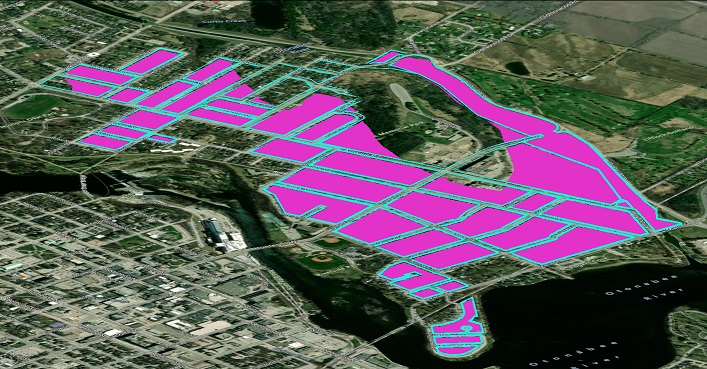
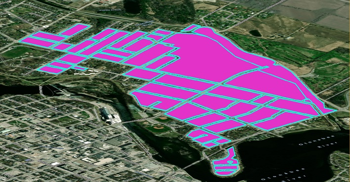
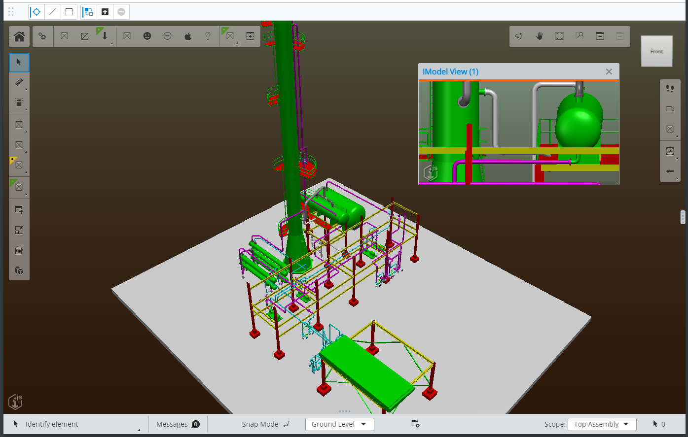

# 3.1.0 Change Notes

## Upgrade Note - peer dependency changes

- The `core-backend` package has changed it's peer dependency on `ecschema-metadata` to optional.  So it is no longer necessary to list `ecschema-metadata` as a dependency unless you use the `IModelSchemaLoader`.
- The package `ecschema-metadata` now has `core-quantity` as a peer dependency.

So if you are upgrading from 2.x or 3.0 and depend on `core-backend` you must either add `core-quantity` or remove `ecschema-metadata`.

## Simplified material creation

[RenderSystem.createMaterial]($frontend) presents an awkward API requiring the instantiation of several related objects to create even a simple [RenderMaterial]($common). It also requires an [IModelConnection]($frontend). It has been deprecated in favor of [RenderSystem.createRenderMaterial]($frontend), which accepts a single [CreateRenderMaterialArgs]($frontend) object concisely specifying only the properties of interest to the caller. For example, the following:

```ts
  const params = new RenderMaterial.Params();
  params.alpha = 0.5;
  params.diffuseColor = ColorDef.blue;
  params.diffuse = 0.4;

  const mapParams = new TextureMapping.Params({ textureWeight: 0.25 });
  params.textureMapping = new TextureMapping(texture, mapParams);
  const material = IModelApp.renderSystem.createMaterial(params, iModel);
```

Can now be expressed as follows (note no IModelConnection is required):

```ts
  const material = IModelApp.renderSystem.createRenderMaterial({
    alpha: 0.5,
    diffuse: { color: ColorDef.blue, weight: 0.4 },
    textureMapping: { texture, weight: 0.25 },
  });
```

## Model map layers

Previously, map layers defined by a [MapLayerSettings]($common) were limited to imagery generated by tile servers, but many iModels contain planar spatial models representing [GIS](https://en.wikipedia.org/wiki/Geographic_information_system) data or aerial photography, similar to that obtained from tile imagery services. Now, the imagery for a map layer can also be obtained from such a model by specifying its model Id in a [ModelMapLayerSettings]($common). The model's geometry will be projected onto the terrain surface, and display of categories within the layer can be controlled by the view's category selector.

In the image below, a planar GIS model is displayed as an ordinary model in the scene - note how it does not align correctly with the 3d terrain:



When displayed instead as a map layer, the same GIS model is correctly draped onto the 3d terrain:



[MapLayerSettings]($common) now serves as a base class for [ImageMapLayerSettings]($common) and [ModelMapLayerSettings]($common), with respective JSON representations [ImageMapLayerProps]($common) and [ModelMapLayerProps]($common).

## Obtain geometry from terrain and reality models

- [TileGeometryCollector]($core-frontend), which specifies the level of detail, spatial volume, and other criteria for determining which tile meshes to obtain; and
- [GeometryTileTreeReference]($core-frontend), a [TileTreeReference]($core-frontend) that can supply [Polyface]($core-geometry) for its tiles.

A [GeometryTileTreeReference]($core-frontend) can be obtained from an existing [TileTreeReference]($core-frontend) via [TileTreeReference.createGeometryTreeReference]($core-frontend). You can then supply a [TileGeometryCollector]($core-frontend) to [GeometryTileTreeReference.collectTileGeometry]($core-frontend) to collect the polyfaces. Because tile contents are downloaded asynchronously, you will need to repeat this process over successive frames until [TileGeometryCollector.isAllGeometryLoaded]($core-frontend) evaluates `true`.

display-test-app provides [an example tool](https://github.com/iTwin/itwinjs-core/blob/master/test-apps/display-test-app/src/frontend/TerrainDrapeTool.ts) that uses these APIs to allow the user to drape line strings onto terrain and reality models.

## Draco compression

[Draco compression](https://codelabs.developers.google.com/codelabs/draco-3d) can significantly reduce the sizes of meshes and point clouds. iTwin.js has been enhanced to correctly decompress reality models, point clouds, and glTF models that contain draco-encoded data, reducing download time and bandwidth usage.

## Floating content views in AppUI



## Font Workspaces

It is now possible to store and load fonts from a Font Workspace. See [Fonts](../learning/backend/Fonts.md) for more details.

## Promote QuantityFormatter from beta to public

The [QuantityFormatter]($core-frontend), accessed via `IModelApp.quantityFormatter`, is now public and provides a set of APIs to format and parse standard quantity types. For more documentation and samples see [Quantity Formatting](../learning/frontend/QuantityFormatting.md).

## New SchemaUnitProvider

It is now possible to retrieve `Units` from schemas stored in IModels. The new [SchemaUnitProvider]($ecschema-metadata) can now be created and used by the [QuantityFormatter]($core-frontend) or any method in the `core-quantity` package that requires a [UnitsProvider]($quantity). Below is an example, extracted from `ui-test-app`, that demonstrates how to register the IModel-specific `UnitsProvider` as the IModelConnection is created. This new provider will provide access to a wide variety of Units that were not available in the standalone `BasicUnitsProvider`.

```ts
    // Provide the QuantityFormatter with the iModelConnection so it can find the unit definitions defined in the iModel
    const schemaLocater = new ECSchemaRpcLocater(iModelConnection);
    await IModelApp.quantityFormatter.setUnitsProvider (new SchemaUnitProvider(schemaLocater));
```

>IMPORTANT: the `core-quantity` package is not a peer dependency of the `ecschema-metadata` package

## AppUI Updates

### WidgetState changes

The property [WidgetDef.state]($appui-react) will now return `WidgetState.Closed` if the widget is in a panel that is collapsed, or the panel size is 0 or undefined. When `WidgetState.Open` is passed to the method [WidgetDef.setWidgetState]($appui-react) the containing panel will also open if it is in a collapsed state.
