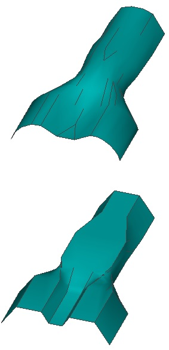
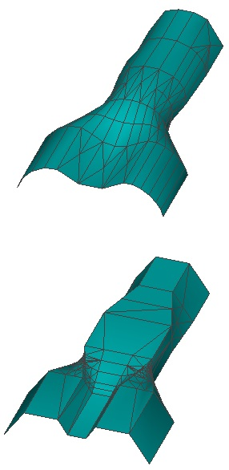
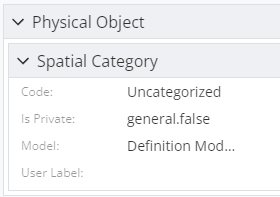
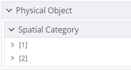
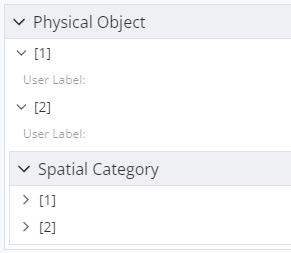
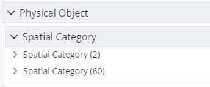
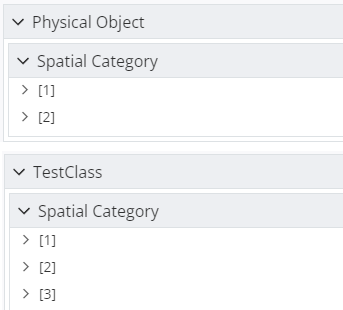

# 3.2.0 Change Notes

Table of contents:

- [Display](#display)
  - [Multi-way viewport sync](#multi-way-viewport-sync)
  - [Batching of pickable graphics](#batching-of-pickable-graphics)
  - [Detecting integrated graphics](#detecting-integrated-graphics)
  - [Improved polyface edges](#improved-polyface-edges)
  - [ArcGIS OAuth2 support](#arcgis-oauth2-support)
  - [Reality model enhancements](#reality-model-enhancements)
  - [readPixels enhancements](#readpixels-enhancements)
- [Presentation](#presentation)
  - [Filtering related property instances](#filtering-related-property-instances)
  - [ECExpressions for property overrides](#ecexpressions-for-property-overrides)
  - [Fixed nested hierarchy rules handling](#fixed-nested-hierarchy-rules-handling)
  - [Fixed inconsistent property grid representation](#fixed-inconsistent-property-grid-representation)
  - [Fixed relatedProperties specification bug](#fixed-relatedproperties-specification-bug)
  - [Property override enhancements](#property-override-enhancements)
  - [Fixed incorrect property field categories](#fixed-incorrect-property-field-categories)
- [UI](#ui)
  - [Default tool for standard frontstage](#default-tool-for-standard-frontstage)
  - [UiItemsManager changes](#uiitemsmanager-changes)
  - [Widget panel changes](#widget-panel-changes)
  - [React icons support](#react-icons-support)
- [iModel transformations](#imodel-transformations)
  - [Geometry optimization](#geometry-optimization)
  - [Resuming transformations](#resuming-transformations)
- [Batched mass properties requests](#batched-mass-properties-requests)
- [Rpc response compression](#rpc-response-compression)
- [ColorDef validation](#colordef-validation)
- [ColorByName changes](#colorbyname-changes)
- [Deprecations](#deprecations)

## Display

### Multi-way viewport sync

[TwoWayViewportSync]($frontend) is useful for synchronizing the states of two or more [Viewport]($frontend)s such that navigations made in one viewport are reflected in the other viewport. But what if you want to synchronize more than two viewports? iTwin.js 3.2 introduces [connectViewports]($frontend) to establish a connection between any number of viewports. You supply the set of viewports to be connected and a function that implements the logic for synchronizing the viewports when any of their states change. You can sever the connection by invoking the function returned by `connectViewports`. [connectViewportViews]($frontend) and [connectViewportFrusta]($frontend) are supplied as alternatives to [TwoWayViewportSync]($frontend) and [TwoWayViewportFrustumSync]($frontend), respectively, that can operate on any number of viewports.

Here's a simple example that keeps the viewports' [ViewFlags]($common) in sync:

```ts
  // Establish the connection.
  const disconnect = connectViewports([viewport1, viewport2, viewport3], (changedViewport: Viewport) => {
    // Supply a function that will synchronize the state of the other viewports with that of the changed viewport.
    return (source: Viewport, target: Viewport) => {
      target.viewFlags = source.viewFlags;
    };
  };

  // Some time later, sever the connection.
  disconnect();
```

### Batching of pickable graphics

[Pickable decorations](../learning/frontend/ViewDecorations#pickable-view-graphic-decorations) associate an [Id64String]($bentley) with a [RenderGraphic]($frontend), enabling the graphic to be interacted with using mouse or touch inputs and to have its [appearance overridden](../learning/display/SymbologyOverrides.md). Previously, a [GraphicBuilder]($frontend) accepted only a single pickable Id. [Decorator]($frontend)s that produce many pickable objects were therefore required to create a separate graphic for each pickable Id. This can negatively impact display performance by increasing the number of draw calls.

Now, [GraphicBuilder.activatePickableId]($frontend) and [GraphicBuilder.activateFeature]($frontend) enable any number of pickable objects can be batched together into one graphic, improving performance. The following simple example illustrates how to batch a pickable sphere and a pickable box into one graphic.

```ts
  class MyDecorator implements Decorator {
    boxId: Id64String;
    sphereId: Id64String;

    public constructor(iModel: IModelConnection) {
      // reserve pickable Ids for each of our features.
      this.boxId = iModel.transientIds.next;
      this.sphereId = iModel.transientIds.next;
    }

    public decorate(context: DecorateContext): void {
      // We must supply a PickableGraphicOptions when creating the GraphicBuilder.
      // Any geometry added to the builder will use this.boxId as its pickable Id.
      const builder = context.createGraphic({
        type: GraphicType.Scene,
        pickable: { id: boxId },
      };

      // Add a box.
      const box = Box.createRange(new Range3d(0, 0, 0, 1, 1, 1))!;
      builder.addSolidPrimitive(box);

      // Change the pickable Id. Any subsequently-added geometry will use this.sphereId as its pickable Id.
      builder.activatePickableId(this.sphereId);

      // Add a sphere.
      const sphere = Sphere.createCenterRadius(new Point3d(0, 0, 0), 1)!;
      builder.addSolidPrimitive(sphere);

      // Add the finished graphic to the viewport.
      context.addDecorationFromBuilder(builder);
    }
  }
```

### Detecting integrated graphics

Many computers - especially laptops - contain two graphics processing units: a low-powered "integrated" GPU such as those manufactured by Intel, and a more powerful "discrete" GPU typically manufactured by NVidia or AMD. Operating systems and web browsers often default to using the integrated GPU to reduce power consumption, but this can produce poor performance in graphics-heavy applications like those built with iTwin.js.  We recommend that users adjust their settings to use the discrete GPU if one is available.

iTwin.js applications can now check [WebGLRenderCompatibilityInfo.usingIntegratedGraphics]($webgl-compatibility) to see if the user might experience degraded performance due to the use of integrated graphics. Because WebGL does not provide access to information about specific graphics hardware, this property is only a heuristic. But it will accurately identify integrated Intel chips manufactured within the past 10 years or so, and allow the application to suggest that the user verify whether a discrete GPU is available to use instead. As a simple example:

```ts
  const compatibility = IModelApp.queryRenderCompatibility();
  if (compatibility.usingIntegratedGraphics)
    alert("Integrated graphics are in use. If a discrete GPU is available, consider switching your device or browser to use it.");
```

### Improved polyface edges

A [Polyface]($geometry) can optionally specify the visibility of the edges of each of its faces. If present, this edge visibility information - accessed via [PolyfaceData.edgeVisible]($geometry) - is used when producing graphics from the polyface to determine which edges should be drawn. If the edge visibility information is not present, however, then the display system must try to decide which edges should be drawn.

Previously, the display system would attempt to infer the visibility of each interior edge based on the angle between its two adjacent faces. For example, an edge between two faces of a cube would be visible, whereas an edge between two nearly-coplanar faces would be invisible. However, this inference does not work well for polyfaces with smoother topology. Now, instead of attempting to infer edge visibility, the display system will simply render the edges of all faces visible.

The images below illustrate the improvement. Note that edge inference is inconsistent - small variations in angles between faces produce discontinuities where continuous edges are expected. By drawing all edges, the topology of the mesh is readily apparent. Of course, the ideal results are achieved by explicitly specifying the visibility of each edge in the [Polyface]($geometry).

| Inferred edges (previous behavior)                                | All edges (new behavior)                                  |
| ----------------------------------------------------------------- | --------------------------------------------------------- |
|  |  |

If for some reason you wish to revert to the previous behavior, you can set [TileAdmin.Props.generateAllPolyfaceEdges]($frontend) to `false` when calling [IModelApp.startup]($frontend).

### ArcGIS OAuth2 support

It's now possible to connect to an ArcGIS MapService protected by OAuth2 authentication.  To enable this feature, the new `@itwin/map-layers-auth` package must be loaded by the hosting application, and an `ArcGgisAccessClient` must be created and configured properly.

For example:

```ts
  const enterpriseClientIds = [{
      serviceBaseUrl: SampleAppIModelApp.testAppConfiguration.arcGisEnterpriseBaseUrl,
      clientId: SampleAppIModelApp.testAppConfiguration?.arcGisEnterpriseClientId,
    }];
  const accessClient = new ArcGisAccessClient();
  const initStatus = accessClient.initialize({
    redirectUri: "http://localhost:3000/esri-oauth2-callback",
    clientIds: {
      arcgisOnlineClientId: SampleAppIModelApp?.testAppConfiguration?.arcGisOnlineClientId,
      enterpriseClientIds,
    }});
  IModelApp.mapLayerFormatRegistry.setAccessClient("ArcGIS", accessClient);
```

The hosting application must be registered in either the ArcGIS Online server (cloud offering) or an ArcGIS enterprise server (on-premise). The registered application must then provide it's associated clientID and redirectUri to the `ArcGgisAccessClient` object.  The ui-test-app application provides a complete sample configuration.

The maplayers widget has also been updated to support OAuth2: if needed, a popup window will be displayed to trigger the external OAuth process with the remote ArcGIS server. When the process completes, the focus returns to the map-layers widget and layer is ready to be added/displayed.

More details on how to configure the ArcGis Server can be found in the [ESRI documentation](https://developers.arcgis.com/documentation/mapping-apis-and-services/security/tutorials/register-your-application/)

### Reality model enhancements

Displaying a reality model involves streaming a large number of 3d tiles. As the user navigates the view, new tiles are constantly requested to display the model at an appropriate level of detail. Ideally, the highest level of detail tiles will load most quickly in the area of the user's interest. To achieve this, the determination of which tiles to load first was tweaked. If the user is zooming in or out on a particular area of the viewport, tiles closer to that area will be prioritized for loading. Otherwise, tiles closer to the center of the screen are prioritized. Despite the number of tiles downloaded and the time required to do so remaining unchanged, the change in **prioritization** of those tiles produces a user experience that appears more responsive.

### readPixels enhancements

[Viewport.readPixels]($frontend) is a potentially expensive operation that must re-render a portion of the view to determine what elements are currently under the cursor. Previously this function was invoked on every single mouse motion, which could cause up to 60 calls per second. It is not useful to call it so frequently when the mouse cursor is moving so rapidly.

Now, a limit is imposed upon the frequency with which `readPixels` is invoked, improving performance and user experience.

## Presentation

### Filtering related property instances

The [related properties specification](../presentation/Content/RelatedPropertiesSpecification.md) allows including properties of related instances when requesting content  for the primary instance. However, sometimes there's a need show properties of only a few related instances rather than all of them. That can now be done by supplying an instance filter - see the [`instanceFilter` attribute section](../presentation/Content/RelatedPropertiesSpecification.md#attribute-instancefilter) for more details.

### ECExpressions for property overrides

It is now possible to set property specification [`isDisplayed` attribute](../presentation/Content/PropertySpecification.md#attribute-isdisplayed) value using [ECExpressions](../presentation/Content/ECExpressions.md#property-overrides).

### Fixed nested hierarchy rules handling

There was a bug with how [nested child node rules](../presentation/Hierarchies/Terminology.md#nested-rule) were handled. When creating children for a node created by a nested child node rule, the bug caused the library to only look for child node rules that are nested under the rule that created the parent node. The issue is now fixed and the library looks for child node rules nested under the parent node rule and at the root level of the ruleset.

Example:

```jsonc
{
  "id": "example",
  "rules": [{
    "ruleType": "RootNodes",
    "specifications": [{
      "specType": "CustomNode",
      "type": "child-1",
      "label": "Child 1",
      "nestedRules": [{
        "ruleType": "ChildNodes",
        "specifications": [{
          "specType": "CustomNode",
          "type": "child-1.1",
          "label": "Child 1.1"
        }, {
          "specType": "CustomNode",
          "type": "child-1.2",
          "label": "Child 1.2",
          "nestedRules": [{
            "ruleType": "ChildNodes",
            "specifications": [{
              "specType": "CustomNode",
              "type": "child-1.2.1",
              "label": "Child 1.2.1"
            }]
          }]
        }]
      }]
    }]
  }, {
    "ruleType": "ChildNodes", // this rule now also returns children for `Child 1.2.1`
    "specifications": [{
      "specType": "CustomNode",
      "type": "child-2",
      "label": "Child 2"
    }]
  }]
}
```

With the above ruleset, when creating children for `Child 1.2.1` node, the library would've found no child node rules, because there are no nested rules for its specification. After the change, the library also looks at child node rules at the root level of the ruleset. The rules that are now handled are marked with a comment in the above example. If the effect is not desirable, rules should have [conditions](../presentation/Hierarchies/ChildNodeRule.md#attribute-condition) that specify what parent node they return children for.

### Fixed inconsistent property grid representation

Previously, when using [RelatedPropertiesSpecification.nestedRelatedProperties]($presentation-common) attribute, the properties were loaded differently based on whether parent specification included any properties or not. Now the behavior is consistent.

```json
{
  "id": "example",
  "rules": [{
      "ruleType": "Content",
      "specifications": [{
          "specType": "ContentInstancesOfSpecificClasses",
          "classes": { "schemaName": "BisCore", "classNames": ["GeometricModel3d"], "arePolymorphic": true }
        }]
    }, {
      "ruleType": "ContentModifier",
      "class": {
        "schemaName": "BisCore",
        "className": "Model"
      },
      "relatedProperties": [{
          "propertiesSource": {
            "relationship": { "schemaName": "BisCore", "className": "ModelContainsElements" },
            "direction": "Forward",
            "targetClass": { "schemaName": "Generic", "className": "PhysicalObject" }
          },
          "properties": "_none_",
          "nestedRelatedProperties": [{
              "propertiesSource": {
                "relationship": { "schemaName": "BisCore", "className": "GeometricElement3dIsInCategory" },
                "direction": "Forward"
              }
            }]
        }]
    }]
}
```

| Value of `"properties"` attribute | before                                                                                                                            | after                                                                                                                             |
| --------------------------------- | --------------------------------------------------------------------------------------------------------------------------------- | --------------------------------------------------------------------------------------------------------------------------------- |
| `"_none_"`                        |                                          |                                       |
| `["UserLabel"]`                   |  |  |

### Fixed relatedProperties specification bug

The bug made it impossible to remove related properties if a lower priority rule specified that the property should be included.

For example, the [default BisCore supplemental ruleset](https://github.com/iTwin/itwinjs-core/blob/504a7b88e9ade29cc306bd55d093be1d76ddad43/presentation/backend/assets/supplemental-presentation-rules/BisCore.PresentationRuleSet.json#L372-L419) automatically includes `ExternalSourceAspect.Identifier` property to all Elements' content when they have such aspect. It's now possible to disable that rule using one of these approaches:

- Set `"properties"` to `"_none_"` or `[]`:

  ```json
  {
    "ruleType": "ContentModifier",
    "class": { "schemaName": "BisCore", "className": "Element" },
    "relatedProperties": [{
        "propertiesSource": {
          "relationship": { "schemaName": "BisCore", "className": "ElementOwnsMultiAspects" },
          "direction": "Forward",
          "targetClass": { "schemaName": "BisCore", "className": "ExternalSourceAspect" }
        },
        "properties": "_none_"
      }
    ]
  }
  ```

- Disable property display:

  ```json
  {
    "ruleType": "ContentModifier",
    "class": { "schemaName": "BisCore", "className": "Element" },
    "relatedProperties": [{
        "propertiesSource": {
          "relationship": { "schemaName": "BisCore", "className": "ElementOwnsMultiAspects" },
          "direction": "Forward",
          "targetClass": { "schemaName": "BisCore", "className": "ExternalSourceAspect" }
        },
        "properties": [{
          "name": "Identifier",
          "isDisplayed": false
        }]
      }
    ]
  }
  ```

### Property override enhancements

It is now possible to override values of [`isReadOnly`](../presentation/Content/PropertySpecification.md#attribute-isreadonly) and [`priority`](../presentation/Content/PropertySpecification.md#attribute-priority) property attributes.

### Fixed incorrect property field categories

Previously, nested related properties of different intermediate classes were all categorized under the first intermediate class. Now the properties are categorized under the intermediate classes to which they belong.

```json
{
  "id": "example",
  "rules": [{
      "ruleType": "Content",
      "specifications": [{
          "specType": "ContentInstancesOfSpecificClasses",
          "classes": { "schemaName": "BisCore", "classNames": ["GeometricModel3d"], "arePolymorphic": true }
        }]
    }, {
      "ruleType": "ContentModifier",
      "class": { "schemaName": "BisCore", "className": "Model" },
      "relatedProperties": [{
          "propertiesSource": {
            "relationship": { "schemaName": "BisCore", "className": "ModelContainsElements" },
            "direction": "Forward",
            "targetClass": { "schemaName": "BisCore", "className": "GeometricElement3d" }
          },
          "properties": "_none_",
          "nestedRelatedProperties": [{
              "propertiesSource": {
                "relationship": { "schemaName": "BisCore", "className": "GeometricElement3dIsInCategory" },
                "direction": "Forward"
              }
            }],
          "handleTargetClassPolymorphically": true
        }]
    }]
}
```

| before                                                                                         | after                                                                                                       |
| ---------------------------------------------------------------------------------------------- | ----------------------------------------------------------------------------------------------------------- |
|  |  |

## UI

### Default tool for standard frontstage

The [StandardFrontstageProvider]($appui-react) gives apps an easy way to create a custom frontstage, but overriding the default [Tool]($frontend) was more complicated. Now, a default tool can easily configured by setting `StandardFrontstageProps.defaultTool`.

### UiItemsManager changes

When registering a UiItemsProvider with the `UiItemsManager` it is now possible to pass an additional argument to limit when the provider is called to provide its items. The interface `UiItemProviderOverrides` define the parameters that can be used to limit the provider. The example registration below will limit a provider to only be used if the active stage has an Id of "redlining".

```ts
    UiItemsManager.register(commonToolProvider, {stageIds: ["redlining"]});
```

### Widget panel changes

Based on usability testing, the following changes to widget panels have been implemented.

1. Only two widget panel sections will be shown in any widget panel.
2. A splitter is now provided that allows user to set the size of the widget panel sections.
3. There is no special processing of double clicks on widget tabs when the widget tab is shown in a widget panel.
4. The Widget Panel Unpin icon has been updated to make it more clear the action to be performed when the toggle is clicked.

The API impact of these updates are listed below.

1. The `UiItemsManager` will still query the `UiItemsProvider`s for widgets for the `StagePanelSection`.Center but the returned widgets will be shown in the bottom panel sections. The StagePanelSection.Center enum entry has been deprecated and UiItemProviders should start using only `StagePanelSection.Start` and `StagePanelSection.End`.
2. Widgets in panels only support the [WidgetState]($appui-abstract)s WidgetState.Open or WidgetState.Hidden.
3. The UiItemProviders `provideWidgets` call can now return `AbstractWidgetProps` that specify a `defaultFloatingSize` that can be used for Widgets that use components that do not have an intrinsic size. For more details see [WidgetItem](../learning/ui/AugmentingUI.md).

### React icons support

In addition to toolbar buttons, React icons are now supported for use in [Widget]($appui-react) tabs, [Backstage]($appui-react) items, and [StatusBar]($appui-react) items.

## iModel transformations

### Geometry optimization

The geometry produced by [connectors](https://www.itwinjs.org/learning/imodel-connectors/) and [transformation workflows](../learning/transformer/index.md) is not always ideal. One common issue is a proliferation of [GeometryPart]($backend)s to which only one reference exists. In most cases, it would be more efficient to embed the part's geometry directly into the referencing element's [geometry stream](https://www.itwinjs.org/learning/common/geometrystream/).

[IModelImporter.optimizeGeometry]($transformer) has been introduced to enable this kind of optimization. It takes an [OptimizeGeometryOptions]($transformer) object specifying which optimizations to apply, and applies them to all of the 3d geometry in the iModel. Currently, only the optimization described above is supported, but more are expected to be added in the future.

If you are using [IModelImporter]($transformer) directly, you can call `optimizeGeometry` directly. Typically you would want to do so as a post-processing step. It's simple:

```ts
  // Import all of your geometry, then:
  importer.optimizeGeometry({ inlineUniqueGeometryParts: true });
```

If you are using [IModelTransformer]($transformer), you can configure automatic geometry optimization via [IModelTransformOptions.optimizeGeometry]($transformer). If this property is defined, then [IModelTransformer.processAll]($transformer) and [IModelTransformer.processChanges]($transformer) will apply the specified optimizations after the transformation process completes. For example:

```ts
  const options = { inlineUniqueGeometryParts: true };
  const transformer = new IModelTransformer(sourceIModel, targetIModel, options);
  transformer.processAll();
```

### Resuming transformations

The functions [IModelTransformer.saveStateToFile]($transformer) and [IModelTransformer.resumeTransformation]($transformer) have been
added to the transformer, and can be used to save the transformer internal state to a file. This can then be used, in combination with a
target at the same state as it was when the transformer state file was made, to "resume" a transformation.
[IModelTransformer.resumeTransformation]($transformer) will create a new transformer instance upon which calling
[IModelTransformer.processAll]($transformer) or [IModelTransformer.processChanges]($transformer) will start the transformation but not re-export
already inserted entities. This can be useful in some cases where a transformation is a long running process and may need to be paused and resumed.

## Batched mass properties requests

[IModelConnection.getMassProperties]($frontend) provides useful geometry information about an element, like area, volume, and length. When requesting such information for many elements, however, calling this function repeatedly can be inefficient. Now, [IModelConnection.getMassPropertiesPerCandidate]($frontend) can be used instead to request mass properties for multiple elements simultaneously, producing results more quickly.

## Rpc response compression

Some [RpcInterfaces](https://www.itwinjs.org/learning/rpcinterface/) define operations that may return so much data, that downloading it becomes a significant part of a Web request duration. Such operations can now utilize `gzip` compression to cut download time by an order of magnitude on large JSON responses.

This enhancement relies on request's `Accept-Encoding` header not gettting stripped before it reaches the backend server.

## ColorDef validation

[ColorDef.fromString]($common) returns [ColorDef.black]($common) if the input is not a valid color string. [ColorDef.create]($common) coerces the input numeric representation into a 32-bit unsigned integer. In either case, this occurs silently. Now, you can use [ColorDef.isValidColor]($common) to determine if your input is valid.

## ColorByName changes

Enums in TypeScript have some shortcomings, one of which resulted in a bug that caused [ColorDef.fromString]($common) to return [ColorDef.black]($common) for some valid color strings like "aqua". This is due to several standard color names ("aqua" and "cyan", "magenta" and "fuschia", and several "grey" vs "gray" variations) having the same numeric values. To address this, [ColorByName]($common) has been converted from an `enum` to a `namespace`. Code that accesses `ColorByName` members by name will continue to compile with no change.

## Deprecations

### @itwin/components-react

The interfaces and components `ShowHideMenuProps`, `ShowHideMenu`, `ShowHideItem`, `ShowHideID`, `ShowHideDialogProps`, and `ShowHideDialog` are all being deprecated because they were supporting components for the now deprecated `Table` component. This `Table` component used an Open Source component that is not being maintained so it was determined to drop it from the API. The @itwin/itwinui-react package now delivers a Table component which should be used in place of the deprecated Table.

### @itwin/core-geometry

The low-level [PolyfaceBuilder]($core-geometry) methods `findOrAddPoint`, `findOrAddPointXYZ`, `findOrAddParamXY`, and `findOrAddParamInGrowableXYArray` are deprecated in favor of the more appropriately named new methods `addPoint`, `addPointXYZ`, `addParamXY` and `addParamInGrowableXYArray`. These methods always add their inputs to the relevant builder array, rather than searching it and returning the index of a duplicate. The intent is to enable efficient `IndexedPolyface` construction by allowing duplicate data to be accumulated as facets are added, and to compress the data when done with `claimPolyface`.

### @itwin/core-react

Using the sprite loader for SVG icons is deprecated. This includes `SvgSprite` and the methods getSvgIconSpec() and getSvgIconSource() methods on [IconSpecUtilities]($appui-abstract). The sprite loader has been replaced with a web component [IconWebComponent]($core-react) used by [Icon]($core-react) to load SVGs onto icons.

### @itwin/core-transformer

The beta transformer API functions [IModelTransformer.skipElement]($transformer) and [IModelTransformer.processDeferredElements]($transformer)
have been deprecated, as the transformer no longer "defers" elements until all of its references have been transformed. These now have no effect,
since no elements will be deferred, and elements will always be transformed, so skipping them to transform them later is not necessary.
