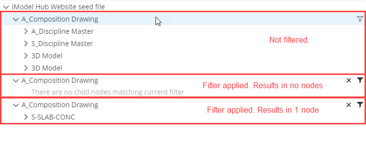

# 3.6.0 Change Notes

Table of contents:

- [API support policies](#api-support-policies)
- [Electron 22 support](#electron-22-support)
- [Display system](#display-system)
  - [Point cloud shading](#point-cloud-shading)
  - [Normal mapping](#normal-mapping)
  - [Smooth viewport resizing](#smooth-viewport-resizing)
  - [Pickable view overlays](#pickable-view-overlays)
  - [Element clipping example](#element-clipping-example)
  - [Support larger terrain meshes](#support-larger-terrain-meshes)
- [Geometry](#geometry)
  - [Query mesh convexity](#query-mesh-convexity)
- [Write-ahead logging](#write-ahead-logging)
- [Presentation](#presentation)
  - [Hierarchy levels filtering](#hierarchy-levels-filtering)
  - [Grouping nodes HiliteSet](#grouping-nodes-hiliteset)
- [API promotions](#api-promotions)
- [API deprecations](#api-deprecations)

## API support policies

iTwin.js now documents the [official policies](../learning/api-support-policies.md) defining the level of stability and support afforded to its public APIs and each major release.

## Electron 22 support

In addition to already supported Electron versions, iTwin.js now supports [Electron 22](https://www.electronjs.org/blog/electron-22-0).

## Display system

### Point cloud shading

Point clouds can provide valuable real-world context when visualizing an iTwin, but it can often be difficult to discern individual features within the cloud of points - especially when the point cloud lacks color data. You can now accentuate the depth, shape, and surface of a point cloud using a technique called "eye-dome lighting" that uses the relative depths of the points to compute a lighting effect.

Point cloud shading is specified by several properties of [RealityModelDisplaySettings.pointCloud]($common), all with names prefixed with `edl` (short for "eye-dome lighting"):

- [PointCloudDisplaySettings.edlMode]($common) enables the effect if set to "on" or "full".
- [PointCloudDisplaySettings.edlStrength]($common) specifies the intensity of the effect.
- [PointCloudDisplaySettings.edlRadius]($common) specifies the radius in pixels around each point that should be sampled to detect differences in depth.
- [PointCloudDisplaySettings.edlFilter]($common) specifies whether to apply a filtering pass to smooth out the effect, when `edlMode` is set to "full".

Each point cloud in a view can have its own independent EDL settings. You can configure those settings via [ContextRealityModel.displaySettings]($common) for context reality models, and [DisplayStyleSettings.setRealityModelDisplaySettings]($common) for persistent reality models. Adjusting related settings like [PointCloudDisplaySettings.sizeMode]($common) and [PointCloudDisplaySettings.shape]($common) can influence the shading effect.

A monochrome point cloud with (bottom) and without (top) shading:


A colorized point cloud with (bottom) and without (top) shading:


### Normal mapping

[Normal mapping](https://en.wikipedia.org/wiki/Normal_mapping) is a technique that simulates additional surface details by mapping a texture containing normal vectors onto a surface. [RenderMaterial]($common)s now support applying normal maps.

You can create a [RenderMaterial]($common) with a normal map on the frontend via [RenderSystem.createRenderMaterial]($frontend). The normal map is specified by the [MaterialTextureMappingProps.normalMapParams]($frontend) in your [CreateRenderMaterialArgs.textureMapping]($frontend).

To create a [RenderMaterialElement]($backend) with a normal map on the backend, use [RenderMaterialElement.insert]($backend) or [RenderMaterialElement.create]($backend). Pass the normal map in [RenderMaterialElementParams.normalMap]($backend).

The image below illustrates the effects of normal mapping. The cubes in the top row have no normal maps, while the cubes in the bottom row are normal mapped.


### Smooth viewport resizing

Previously, when a [Viewport]($frontend)'s canvas was resized there would be a delay of up to one second during which the viewport's contents would appear stretched or squished, before they were redrawn to match the new canvas dimensions. This was due to the unavailability of [ResizeObserver](https://developer.mozilla.org/en-US/docs/Web/API/ResizeObserver) in some browsers. Now that `ResizeObserver` is supported by all major browsers, we are able to use it to make the contents of the viewport update smoothly during a resize operation.

### Pickable view overlays

A bug preventing users from interacting with [pickable decorations](../learning/frontend/ViewDecorations.md#pickable-view-graphic-decorations) defined as [GraphicType.ViewOverlay]($frontend) has been fixed.

### Element clipping example

In some cases it is useful to apply a [clipping volume](https://www.itwinjs.org/reference/core-common/views/viewdetails/clipvector/) to a view that mimics the shape of one or more elements. For example, you may have a view displaying a reality mesh captured from a real-world asset like a factory, and a design model representing the same asset, and wish to isolate the portions of the reality mesh corresponding to a series of pipe elements in the design model.

display-test-app now provides an [example tool](https://github.com/iTwin/itwinjs-core/blob/master/test-apps/display-test-app/src/frontend/ViewClipByElementGeometryTool.ts) demonstrating how this can be achieved. It uses [IModelConnection.generateElementMeshes]($frontend) to produce [Polyface]($core-geometry)s from one or more elements; decomposes them into a set of convex hulls using [VHACD.js](https://www.npmjs.com/package/vhacd-js); and creates a clipping volume from the hulls via [ConvexClipPlaneSet.createConvexPolyface]($core-geometry). The example tool can be accessed in display-test-app using the keyin `dta clip element geometry`.

### Support larger terrain meshes

Previously, [RealityMeshParams]($frontend) only supported 16-bit vertex indices, which limited the number of vertices that could be produced by a [TerrainMeshProvider]($frontend). That limit has been extended to 32 bits (the maximum supported by WebGL). The code has also been optimized to allocate only as many bytes per vertex index as required. For example, if a mesh contains fewer than 256 vertices, only one byte will be allocated per vertex index.

## Geometry

### Query mesh convexity

A new method [PolyfaceQuery.isConvexByDihedralAngleCount]($core-geometry) permits testing the convexity of a mesh by inspecting the dihedral angles of all of its edges. For an example of its usage, see the [element clipping example](#element-clipping-example).

## Write-ahead logging

Previously, iTwin.js used [DELETE](https://www.sqlite.org/pragma.html#pragma_journal_mode) journal mode for writes to local briefcase files. It now uses [write-ahead logging](https://www.sqlite.org/wal.html) (WAL) mode. This change should be invisible to applications, other than performance of [IModelDb.saveChanges]($backend) should improve in most cases. However, there are a few subtle implications of this change that may affect existing applications:

- Attempting to open more than one simultaneous writeable connections to the same briefcase will now fail on open. Previously, both opens would succeed, followed by a failure on the first attempted write by one or the other connection.
- Failure to close a writeable briefcase may leave a "-wal" file. Previously, if a program crashed or exited with an open briefcase, it would leave the briefcase file as-of its last call to `IModelDb.saveChanges`. Now, there will be another file with the name of the briefcase with "-wal" appended. This is not a problem and the briefcase is completely intact, except that the briefcase file itself is not sufficient for copying (it will not include recent changes.) The "-wal" file will be used by future connections and will be deleted the next time the briefcase is successfully closed.
- Attempting to copy an open-for-write briefcase file may not include recent changes. This scenario generally only arises for tests. If you wish to copy an open-for-write briefcase file, you must now call [IModelDb.performCheckpoint]($backend) first.

## Presentation

### Hierarchy levels filtering

Ability to filter individual hierarchy levels was added for tree components that use [PresentationTreeDataProvider]($presentation-components). To enable this, [PresentationTreeRenderer]($presentation-components) should be passed to [ControlledTree]($components-react) through [ControlledTreeProps.treeRenderer]($components-react):

```ts
return <ControlledTree
  // other props
  treeRenderer={(treeProps) => <PresentationTreeRenderer {...treeProps} imodel={imodel} modelSource={modelSource} />}
/>;
```

[PresentationTreeRenderer]($presentation-components) renders nodes with action buttons for applying and clearing filters. Some hierarchy levels might not be filterable depending on the presentation rules used to build them. In that case, action buttons for those hierarchy levels are not rendered. If applied filter does not produce any nodes, `There are no child nodes matching current filter` message is rendered in that hierarchy level.



Dialog component for creating hierarchy level filter is opened when node's `Filter` button is clicked. This dialog allows to create complex filters with multiple conditions based on properties from instances that are represented by the nodes in that hierarchy level.


### Grouping nodes HiliteSet

[HiliteSetProvider.getHiliteSet]($presentation-frontend) now supports getting [HiliteSet]($presentation-frontend) for grouping nodes. Previously, [HiliteSetProvider.getHiliteSet]($presentation-frontend) used to return empty [HiliteSet]($presentation-frontend) if called with key of the grouping node. Now it returns [HiliteSet]($presentation-frontend) for all the instances that are grouped under grouping node. This also means that now elements will be hilited in viewport using [Unified Selection](../presentation/unified-selection/index.md) when grouping node is selected in the tree.

## API promotions

The following APIs have been promoted to `@public`, indicating they are now part of their respective packages' [stability contract](../learning/api-support-policies.md).

### @itwin/core-bentley

- [AccessToken]($bentley)

### @itwin/core-common

- [AuthorizationClient]($common)
- [FrustumPlanes]($common)

### @itwin/core-frontend

- [Viewport.queryVisibleFeatures]($frontend)
- [ViewState3d.lookAt]($frontend)

### @itwin/presentation-common

- Presentation rules:
  - [InstanceLabelOverridePropertyValueSpecification.propertySource]($presentation-common)
  - [ChildNodeSpecificationBase.suppressSimilarAncestorsCheck]($presentation-common)
  - [RequiredSchemaSpecification]($presentation-common) and its usages:
    - [SubCondition.requiredSchemas]($presentation-common)
    - [RuleBase.requiredSchemas]($presentation-common)
    - [Ruleset.requiredSchemas]($presentation-common)
- Content traversal - related APIs:
  - [traverseContent]($presentation-common)
  - [IContentVisitor]($presentation-common)
- Selection scope computation - related APIs:
  - [SelectionScopeProps]($presentation-common)
  - [ComputeSelectionRequestOptions]($presentation-common)
  - [PresentationRpcInterface.getElementProperties]($presentation-common)
- Element properties request - related APIs:
  - [ElementProperties]($presentation-common)
  - [ElementPropertiesRequestOptions]($presentation-common)
  - [PresentationRpcInterface.computeSelection]($presentation-common)
- Content sources request - related APIs:
  - [ContentSourcesRequestOptions]($presentation-common)
  - [PresentationRpcInterface.getContentSources]($presentation-common)
- Content instance keys request - related APIs:
  - [ContentInstanceKeysRequestOptions]($presentation-common)
  - [PresentationRpcInterface.getContentInstanceKeys]($presentation-common)
- [NestedContentField.relationshipMeaning]($presentation-common)
- [ContentFlags.IncludeInputKeys]($presentation-common) and [Item.inputKeys]($presentation-common)

### @itwin/presentation-backend

- Presentation manager's caching related APIs:
  - [HierarchyCacheMode]($presentation-backend)
  - [HierarchyCacheConfig]($presentation-backend)
  - [PresentationManagerCachingConfig.hierarchies]($presentation-backend) and [PresentationManagerCachingConfig.workerConnectionCacheSize]($presentation-backend)
- [PresentationManager.getElementProperties]($presentation-backend) and [MultiElementPropertiesResponse]($presentation-backend)
- [PresentationManager.getContentSources]($presentation-backend)
- [PresentationManager.computeSelection]($presentation-backend)
- [RulesetEmbedder]($presentation-backend) and related APIs

### @itwin/presentation-frontend

- [PresentationManager.getContentSources]($presentation-frontend)
- [PresentationManager.getElementProperties]($presentation-frontend)
- [PresentationManager.getContentInstanceKeys]($presentation-frontend)

### @itwin/presentation-components

- [FavoritePropertiesDataFilterer]($presentation-components)
- [PresentationPropertyDataProvider.getPropertyRecordInstanceKeys]($presentation-components)
- [PresentationTreeDataProviderProps.customizeTreeNodeItem]($presentation-components)
- [PresentationTreeNodeLoaderProps.seedTreeModel]($presentation-components)

## API deprecations

### @itwin/core-bentley

[ByteStream]($bentley)'s `next` property getters like [ByteStream.nextUint32]($bentley) and [ByteStream.nextFloat64]($bentley) have been deprecated and replaced with corresponding `read` methods like [ByteStream.readUint32]($bentley) and [ByteStream.readFloat64]($bentley). The property getters have the side effect of incrementing the stream's current read position, which can result in surprising behavior and may [trip up code optimizers](https://github.com/angular/angular-cli/issues/12128#issuecomment-472309593) that assume property access is free of side effects.

Similarly, [TransientIdSequence.next]($bentley) returns a new Id each time it is called. Code optimizers like [Angular](https://github.com/angular/angular-cli/issues/12128#issuecomment-472309593)'s may elide repeated calls to `next` assuming it will return the same value each time. Prefer to use the new [TransientIdSequence.getNext]($bentley) method instead.

### @itwin/core-frontend

[ScreenViewport.setEventController]($frontend) was only ever intended to be used by [ViewManager]($frontend). In the unlikely event that you are using it for some (probably misguided) purpose, it will continue to behave as before, but it will be removed in a future major version.

[NativeApp.requestDownloadBriefcase]($frontend) parameter `progress` is deprecated in favor of `progressCallback` in [DownloadBriefcaseOptions]($frontend). Similarly, `progressCallback` in [PullChangesOptions]($frontend) is now deprecated and should be replaced with `downloadProgressCallback` in [PullChangesOptions]($frontend). Both new variables are of type [OnDownloadProgress]($frontend), which more accurately represents information reported during downloads.

[IModelConnection.displayedExtents]($frontend) and [IModelConnection.expandDisplayedExtents]($frontend) are deprecated. The displayed extents are expanded every time a [ContextRealityModel]($common) is added to any view in the iModel, and never shrink. They were previously used to compute the viewed extents of every [SpatialViewState]($frontend), which could produce an unnecessarily large frustum resulting in graphical artifacts. Now each spatial view computes its extents based on the extents of the models it is currently displaying. `displayedExtents` is still computed as before to support existing users of the API, but its use is not recommended.

### @itwin/core-backend

[RenderMaterialElement.Params]($backend) is defined as a class, which makes it unwieldy to use. You can now use the interface [RenderMaterialElementParams]($backend) instead.

### @itwin/appui-abstract

`UiItemsProvider` and other AppUI specific types and APIs are deprecated and moved to `@itwin/appui-react` package.
For a replacement in case of API rename consult @deprecated tag in the documentation.

### @itwin/appui-react

`ModelsTree` and `CategoryTree` were moved to [@itwin/tree-widget-react](https://github.com/iTwin/viewer-components-react/tree/master/packages/itwin/tree-widget) package and deprecated in `@itwin/appui-react` packages. They will be removed from `@itwin/appui-react` in future major version.

`SpatialContainmentTree` were deprecated in favor of `SpatialContainmentTree` from [@itwin/breakdown-trees-react](https://github.com/iTwin/viewer-components-react/tree/master/packages/itwin/breakdown-trees) package. `SpatialContainmentTree` will be removed in future major version.

### @itwin/presentation-common

A bunch of `{api_name}JSON` interfaces, completely matching their sibling `{api_name}` definition, thus having no real benefit, have been forcing us to map back and forth between `{api_name}` and `{api_name}JSON` with `{api_name}.toJSON` and `{api_name}.fromJSON` helper functions. Majority of them are marked public as they're part of public RPC interface, but are generally not expected to be directly used by consumer code. They have been deprecated with the recommendation to use `{api_name}`.
