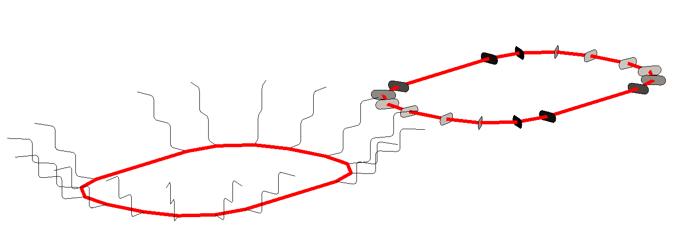
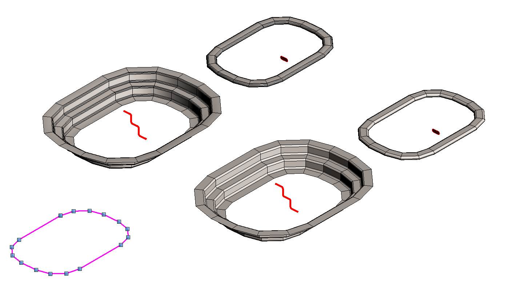
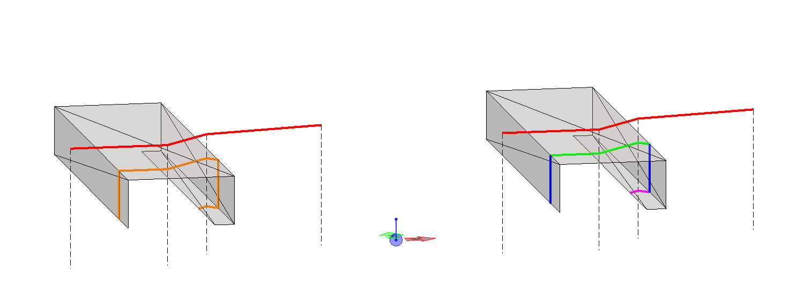
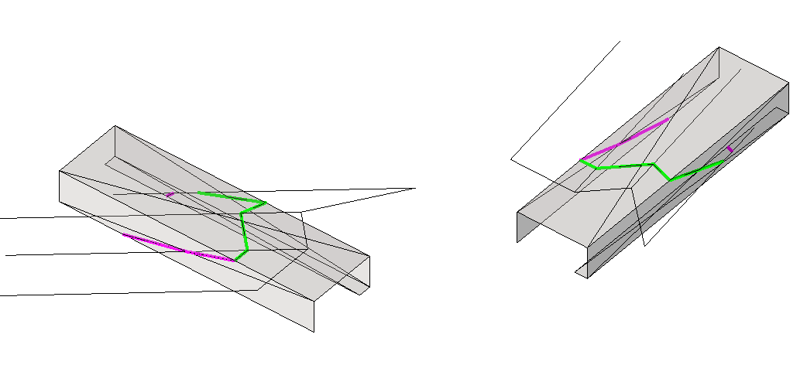
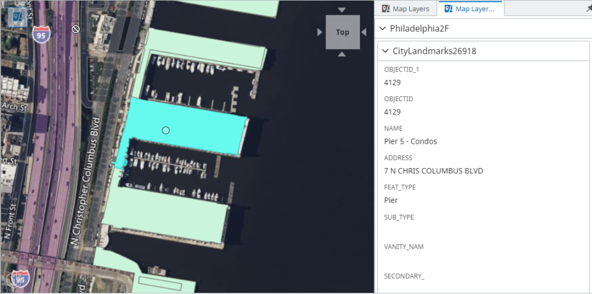
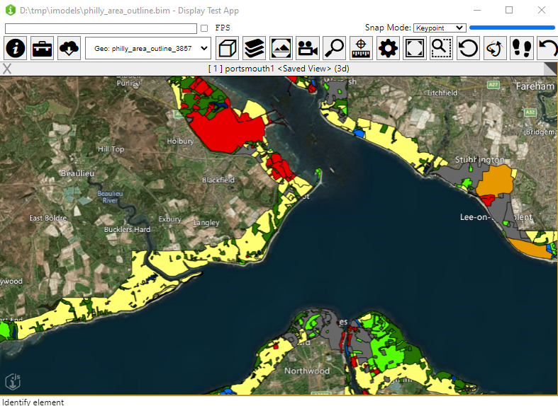

# 4.1.0 Change Notes

Table of contents:

- [Snapping within view attachments](#snapping-within-view-attachments)
- [Display](#display)
  - [Tile decoding in workers](#tile-decoding-in-workers)
  - [Smaller edge encoding](#smaller-edge-encoding)
  - [glTF point clouds](#gltf-point-clouds)
- [Presentation](#presentation)
  - [Renderer, editor and category on calculated properties](#renderer-editor-and-category-on-calculated-properties)
  - [Class property categories under custom categories](#class-property-categories-under-custom-categories)
- [Electron 25 support](#electron-25-support)
- [Geometry](#geometry)
  - [Sweeping a section to a sequence of planes](#sweeping-a-section-to-a-sequence-of-planes)
  - [New constructors](#new-constructors)
  - [Swept surface constructions](#swept-surface-constructions)
  - [Sweeping a linestring to facets](#sweeping-a-linestring-to-facets)
- [Map Layers](#map-layers)
  - [Map Feature Info](#map-feature-info)
  - [ArcGIS Feature uniqueValueRenderer support](#arcgis-feature-uniqueValueRenderer)
- [API deprecations](#api-deprecations)
  - [Geometry](#geometry-1)

## Snapping within view attachments

[SheetViewDefinition]($backend)s can include the contents of other views by way of [ViewAttachment]($backend)s. It has always been possible to locate and interact with elements inside of a view attachment, but [now](https://github.com/iTwin/itwinjs-core/pull/5633) you can also snap to their geometry while doing so. This is useful, for example, for measuring distances between elements inside of the attachment. Additionally, when locating elements on a sheet - whether or not snapping is enabled - information about the view attachment is included.

When a locate operation identifies an element inside of a view attachment, the attachment's element Id can be obtained via [HitDetail.viewAttachment]($frontend). If you are using [Viewport.readPixels]($frontend), the Id will be included in [Pixel.Data]($frontend). All world coordinates (e.g., [HitDetail.hitPoint]($frontend)) will be in the *sheet* model's coordinate space. You can pass the attachment Id to [ViewState.computeDisplayTransform]($frontend) to obtain the [Transform]($core-geometry) from the view attachment's coordinate space to the sheet.

Note: most view attachments are two-dimensional drawings or orthographic spatial views. Attachments of perspective (camera) views do not support locating elements inside them, nor snapping to them.

## Display

### Tile decoding in workers

Producing a responsive web app requires [limiting](https://web.dev/off-main-thread/) the amount of JavaScript code executing on the main thread. To that end, we have [moved](https://github.com/iTwin/itwinjs-core/pull/5548) decoding of [tile content](https://www.itwinjs.org/learning/display/tiles/) to a worker. This helps to reduce stutter when loading a large number of tiles. We plan to move more code to workers in upcoming releases.

### Smaller edge encoding

When rendering the contents of a view with [edge display](https://www.itwinjs.org/learning/display/edgedisplay/) enabled, special [tiles](https://www.itwinjs.org/learning/display/tiles/) are requested that encode the edge geometry in addition to the surfaces. A tile containing edges can be many times bigger than the same tile containing only surfaces. iTwin.js 4.1 introduces a [new encoding scheme](https://github.com/iTwin/itwinjs-core/pull/5581) that reduces that size difference by an order of magnitude. Previously, the average tile containing edges weighed 73% more than the corresponding tile without edges; now, the average difference is only 6.7%. This reduces tile transmission times and memory usage when edge display is enabled.

### glTF point clouds

The newest evolution of the [3D Tiles specification](https://cesium.com/blog/2021/11/10/introducing-3d-tiles-next/#using-gltf-for-point-clouds) introduces a streamlined way to represent point clouds using [glTF](https://en.wikipedia.org/wiki/GlTF), deprecating the previous ["PNTS"](https://github.com/CesiumGS/3d-tiles/tree/main/specification/TileFormats/PointCloud) tile format. As part of our efforts to align the iTwin platform with open web standards, iTwin.js now supports decoding and displaying point clouds encoded this way.

## Presentation

### Renderer, editor and category on calculated properties

Previously, the [calculated properties specification](../presentation/content/CalculatedPropertiesSpecification.md) only allowed specifying property [label](../presentation/content/CalculatedPropertiesSpecification.md#attribute-label) and [value](../presentation/content/CalculatedPropertiesSpecification.md#attribute-value). Now the specification has an ability to assign [renderer](../presentation/content/CalculatedPropertiesSpecification.md#attribute-renderer), [editor](../presentation/content/CalculatedPropertiesSpecification.md#attribute-editor) and [category](../presentation/content/CalculatedPropertiesSpecification.md#attribute-categoryid) to calculated properties.

### Class property categories under custom categories

Now when moving property into a different category using [`categoryId`](../presentation/content/PropertySpecification.md#attribute-categoryid), [IdCategoryIdentifier]($presentation-common) has a new attribute `createClassCategory` which specifies whether an additional class category should be created under the category pointed to by the [IdCategoryIdentifier.categoryId]($presentation-common) or not. See [property categorization](../presentation/content/PropertyCategorization.md#creating-nested-class-categories) for more details.

## Electron 25 support

In addition to already supported Electron versions, iTwin.js now supports [Electron 25](https://www.electronjs.org/blog/electron-25-0).

## Geometry

### Sweeping a section to a sequence of planes

A new method [CurveFactory.createMiteredSweepSections]($core-geometry) moves a section "along" a polyline path; at each vertex the section projects to the plane containing the inbound and outbound edges' bisector.

Here are two examples of sections moving along a (red) path. The first section is a stepped polyline with rounded corners. The second section is a "stadium" shape.



Here are those result sections assembled into `RuledSweep` solids and then faceted as meshes, illustrating optional output controlled by [MiteredSweepOptions.outputSelect]($core-geometry).



### New constructors

- [Vector3d.createNormalizedStartEnd]($core-geometry) returns (if possible) a unit vector from start to end, with start and end given as [XYAndZ]($core-geometry).
- [Matrix3d.createFlattenAlongVectorToPlane]($core-geometry) returns a matrix which sweeps vectors along the given sweep direction to a plane through the origin with given normal.
- [Transform.createFlattenAlongVectorToPlane]($core-geometry) returns a transform which sweeps points along the given sweep direction to a plane with given origin and normal.
- [PolylineOps.createBisectorPlanesForDistinctPoints]($core-geometry) For each point on a polyline, constructs a plane which bisects the angle between inbound and outbound segments.

### Swept surface constructions

The constructors for swept surfaces ([LinearSweep]($core-geometry), [RotationalSweep]($core-geometry), [RuledSweep]($core-geometry)) now allow [CurvePrimitive]($core-geometry) input. Internally, the curve is promoted to a `CurveChain` with one member.

### Sweeping a linestring to facets

New method [PolyfaceQuery.sweepLineStringToFacets]($core-geometry) provides new options to specify (a) sweep direction other than vertical, (b) limiting output to forward facing, side facing, and/or rear facing facets, and (c) assembly of output segments into chains.

In the first example, a mesh with an upward facing main surface has smaller vertical sides and a small downward facing flange at the bottom of the side right face.  The red linestring is above the mesh.  The red linestring is swept downward (along dashed lines), intersecting the mesh.   On the left all cut lines are gathered as a single output (orange).  On the right the forward, side, and rear facing parts are separated as green, blue, and magenta.



In the second example, the same red linestring is swept to the same facets but along a non-vertical direction.



New method [PolyfaceQuery.sweepLineStringToFacetsXY]($core-geometry) performs the same sweep along the z-axis, optimized around a 2D range search object which the caller supplies. The search object must support the queries in the interface [Range2dSearchInterface]($core-geometry) and be constructed from facet ranges tagged with Polyface read index.

## Map Layers

### Map Feature Info

The [Viewport.getMapFeatureInfo]($core-frontend) method [has been improved](https://github.com/iTwin/itwinjs-core/pull/5327) and now includes a [GraphicPrimitive]($core-frontend) object for each identified feature. Also a new [MapFeatureInfoTool]($map-layers-formats) is provided that will automatically display decorations matching the identified feature geometry. This tool also dispatches [MapFeatureInfoTool.onInfoReady]($map-layers-formats) events that can be handled by some UI, such as widget, to display the feature attributes:


### ArcGIS Feature uniqueValueRenderer support

Implemented ArcGIS's [UniqueValue renderer](https://developers.arcgis.com/web-map-specification/objects/uniqueValueRenderer/) to allow features to be symbolized based on attribute values.


## API deprecations

### Geometry

The two methods
[PolyfaceQuery.sweepLinestringToFacetsXYReturnLines]($core-geometry) and [PolyfaceQuery.sweepLinestringToFacetsXYReturnChains]($core-geometry) are deprecated.  Equivalent (and improved) services are provided by new function [PolyfaceQuery.sweepLineStringToFacets]($core-geometry).

The improved set of input options in a parameter [SweepLineStringToFacetsOptions]($core-geometry) provides for
- sweep along any direction (i.e. not just vertical)
- choice of chained or "just line segments" output
- flags to selectively accept/reject output from facets that are forward, side, and/or rear facing.

The output from [PolyfaceQuery.sweepLinestringToFacetsXYReturnLines]($core-geometry) is now obtained with
[SweepLineStringToFacetsOptions]($core-geometry) options:
```
const options = SweepLineStringToFacetsOptions.create(Vector3d.unitZ(), Angle.createSmallAngle(), false, true, true, true);
```

The output from [PolyfaceQuery.sweepLinestringToFacetsXYReturnChains]($core-geometry) is now obtained with
[SweepLineStringToFacetsOptions]($core-geometry) options:
```
const options = SweepLineStringToFacetsOptions.create(Vector3d.unitZ(), Angle.createSmallAngle(), true, true, true, true);
```

