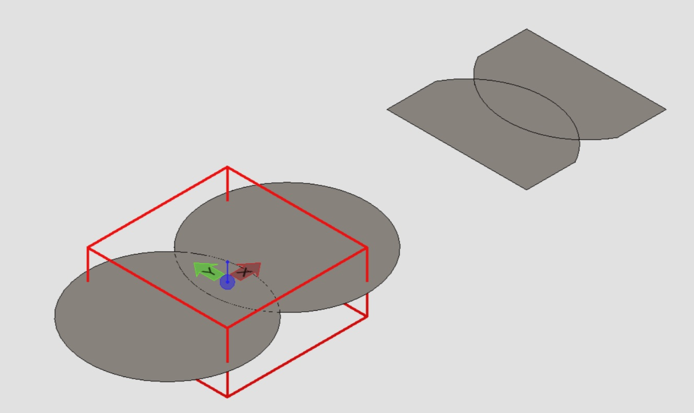
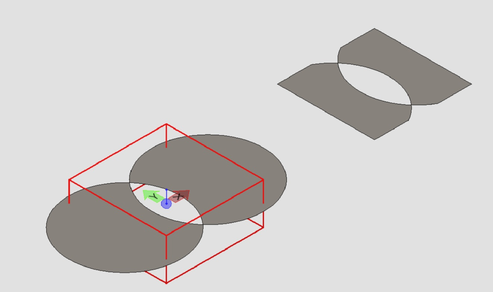
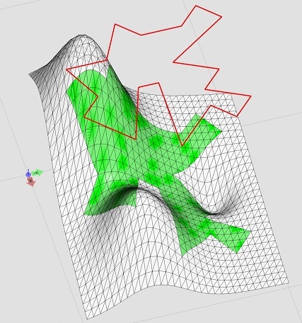

# 4.2.0 Change Notes

Table of contents:

- [Geometry](#geometry)
  - [Clip any curve](#clip-any-curve)
  - [Drape region onto mesh](#drape-region-onto-mesh)
- [Electron 26 support](#electron-26-support)
- [Locating and serializing schemas](#locating-and-serializing-schemas)
- [API Deprecations](#api-deprecations)
- [API Alpha Removals](#api-deprecations)

## Geometry

### Clip any curve

The new method [ClipUtilities.clipAnyCurve]($core-geometry) clips the input curve or region. One just needs to pass an [AnyCurve]($core-geometry) and a [Clipper]($core-geometry), and the method returns the clipped curves or regions that lie inside the clipper.

Here is an example of clipping a union region:

and an example of clipping a parity region:

### Drape region onto mesh

The new method [PolyfaceClip.drapeRegion]($core-geometry) computes the portion of the input [Polyface]($core-geometry) that lies inside the clipper generated by sweeping the input [AnyRegion]($core-geometry) along a direction. For example, the red polygon below is swept downward onto the white mesh, and the green mesh is returned:

## Electron 26 support

In addition to [already supported Electron versions](../learning/SupportedPlatforms.md#electron), iTwin.js now supports [Electron 26](https://www.electronjs.org/blog/electron-26-0).

## Locating and serializing schemas

New APIs like [SchemaLoader]($ecschema-metadata) allow you to [locate schemas](../learning/serializing-xml-schemas.md/#schemas-from-an-imodel) in the context of an iModel.
You can serialize schemas using the new functions [SchemaXml.writeFile]($ecschema-locaters) and [SchemaXml.writeString]($ecschema-locaters).

## API deprecations

### @itwin/appui-abstract

[UiEvent]($appui-abstract) is a duplicate of [BeUiEvent]($bentley). [UiEventDispatcher]($appui-abstract) is only consumed internally from [SyncUiEventDispatcher]($appui-react) in @itwin/appui-react, which should be used in its place. Similarly, [UiSyncEventArgs]($appui-abstract) and [UiSyncEvent] have been also moved to appui-react.

[PointProps]($appui-abstract) was created primarily to avoid a dependency on @itwin/core-geometry, which contains an identical interface named [XAndY]($core-geometry). PointProps is now deprecated in favor of XAndY, or your own simple implementation. Similarly, [UiAdmin.createXAndY]($appui-abstract) has been deprecated.

## Alpha API Removals

### @itwin/appui-abstract

`isLetter` has been removed. Should you need that functionality, please implement it in your own code.

