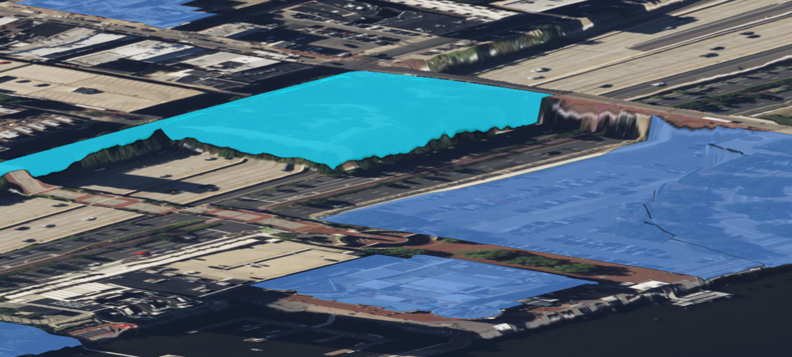

# 4.6.0 Change Notes

Table of contents:

- [Display](#display)
  - [Map layer feature highlighting](#map-layer-feature-highlighting)

## Display

### Map layer feature highlighting

Map layer features can now be highlighted when terrain display is enabled. In the image below, the brighter blue polygon is highlighted.

