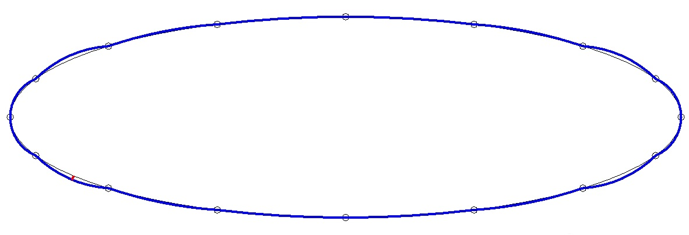
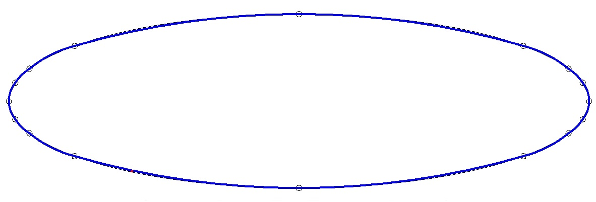
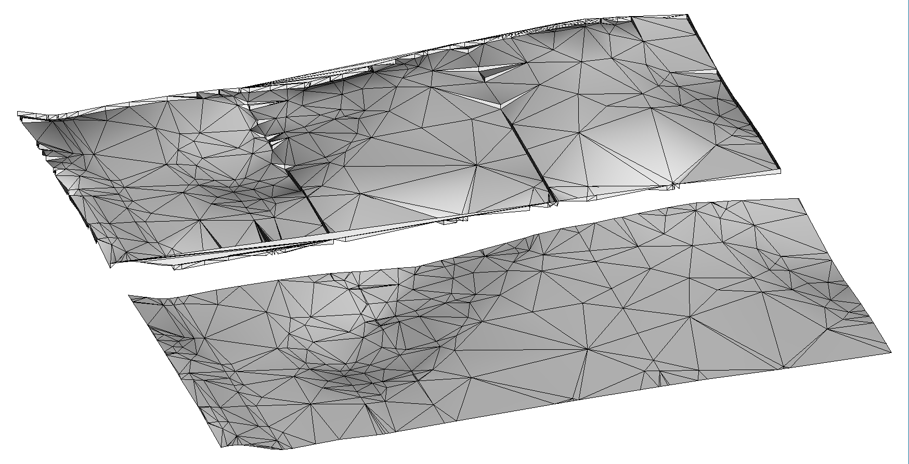

# 4.9.0 Change Notes

Table of contents:

- [Quantity](#quantity)
- [Electron 32 support](#electron-32-support)
- [Geometry](#geometry)
  - [Approximating an elliptical arc with a circular arc chain](#approximating-an-elliptical-arc-with-a-circular-arc-chain)
  - [Triangulating points](#triangulating-points)
- [Display](#display)
  - [Dynamic clip masks](#dynamic-clip-masks)
- [Presentation](#presentation)
  - [Custom content parser for creating element properties](#custom-content-parser-for-creating-element-properties)
  - [ECExpression to get related instance label](#ecexpression-to-get-related-instance-label)
  - [Referencing schema-based categories in property overrides and calculated properties](#referencing-schema-based-categories-in-property-overrides-and-calculated-properties)
  - [Calculated properties specification enhancements](#calculated-properties-specification-enhancements)
  - [API Deprecations](#api-deprecations)

## Quantity

- The `minWidth` property on FormatProps now works as documented.
- The `spacer` property on FormatProps now indicates the space used between composite components, it defaults to a single space, and there is no longer a ':' prepended. If a ':' spacer is desired, `spacer` has to be set accordingly. This is to streamline the behavior with the documentation and native APIs.
- Added support for bearing and azimuth format types (e.g. bearing `N45°30'10"E`). A new phenomenon "Direction" for these will be added to our units library soon, but they work just as well with the angle phenomenon for now. Persistence values for both bearing and azimuth are to be provided counter-clockwise from an east-base (inspired by PowerPlatform).

## Electron 32 support

In addition to [already supported Electron versions](../learning/SupportedPlatforms.md#electron), iTwin.js now supports [Electron 32](https://www.electronjs.org/blog/electron-32-0).

## Geometry

### Approximating an elliptical arc with a circular arc chain

[Arc3d.constructCircularArcChainApproximation]($core-geometry) returns a [CurveChain]($core-geometry) of circular arcs that approximates the elliptical instance arc. Each arc in the chain starts and ends on the ellipse. The ellipse major/minor axis points and tangents are also interpolated, as well as those at the elliptical arc start/end, and the arcs are arranged to preserve ellipse symmetry. Various settings in the optional [EllipticalArcApproximationOptions]($core-geometry) input object control the approximation accuracy. The default method is [EllipticalArcSampleMethod.AdaptiveSubdivision]($core-geometry), which is controlled by a maximum error distance, `options.maxError`. Other values of `options.sampleMethod` interpolate the ellipse in other ways, controlled by the number of points interpolated in a given quadrant, `options.numSamplesInQuadrant`. For a fixed number of samples, the default method usually yields the most accurate approximation.

Pictured below in order of decreasing error are some example approximations in blue, with ellipses in black, sample sites circled, and maximum error segment in red.

Approximation using `options.sampleMethod = EllipticalArcSampleMethod.UniformCurvature` and `options.numSamplesInQuadrant = 5`, yielding error 0.18:


Approximation using `options.sampleMethod = EllipticalArcSampleMethod.UniformParameter` and `options.numSamplesInQuadrant = 5`, yielding error 0.12:



Approximation using `options.sampleMethod = EllipticalArcSampleMethod.NonUniformCurvature`, `options.remapFunction = (x) => x*x`, and `options.numSamplesInQuadrant = 5`, yielding error 0.05:



Approximation using `options.sampleMethod = EllipticalArcSampleMethod.AdaptiveSubdivision` and `options.maxError === 0.05`, yielding error 0.03:


### Triangulating points

[PolyfaceBuilder.pointsToTriangulatedPolyface]($core-geometry), which creates a [Polyface]($core-geometry) from an xy-triangulation of input points, now uses the [StrokeOptions]($core-geometry) input setting `options.chordTol` to control the maximum xy-distance for equating points. This method preserves the highest z-coordinate among points equated in this manner. The default for this setting is [Geometry.smallMetricDistance]($core-geometry), however for typical DTM datasets, a larger tolerance can be used (e.g., 1-2mm) to eliminate extraneous "skirt" points that lie underneath the terrain boundary.

Pictured below are triangulations of a DTM dataset with skirt points. At top is the result using default tolerance. Due to the skirt points having xy-distance greater than the default tolerance from actual terrain sites, they are included in the triangulation, resulting in undesirable near-vertical facets. At bottom is the result using `options.chordTol = 0.002`, which is sufficiently large to remove these artifacts:



## Display

### Dynamic clip masks

[PlanarClipMaskSettings]($common) permit you to mask out (render partially or fully transparent) portions of the background map based on its intersection with other geometry in the scene. Previously, only [GeometricModel]($backend)s and reality models could contribute to the mask. Now, geometry added to the scene dynamically via [TiledGraphicsProvider]($frontend)s can also contribute to the mask. As with reality models, TiledGraphicsProviders' geometry only contributes to the mask in [PlanarClipMaskMode.Priority]($common). You can optionally configure a custom mask priority using [TileTreeReference.planarClipMaskPriority]($frontend) or the newly-added [RenderGraphicTileTreeArgs.planarClipMaskPriority]($frontend). Here's an example of the latter:

```ts
[[include:TileTreeReference_DynamicClipMask]]
```

## Presentation

### Custom content parser for creating element properties

The `getElementProperties` function on the backend [PresentationManager]($presentation-backend) has two overloads:

- For single element case, taking `elementId` and returning an data structure in the form of `ElementProperties`.
- For multiple elements case, taking an optional list of `elementClasses` and returning properties of those elements. While the default form of the returned data structure is `ElementProperties`, just like in single element case, the overload allows for a custom parser function to be provided. In that case the parser function determines the form of the returned data structure.

In this release the overload for single element case was enhanced to also take an optional custom content parser to make the two overloads consistent in this regard. In addition, the `getElementProperties` method on the frontend [PresentationManager]($presentation-frontend) has also been enhanced with this new feature to be consistent with the similar method on the backend.

### ECExpression to get related instance label

A new `GetRelatedDisplayLabel` function symbol has been added to [ECInstance ECExpressions context]($docs/presentation/advanced/ECExpressions.md#ecinstance), allowing retrieval of related instance label. The function takes 3 arguments: full name of a relationship, its direction and related class name. Example usage in [calculated properties specification]($docs/presentation/content/CalculatedPropertiesSpecification.md):

```json
{
  "label": "My Calculated Property",
  "value": "this.GetRelatedDisplayLabel(\"BisCore:ModelContainsElements\", \"Backward\", \"BisCore:Model\")"
}
```

The above specification, when applied to `BisCore:Element` content, will include a "My Calculated Property" property whose value equals to the label of the model that contains the element.

### Referencing schema-based categories in property overrides and calculated properties

In some cases there may be a need to place specific property in the same group as other specific properties. One way to do that is by creating a [property category specification]($docs/presentation/content/PropertyCategorySpecification.md) and assigning it to all such properties. However, what if want to place a property next to other properties, which are categorized through a schema-based category? This is now possible through the new `SchemaCategory` category identifier. For example, to place a calculated property next to an ECProperty that uses `MySchema:MyCategory` category:

```json
{
  "label": "My calculated property",
  "categoryId": {
    "type": "SchemaCategory",
    "categoryName": "MySchema:MyCategory"
  }
}
```

### Calculated properties specification enhancements

A number of enhancements have been made to [calculated properties specification]($docs/presentation/content/CalculatedPropertiesSpecification.md):

- The [`value`]($docs/presentation/content/CalculatedPropertiesSpecification.md#attribute-value) is now optional. If not provided, the value of resulting property will be `undefined`.

- A new optional [`type`]($docs/presentation/content/CalculatedPropertiesSpecification.md#attribute-type) attribute has been added. The attribute allows specifying value type of the calculated property, allowing the property to have other types than `string`. The default value is `string`.

- A new optional [`extendedData`]($docs/presentation/content/CalculatedPropertiesSpecification.md#attribute-extendeddata) attribute has been added. The attribute allows associating resulting calculated properties field with some extra information, which may be especially useful for dynamically created calculated properties.

## API deprecations

### @itwin/appui-abstract

- `LayoutFragmentProps`, `ContentLayoutProps`, `LayoutSplitPropsBase`, `LayoutHorizontalSplitProps`, `LayoutVerticalSplitProps`, and `StandardContentLayouts` have been deprecated. Use the same APIs from `@itwin/appui-react` instead.

- `BackendItemsManager` is internal and should never have been consumed. It has been deprecated and will be removed in 5.0.0. Use `UiFramework.backstage` from `@itwin/appui-react` instead.

