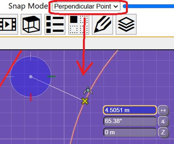
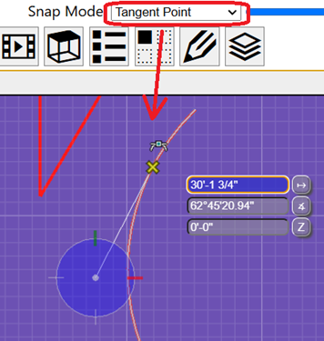
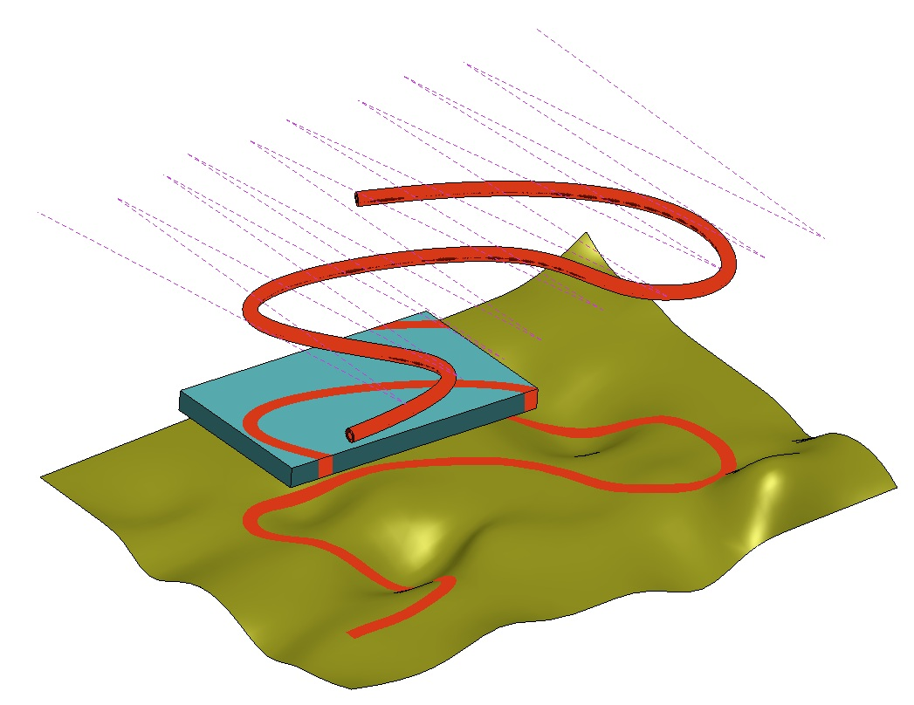

# 5.0.0 Change Notes

Table of contents:

- [New Features](#new-features)
  - [Selection](#selection)
    - [Selection set](#selection-set)
    - [Select by volume](#select-by-volume)
  - [Snapping](#snapping)
  - [Font APIs](#font-apis)
    - [Text Block Margins](#text-block-margins)
  - [Backend](#backend)
    - [Image conversion](#image-conversion)
    - [Delete all transactions](#delete-all-transactions)
    - [Attach/detach db](#attachdetach-db)
  - [Geometry](#geometry)
    - [Polyface Traversal](#polyface-traversal)
    - [Tangent To Curve](#tangent-to-curve)
  - [Graphics](#graphics)
    - [Google Maps 2D Tiles API](#google-maps-2d-tiles-api)
    - [Read image to canvas](#read-image-to-canvas)
    - [Draping iModel models onto reality data or other iModel models](#draping-imodel-models-onto-reality-data-or-other-imodel-models)
    - [Reading contour lines](#reading-contour-lines)
  - [Presentation](#presentation)
    - [Unified selection move to `@itwin/unified-selection`](#unified-selection-move-to-itwinunified-selection)
    - [Localization assets in `@itwin/presentation-common`](#localization-assets-in-itwinpresentation-common)
    - [Internal APIs](#internal-apis)
  - [Quantity Formatting](#quantity-formatting)
    - [FormatDefinition](#formatdefinition)
    - [FormatsProvider](#formatsprovider)
    - [Persistence](#persistence)
    - [Migrating From QuantityType to KindOfQuantity](#migrating-from-quantitytype-to-kindofquantity)
- [API deprecations](#api-deprecations)
  - [@itwin/appui-abstract](#itwinappui-abstract)
  - [@itwin/core-backend](#itwincore-backend)
    - [Deprecated metadata retrieval methods](#deprecated-metadata-retrieval-methods)
  - [@itwin/core-bentley](#itwincore-bentley)
  - [@itwin/core-common](#itwincore-common)
  - [@itwin/core-frontend](#itwincore-frontend)
  - [@itwin/ecschema-rpcinterface-common](#itwinecschema-rpcinterface-common)
  - [@itwin/presentation-backend](#itwinpresentation-backend)
  - [@itwin/presentation-common](#itwinpresentation-common)
  - [@itwin/presentation-frontend](#itwinpresentation-frontend)
- [Breaking Changes](#breaking-changes)
  - [API Support Policy](#api-support-policy)
  - [Updated minimum requirements](#updated-minimum-requirements)
    - [Node.js](#nodejs)
    - [Electron](#electron)
    - [ECMAScript](#ecmascript)
    - [TypeScript](#typescript)
      - [`target`](#target)
      - [`useDefineForClassFields`](#usedefineforclassfields)
  - [Preventing Doppelgangers](#preventing-doppelgangers)
  - [Deprecated API removals](#deprecated-api-removals)
    - [@itwin/appui-abstract](#itwinappui-abstract-1)
    - [@itwin/core-backend](#itwincore-backend-1)
    - [@itwin/core-bentley](#itwincore-bentley-1)
    - [@itwin/core-common](#itwincore-common-1)
    - [@itwin/core-electron](#itwincore-electron)
    - [@itwin/core-frontend](#itwincore-frontend-1)
    - [@itwin/core-geometry](#itwincore-geometry)
    - [@itwin/presentation-common](#itwinpresentation-common-1)
    - [@itwin/presentation-backend](#itwinpresentation-backend-1)
    - [@itwin/presentation-frontend](#itwinpresentation-frontend-1)
  - [API removals](#api-removals)
    - [@itwin/core-common](#itwincore-common-2)
  - [Peer Dependency changes](#peer-dependency-changes)
    - [@itwin/core-frontend](#itwincore-frontend-2)
  - [Packages dropped](#packages-dropped)
  - [Opening connection to local snapshot requires IPC](#opening-connection-to-local-snapshot-requires-ipc)
  - [Change to `pullMerge`](#change-to-pullmerge)
    - [No pending/local changes](#no-pendinglocal-changes)
    - [With pending/local changes](#with-pendinglocal-changes)
  - [Reworked @itwin/ecschema-metadata package](#reworked-itwinecschema-metadata-package)
    - [Tips for adjusting existing code](#tips-for-adjusting-existing-code)
  - [Changes to getElement and getModel](#changes-to-getelement-and-getmodel)

## New Features

### Selection

#### Selection set

There are two similar selection-related concepts in `@itwin/core-frontend` - [SelectionSet]($core-frontend) and [HiliteSet]($core-frontend). The former is generally used by interactive tools (e.g. the "Move element" tool), so it contains what tools think is selected. The latter is used by the graphics system to know what elements to highlight, so it contains what users think is selected. Generally, we want the two sets to be in sync to avoid confusion why tools act on different elements than what users think are selected. Keeping them in sync was not always possible, because `HiliteSet` may store Model and SubCategory ids, but `SelectionSet` could only store Element ids. So we could end up in situations where a Model id is added to `HiliteSet` and `SelectionSet` is empty, making users think that all elements in that model are selected, but tools not knowing anything about it.

To alleviate this problem, the `SelectionSet`-related APIs have been enhanced to support storing Model and SubCategory ids, similar to what `HiliteSet` does. The change has been made in a backwards compatible way, so all existing code using `SelectionSet` should continue to work as before:

- `SelectionSet` modification methods `add`, `addAndRemove`, `remove`, `replace` now, in addition to existing `Id64Arg` argument, accept the `SelectableIds` structure.
- `SelectionSetEvent` attributes `added` and `removed` have been deprecated, but continue to work as before, containing only element ids. In addition, the event object now contains new `additions` and `removals` attributes, which are instances of `SelectableIds` and contain all ids that were added or removed from the selection set, including those of Model and SubCategory.

Because the `SelectionSet` now stores additional types of ids, existing code that listens to `onChange` event may start getting extra invocations that don't affect the element selection (e.g. `SelectAddEvent` with `added: []` and `additions: { models: ["0x1"] }`). Also, the `isActive` getter may return `true` even though `elements` set is empty.

#### Select by volume

By default a box select with the selection tool will only identify visible elements (i.e. elements that light up a pixel in the current view). Sometimes it is desirable to select all elements that are inside or overlap the box regardless of whether they are currently obscured by other elements. Applications can now change [ToolSettings.enableVolumeSelection]($core-frontend) to enable box selection by volume in spatial views.

The following protected methods on SelectTool had their signature changed to support volume selection:

- [SelectTool.selectByPointsProcess]($core-frontend)
- [SelectTool.selectByPointsEnd]($core-frontend)

### Snapping

Added [SnapMode.PerpendicularPoint]($core-frontend). Snaps to the closest/perpendicular point on the curve under the cursor from the AccuDraw origin.



Added [SnapMode.TangentPoint]($core-frontend). Snaps to the closest point of tangency on the curve under the cursor that will pass through the AccuDraw origin.



### Font APIs

[Fonts](../learning/backend/Fonts.md) control the appearance and layout of [TextAnnotation]($common)s. To apply a font to text stored in a [GeometryStream](../learning/common/GeometryStream.md), the font must first be embedded into the iModel. Two new APIs permit you to work with fonts:

- [FontFile]($backend) represents a font obtained from a digital representation like a file on disk.
- [IModelDb.fonts]($backend) permits you to read and write font-related information, including [FontFile]($backend)s, into an [IModelDb]($backend).

Consult the [learning article](../learning/backend/Fonts.md) for details and example code.

#### Text Block Margins

You can now surround a [TextBlock]($core-common) with padding by setting its [TextBlockMargins]($core-common). When [layoutTextBlock]($core-backend) computes [TextBlockLayout.range]($core-backend), it will expand the bounding box to include the margins. [ProduceTextAnnotationGeometryArgs.debugAnchorPointAndRange]($core-backend) now produces two bounding boxes: one tightly fitted to the text, and a second expanded to include the margins.

### Backend

#### Image conversion

`@itwin/core-backend` provides two new APIs for encoding and decoding images:

- [imageBufferFromImageSource]($backend) converts a PNG or JPEG image into a bitmap image
- [imageSourceFromImageBuffer]($backend) performs the inverse conversion.

#### Delete all transactions

[BriefcaseDb.txns]($backend) keeps track of all unsaved and/or unpushed local changes made to a briefcase. After pushing your changes, the record of local changes is deleted. In some cases, a user may wish to abandon all of their accumulated changes and start fresh. [TxnManager.deleteAllTxns]($backend) deletes all local changes without pushing them.

#### Attach/detach db

Allow the attachment of an ECDb/IModel to a connection and running ECSQL that combines data from both databases.

```ts
[[include:IModelDb_attachDb.code]]
```

> Note: There are some reserve alias names that cannot be used. They are 'main', 'schema_sync_db', 'ecchange' & 'temp'

### Geometry

#### Polyface Traversal

Conventional [IndexedPolyface]($core-geometry) data defines each facet by a sequence of point indices around the facet, however these indices do not indicate which facet is adjacent across an edge, nor do they indicate which facets are adjacent at a vertex. The topology of the mesh is incomplete.

The new class [IndexedPolyfaceWalker]($core-geometry) has methods to complete the topology of an `IndexedPolyface` and to navigate these adjacencies. A one-time call to [IndexedPolyfaceWalker.buildEdgeMateIndices]($core-geometry) populates a new optional index array of the [PolyfaceData]($core-geometry). This array stores the cross-edge relationship, and is valid as long as the mesh topology is unchanged. After this step, the following queries support navigation around a facet, around a vertex, and across an edge. Given an `IndexedPolyfaceWalker` object that refers to a particular edge:

- [IndexedPolyfaceWalker.nextAroundFacet]($core-geometry) and [IndexedPolyfaceWalker.previousAroundFacet]($core-geometry) return a walker referring to the next/previous edge around the facet.
- [IndexedPolyfaceWalker.nextAroundVertex]($core-geometry) and [IndexedPolyfaceWalker.previousAroundVertex]($core-geometry) return a walker referring to the next/previous edge around the edges' start vertex.
- [IndexedPolyfaceWalker.edgeMate]($core-geometry) returns a walker referring to the matched edge in the adjacent facet.

If a walker operation would advance outside the mesh (e.g., `edgeMate` of a boundary edge), it returns an invalid walker.

#### Tangent To Curve

A new API [CurvePrimitive.emitTangents]($core-geometry) is added to announce tangents from a space point to a curve primitive. This API takes a callback to announce each computed tangent so users can specify the callback according to their need. For example, we have created 2 specific APIs to take advantage of the new API. First API is [CurvePrimitive.allTangents]($core-geometry) which returns all tangents from a space point to a curve primitive. Second API is [CurvePrimitive.closestTangent]($core-geometry) which returns the closest tangent from a space point to a curve primitive with respect to a hint point.

### Graphics

#### Google Maps 2D Tiles API

The `@itwin/map-layers-formats` package now includes an API for consuming [Google Maps 2D tiles](https://developers.google.com/maps/documentation/tile/2d-tiles-overview).

To enable it as a base map, it's as simple as:

```typescript
import { GoogleMaps } from "@itwin/map-layers-formats";
const ds = IModelApp.viewManager.selectedView.displayStyle;
ds.backgroundMapBase = GoogleMaps.createBaseLayerSettings();
```

Can also be attached as a map-layer:

```typescript
[[include:GoogleMaps_AttachMapLayerSimple]]
```

> **_IMPORTANT_**: Make sure to configure your Google Cloud's API key in the `MapLayerOptions` when starting your IModelApp application:

```typescript
[[include:GoogleMaps_SetGoogleMapsApiKey]]
```

Optionally, a custom session manager can be specified to get control over the session management and request URLs.:

```typescript
[[include:GoogleMaps_SetGoogleMapsSessionManager]]
```

#### Read image to canvas

Previously, when using [Viewport.readImageToCanvas]($core-frontend) with a single open viewport, canvas decorations were not included in the saved image. Sometimes this behavior was useful, so an overload to [Viewport.readImageToCanvas]($core-frontend) using the new [ReadImageToCanvasOptions]($core-frontend) interface was [created](https://github.com/iTwin/itwinjs-core/pull/7539). This now allows the option to choose whether or not canvas decorations are omitted in the saved image: if [ReadImageToCanvasOptions.omitCanvasDecorations]($core-frontend) is true, canvas decorations will be omitted.

If [ReadImageToCanvasOptions]($core-frontend) are undefined in the call to [Viewport.readImageToCanvas]($core-frontend), previous behavior will persist and canvas decorations will not be included. This means canvas decorations will not be included when there is a single open viewport, but will be included when there are multiple open viewports. All existing calls to [Viewport.readImageToCanvas]($core-frontend) will be unaffected by this change as the inclusion of [ReadImageToCanvasOptions]($core-frontend) is optional, and when they are undefined, previous behavior will persist.

#### Draping iModel models onto reality data or other iModel models

A new property titled `drapeTarget` has been added to [ModelMapLayerProps]($common) and [ModelMapLayerSettings]($common). When this property is specified as [ModelMapLayerDrapeTarget.RealityData]($common), the model map layer will be only draped onto all attached reality data. When this property is specified as [ModelMapLayerDrapeTarget.IModel]($common), the model map layer will be only draped onto all models within the iModel. If `drapeTarget` is not specified in the properties, the drape target will default to [ModelMapLayerDrapeTarget.Globe]($common), which will only drape the model map layer onto the globe.

Here is a sample screenshot of draping a model from within an iModel (the piping in the air) onto some glTF reality data (the terrain underneath):

 onto some glTF reality data (the terrain underneath)")

Here is a sample screenshot of draping a model from within an iModel onto all models from that same iModel. The red piping model is draping onto all models (even itself); all of these models are contained within the same iModel.



#### Reading contour lines

When a [HitDetail]($frontend) originates from a [contour line](../learning/display/ContourDisplay.md), the new [HitDetail.contour]($frontend) property now provides the elevation of the contour line, whether it is a major or minor contour, and from which [ContourGroup]($common) it originated. The same information is available in the `contour` property of the [Pixel.Data]($frontend) objects produced by [Viewport.readPixels]($frontend).

### Presentation

The Presentation system is moving towards a more modular approach, with smaller packages intended for more specific tasks and having less peer dependencies. You can find more details about that in the [README of `@itwin/presentation` repo](https://github.com/iTwin/presentation/blob/master/README.md#the-packages). As part of that move, some Presentation APIs in `@itwin/itwinjs-core` repository, and, more specifically, 3 Presentation packages: `@itwin/presentation-common`, `@itwin/presentation-backend`, and `@itwin/presentation-frontend` have received a number of deprecations for APIs that already have replacements.

#### Unified selection move to `@itwin/unified-selection`

The unified selection system has been part of `@itwin/presentation-frontend` for a long time, providing a way for apps to have a single source of truth of what's selected. This system is now deprecated in favor of the new [@itwin/unified-selection](https://www.npmjs.com/package/@itwin/unified-selection) package. See the [migration guide](https://github.com/iTwin/presentation/blob/master/packages/unified-selection/learning/MigrationGuide.md) for migration details.

#### Localization assets in `@itwin/presentation-common`

The `@itwin/presentation-common` delivers a localization file used by either `@itwin/presentation-backend` or `@itwin/presentation-frontend`, depending on where the localization is needed. Backend and frontend code expects to find localization assets under different directories:

- Frontend looks for localization assets under `lib/public/locales` directory.
- Backend used to look for localization assets under `lib/cjs/assets/locales` directory. This directory has been changed to `lib/assets/locales` to avoid duplication between `cjs` and `esm` builds. Anyone looking for localization assets in code can find then using `@itwin/presentation-common/locales/en/Presentation.json` import path.

#### Internal APIs

The Presentation packages exported a number of `@internal` APIs through the public barrel files. These APIs were never intended for consumers' use and have been removed from the public barrels to avoid accidental usage.

### Quantity Formatting

#### FormatDefinition

A [FormatDefinition]($quantity) interface has been added, an extension of FormatProps to help identify formats.

#### FormatsProvider

[FormatsProvider]($quantity) and [MutableFormatsProvider]($quantity) interfaces and a [SchemaFormatsProvider]($ecschema-metadata) class have been added. This enables quick setup of [FormatterSpec]($quantity) and [ParserSpec]($quantity) to help with display formatting.

In addition, [IModelApp]($core-frontend) now accepts an optional `FormatsProvider` for use across a frontend application, defaulting to an internal implementation that uses [QuantityType]($core-frontend). The implementation of this default provider will be updated when `QuantityType` is deprecated in 5.x lifecycle.

#### Persistence

Following APIs have been added to support persistence:

- [FormatSet]($ecschema-metadata) defines an interface to support loading/saving [Format]($ecschema-metadata).

Learn more at the [Quantity](../learning/quantity/index.md#persistence) learnings article for examples and use cases.

#### Migrating From QuantityType to KindOfQuantity

We are moving away from using [QuantityType]($core-frontend) in favor of [KindOfQuantity]($ecschema-metadata) [EC full name](https://www.itwinjs.org/bis/ec/ec-name/#full-name). See [Migrating from QuantityType to KindOfQuantity](../learning/frontend/QuantityFormatting.md#migrating-from-quantitytype-to-kindofquantity) for explanations on replacements to `QuantityType`.

Here are 2 ways to retrieve formats, given an EC Full Name for a `KindOfQuantity`:

1. For async eligible workflows, you can call `IModelApp.formatsProvider.getFormat(kindOfQuantityName)` to get a FormatProps object, and construct the formatting specs ([new helper methods](https://github.com/iTwin/itwinjs-core/blob/master/core/frontend/src/quantity-formatting/QuantityFormatter.ts#L1089-L1111)). There is a concern about having to pass in a valid persistenceUnit name, but the kindOfQuantityName can be used to lookup the KoQ schemaItem and retrieve the persistenceUnit. If this workflow is too expensive, and you're concerned about the time it takes to get formats on demand, you can follow option 2.
2. For sync only workflows, use [getSpecsByName](https://github.com/iTwin/itwinjs-core/blob/master/core/frontend/src/quantity-formatting/QuantityFormatter.ts#L1113-L1119). The `IModelApp.quantityFormatter` acts as a cache for the formatting specs and listens to formatsChanged events. Applications or tools can call [addFormattingSpecsToRegistry](https://github.com/iTwin/itwinjs-core/blob/master/core/frontend/src/quantity-formatting/QuantityFormatter.ts#L1121-L1148) on startup, or ahead of time.

## API deprecations

### @itwin/appui-abstract

- The `quantityType` property in `PropertyDescription` has been deprecated, in favor of a new optional property, `kindOfQuantityName`. This was done to follow the [migration away from using QuantityType enums.](#migrating-from-quantitytype-to-kindofquantity)

### @itwin/core-backend

- Use [IModelDb.fonts]($backend) instead of [IModelDb.fontMap]($backend).
- Added dependency to `@itwin/ecschema-metadata` and exposed the metadata from various spots (IModelDb, Entity).

#### Deprecated metadata retrieval methods

The `IModelDb.getMetaData(classFullName: string)` method has been deprecated in version 5.0. This method was used to get metadata for a class and would load the metadata from the iModel into the cache, if necessary.

Similarly, other functions to retrieve metadata also have replacements:

| **Deprecated from `@itwin/core-backend`** | **Replacement function**                                         | Usage                                                                          |
| ----------------------------------------- | ---------------------------------------------------------------- | ------------------------------------------------------------------------------ |
| `Element.getClassMetaData`                | Use `Element.getMetaData` from `@itwin/core-backend` instead.    | `await entity.getMetaData()`                                                   |
| `Entity.forEachProperty`                  | Use `Entity.forEach` from `@itwin/core-backend` instead.         | `entity.forEach(callback)`                                                     |
| `IModelDb.classMetaDataRegistry` getter   | Use `getSchemaItemSync` from `@itwin/ecschema-metadata` instead. | `imodel.schemaContext.getSchemaItemSync("SchemaName.ClassName", EntityClass);` |
| `IModelDb.getMetaData`                    | Use `getSchemaItemSync` from `@itwin/ecschema-metadata` instead. | `imodel.schemaContext.getSchemaItemSync("SchemaName.ClassName", EntityClass);` |
| `IModelDb.tryGetMetaData`                 | Use `getSchemaItemSync` from `@itwin/ecschema-metadata` instead. | `schemaContext.getSchemaItemSync("BisCore.Element", EntityClass)`              |
| `IModelDb.forEachMetaData`                | Use `Entity.forEach` from `@itwin/core-backend` instead.         | `entity.forEach(callback)`                                                     |
| `MetaDataRegistry` class                  | Use `getSchemaItemSync` from `@itwin/ecschema-metadata` instead. | `imodel.schemaContext.getSchemaItemSync("SchemaName.ClassName", EntityClass);` |

**Example function templates:**

```typescript
// Deprecated method
iModelDb.getMetaData("SchemaName:ClassName");

// Replacement using schemaContext with a schema key/schemaName-itemName combination/schema item full name
await iModelDb.schemaContext.getSchemaItem(schemaItemKey);
await iModelDb.schemaContext.getSchemaItem("SchemaName", "ClassName");
await iModelDb.schemaContext.getSchemaItem("SchemaName:ClassName");
await iModelDb.schemaContext.getSchemaItem("SchemaName.ClassName");
```

> The `schemaContext.getSchemaItem` function has a synchronous version as well `schemaContext.getSchemaItemSync` which supports all the same parameters as the asynchronous function. Refer to the examples [below](#deprecated-metadata-retrieval-methods).

The deprecated `imodel.getMetaData()` function was limited to only Entity classes.
The replacement method `schemaContext.getSchemaItem` on the iModel can fetch the metadata for all types of schema items.

**Examples:**

```typescript
const metaData: RelationshipClass | undefined = await imodelDb.schemaContext.getSchemaItem("BisCore.ElementRefersToElements", RelationshipClass);
const metaData: Enumeration | undefined = await imodelDb.schemaContext.getSchemaItem("BisCore.AutoHandledPropertyStatementType", Enumeration);
const metaData: UnitSystem | undefined = await imodelDb.schemaContext.getSchemaItem("Units.SI", UnitSystem);
const metaData: Format | undefined = await imodelDb.schemaContext.getSchemaItem("Formats.DefaultReal", Format);
const metaData: KindOfQuantity | undefined = await imodelDb.schemaContext.getSchemaItem("TestSchema.TestKoQ", KindOfQuantity);
```

### @itwin/core-bentley

- The [IDisposable]($core-bentley) interface, along with related [isIDisposable]($core-bentley) and [using]($core-bentley) utilities, have been deprecated in favor of [TypeScript's built-in](https://www.typescriptlang.org/docs/handbook/release-notes/typescript-5-2.html#using-declarations-and-explicit-resource-management) `Disposable` type and `using` declarations (from the upcoming [Explicit Resource Management](https://github.com/tc39/proposal-explicit-resource-management) feature in ECMAScript).

  For example, the following:

  ```typescript
  import { using } from "@itwin/core-bentley";
  export function doSomeWork() {
    using(new SomethingDisposable(), (temp) => {
      // do something with temp
    });
  }
  ```

  should now be rewritten as:

  ```typescript
  export function doSomeWork() {
    using temp = new SomethingDisposable();
    // do something with temp
  }
  ```

  > Note that while public types with deterministic cleanup logic in iTwin.js will continue to implement _both_ `IDisposable` and `Disposable` until the former is fully removed in iTwin.js 7.0 (in accordance with our [API support policy](../learning/api-support-policies)), disposable objects should still only be disposed once - _either_ with [IDisposable.dispose]($core-bentley) _or_ `Symbol.dispose()` but not both! Where possible, prefer `using` declarations or the [dispose]($core-bentley) helper function over directly calling either method.

### @itwin/core-common

- [FontMap]($common) attempts to provide an in-memory cache mapping [FontId]($common)s to [Font](../learning/backend/Fonts.md) names. Use [IModelDb.fonts]($backend) instead.
- Some types which are now more comprehensively exposed by backend's new `@itwin/ecschema-metadata` integration were made deprecated:
  - [EntityMetaData]($common)
  - [EntityMetaDataProps]($common)
  - [CustomAttribute]($common)
  - [PropertyMetaData]($common)
  - [PropertyMetaDataProps]($common)

| **Deprecated class from `@itwin/core-common`** | **Replacement class from `@itwin/ecschema-metadata`** |
| ---------------------------------------------- | ----------------------------------------------------- |
| `EntityMetaData`                               | Use `EntityClass` instead.                            |
| `CustomAttribute`                              | Use `CustomAttribute` instead.                        |
| `PropertyMetaData`                             | Use `Property` instead.                               |

### @itwin/core-frontend

- Deprecated [SelectionSet]($core-frontend)-related APIs:

  - `SelectionSet.has` and `SelectionSet.isSelected` - use `SelectionSet.elements.has(id)` instead.
  - `SelectionSetEvent.added` and `SelectionSetEvent.removed` - use `SelectionSetEvent.additions.elements` and `SelectionSetEvent.removals.elements` instead.

- Deprecated [HiliteSet.setHilite]($core-frontend) - use `add`, `remove`, `replace` methods instead.

- Deprecated synchronous [addLogoCards]($core-frontend)-related APIs in favor of new asynchronous ones:

  - `TileTreeReference.addLogoCard` : use `addAttributions` method instead
  - `MapLayerImageryProvider.addLogoCard` : use `addAttributions` method instead

- [IModelConnection.fontMap]($frontend) caches potentially-stale mappings of [FontId]($common)s to font names. If you need access to font Ids on the front-end for some reason, implement an [Ipc method](../learning/IpcInterface.md) that uses [IModelDb.fonts]($backend).

- Deprecated `quantityType` getter for [LengthDescription]($core-frontend), [SurveyLengthDescription]($core-frontend), [EngineeringLengthDescription]($core-frontend), and [AngleDescription]($core-frontend). Use `kindOfQuantityName` property of those classes instead.

### @itwin/ecschema-rpcinterface-common

- The `getSchemaSync` method in `ECSchemaRpcLocater` has been deprecated in version 5.0. This method is not supported for locating schemas over RPC/HTTP. Instead, use the asynchronous `getSchema` method for schema retrieval.

**Reason for deprecation:**
The synchronous `getSchemaSync` method is incompatible with the asynchronous nature of RPC/HTTP operations. It always throws an error and should not be used.

**Replacement:**
Use the `getSchema` method, which is asynchronous and designed for retrieving schemas over RPC/HTTP.

**Example:**

```typescript
// Deprecated usage
const schema = context.getSchemaSync(schemaKey, SchemaMatchType.Exact);

// Recommended usage
const schema = await context.getSchema(schemaKey, SchemaMatchType.Exact);
```

### @itwin/presentation-backend

- All unified-selection related APIs have been deprecated in favor of the new `@itwin/unified-selection` package (see [Unified selection move to `@itwin/unified-selection`](#unified-selection-move-to-itwinunified-selection) section for more details). Affected APIs:
  - `PresentationManager.computeSelection`,
  - `PresentationManager.getSelectionScopes`.

### @itwin/presentation-common

- All public methods of [PresentationRpcInterface]($presentation-common) have been deprecated. Going forward, RPC interfaces should not be called directly. Public wrappers such as [PresentationManager]($presentation-frontend) should be used instead.
- `PresentationStatus.BackendTimeout` has been deprecated as it's no longer used. The Presentation library now completely relies on RPC system to handle timeouts.
- `imageId` properties of [CustomNodeSpecification]($presentation-common) and [PropertyRangeGroupSpecification]($presentation-common) have been deprecated. [ExtendedData](../presentation/customization/ExtendedDataUsage.md#customize-tree-node-item-icon) rule should be used instead.
- `fromJSON` and `toJSON` methods of [Field]($presentation-common), [PropertiesField]($presentation-common), [ArrayPropertiesField]($presentation-common), [StructPropertiesField]($presentation-common) and [NestedContentField]($presentation-common) have been deprecated. Use `fromCompressedJSON` and `toCompressedJSON` methods instead.
- `ItemJSON.labelDefinition` has been deprecated in favor of newly added optional `label` property.
- `NestedContentValue.labelDefinition` has been deprecated in favor of newly added optional `label` property.
- All unified-selection related APIs have been deprecated in favor of the new `@itwin/unified-selection` package (see [Unified selection move to `@itwin/unified-selection`](#unified-selection-move-to-itwinunified-selection) section for more details). Affected APIs:
  - `ComputeSelectionRequestOptions`,
  - `ComputeSelectionRpcRequestOptions`,
  - `ElementSelectionScopeProps`,
  - `SelectionScope`,
  - `SelectionScopeProps`,
  - `SelectionScopeRequestOptions`,
  - `SelectionScopeRpcRequestOptions`.

### @itwin/presentation-frontend

- All unified-selection related APIs have been deprecated in favor of the new `@itwin/unified-selection` package (see [Unified selection move to `@itwin/unified-selection`](#unified-selection-move-to-itwinunified-selection) section for more details). Affected APIs:
  - `createSelectionScopeProps`,
  - `HiliteSet`,
  - `HiliteSetProvider`,
  - `HiliteSetProviderProps`,
  - `ISelectionProvider`,
  - `Presentation.selection`,
  - `PresentationProps.selection`,
  - `SelectionChangeEvent`,
  - `SelectionChangeEventArgs`,
  - `SelectionChangesListener`,
  - `SelectionChangeType`,
  - `SelectionHandler`,
  - `SelectionHandlerProps`,
  - `SelectionHelper`,
  - `SelectionManager`,
  - `SelectionManagerProps`,
  - `SelectionScopesManager`,
  - `SelectionScopesManagerProps`.

## Breaking Changes

### API Support Policy

iTwin.js 5.0 is a major release, and as such, it introduces breaking changes to the API. We have made every effort to ensure that these changes are well-documented and that migration paths are provided where possible. Please refer to the updated [API Support Policy](../learning/api-support-policies.md) for more information on our support policies and how they apply to this release.

We have introduced the concept of a new `@preview` tag to be used for APIs that are stable within the current major version but may change in the next major version. This tag is intended to help developers identify APIs that are not yet fully stable (`@public`) and may require adjustments in future releases.

Deprecation notices now include specific dates that indicate the earliest time a deprecated API can be removed. This is to provide developers with a clear timeline for when they need to migrate away from deprecated APIs. Specific grace periods are now defined as **one year** for `@public` APIs and **three months** for `@preview` APIs. This is a departure from the previous policy of waiting until major version `N+2` for removal of an API deprecated in major version `N`; which was often too long and led to confusion about when APIs would actually be removed.

### Updated minimum requirements

A new major release of iTwin.js affords us the opportunity to update our requirements to continue to provide modern, secure, and rich libraries. Please visit our [Supported Platforms](../learning/SupportedPlatforms.md) documentation for a full breakdown.

Support for Intel architecture on macOS and iOS Simulator was removed in iTwin.js 5.0. Both now require an Apple Silicon Mac (M1 or later).

#### Node.js

Node.js 18 has reached [end-of-life](https://github.com/nodejs/release?tab=readme-ov-file#release-schedule) and is no longer supported. iTwin.js 5.0 requires a minimum of Node 20.11.0, though we recommend using the latest long-term-support version.

#### Electron

iTwin.js now supports only [Electron 35](https://www.electronjs.org/blog/electron-35-0) and [Electron 36](https://www.electronjs.org/blog/electron-36-0). Support for all older Electron releases were dropped. This decision was made because Electron releases major updates much more frequently than iTwin.js and it is difficult to support a high number of major versions.

#### ECMAScript

`@itwin/build-tools` has bumped the [TypeScript compilation target](https://www.typescriptlang.org/tsconfig#target) from [ES2021](https://262.ecma-international.org/12.0/) to [ES2023](https://262.ecma-international.org/14.0/). This means that JavaScript files provided by core packages should be run in [environments supporting ES2023 features](https://compat-table.github.io/compat-table/es2016plus/).

#### TypeScript

There are number of changes made to base TypeScript configuration available in `@itwin/build-tools` package.

##### `target`

[`target`](https://www.typescriptlang.org/tsconfig/#target) is now set to `ES2023` instead of `ES2021`.

##### `useDefineForClassFields`

Starting in `ES2022`, Typescript compile flag for [`useDefineForClassFields`](https://www.typescriptlang.org/tsconfig/#useDefineForClassFields) defaults to `true` ([TypeScript release notes on `useDefineForClassFields` flag](https://www.typescriptlang.org/docs/handbook/release-notes/typescript-3-7.html#the-usedefineforclassfields-flag-and-the-declare-property-modifier)).

This may cause issues for classes which have [Entity]($backend) class as an ancestor and initialize their properties using [Entity]($backend) constructor (note: example uses simplified [Element]($backend) class):

```ts
interface MyElementProps extends ElementProps {
  property: string;
}

class MyElement extends Element {
  public property!: string;

  constructor(props: MyElementProps) {
    super(props);
  }
}

const myElement = new MyElement({ property: "value" });
console.log(myElement.property); // undefined
```

To fix this, you can either initialize your properties in your class constructor:

```ts
class MyElement extends Element {
  public property: string;

  constructor(props: MyElementProps) {
    super(props);
    property = props.property;
  }
}
```

or just define your properties using `declare` keyword:

```ts
class MyElement extends Element {
  declare public property: string;
  ...
}
```

### Preventing Doppelgangers

Previously, applications could inadvertently include multiple instances of the same iTwin.js core package (known as _"doppelgangers"_). This could happen due to dependency misconfiguration, incorrect bundling, or mixing module systems. Doppelgangers create several serious issues:

- _Non-single singletons_: Services intended to be singletons become duplicated, causing state inconsistencies
- _Duplicate types_: Type checking failures when comparing identical types from different package instances
- _Semantically different behavior_: Different versions of the same code running simultaneously

For more details on the consequences of doppelgangers, see the Microsoft [Rush.js](https://rushjs.io/) project's documentation on the [consequences of doppelgangers](https://github.com/microsoft/rushstack-websites/blob/main/websites/rushjs.io/docs/pages/advanced/npm_doppelgangers.md#consequences-of-doppelgangers).

In iTwin.js 5.0, we've implemented a robust doppelganger detection mechanism using JavaScript [Symbol](https://developer.mozilla.org/en-US/docs/Web/JavaScript/Reference/Global_Objects/Symbol)s. When a core package is loaded for the first time, it registers its presence in the global scope with a unique symbol. If the same package is loaded again (from a different instance), the system detects this conflict and throws a detailed error message with stack traces showing:

1. Where the package was first loaded
2. Where the duplicate loading attempt occurred

This early detection prevents hard-to-diagnose runtime errors by immediately identifying the duplicate package problem with actionable information for resolution.

### Deprecated API removals

The following previously-deprecated APIs have been removed:

#### @itwin/appui-abstract

The following APIs have been removed in `@itwin/appui-abstract`.

| **Removed**                         | **Replacement**                                                                        |
| ----------------------------------- | -------------------------------------------------------------------------------------- |
| `AbstractStatusBarActionItem`       | Use `StatusBarActionItem` in `@itwin/appui-react` instead.                             |
| `AbstractStatusBarCustomItem`       | Use `StatusBarCustomItem` in `@itwin/appui-react` instead.                             |
| `AbstractStatusBarItem`             | Use `CommonStatusBarItem` in `@itwin/appui-react` instead.                             |
| `AbstractStatusBarItemUtilities`    | Use `StatusBarItemUtilities` in `@itwin/appui-react` instead.                          |
| `AbstractStatusBarLabelItem`        | Use `StatusBarLabelItem` in `@itwin/appui-react` instead.                              |
| `AbstractWidgetProps`               | Use `Widget` in `@itwin/appui-react` instead.                                          |
| `AllowedUiItemProviderOverrides`    | `AllowedUiItemProviderOverrides` in `@itwin/appui-react`.                              |
| `BackstageActionItem`               | `BackstageActionItem` in `@itwin/appui-react`.                                         |
| `BackstageItem`                     | `BackstageItem` in `@itwin/appui-react`.                                               |
| `BackstageItemType`                 | Use Type Guard instead.                                                                |
| `BackstageItemsChangedArgs`         | N/A                                                                                    |
| `BackstageItemsManager`             | N/A                                                                                    |
| `BackstageItemUtilities`            | `BackstageItemUtilities` in `@itwin/appui-react`.                                      |
| `BackstageStageLauncher`            | `BackstageStageLauncher` in `@itwin/appui-react`.                                      |
| `BaseUiItemsProvider`               | `BaseUiItemsProvider` in `@itwin/appui-react`.                                         |
| `CommonBackstageItem`               | `CommonBackstageItem` in `@itwin/appui-react`.                                         |
| `CommonStatusBarItem`               | Use `StatusBarItem` in `@itwin/appui-react` instead.                                   |
| `createSvgIconSpec`                 | Use `IconSpecUtilities.createWebComponentIconSpec()` instead.                          |
| `EditorPosition.columnSpan`         | N/A                                                                                    |
| `getSvgSource`                      | Use `IconSpecUtilities.getWebComponentSource()` instead.                               |
| `isAbstractStatusBarActionItem`     | Use `isStatusBarActionItem` in `@itwin/appui-react` instead.                           |
| `isAbstractStatusBarCustomItem`     | Use `isStatusBarCustomItem` in `@itwin/appui-react` instead.                           |
| `isAbstractStatusBarLabelItem`      | Use `isStatusBarLabelItem` in `@itwin/appui-react` instead.                            |
| `isActionItem`                      | Use `isBackstageActionItem` in `@itwin/appui-react` instead.                           |
| `isStageLauncher`                   | Use `isBackstageStageLauncher` in `@itwin/appui-react` instead.                        |
| `ProvidedItem`                      | `ProvidedItem` in `@itwin/appui-react`.                                                |
| `StagePanelLocation`                | `StagePanelLocation` in `@itwin/appui-react`.                                          |
| `StagePanelSection`                 | `StagePanelSection` in `@itwin/appui-react`.                                           |
| `StageUsage`                        | `StageUsage` in `@itwin/appui-react`.                                                  |
| `StatusBarItemId`                   | Use `CommonStatusBarItem` in `@itwin/appui-react` instead.                             |
| `StatusBarLabelSide`                | `StatusBarLabelSide` in `@itwin/appui-react`.                                          |
| `StatusBarSection`                  | `StatusBarSection` in `@itwin/appui-react`.                                            |
| `ToolbarItemId`                     | Use `ToolbarItem["id"]` in `@itwin/appui-react` instead.                               |
| `ToolbarManager`                    | For replacement, check [here]($docs/ui/appui/provide-ui-items/#provide-toolbar-items). |
| `ToolbarOrientation`                | `ToolbarOrientation` in `@itwin/appui-react`.                                          |
| `ToolbarUsage`                      | `ToolbarUsage` in `@itwin/appui-react`.                                                |
| `UiItemProviderRegisteredEventArgs` | `UiItemProviderRegisteredEventArgs` in `@itwin/appui-react`.                           |
| `UiItemProviderOverrides`           | `UiItemProviderOverrides` in `@itwin/appui-react`.                                     |
| `UiItemsApplicationAction`          | N/A                                                                                    |
| `UiItemsManager`                    | `UiItemsManager` in `@itwin/appui-react`.                                              |
| `UiItemsProvider`                   | `UiItemsProvider` in `@itwin/appui-react`.                                             |
| `WidgetState`                       | `WidgetState` in `@itwin/appui-react`.                                                 |

#### @itwin/core-backend

| Removed                              | Replacement                                                                                                    |
| ------------------------------------ | -------------------------------------------------------------------------------------------------------------- |
| `IModelDb.nativeDb`                  | N/A                                                                                                            |
| `ECDb.nativeDb`                      | N/A                                                                                                            |
| `SQLiteDb.nativeDb`                  | N/A                                                                                                            |
| `IModelHost.platform`                | N/A                                                                                                            |
| `CheckpointArg`                      | `DownloadRequest`                                                                                              |
| `ECDB.query`                         | Use `createQueryReader` instead (same parameter).                                                              |
| `ECDB.queryRowCount`                 | Count the number of results using `count(*)` with a subquery, e.g., `SELECT count(*) FROM (<original-query>)`. |
| `ECDB.restartQuery`                  | Use `createQueryReader`. Pass the restart token in the `config` argument, e.g., `{ restartToken: myToken }`.   |
| `Element.collectPredecessorIds`      | `Element.collectReferenceIds`                                                                                  |
| `Element.getPredecessorIds`          | `Element.getReferenceIds`                                                                                      |
| `ElementAspect.findBySource`         | `ElementAspect.findAllBySource`                                                                                |
| `Entity.getReferenceConcreteIds`     | `Entity.getReferenceIds`                                                                                       |
| `Entity.collectReferenceConcreteIds` | `Entity.collectReferenceIds`                                                                                   |
| `IModelDb.query`                     | Use `createQueryReader` instead (same parameter).                                                              |
| `IModelDb.queryRowCount`             | Count the number of results using `count(*)` with a subquery, e.g., `SELECT count(*) FROM (<original-query>)`. |
| `IModelDb.restartQuery`              | Use `createQueryReader`. Pass the restart token in the `config` argument, e.g., `{ restartToken: myToken }`.   |
| `IModelDb.getViewStateData`          | `IModelDb.getViewStateProps`                                                                                   |

All three `nativeDb` fields and `IModelHost.platform` have always been `@internal`. Use the `@public` APIs instead. If some functionality is missing from those APIs, [let us know](https://github.com/iTwin/itwinjs-core/issues/new?template=feature_request.md).

#### @itwin/core-bentley

| Removed                    | Replacement                                                 |
| -------------------------- | ----------------------------------------------------------- |
| `ByteStream constructor`   | `ByteStream.fromUint8Array` or `ByteStream.fromArrayBuffer` |
| `ByteStream.nextUint8`     | `ByteStream.readUint8`                                      |
| `ByteStream.nextUint16`    | `ByteStream.readUint16`                                     |
| `ByteStream.nextUint32`    | `ByteStream.readUint32`                                     |
| `ByteStream.nextInt32`     | `ByteStream.readInt32`                                      |
| `ByteStream.nextFloat32`   | `ByteStream.readFloat32`                                    |
| `ByteStream.nextFloat64`   | `ByteStream.readFloat64`                                    |
| `ByteStream.nextId64`      | `ByteStream.readId64`                                       |
| `ByteStream.nextUint24`    | `ByteStream.readUint32`                                     |
| `TransientIdSequence.next` | `TransientIdSequence.getNext`                               |

#### @itwin/core-common

| Removed                                        | Replacement                                          |
| ---------------------------------------------- | ---------------------------------------------------- |
| `CodeSpec.isManagedWithIModel`                 | `CodeSpec.scopeReq`                                  |
| `FeatureOverrides.overrideModel`               | `FeatureOverrides.override`                          |
| `FeatureOverrides.overrideSubCategory`         | `FeatureOverrides.override`                          |
| `FeatureOverrides.overrideElement`             | `FeatureOverrides.override`                          |
| `Localization.getLocalizedStringWithNamespace` | `Localization.getLocalizedString`                    |
| `TerrainProviderName`                          | `string`                                             |
| `RenderMaterial.Params`                        | `CreateRenderMaterialArgs`                           |
| `RenderTexture.Params`                         | `RenderSystem.createTexture` and `CreateTextureArgs` |

#### @itwin/core-electron

| Removed                             | Replacement                                               |
| ----------------------------------- | --------------------------------------------------------- |
| `ElectronApp.callDialog`            | [ElectronApp.dialogIpc]($electron)                        |
| `ElectronHost.getWindowSizeSetting` | [ElectronHost.getWindowSizeAndPositionSetting]($electron) |

#### @itwin/core-frontend

| **Removed**                                          | **Replacement**                                                                                                   |
| ---------------------------------------------------- | ----------------------------------------------------------------------------------------------------------------- |
| `callIpcHost`                                        | Use `appFunctionIpc` instead.                                                                                     |
| `callNativeHost`                                     | Use `nativeAppIpc` instead.                                                                                       |
| `createMaterial`                                     | Use `createRenderMaterial` instead.                                                                               |
| `createTextureFromImage`                             | Use `createTexture` instead.                                                                                      |
| `createTextureFromImageBuffer`                       | Use `createTexture` instead.                                                                                      |
| `createTextureFromImageSource`                       | Use `RenderSystem.createTextureFromSource` instead.                                                               |
| `displayStyleState.getThumbnail`                     | N/A (in almost all cases it throws "no content" due to no thumbnail existing.)                                    |
| `displayStyleState.onScheduleScriptReferenceChanged` | Use [DisplayStyleState.onScheduleScriptChanged]($frontend) instead                                                |
| `displayStyleState.scheduleScriptReference`          | Use [DisplayStyleState.scheduleScript]($frontend) instead                                                         |
| `GraphicBuilder.pickId`                              | Deprecated in 3.x. Maintain the current pickable ID yourself.                                                     |
| `getDisplayedExtents`                                | These extents are based on `IModelConnection.displayedExtents`. Consider `computeFitRange` or `getViewedExtents`. |
| `IModelConnection.displayedExtents`                  | N/A                                                                                                               |
| `IModelConnection.expandDisplayedExtents`            | Use `displayedExtents` instead.                                                                                   |
| `IModelConnection.query`                             | Use `createQueryReader` instead (same parameter).                                                                 |
| `IModelConnection.queryRowCount`                     | Count the number of results using `count(*)` with a subquery, e.g., `SELECT count(*) FROM (<original-query>)`.    |
| `IModelConnection.restartQuery`                      | Use `createQueryReader`. Pass the restart token in the `config` argument, e.g., `{ restartToken: myToken }`.      |
| `requestDownloadBriefcase(progress)`                 | `progress` is removed, use `DownloadBriefcaseOptions.progressCallback` instead.                                   |
| `readImage`                                          | Use `readImageBuffer` instead.                                                                                    |
| `setEventController`                                 | Removed (was for internal use).                                                                                   |
| `PullChangesOptions.progressCallback`                | Use `downloadProgressCallback` instead.                                                                           |
| `AccuDrawShortcuts.rotatePerpendicular`              | Use `AccuDrawShortcuts.rotateAxesByPoint` with `SnapMode.PerpendicularPoint` instead.                             |
| `AccuDrawRotatePerpendicularTool`                    | Use `AccuDrawRotateAxesTool` with `SnapMode.PerpendicularPoint` instead.                                          |

#### @itwin/core-geometry

| Removed                                           | Replacement                                 |
| ------------------------------------------------- | ------------------------------------------- |
| `PathFragment.childFractionTChainDistance`        | `PathFragment.childFractionToChainDistance` |
| `GrowableXYArray.setXYZAtCheckedPointIndex`       | `GrowableXYArray.setXYAtCheckedPointIndex`  |
| `PolyfaceBuilder.findOrAddPoint`                  | `PolyfaceBuilder.addPoint`                  |
| `PolyfaceBuilder.findOrAddParamXY`                | `PolyfaceBuilder.addParamXY`                |
| `PolyfaceBuilder.findOrAddParamInGrowableXYArray` | `PolyfaceBuilder.addParamInGrowableXYArray` |
| `PolyfaceBuilder.findOrAddPointXYZ`               | `PolyfaceBuilder.addPointXYZ`               |

#### @itwin/presentation-common

| Removed                                                      | Replacement                                                                                                                                                   |
| ------------------------------------------------------------ | ------------------------------------------------------------------------------------------------------------------------------------------------------------- |
| `BaseNodeKeyJSON`                                            | `BaseNodeKey`                                                                                                                                                 |
| `BooleanRulesetVariableJSON`                                 | `BooleanRulesetVariable`                                                                                                                                      |
| `CheckBoxRule`                                               | Use `ExtendedDataRule` instead. See [extended data usage page](../presentation/customization/ExtendedDataUsage.md) for more details.                          |
| `ClassInfo.fromJSON`                                         | `ClassInfo`                                                                                                                                                   |
| `ClassInfo.toJSON`                                           | `ClassInfo`                                                                                                                                                   |
| `ClassInfoJSON`                                              | `ClassInfo`                                                                                                                                                   |
| `ConditionContainer`                                         | n/a                                                                                                                                                           |
| `ContentFlags.ShowImages`                                    | Use `ExtendedDataRule` instead. See [extended data usage page](../presentation/customization/ExtendedDataUsage.md) for more details.                          |
| `ContentSpecificationBase.showImages`                        | Use `ExtendedDataRule` instead. See [extended data usage page](../presentation/customization/ExtendedDataUsage.md) for more details.                          |
| `Descriptor.contentOptions`                                  | n/a                                                                                                                                                           |
| `Descriptor.filterExpression`                                | `Descriptor.fieldsFilterExpression`                                                                                                                           |
| `DescriptorJSON.contentOptions`                              | n/a                                                                                                                                                           |
| `DescriptorJSON.filterExpression`                            | `DescriptorJSON.fieldsFilterExpression`                                                                                                                       |
| `DescriptorSource.filterExpression`                          | `DescriptorSource.fieldsFilterExpression`                                                                                                                     |
| `DisplayValue.fromJSON`                                      | `DisplayValue`                                                                                                                                                |
| `DisplayValue.toJSON`                                        | `DisplayValue`                                                                                                                                                |
| `DisplayValueJSON`                                           | `DisplayValue`                                                                                                                                                |
| `DisplayValuesArrayJSON`                                     | `DisplayValuesArray`                                                                                                                                          |
| `DisplayValuesMapJSON`                                       | `DisplayValuesMap`                                                                                                                                            |
| `DisplayValueGroup.fromJSON`                                 | `DisplayValueGroup`                                                                                                                                           |
| `DisplayValueGroup.toJSON`                                   | `DisplayValueGroup`                                                                                                                                           |
| `DisplayValueGroupJSON`                                      | `DisplayValueGroup`                                                                                                                                           |
| `ECClassGroupingNodeKeyJSON`                                 | `ECClassGroupingNodeKeyJSON`                                                                                                                                  |
| `ECInstancesNodeKeyJSON`                                     | `ECInstancesNodeKey`                                                                                                                                          |
| `ECPropertyGroupingNodeKeyJSON`                              | `ECPropertyGroupingNodeKeyJSON`                                                                                                                               |
| `GroupingNodeKeyJSON`                                        | `GroupingNodeKey`                                                                                                                                             |
| `HierarchyCompareInfo.fromJSON`                              | `HierarchyCompareInfo`                                                                                                                                        |
| `HierarchyCompareInfo.toJSON`                                | `HierarchyCompareInfo`                                                                                                                                        |
| `HierarchyCompareInfoJSON`                                   | `HierarchyCompareInfo`                                                                                                                                        |
| `HierarchyLevel.fromJSON`                                    | `HierarchyLevel`                                                                                                                                              |
| `HierarchyLevelJSON`                                         | `HierarchyLevel`                                                                                                                                              |
| `Id64RulesetVariableJSON`                                    | `Id64RulesetVariable`                                                                                                                                         |
| `ImageIdOverride`                                            | Use `ExtendedDataRule` instead. See [extended data usage page](../presentation/customization/ExtendedDataUsage.md) for more details.                          |
| `InstanceKey.fromJSON`                                       | `InstanceKey`                                                                                                                                                 |
| `InstanceKey.toJSON`                                         | `InstanceKey`                                                                                                                                                 |
| `InstanceKeyJSON`                                            | `InstanceKey`                                                                                                                                                 |
| `InstanceNodesOfSpecificClassesSpecification.arePolymorphic` | The attribute was replaced with `arePolymorphic` attribute specified individually for each class definition under `classes` and `excludedClasses` attributes. |
| `IntRulesetVariableJSON`                                     | `IntRulesetVariable`                                                                                                                                          |
| `IntsRulesetVariableJSON`                                    | `IntsRulesetVariable`                                                                                                                                         |
| `Item.imageId`                                               | Use `Item.extendedData` instead. See [extended data usage page](../presentation/customization/ExtendedDataUsage.md) for more details.                         |
| `ItemJSON.imageId`                                           | Use `Item.extendedData` instead. See [extended data usage page](../presentation/customization/ExtendedDataUsage.md) for more details.                         |
| `LabelCompositeValue.fromJSON`                               | `LabelCompositeValue`                                                                                                                                         |
| `LabelCompositeValue.toJSON`                                 | `LabelCompositeValue`                                                                                                                                         |
| `LabelCompositeValueJSON`                                    | `LabelCompositeValue`                                                                                                                                         |
| `LabelDefinition.fromJSON`                                   | `LabelDefinition`                                                                                                                                             |
| `LabelDefinition.toJSON`                                     | `LabelDefinition`                                                                                                                                             |
| `LabelDefinitionJSON`                                        | `LabelDefinition`                                                                                                                                             |
| `LabelGroupingNodeKeyJSON`                                   | `LabelGroupingNodeKey`                                                                                                                                        |
| `LabelOverride`                                              | Use `ExtendedDataRule` instead. See [extended data usage page](../presentation/customization/ExtendedDataUsage.md) for more details.                          |
| `LabelRawValueJSON`                                          | `LabelRawValue`                                                                                                                                               |
| `NavigationPropertyInfo.fromJSON`                            | `NavigationPropertyInfo.fromCompressedJSON`                                                                                                                   |
| `NavigationPropertyInfo.toJSON`                              | `NavigationPropertyInfo.toCompressedJSON`                                                                                                                     |
| `NestedContentField.fromJSON`                                | `NestedContentField.fromCompressedJSON`                                                                                                                       |
| `NestedContentValue.fromJSON`                                | `NestedContentValue`                                                                                                                                          |
| `NestedContentValue.toJSON`                                  | `NestedContentValue`                                                                                                                                          |
| `NestedContentValueJSON`                                     | `NestedContentValue`                                                                                                                                          |
| `Node.backColor`                                             | Use `Node.extendedData` instead. See [extended data usage page](../presentation/customization/ExtendedDataUsage.md) for more details.                         |
| `Node.fontStyle`                                             | Use `Node.extendedData` instead. See [extended data usage page](../presentation/customization/ExtendedDataUsage.md) for more details.                         |
| `Node.foreColor`                                             | Use `Node.extendedData` instead. See [extended data usage page](../presentation/customization/ExtendedDataUsage.md) for more details.                         |
| `Node.isCheckboxEnabled`                                     | Use `Node.extendedData` instead. See [extended data usage page](../presentation/customization/ExtendedDataUsage.md) for more details.                         |
| `Node.isCheckboxVisible`                                     | Use `Node.extendedData` instead. See [extended data usage page](../presentation/customization/ExtendedDataUsage.md) for more details.                         |
| `Node.isChecked`                                             | Use `Node.extendedData` instead. See [extended data usage page](../presentation/customization/ExtendedDataUsage.md) for more details.                         |
| `Node.fromJSON`                                              | `Node`                                                                                                                                                        |
| `Node.toJSON`                                                | `Node`                                                                                                                                                        |
| `NodeJSON`                                                   | `Node`                                                                                                                                                        |
| `NodeDeletionInfoJSON`                                       | `NodeDeletionInfo`                                                                                                                                            |
| `NodeInsertionInfoJSON`                                      | `NodeInsertionInfo`                                                                                                                                           |
| `NodeKey.fromJSON`                                           | `NodeKey`                                                                                                                                                     |
| `NodeKey.toJSON`                                             | `NodeKey`                                                                                                                                                     |
| `NodeKeyJSON`                                                | `NodeKey`                                                                                                                                                     |
| `NodePathElement.fromJSON`                                   | `NodePathElement`                                                                                                                                             |
| `NodePathElement.toJSON`                                     | `NodePathElement`                                                                                                                                             |
| `NodePathElementJSON`                                        | `NodePathElement`                                                                                                                                             |
| `NodePathFilteringData.fromJSON`                             | `NodePathFilteringData`                                                                                                                                       |
| `NodePathFilteringData.toJSON`                               | `NodePathFilteringData`                                                                                                                                       |
| `NodePathFilteringDataJSON`                                  | `NodePathFilteringData`                                                                                                                                       |
| `NodeUpdateInfoJSON`                                         | `NodeUpdateInfo`                                                                                                                                              |
| `PartialHierarchyModification.fromJSON`                      | `PartialHierarchyModification`                                                                                                                                |
| `PartialHierarchyModification.toJSON`                        | `PartialHierarchyModification`                                                                                                                                |
| `PartialHierarchyModificationJSON`                           | `PartialHierarchyModification`                                                                                                                                |
| `PartialNodeJSON`                                            | `PartialNode`                                                                                                                                                 |
| `Property.fromJSON`                                          | `Property`                                                                                                                                                    |
| `Property.toJSON`                                            | `Property.toCompressedJSON`                                                                                                                                   |
| `PropertyGroup.groupingValue`                                | n/a - display value should always be used for grouping.                                                                                                       |
| `PropertyGroup.sortingValue`                                 | n/a - property grouping nodes should always be sorted by display label.                                                                                       |
| `PropertyGroupingValue`                                      | n/a                                                                                                                                                           |
| `PropertyInfo.fromJSON`                                      | `PropertyInfo.fromCompressedJSON`                                                                                                                             |
| `PropertyInfo.toJSON`                                        | `PropertyInfo.toCompressedJSON`                                                                                                                               |
| `RelatedClassInfo.fromJSON`                                  | `RelatedClassInfo.fromCompressedJSON`                                                                                                                         |
| `RelatedClassInfo.toJSON`                                    | `RelatedClassInfo.toCompressedJSON`                                                                                                                           |
| `StringRulesetVariableJSON`                                  | `StringRulesetVariable`                                                                                                                                       |
| `StyleOverride`                                              | Use `ExtendedDataRule` instead. See [extended data usage page](../presentation/customization/ExtendedDataUsage.md) for more details.                          |
| `Value.fromJSON`                                             | `Value`                                                                                                                                                       |
| `Value.toJSON`                                               | `Value`                                                                                                                                                       |
| `ValueJSON`                                                  | `Value`                                                                                                                                                       |
| `ValuesArrayJSON`                                            | `ValuesArray`                                                                                                                                                 |
| `ValuesMapJSON`                                              | `ValuesMap`                                                                                                                                                   |

#### @itwin/presentation-backend

| Removed                                                                                                                       | Replacement                                                                                                             |
| ----------------------------------------------------------------------------------------------------------------------------- | ----------------------------------------------------------------------------------------------------------------------- |
| `PresentationAssetsRootConfig.common`                                                                                         | n/a - the prop isn't used anymore                                                                                       |
| `PresentationManager.computeSelection(arg: SelectionScopeRequestOptions<IModelDb> & { ids: Id64String[]; scopeId: string; })` | `PresentationManager.computeSelection` overload that takes a single `ComputeSelectionRequestOptions<IModelDb>` argument |
| `PresentationManager.activeLocale`, `PresentationManagerProps.defaultLocale` and `PresentationManagerProps.localeDirectories` | `PresentationManagerProps.getLocalizedString`                                                                           |
| `PresentationManagerMode` and `PresentationManagerProps.mode`                                                                 | n/a - the prop isn't used anymore                                                                                       |
| `PresentationManagerProps.enableSchemasPreload`                                                                               | `PresentationProps.enableSchemasPreload`                                                                                |

#### @itwin/presentation-frontend

| Removed      | Replacement                                                           |
| ------------ | --------------------------------------------------------------------- |
| `getScopeId` | n/a - this is an internal utility that should've never become public. |

### API removals

The following APIs have been removed:

#### @itwin/core-common

The following APIs which were re-exported from `@itwin/core-bentley` and have been removed. Please import them directly from `@itwin/core-bentley` instead.

| Removed               |
| --------------------- |
| `BentleyStatus`       |
| `BentleyError`        |
| `IModelStatus`        |
| `BriefcaseStatus`     |
| `DbResult`            |
| `ChangeSetStatus`     |
| `GetMetaDataFunction` |
| `LogFunction`         |
| `LoggingMetaData`     |

### Peer Dependency changes

#### @itwin/core-frontend

- Added peer dependencies to `@itwin/ecschema-metadata` and `@itwin/ecschema-rpcinterface-common` to allow exposing schema metadata to our frontend APIs. Added a `SchemaContext` property to `IModelConnection`, with an `ECSchemaRpcLocater` registered as a fallback locater. For functionality to work properly, client-side applications must register `ECSchemaRpcInterface` following instructions for [RPC configuration]($docs/learning/rpcinterface/#client-side-configuration).

### Packages dropped

As of iTwin.js 5.0, the following packages have been removed and are no longer available:

| Removed                        | Replacement                                                                                                                                                        |
| ------------------------------ | ------------------------------------------------------------------------------------------------------------------------------------------------------------------ |
| `@itwin/backend-webpack-tools` | Previously we recommended bundling backends via tools like webpack to decrease the deployed backend size, however we no longer recommend bundling backends at all. |
| `@itwin/core-telemetry`        | No consumable APIs were being published therefore this package has been removed, with no replacement available. Please implement your own telemetry client.        |
| `@itwin/core-webpack-tools`    | We no longer recommend using [webpack](https://webpack.js.org/) and instead recommend using tools like [Vite](https://vite.dev/).                                             |

### Opening connection to local snapshot requires IPC

[SnapshotConnection.openFile]($frontend) now requires applications to have set up a valid IPC communication. If you're using this API in an Electron or Mobile application, no additional action is needed as long as you call `ElectronHost.startup` or `MobileHost.startup` respectively. This API shouldn't be used in Web applications, so it has no replacement there.

### Change to `pullMerge`

Starting from version 5.0, iTwin.js has transitioned from using the merge method to using the `rebase + fast-forward` method for merging changes. This change is transparent to users and is enabled by default.

#### No pending/local changes

- Incoming changes are applied using the `fast-forward` method.

#### With pending/local changes

The merging process in this method follows these steps:

1. Initially, each incoming change is attempted to be applied using the _fast-forward_ method. If successful, the process is complete.
2. If the fast-forward method fails for any incoming change, that changeset is abandoned and the rebase method is used instead.
3. The rebase process is executed as follows:
   - All local transactions are reversed.
   - All incoming changesets are applied using the fast-forward method.
   - Local transactions are reinstated one by one, with any conflicts reported to the TxnManager.
   - Once a local changeset is rebased, the local transaction is updated with the rebased changeset.

This method offers several advantages:

1. It allows applications to resolve conflicts effectively.
2. Even after the pull/merge process, applications can still undo/redo their local transactions.
3. The chances of pushing a corrupt changeset are minimal because the rebase process captures modified merge changesets without altering data outside the change tracking session.
4. In the future, this method will be essential for lock-less editing as it enables applications to merge changes with domain intelligence.

For more information read [Pull merge & conflict resolution](../learning/backend/PullMerge.md)

### Reworked @itwin/ecschema-metadata package

- Removed generic type parameter from SchemaLocater/Context's `getSchema()` methods as it was only used by internal editing API
- Removed `ISchemaItemLocater` interface, it was only ever used by our own `SchemaContext`.
- Reworked the `SchemaContext` and `Schema` `getItem()` APIs so they provide a type-safe retrieval method.
  The original suggested it was type-safe but didn't really verify returned types.
  The new safe overload takes a constructor of a schema item subclass to only return items of that type.
- Added type guards and type assertions for every schema item class (they are on the individual classes, e.g. `EntityClass.isEntityClass()`)
- We now consistently return `Iterable<T>` results. Previously some returned arrays and others `IterableIterator`. Modified methods: `getSchemaItems()`, `getItems()` and `getProperties()`
  - `SchemaContext.getSchemaItems()` changed from `IterableIterator<SchemaItem>` to `Iterable<SchemaItem>`
  - `ECClass.getProperties/Sync()` changed from `Property[]` to `Iterable<Property>`
  - `ECClass.properties` previously `IterableIterator<Property>` has been integrated into `getProperties(excludeInherited: boolean)`
  - `ECClass.getAllBaseClasses()` changed from `AsyncIterableIterator<ECClass>` to `Iterable<ECClass>`
  - `Schema.getItems()` changed from `IterableIterator<SchemaItem>` to `Iterable<SchemaItem>`
- Reworked caching for merged properties on ECClass. Previously there was a boolean flag `ECClass.getProperties(resetCache: boolean)`.
  This flag has been removed. The cache is automatically cleared, and in cases when base classes change, there is a new `ECClass.cleanCache()` method.
- Updated the `ECClass.getProperty` and `ECClass.getPropertySync` method signatures to include inherited properties by default, not exclude them. This aligns with `ECClass.getProperties/Sync()` signature.
- Removed `Schema.getClasses()` - use `Schema.getItems()` instead with `ECClass.isECClass()` check for each item returned
- `Format` updated to use Lazy Loaded items to be consistent with other schema items
  - `addUnit` takes `LazyLoadedUnit | LazyLoadedInvertedUnit` instead of `Unit | InvertedUnit`
  - `setUnits` takes `LazyLoadedUnit | LazyLoadedInvertedUnit` instead of `Unit | InvertedUnit`
  - `units` getter returns `ReadonlyArray<[LazyLoadedUnit | LazyLoadedInvertedUnit, string | undefined]>` instead of `ReadonlyArray<[Unit | InvertedUnit, string | undefined]>`
- `KindOfQuantity` updated to use Lazy Loaded items to be consistent with other schema items
  - `addPresentationFormat` takes `LazyLoadedFormat` instead of `Format`
  - `createFormatOverride` takes `Array<[LazyLoadedUnit | LazyLoadedInvertedUnit, string | undefined]>` instead of `Array<[Unit | InvertedUnit, string | undefined]>`
  - `defaultPresentationFormat` getter returns `LazyLoadedFormat` instead of `Format`
  - `presentationFormats` getter returns `LazyLoadedFormat` instead of `Format`
  - `ECObjectsStatus` renamed to `ECSchemaStatus`

  ```ts
  public async getProperty(name: string, excludeInherited: boolean = false): Promise<Property | undefined>
  ```

#### Tips for adjusting existing code

Existing calls like `context.getSchemaItem<EntityClass>("schema:myName")` have to be adjusted either into
`context.getSchemaItem("schema", "myName", EntityClass)` or more verbose as a general item followed by a type-guard:

```ts
const item: SchemaItem = await iModel.schemaContext.getSchemaItem("BisCore", "Element");
if (item && EntityClass.isEntityClass(item)) {
}
```

A regex can be used to do bulk renaming:
`getSchemaItem<([^>]+)>\(([^)]+)\)` replace with: `getSchemaItem($2, $1)`
This applies to `SchemaContext.getSchemaItem/Sync`, `Schema.getItem/Sync` and `Schema.lookupItem/Sync`.

### Changes to getElement and getModel

The [getElement]($backend) and [getModel]($backend) apis have been optimized on the backend. Element reads and Model reads should be largely unaffected and should function exactly as they have before, with some minor exceptions listed below.

List of changes to how Entity props are returned by `getElement()` and `getModel()`:

- GeometricElement3dProps with empty placement.angles:
  Previously, if placement.angles was [0,0,0], it was omitted entirely from the returned object. Now, placement.angles will always be defined, even if it is an empty object `({})`, aligning with how YawPitchRollProps handles [0,0,0].

- Precision Changes in angles:
  Very small angles values will now be rounded when converted to JavaScript numbers (e.g., -35.0000000000000055 becomes -35.000000000000006).

- Undefined Values in jsonProperties:
  Undefined values in custom jsonProperties are no longer returned. Previously, such values were explicitly included as undefined.

- GeomStream:
  GeomStream via ECSql Reader now returns an uncompressed GeomStream buffer instead of a compressed buffer.

A new [IModelHost]($backend) configuration is offered to opt out of these changes: `disableThinnedNativeInstanceWorkflow`
By setting `disableThinnedNativeInstanceWorkflow` to true, the workflow will function exactly as before.

